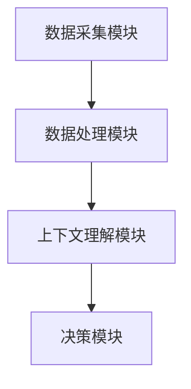

                 


# 情境感知：增强AI Agent的环境理解能力

## 关键词：
- 情境感知
- AI Agent
- 环境理解
- 多模态数据
- 深度学习
- 上下文理解
- 传感器融合

## 摘要：
情境感知是增强AI Agent环境理解能力的关键技术，通过整合多模态数据和上下文信息，AI Agent能够更好地理解和适应动态变化的环境。本文将系统地介绍情境感知的基本概念、核心算法、系统架构以及实际应用案例，深入探讨其在提升AI Agent环境理解能力中的重要作用，并展望未来的研究方向。

---

## 第一部分: 情境感知概述

### 第1章: 情境感知的基本概念

#### 1.1 问题背景
情境感知（Situation Awareness）是指系统或Agent对当前环境状态的理解能力，是实现智能决策和交互的基础。随着AI技术的快速发展，AI Agent需要在复杂多变的环境中完成任务，这对其环境理解能力提出了更高的要求。

#### 1.2 问题描述
AI Agent在实际应用中面临以下挑战：
- **多模态数据融合**：如何有效整合来自不同传感器（如视觉、听觉、触觉等）的数据。
- **动态环境适应**：如何实时感知环境变化并做出相应调整。
- **上下文理解**：如何基于环境信息进行语义理解和推理。

#### 1.3 问题解决
情境感知通过以下方式解决上述问题：
- **多模态数据融合**：利用多种传感器数据，提升感知的准确性和鲁棒性。
- **上下文建模**：构建环境模型，帮助AI Agent理解当前情境。
- **实时推理**：基于环境信息进行实时推理和决策。

#### 1.4 边界与外延
情境感知的边界在于仅关注环境信息的感知和理解，而不直接涉及决策和行动。其外延包括但不限于多模态数据处理、知识图谱构建和动态环境建模。

#### 1.5 概念结构与核心要素组成
情境感知的核心要素包括：
1. **环境数据**：来自传感器的原始数据。
2. **上下文信息**：环境数据经过处理和理解后的语义信息。
3. **推理模型**：基于上下文信息进行推理和预测的算法。

---

### 第2章: 情境感知的技术挑战

#### 2.1 技术挑战
- **数据多样性**：不同传感器的数据格式和特征差异较大，如何有效融合这些数据是一个难题。
- **环境动态性**：环境中的物体、场景和事件会动态变化，如何实时感知和适应是关键。
- **传感器融合**：如何处理传感器数据中的噪声和冗余信息，提升感知的准确性。
- **上下文理解**：如何基于环境信息进行语义理解和关联推理。

#### 2.2 技术难点
- **数据处理的复杂性**：多模态数据的预处理和特征提取需要复杂的算法支持。
- **知识表示的多样性**：环境信息的表示方式多种多样，如何统一表示是难点。
- **实时性与效率问题**：实时感知需要高效的算法和计算资源。
- **鲁棒性与可靠性问题**：在复杂和不确定的环境中，感知系统需要具备较强的鲁棒性。

---

### 第3章: 情境感知的研究现状

#### 3.1 主要研究方向
- **多模态数据融合**：研究如何将视觉、听觉、触觉等多模态数据进行有效融合。
- **上下文理解**：研究如何基于环境信息进行语义理解和关联推理。
- **环境建模**：研究如何构建动态、实时的环境模型。

#### 3.2 典型应用
- **智能机器人**：通过情境感知实现人机交互和环境适应。
- **智能驾驶**：通过情境感知实现车辆与环境的实时交互。
- **智能助手**：通过情境感知实现更智能的用户交互和任务执行。

---

## 第二部分: 情境感知的核心概念与联系

### 第4章: 情境感知的原理与方法

#### 4.1 基本原理
- **数据采集与预处理**：通过多种传感器采集环境数据，并进行标准化和去噪处理。
- **特征提取**：从原始数据中提取有用的特征，如颜色、纹理、声音频率等。
- **上下文建模**：基于特征构建环境模型，如场景图、知识图谱等。
- **情境推理**：基于环境模型进行推理和预测，得出当前环境的状态和趋势。

#### 4.2 主要方法
- **多模态数据融合**：利用多种传感器数据，通过加权融合、注意力机制等方法提升感知的准确性。
- **基于知识图谱的方法**：通过构建语义网络，实现环境信息的关联理解和推理。
- **基于深度学习的方法**：利用深度神经网络（如CNN、RNN、Transformer）进行特征提取和语义建模。

---

### 第5章: 情境感知的核心算法

#### 5.1 多模态数据融合算法
- **加权融合**：根据传感器的可靠性和重要性，对数据进行加权融合。
- **注意力机制**：通过注意力网络，动态调整各模态数据的权重。
- **基于图的融合**：利用图神经网络（Graph Neural Network, GNN）进行多模态数据的关联融合。

#### 5.2 知识图谱构建算法
- **实体识别与链接**：识别环境中的实体，并建立实体之间的关联关系。
- **关系抽取**：从文本或数据中抽取实体之间的关系。
- **知识融合**：将多源数据中的知识进行整合，构建统一的知识图谱。

#### 5.3 深度学习算法
- **卷积神经网络（CNN）**：用于处理图像和视觉数据。
- **循环神经网络（RNN）**：用于处理序列数据，如语音和文本。
- **Transformer网络**：用于处理长序列数据，如自然语言处理任务。

---

### 第6章: 情境感知的系统架构设计

#### 6.1 系统架构概述
- **数据采集模块**：负责采集多模态环境数据。
- **数据处理模块**：对采集的数据进行预处理和特征提取。
- **上下文理解模块**：基于特征构建环境模型，进行语义理解和关联推理。
- **决策模块**：根据上下文信息进行决策和行动。

#### 6.2 系统功能设计
- **数据流设计**：从传感器到数据处理模块，再到上下文理解模块，最后输出到决策模块。
- **模块交互设计**：各模块之间的接口设计和数据传输方式。

#### 6.3 系统架构图


---

### 第7章: 情境感知的项目实战

#### 7.1 项目背景
- **项目目标**：开发一个基于情境感知的智能助手，能够理解和响应用户的多模态输入。
- **项目需求**：支持语音识别、视觉识别和自然语言理解功能。

#### 7.2 环境搭建
- **开发工具**：Python、TensorFlow、Keras。
- **传感器数据**：来自摄像头、麦克风等设备。

#### 7.3 核心代码实现
```python
import tensorflow as tf
from tensorflow.keras import layers

# 多模态数据融合模型
class MultiModalFusion(tf.keras.Model):
    def __init__(self):
        super(MultiModalFusion, self).__init__()
        self.text_branch = layers.Dense(128, activation='relu')
        self.audio_branch = layers.Dense(128, activation='relu')
        self.visual_branch = layers.Dense(128, activation='relu')
        self.fusion = layers.Dense(1, activation='sigmoid')

    def call(self, inputs):
        text, audio, visual = inputs
        text_emb = self.text_branch(text)
        audio_emb = self.audio_branch(audio)
        visual_emb = self.visual_branch(visual)
        fused = tf.concat([text_emb, audio_emb, visual_emb], axis=1)
        output = self.fusion(fused)
        return output
```

#### 7.4 功能实现
- **语音识别**：通过麦克风采集语音数据，利用深度学习模型进行语音识别。
- **视觉识别**：通过摄像头采集图像数据，利用卷积神经网络进行图像识别。
- **自然语言理解**：基于知识图谱进行语义理解和意图识别。

#### 7.5 测试与优化
- **测试数据集**：使用多模态数据进行测试，评估模型的准确性和鲁棒性。
- **性能优化**：通过调整模型参数和优化算法，提升系统的运行效率。

---

### 第8章: 总结与展望

#### 8.1 总结
情境感知是增强AI Agent环境理解能力的关键技术，通过多模态数据融合、上下文理解和知识图谱构建等方法，AI Agent能够更好地感知和适应复杂环境。

#### 8.2 未来展望
- **更高效的算法**：研究更高效的多模态数据融合算法，提升感知的实时性和准确性。
- **更强大的模型**：开发更强大的深度学习模型，如多模态大语言模型（LLM）。
- **更广泛的应用**：将情境感知技术应用于更多领域，如智能城市、智能医疗等。

#### 8.3 最佳实践 Tips
- 在实际应用中，建议结合具体场景选择合适的算法和模型。
- 注重数据的质量和多样性，提升感知的准确性和鲁棒性。
- 定期更新和优化模型，适应环境的变化和用户需求的更新。

---

通过以上内容，您可以系统地了解情境感知的核心概念、算法原理和实际应用。希望本文对您在增强AI Agent环境理解能力方面的研究和实践有所帮助！

