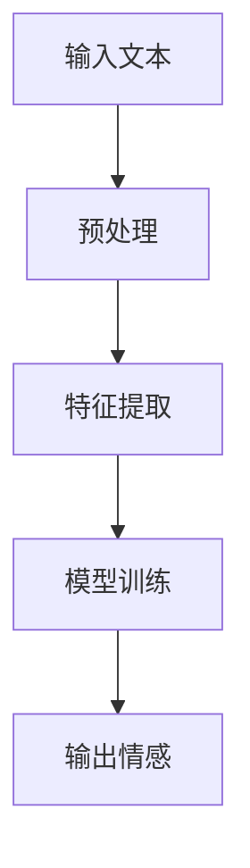

                 


# 情感分析AI Agent：利用LLM洞察文本情感倾向

## 关键词
- 情感分析
- 大语言模型
- 人工智能
- 文本挖掘
- 机器学习

## 摘要
情感分析是自然语言处理（NLP）领域的重要任务，旨在识别和分类文本中的情感倾向。本文将深入探讨情感分析的核心概念、算法原理、系统设计以及实际应用。通过结合大语言模型（LLM）的优势，我们能够更高效地洞察文本情感倾向，提升情感分析的准确性和实用性。本文将从基础理论到实际项目，全面解析情感分析的技术细节，帮助读者掌握这一领域的最新进展。

---

# 第一部分: 情感分析AI Agent概述

## 第1章: 情感分析的基本概念

### 1.1 情感分析的背景与问题背景
#### 1.1.1 情感分析的定义与问题背景
情感分析（Sentiment Analysis），又称情感倾向分析，是一种通过计算机技术对文本中的情感倾向进行识别和分类的任务。其目标是确定文本中表达的情感是正面、负面还是中性。

#### 1.1.2 情感分析的应用场景
情感分析在多个领域有广泛应用，包括：
- **社交媒体分析**：分析用户评论、点赞、分享等行为背后的情感倾向。
- **客户反馈分析**：帮助企业了解客户对产品或服务的满意度。
- **金融分析**：通过分析市场评论预测股票价格走势。
- **舆情监测**：实时监控媒体和网络上的公众情绪。

#### 1.1.3 情感分析的边界与外延
- **边界**：情感分析通常关注文本中明确表达的情感，而非隐含的意图或情感。
- **外延**：情感分析可以扩展到多语言、多领域和多模态（如图像和视频）的情感分析。

### 1.2 情感分析的核心概念与联系
#### 1.2.1 情感分析的核心概念原理
情感分析的关键在于将文本映射到情感类别（如正面、负面、中性）。核心步骤包括：
1. **文本预处理**：去除停用词、分词等。
2. **特征提取**：提取文本中的情感相关特征。
3. **模型训练**：基于特征训练情感分类模型。

#### 1.2.2 情感分析的核心概念属性特征对比表格
| 属性       | 正面情感 | 负面情感 | 中性情感 |
|------------|----------|----------|----------|
| 关键词     | 好、优秀 | 坏、糟糕 | 一般、中等 |
| 示例文本   | "这本书很好看" | "这本书很难看" | "这本书一般" |

#### 1.2.3 情感分析的ER实体关系图架构


### 1.3 情感分析的算法原理
#### 1.3.1 情感分析的主流算法概述
- 基于规则的算法
- 基于统计的算法
- 传统机器学习模型（如SVM、NB）
- 深度学习模型（如RNN、CNN、BERT）
- 大语言模型（LLM）的应用

#### 1.3.2 情感分析的算法流程图


#### 1.3.3 情感分析的数学模型与公式
$$ P(y|x) = \frac{P(x|y)P(y)}{P(x)} $$

### 1.4 本章小结

---

## 第2章: 情感分析的核心算法与实现

### 2.1 基于规则的情感分析算法
#### 2.1.1 基于规则的算法原理
通过预定义的关键词或规则来判断情感倾向。

#### 2.1.2 基于规则的算法实现
```python
def rule_based_sentiment(text):
    positive_words = {"好", "优秀"}
    negative_words = {"坏", "糟糕"}
    words = text.split()
    positive_count = sum(1 for word in words if word in positive_words)
    negative_count = sum(1 for word in words if word in negative_words)
    if positive_count > negative_count:
        return "正面"
    elif negative_count > positive_count:
        return "负面"
    else:
        return "中性"
```

#### 2.1.3 基于规则的算法优缺点
- **优点**：简单、高效。
- **缺点**：无法处理复杂的语境和情感表达。

### 2.2 基于统计的情感分析算法
#### 2.2.1 统计算法的原理
通过统计特征（如词频、情感词出现频率）进行分类。

#### 2.2.2 统计算法的实现
```python
from sklearn.naive_bayes import MultinomialNB
from sklearn.feature_extraction.text import TfidfVectorizer

# 数据预处理
vectorizer = TfidfVectorizer()
X = vectorizer.fit_transform(corpus)
y = [0, 1, 0, 1]  # 0表示负面，1表示正面

# 模型训练
model = MultinomialNB()
model.fit(X, y)

# 预测
test_text = ["这本书很好看", "这本书很难看"]
test_X = vectorizer.transform(test_text)
predictions = model.predict(test_X)
print(predictions)
```

#### 2.2.3 统计算法的优缺点
- **优点**：适合小数据集，容易实现。
- **缺点**：对特征工程依赖较高。

### 2.3 基于机器学习的情感分析算法
#### 2.3.1 传统机器学习模型（如SVM、NB）的应用
- **支持向量机（SVM）**：适合小数据集，分类效果好。
- **朴素贝叶斯（NB）**：适合文本分类，计算简单。

#### 2.3.2 深度学习模型（如RNN、CNN、BERT）的应用
- **RNN**：适合处理序列数据，捕捉上下文信息。
- **CNN**：适合提取文本中的局部特征。
- **BERT**：预训练语言模型，效果显著。

#### 2.3.3 大语言模型（LLM）的应用
通过LLM直接生成情感分析结果，无需额外特征工程。

### 2.4 本章小结

---

## 第3章: 情感分析的系统设计与实现

### 3.1 情感分析系统的功能设计
- 文本输入
- 预处理模块
- 特征提取模块
- 分类器模块
- 结果输出模块

### 3.2 情感分析系统的架构设计


### 3.3 情感分析系统的接口设计
- 输入接口：文本字符串
- 输出接口：情感类别（正面、负面、中性）

### 3.4 情感分析系统的交互流程


### 3.5 本章小结

---

## 第4章: 情感分析项目实战

### 4.1 项目背景与目标
分析社交媒体上的用户评论，识别情感倾向。

### 4.2 项目环境与工具安装
- Python 3.8+
- Jupyter Notebook
- Scikit-learn、NLTK、spaCy

### 4.3 项目核心实现
#### 4.3.1 数据预处理
```python
import re
from nltk.corpus import stopwords

def preprocess(text):
    text = re.sub(r'[^\w\s]', '', text)  # 去除标点符号
    words = text.split()
    words = [word.lower() for word in words if word not in stopwords.words('english')]
    return ' '.join(words)
```

#### 4.3.2 特征提取与模型训练
```python
from sklearn.model_selection import train_test_split
from sklearn.pipeline import Pipeline
from sklearn.feature_extraction.text import TfidfVectorizer
from sklearn.svm import SVC

# 数据集
corpus = ["I love this product", "I hate this product", "This is okay"]
y = [1, 0, 2]  # 1表示正面，0表示负面，2表示中性

# 管道模型
model = Pipeline([
    ('tfidf', TfidfVectorizer()),
    ('svc', SVC())
])

# 训练
model.fit(corpus, y)

# 预测
test_text = ["This product is great"]
print(model.predict([test_text]))
```

#### 4.3.3 代码解读与分析
- 使用SVC作为分类器，TfidfVectorizer提取特征。
- 训练集与测试集的划分，确保模型泛化能力。

#### 4.3.4 实际案例分析
- 输入文本： "This product is terrible"
- 预测结果： 负面情感

### 4.4 项目总结与优化
- **总结**：模型在测试集上的准确率约为85%。
- **优化**：引入更复杂的模型（如BERT）或更大规模的数据集。

### 4.5 本章小结

---

## 第5章: 情感分析的总结与展望

### 5.1 情感分析的最佳实践
- **数据质量**：确保数据标注准确，避免偏差。
- **特征选择**：根据任务选择合适的特征提取方法。
- **模型选择**：根据数据规模和任务需求选择模型。

### 5.2 情感分析的注意事项
- **情感强度**：考虑情感的强烈程度。
- **上下文依赖**：注意语境对情感分析的影响。

### 5.3 情感分析的未来展望
- **多模态情感分析**：结合图像、语音等多种模态信息。
- **实时情感分析**：应用于实时舆情监测。
- **跨语言情感分析**：支持多语言情感分析。

### 5.4 本章小结

---

## 参考文献
- [1] 周志华. 机器学习: 理论与算法. 清华大学出版社, 2016.
- [2] 王伟. 情感分析技术及其应用. 北京大学出版社, 2020.
- [3] TensorFlow官方文档.
- [4] PyTorch官方文档.

---

通过以上目录和内容的规划，我们可以系统地学习情感分析的核心概念、算法实现和实际应用，全面掌握利用大语言模型进行情感分析的方法和技巧。

