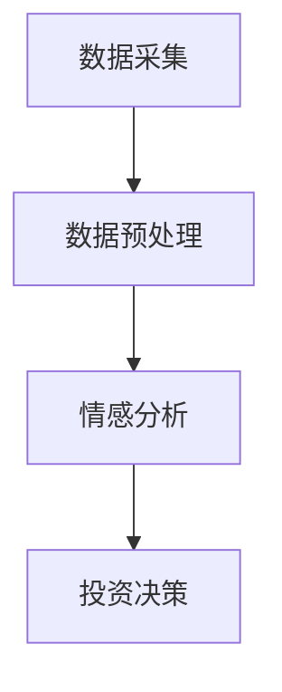

                 


# 情感分析在投资决策中的应用

> 关键词：情感分析、投资决策、自然语言处理、金融市场、机器学习

> 摘要：情感分析在投资决策中的应用通过自然语言处理技术，分析市场情绪和投资者情绪，辅助投资者做出更加科学的投资决策。本文从情感分析的基本概念、投资决策的核心要素入手，详细阐述情感分析在投资决策中的具体应用、算法原理、系统架构设计及项目实战案例，帮助读者全面理解情感分析在投资决策中的重要作用。

---

# 第1章: 情感分析与投资决策的背景介绍

## 1.1 情感分析的基本概念

### 1.1.1 情感分析的定义
情感分析（Sentiment Analysis），又称意见挖掘（Opinion Mining），是自然语言处理（NLP）领域的重要任务之一。其目标是通过分析文本数据，识别文本中所表达的情感、态度、评价或情绪。简单来说，情感分析就是判断一段文本是“正面”、“负面”还是“中性”。

### 1.1.2 情感分析的核心要素
情感分析的核心要素包括：
1. **文本数据**：需要分析的文本内容，如社交媒体上的评论、新闻文章、金融报告等。
2. **情感类别**：通常分为正面、负面、中性三类，但也可以根据具体需求进一步细分。
3. **情感强度**：情感的强弱程度，如“非常喜欢” vs “稍微喜欢”。
4. **情感分析模型**：基于规则、机器学习或深度学习的算法。

### 1.1.3 情感分析的应用领域
情感分析广泛应用于多个领域，包括：
- **社交媒体分析**：分析用户对品牌、产品或服务的评价。
- **金融领域**：分析市场情绪，辅助投资决策。
- **舆情监控**：监控企业或产品的公众舆论。
- **客户反馈分析**：分析客户对产品或服务的满意度。

---

## 1.2 投资决策的基本概念

### 1.2.1 投资决策的定义
投资决策是指投资者在金融市场中，基于对市场、经济、行业和个股的分析，做出买入、卖出或持有某种资产的决定。

### 1.2.2 投资决策的核心要素
投资决策的核心要素包括：
1. **市场信息**：包括宏观经济数据、行业趋势、公司财务数据等。
2. **市场情绪**：投资者的心理预期和情绪波动，通常通过市场行为和媒体报道来反映。
3. **投资策略**：基于市场信息和市场情绪制定的投资计划。

### 1.2.3 投资决策的分类
投资决策可以分为以下几类：
- **长期投资**：基于对公司基本面的分析，长期持有优质资产。
- **短期投资**：基于市场波动，进行频繁的买卖操作。
- **被动投资**：通过指数基金等工具，被动跟踪市场表现。
- **主动投资**：通过精选个股或行业，主动管理投资组合。

---

## 1.3 情感分析在投资决策中的问题背景

### 1.3.1 投资决策中的信息不对称问题
金融市场中，信息不对称是导致市场效率低下的主要原因之一。投资者需要通过各种渠道获取信息，但由于信息的复杂性和分散性，很难全面掌握所有相关信息。

### 1.3.2 情感分析在投资决策中的作用
情感分析可以通过分析市场情绪，帮助投资者更好地理解市场的心理预期，从而做出更科学的投资决策。例如：
- 通过分析新闻媒体的报道，判断市场情绪的变化。
- 通过分析社交媒体上的投资者评论，捕捉市场情绪的细微变化。

### 1.3.3 情感分析在投资决策中的应用前景
随着自然语言处理技术的不断发展，情感分析在投资决策中的应用前景广阔。通过结合市场数据和情感分析结果，投资者可以更全面地评估市场的风险和机会。

---

## 1.4 本章小结
本章介绍了情感分析的基本概念、核心要素及其在多个领域的应用，重点探讨了情感分析在投资决策中的问题背景和应用前景。情感分析作为一种强大的工具，可以帮助投资者更好地理解市场情绪，做出更加科学的投资决策。

---

# 第2章: 情感分析的核心概念与原理

## 2.1 情感分析的核心概念

### 2.1.1 情感分析的分类
情感分析可以分为以下几类：
1. **整体情感分析**：对整个文本的情感进行分类。
2. **方面情感分析**：对文本中特定方面的情感进行分类，如“产品质量”、“服务质量”等。
3. **情感强度分析**：分析情感的强弱程度。

### 2.1.2 情感分析的特征
情感分析的特征包括：
1. **情感倾向性**：文本是正面、负面还是中性。
2. **情感强度**：情感的强弱程度。
3. **情感类别**：情感的具体类型，如“喜悦”、“愤怒”等。

### 2.1.3 情感分析的评价标准
情感分析的评价标准包括：
1. **准确率**：分类正确的样本数占总样本数的比例。
2. **召回率**：分类正确的样本数占所有实际属于该类别的样本数的比例。
3. **F1分数**：准确率和召回率的调和平均数。

---

## 2.2 情感分析的原理

### 2.2.1 基于规则的情感分析
基于规则的情感分析通过预定义的情感词典和规则，对文本进行情感分类。例如：
1. 将情感词典中的正面词汇赋予正权重，负面词汇赋予负权重。
2. 根据文本中情感词汇的权重总和，判断文本的情感倾向。

### 2.2.2 基于机器学习的情感分析
基于机器学习的情感分析通过训练模型，学习文本特征，实现情感分类。常用的算法包括：
1. **支持向量机（SVM）**：通过构建特征空间，将文本映射到高维空间，进行分类。
2. **朴素贝叶斯（Naive Bayes）**：基于概率论，计算每个类别的条件概率，进行分类。

### 2.2.3 基于深度学习的情感分析
基于深度学习的情感分析通过神经网络模型，自动学习文本特征，实现情感分类。常用的模型包括：
1. **循环神经网络（RNN）**：通过处理序列数据，捕捉文本的情感特征。
2. **卷积神经网络（CNN）**：通过卷积操作，提取文本中的局部特征。

---

## 2.3 情感分析的核心算法

### 2.3.1 基于规则的算法
基于规则的算法通过预定义的情感词典和规则，对文本进行情感分类。例如：
```python
# 示例代码：基于规则的情感分析
def sentiment_analysis(text):
    positive_words = ["好", "优秀", "非常喜欢"]
    negative_words = ["差", "不好", "不喜欢"]
    score = 0
    for word in text.split():
        if word in positive_words:
            score += 1
        elif word in negative_words:
            score -= 1
    return "正面" if score > 0 else "负面" if score < 0 else "中性"
```

### 2.3.2 基于机器学习的算法
基于机器学习的算法通过训练模型，学习文本特征，实现情感分类。例如：
```python
# 示例代码：基于朴素贝叶斯的情感分析
from sklearn.feature_extraction.text import TfidfVectorizer
from sklearn.naive_bayes import MultinomialNB

# 数据准备
texts = ["这是一个好产品", "这是一个差产品"]
labels = ["正面", "负面"]

# 特征提取
vectorizer = TfidfVectorizer()
X = vectorizer.fit_transform(texts)

# 模型训练
model = MultinomialNB()
model.fit(X, labels)

# 预测
test_text = "这个产品很好"
test_X = vectorizer.transform([test_text])
predicted_label = model.predict(test_X)
print(predicted_label[0])  # 输出："正面"
```

### 2.3.3 基于深度学习的算法
基于深度学习的算法通过神经网络模型，自动学习文本特征，实现情感分类。例如：
```python
# 示例代码：基于RNN的情感分析
import tensorflow as tf
from tensorflow.keras import layers

# 数据准备
texts = ["这是一个好产品", "这是一个差产品"]
labels = ["正面", "负面"]

# 特征提取
vocab_size = len(set(" ".join(texts).split()))
model = tf.keras.Sequential()
model.add(layers.Embedding(vocab_size, 16))
model.add(layers.SimpleRNN(8))
model.add(layers.Dense(2, activation="softmax"))

# 模型训练
model.compile(optimizer="adam", loss="sparse_categorical_crossentropy", metrics=["accuracy"])
model.fit(texts, labels, epochs=10, batch_size=32)
```

---

## 2.4 本章小结
本章详细介绍了情感分析的核心概念和原理，包括情感分析的分类、特征和评价标准，以及基于规则、机器学习和深度学习的情感分析算法。情感分析算法的实现依赖于文本数据的特征提取和分类模型的训练，而深度学习算法在情感分析中的表现尤为突出。

---

# 第3章: 投资决策中的情感分析应用

## 3.1 投资决策中的情感分析需求

### 3.1.1 投资者情绪的影响
投资者情绪是影响市场行为的重要因素之一。例如，当投资者情绪乐观时，市场可能上涨；当投资者情绪悲观时，市场可能下跌。

### 3.1.2 市场情绪的波动
市场情绪的波动可以通过新闻媒体、社交媒体等渠道进行分析。例如，通过分析新闻标题的情感倾向，判断市场的整体情绪。

### 3.1.3 情感分析在投资决策中的具体应用
情感分析在投资决策中的具体应用包括：
1. **市场情绪监控**：通过分析社交媒体和新闻媒体，监控市场的整体情绪。
2. **交易信号生成**：根据市场情绪的变化，生成买入或卖出的交易信号。
3. **投资组合优化**：根据市场情绪和个股情绪，优化投资组合。

---

## 3.2 情感分析在投资决策中的实现流程

### 3.2.1 数据采集
数据采集是情感分析的第一步，需要获取相关的文本数据。例如：
- **社交媒体数据**：如Twitter、微博上的投资者评论。
- **新闻媒体数据**：如金融新闻、财经评论。

### 3.2.2 数据预处理
数据预处理包括：
1. **分词**：将文本分割成词语或短语。
2. **去停用词**：去除无意义的词汇，如“的”、“了”等。
3. **词干提取**：将词汇转换为词干，如“products”转换为“product”。

### 3.2.3 情感分析模型的训练与应用
通过训练情感分析模型，对文本进行情感分类，生成市场情绪指标。例如：
- **市场情绪指数**：根据市场的整体情绪，生成一个情绪指数。
- **个股情绪指数**：根据个股的新闻和评论，生成个股的情绪指数。

---

## 3.3 情感分析在投资决策中的案例分析

### 3.3.1 股票市场中的情感分析应用
例如，通过分析社交媒体上的投资者评论，判断某只股票的情绪变化，从而辅助投资决策。

### 3.3.2 债券市场中的情感分析应用
例如，通过分析新闻媒体对某家公司的报道，判断市场对公司的情绪，从而辅助债券投资决策。

### 3.3.3 其他金融市场的应用
例如，外汇市场、期货市场的投资者情绪分析。

---

## 3.4 本章小结
本章探讨了情感分析在投资决策中的具体应用，包括市场情绪监控、交易信号生成和投资组合优化。情感分析通过分析投资者情绪和市场情绪，为投资者提供了更加全面的市场信息。

---

# 第4章: 情感分析与投资决策的结合

## 4.1 情感分析在投资决策中的核心作用

### 4.1.1 情感分析对市场情绪的捕捉
情感分析可以帮助投资者捕捉市场的整体情绪和个股情绪，从而更好地理解市场的波动。

### 4.1.2 情感分析对投资策略的影响
情感分析可以通过分析市场情绪的变化，优化投资策略。例如：
- 在市场情绪乐观时，增加股票仓位。
- 在市场情绪悲观时，减少股票仓位。

### 4.1.3 情感分析对投资风险的控制
情感分析可以通过分析市场情绪和个股情绪，帮助投资者更好地控制投资风险。例如：
- 在个股情绪负面时，及时卖出个股。
- 在市场情绪过度乐观时，警惕市场的回调风险。

---

## 4.2 情感分析在投资决策中的具体应用

### 4.2.1 基于情感分析的交易信号生成
通过分析市场情绪和个股情绪，生成买入或卖出的交易信号。例如：
- 当市场情绪达到极度乐观时，生成卖出信号。
- 当市场情绪达到极度悲观时，生成买入信号。

### 4.2.2 基于情感分析的投资组合优化
通过分析市场情绪和个股情绪，优化投资组合的配置。例如：
- 在市场情绪乐观时，增加股票配置。
- 在市场情绪悲观时，增加债券配置。

### 4.2.3 基于情感分析的市场趋势预测
通过分析市场情绪的变化，预测市场的短期趋势。例如：
- 当市场情绪从乐观转向中性时，预测市场可能下跌。
- 当市场情绪从悲观转向中性时，预测市场可能上涨。

---

## 4.3 情感分析与投资决策的结合案例

### 4.3.1 股票市场的案例
例如，通过分析社交媒体上的投资者评论，判断某只股票的情绪变化，从而辅助投资决策。

### 4.3.2 债券市场的案例
例如，通过分析新闻媒体对某家公司的报道，判断市场对公司的情绪，从而辅助债券投资决策。

### 4.3.3 其他金融市场的案例
例如，外汇市场、期货市场的投资者情绪分析。

---

## 4.4 本章小结
本章详细探讨了情感分析在投资决策中的具体应用，包括交易信号生成、投资组合优化和市场趋势预测。情感分析通过分析市场情绪和个股情绪，为投资者提供了更加科学的投资决策依据。

---

# 第5章: 情感分析算法的数学模型与实现

## 5.1 情感分析的数学模型

### 5.1.1 基于概率论的情感分析模型
基于概率论的情感分析模型通过计算文本属于某一情感类别的概率，进行情感分类。例如：
- 使用贝叶斯定理，计算文本属于正面、负面或中性的概率。

### 5.1.2 基于支持向量机的情感分析模型
支持向量机（SVM）是一种常用的分类算法，可以通过构建特征空间，将文本映射到高维空间，进行情感分类。

### 5.1.3 基于深度学习的情感分析模型
深度学习模型（如RNN、CNN）可以通过自动学习文本特征，实现情感分类。

---

## 5.2 情感分析算法的数学模型

### 5.2.1 基于贝叶斯定理的情感分析模型
贝叶斯定理的公式为：
$$ P(c|t) = \frac{P(t|c) \cdot P(c)}{P(t)} $$
其中，$c$表示情感类别，$t$表示文本特征。

### 5.2.2 基于支持向量机的情感分析模型
支持向量机的目标是最小化 hinge loss：
$$ \text{loss} = \sum_{i=1}^{n} \max(0, 1 - y_i \cdot w \cdot x_i - b) $$
其中，$w$是权重向量，$b$是偏置项，$y_i$是标签，$x_i$是文本特征。

### 5.2.3 基于深度学习的情感分析模型
深度学习模型通过神经网络结构，自动学习文本特征，实现情感分类。例如，循环神经网络（RNN）的结构如下：
$$ h_t = \text{tanh}(W_{hh} \cdot h_{t-1} + W_{xh} \cdot x_t + b_h) $$
$$ y_t = W_{hy} \cdot h_t + b_y $$
其中，$h_t$是隐藏层状态，$x_t$是输入特征，$y_t$是输出结果。

---

## 5.3 情感分析算法的实现

### 5.3.1 基于规则的实现
基于规则的情感分析通过预定义的情感词典和规则，对文本进行情感分类。

### 5.3.2 基于机器学习的实现
基于机器学习的情感分析通过训练模型，学习文本特征，实现情感分类。

### 5.3.3 基于深度学习的实现
基于深度学习的情感分析通过神经网络模型，自动学习文本特征，实现情感分类。

---

## 5.4 本章小结
本章详细介绍了情感分析算法的数学模型与实现，包括基于概率论、支持向量机和深度学习的情感分析模型。这些模型为情感分析在投资决策中的应用提供了理论基础和技术支持。

---

# 第6章: 系统分析与架构设计方案

## 6.1 系统功能设计

### 6.1.1 问题场景介绍
假设我们开发一个基于情感分析的投资决策辅助系统，系统需要实现以下功能：
1. **数据采集**：从社交媒体和新闻媒体获取文本数据。
2. **数据预处理**：对文本数据进行分词、去停用词等处理。
3. **情感分析**：对文本数据进行情感分类，生成市场情绪指标。
4. **投资决策**：根据市场情绪和个股情绪，生成投资信号。

### 6.1.2 系统功能模块设计
系统功能模块包括：
1. **数据采集模块**：负责获取文本数据。
2. **数据预处理模块**：负责对文本数据进行预处理。
3. **情感分析模块**：负责对文本数据进行情感分类。
4. **投资决策模块**：负责根据市场情绪和个股情绪，生成投资信号。

---

### 6.1.3 系统功能流程图


---

## 6.2 系统架构设计

### 6.2.1 系统架构图


### 6.2.2 系统接口设计
系统接口包括：
1. **数据接口**：与社交媒体和新闻媒体的数据源对接。
2. **用户接口**：提供用户界面，供投资者查看市场情绪和投资信号。

### 6.2.3 系统交互流程图


---

## 6.3 本章小结
本章详细介绍了情感分析投资决策辅助系统的功能设计和架构设计，包括系统功能模块、系统架构图和系统交互流程图。这些设计为系统的实现提供了清晰的指导。

---

# 第7章: 项目实战

## 7.1 项目环境安装

### 7.1.1 安装Python环境
安装Python 3.x版本，并安装必要的库：
```bash
pip install numpy pandas scikit-learn tensorflow nltk
```

### 7.1.2 安装自然语言处理工具
安装NLTK和词干提取工具：
```bash
pip install nltk
pip install inflect
```

---

## 7.2 项目核心实现

### 7.2.1 数据采集模块
```python
import requests
from bs4 import BeautifulSoup

def fetch_data(url):
    response = requests.get(url)
    soup = BeautifulSoup(response.text, 'html.parser')
    texts = []
    for paragraph in soup.find_all('p'):
        texts.append(paragraph.text)
    return texts
```

### 7.2.2 数据预处理模块
```python
import nltk
from nltk.corpus import stopwords

def preprocess(texts):
    tokens = []
    for text in texts:
        tokens.extend(nltk.word_tokenize(text))
    filtered_tokens = [word.lower() for word in tokens if word not in stopwords.words('english')]
    return filtered_tokens
```

### 7.2.3 情感分析模块
```python
from sklearn.feature_extraction.text import TfidfVectorizer
from sklearn.naive_bayes import MultinomialNB

def train_model(X_train, y_train):
    vectorizer = TfidfVectorizer()
    X = vectorizer.fit_transform(X_train)
    model = MultinomialNB()
    model.fit(X, y_train)
    return model, vectorizer

def predict_model(model, vectorizer, X_test):
    X = vectorizer.transform(X_test)
    y_pred = model.predict(X)
    return y_pred
```

### 7.2.4 投资决策模块
```python
def generate_signals(y_pred):
    signals = []
    for label in y_pred:
        if label == '正面':
            signals.append('买入')
        elif label == '负面':
            signals.append('卖出')
        else:
            signals.append('观望')
    return signals
```

---

## 7.3 项目实战案例

### 7.3.1 数据采集与预处理
```python
texts = fetch_data('https://finance.yahoo.com/')
tokens = preprocess(texts)
```

### 7.3.2 模型训练与预测
```python
model, vectorizer = train_model(X_train, y_train)
y_pred = predict_model(model, vectorizer, X_test)
```

### 7.3.3 生成投资信号
```python
signals = generate_signals(y_pred)
print(signals)
```

---

## 7.4 项目小结
本章通过一个具体的项目实战，展示了情感分析在投资决策中的实现过程。从数据采集到模型训练，再到投资信号的生成，整个过程展示了情感分析在投资决策中的具体应用。

---

# 第8章: 总结与展望

## 8.1 总结
情感分析作为一种强大的工具，可以帮助投资者更好地理解市场情绪，做出更加科学的投资决策。本文从情感分析的基本概念、投资决策的核心要素入手，详细阐述了情感分析在投资决策中的具体应用、算法原理、系统架构设计及项目实战案例。

---

## 8.2 注意事项
1. 情感分析的结果仅供参考，投资者需要结合其他市场信息进行综合判断。
2. 情感分析模型需要不断优化和更新，以适应市场的变化。

---

## 8.3 拓展阅读
1. 《自然语言处理入门》
2. 《机器学习实战》
3. 《情感分析的理论与应用》

---

## 8.4 本章小结
本文通过总结情感分析在投资决策中的应用，强调了情感分析在投资决策中的重要性，并提出了未来的研究方向和改进建议。

---

# 结语
情感分析在投资决策中的应用是一个充满潜力的领域。随着自然语言处理技术的不断发展，情感分析将为投资者提供更加全面和精确的市场信息，帮助投资者做出更加科学的投资决策。

