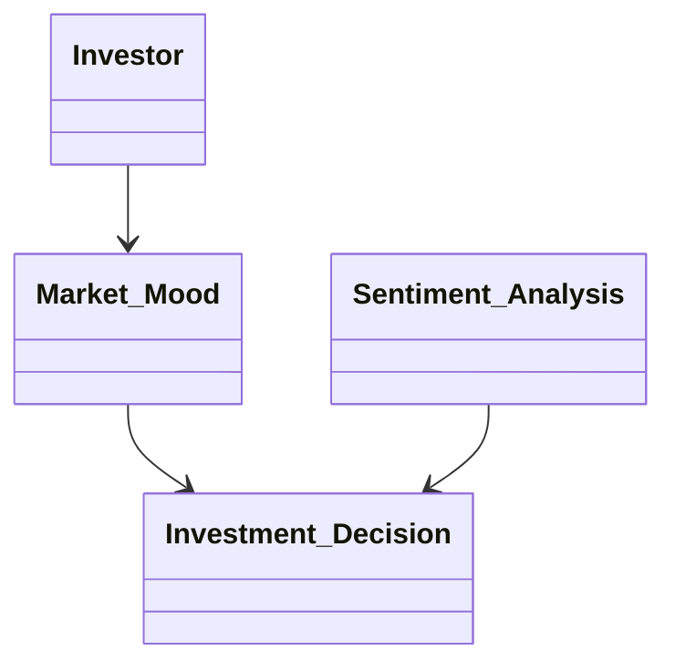
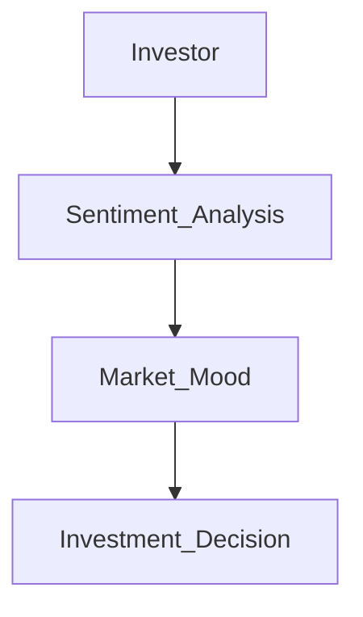
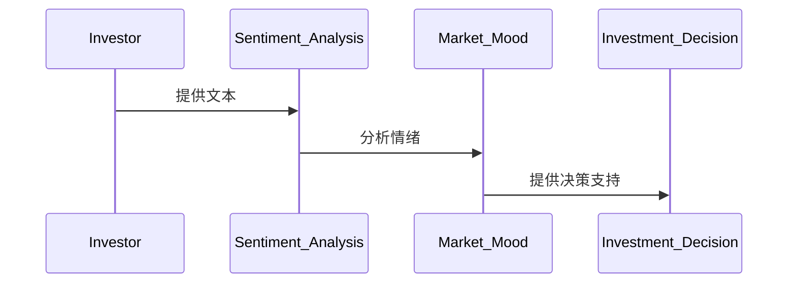

                 


# 情感分析技术在投资决策中的应用与优化

## 关键词：情感分析，投资决策，自然语言处理，机器学习，深度学习

## 摘要：情感分析技术通过分析文本中的情感倾向，帮助投资者做出更明智的决策。本文探讨了情感分析的核心概念、算法原理、系统架构，以及在投资中的实战应用，最后提出了优化建议。

---

# 第1章 情感分析技术概述

## 1.1 情感分析的定义与背景

### 1.1.1 情感分析的基本概念
情感分析（Sentiment Analysis）是自然语言处理（NLP）中的一个重要任务，旨在识别和分析文本中的情感倾向，如正面、负面或中性。它通过分析词语、句子或段落的情绪色彩，帮助我们理解文本的情感基调。

### 1.1.2 情感分析的应用场景
情感分析广泛应用于社交媒体监控、客户反馈分析、金融投资等领域。在金融领域，它可以帮助投资者分析市场情绪，预测股价走势。

### 1.1.3 情感分析在投资决策中的重要性
在投资决策中，情感分析可以用于分析新闻、社交媒体帖子和公司财报中的情绪，帮助投资者识别市场趋势和潜在风险。

## 1.2 情感分析的核心概念

### 1.2.1 情感分析的分类
情感分析可以分为两类：细粒度情感分析和整体情感分析。细粒度分析针对特定方面，而整体分析则是对整体情绪的判断。

### 1.2.2 情感分析的特征
特征包括文本中的关键词、句式结构和情感词。这些特征帮助模型判断情感倾向。

### 1.2.3 情感分析与投资决策的关系
情感分析可以帮助投资者识别市场情绪，预测股价波动，辅助投资决策。

## 1.3 情感分析技术的发展历程

### 1.3.1 情感分析的起源
情感分析起源于20世纪90年代，最初基于规则的系统。

### 1.3.2 技术演进
随着机器学习的发展，情感分析从基于规则的方法转向机器学习和深度学习。

### 1.3.3 应用现状
在金融领域，情感分析被用于实时监控市场情绪，辅助投资决策。

## 1.4 情感分析的挑战与机遇

### 1.4.1 挑战
包括处理模糊语言、噪声数据和情感细微差别。

### 1.4.2 机遇
利用大数据和深度学习提升准确性，扩展应用领域。

### 1.4.3 未来发展方向
结合NLP和大数据分析，提高情感分析的实时性和准确性。

---

# 第2章 情感分析的核心概念与联系

## 2.1 情感分析的核心原理

### 2.1.1 原理概述
情感分析通过提取文本特征，训练模型预测情感倾向。

### 2.1.2 关键技术
包括特征提取、模型训练和情感分类。

### 2.1.3 实现流程
从数据预处理到特征提取，再到模型训练和预测。

## 2.2 情感分析的特征分析

### 2.2.1 文本特征提取
使用TF-IDF提取关键词，识别情感词和情感强度。

### 2.2.2 情感特征分类
将情感分为正面、负面和中性，细粒度分析针对特定方面。

### 2.2.3 情感分析与投资决策的关系
情感分析帮助识别市场情绪，预测股价走势。

## 2.3 实体关系图


---

# 第3章 情感分析算法原理

## 3.1 常见算法

### 3.1.1 基于规则的算法
使用情感词典和规则判断情感倾向。

### 3.1.2 机器学习算法
使用SVM和随机森林等模型进行分类。

### 3.1.3 深度学习算法
利用LSTM和BERT模型捕捉上下文信息。

## 3.2 算法流程图


## 3.3 算法实现

### 3.3.1 基于规则的实现

```python
import nltk
nltk.download('vader_lexicon')
from nltk.sentiment import SentimentIntensityAnalyzer

sia = SentimentIntensityAnalyzer()
text = "The company is doing well."
scores = sia.polarity_scores(text)
print(scores)
```

### 3.3.2 机器学习实现

```python
from sklearn.feature_extraction.text import TfidfVectorizer
from sklearn.svm import SVC

vectorizer = TfidfVectorizer()
X = vectorizer.fit_transform(corpus)
model = SVC()
model.fit(X, labels)
```

---

# 第4章 系统分析与架构设计

## 4.1 问题场景

投资者需要实时监控市场情绪，辅助投资决策。

## 4.2 系统功能设计

### 4.2.1 领域模型



### 4.2.2 系统架构



## 4.3 接口设计

### 4.3.1 API接口

```python
def analyze_sentiment(text):
    # 情感分析逻辑
    return sentiment
```

## 4.4 交互流程



---

# 第5章 项目实战

## 5.1 环境安装

安装Python和相关库，如NLTK、Scikit-learn。

## 5.2 核心实现

### 5.2.1 数据预处理

```python
import pandas as pd

df = pd.read_csv('data.csv')
text = df['text'].values
labels = df['label'].values
```

### 5.2.2 模型训练

```python
from sklearn.model_selection import train_test_split
X_train, X_test, y_train, y_test = train_test_split(text, labels)
vectorizer = TfidfVectorizer()
X_train_vec = vectorizer.fit_transform(X_train)
model = SVC()
model.fit(X_train_vec, y_train)
```

## 5.3 案例分析

使用实际数据训练模型，分析新闻文本，预测市场情绪。

---

# 第6章 优化与提升

## 6.1 提升准确性

使用深度学习模型如LSTM和BERT，结合大数据分析。

## 6.2 实战优化

展示优化后的算法流程和代码。

---

# 第7章 总结与展望

## 7.1 总结

情感分析技术在投资决策中的重要性，及其应用价值。

## 7.2 未来展望

结合NLP和大数据分析，提升实时性和准确性。

## 7.3 最佳实践

建议投资者结合多种技术，定期优化模型，关注数据质量。

---

# 参考文献

列出相关书籍和论文，供读者进一步阅读。

---

通过以上结构，文章详细讲解了情感分析技术在投资中的应用，从基础到实战，再到优化，为读者提供了全面的知识体系。

