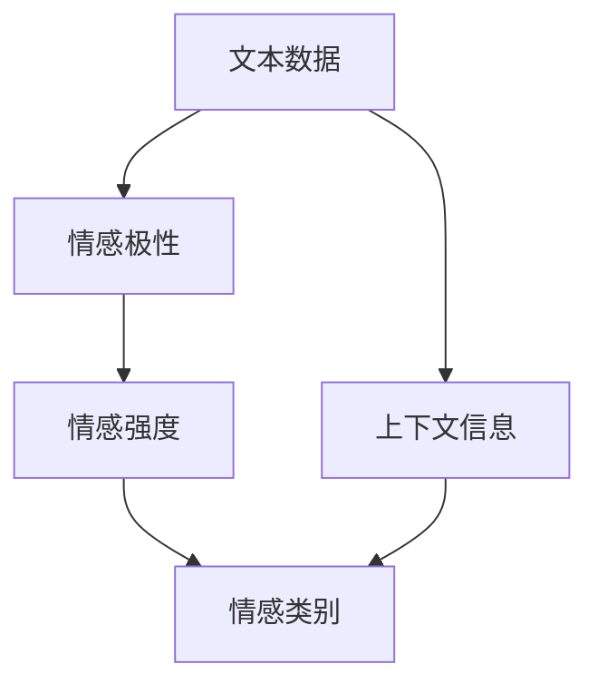
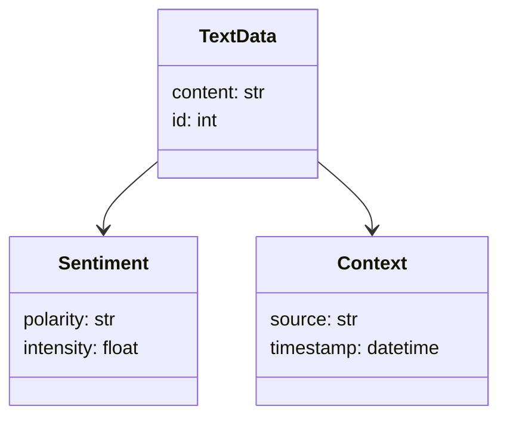
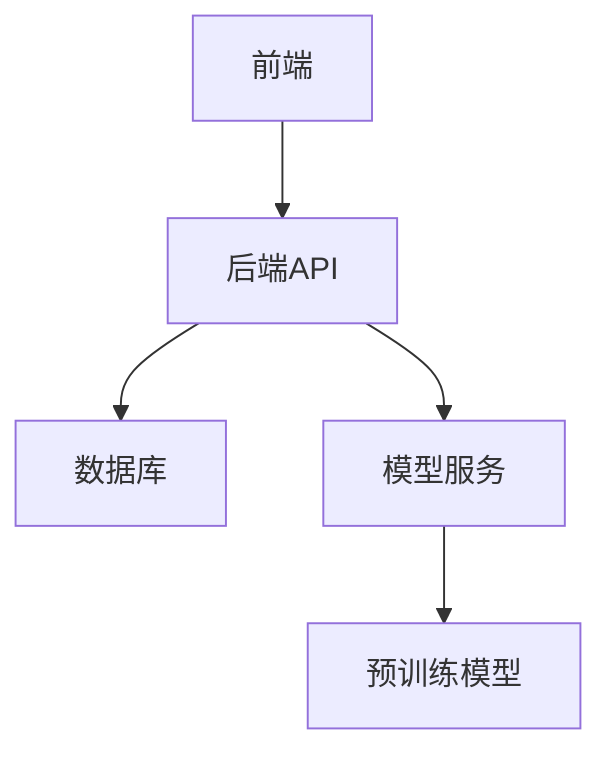
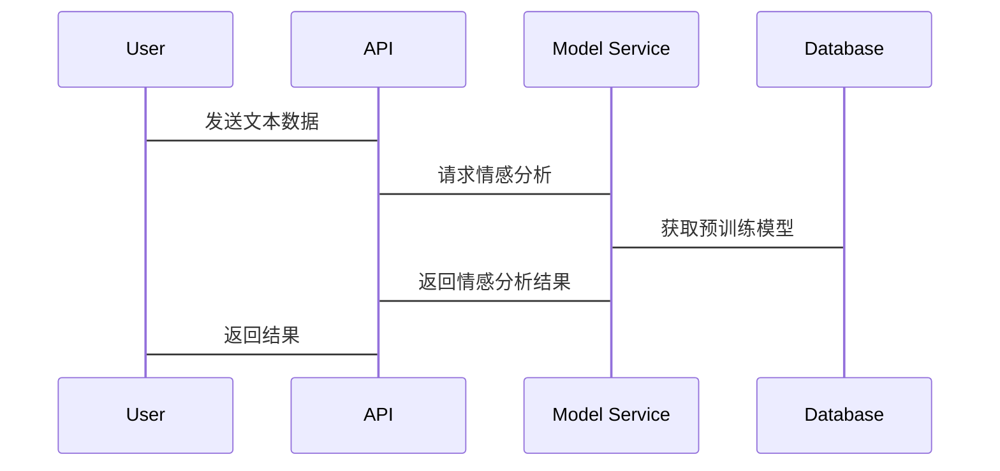

                 


# 情感分析：让AI Agent具备情商

## 关键词：情感分析、人工智能、自然语言处理、深度学习、文本挖掘

## 摘要：情感分析是一种通过计算机技术分析文本中的情感倾向的技术，让AI Agent能够理解和处理人类情感，具备情商。本文将从情感分析的背景、核心概念、算法原理、系统设计、项目实战等方面，详细讲解如何让AI Agent具备情商。

---

# 第1章: 情感分析的背景与概述

## 1.1 情感分析的核心概念

### 1.1.1 情感分析的定义与背景

情感分析是自然语言处理（NLP）领域的重要任务之一，旨在分析文本中所表达的情感倾向。随着社交媒体的普及和人工智能技术的发展，情感分析已成为企业、研究人员和个人广泛应用的技术。通过情感分析，我们可以了解用户对产品、服务或内容的情感态度，从而做出更精准的决策。

### 1.1.2 情感分析的应用场景

情感分析的应用场景非常广泛，包括：

1. **社交媒体分析**：分析用户在社交媒体上的评论、帖子，了解公众对某个品牌或产品的看法。
2. **客户反馈分析**：帮助企业分析客户反馈，识别客户满意度，优化产品和服务。
3. **舆情监控**：实时监控媒体、网络上的舆论动态，为企业提供及时的预警信息。
4. **推荐系统**：根据用户的情感偏好推荐相关内容或产品。
5. **客户服务**：通过分析客户的问题和情绪，提供更智能化的客服支持。

### 1.1.3 情感分析的边界与外延

情感分析的边界主要在于文本的情感倾向分析，而外延则包括了对情感强度、情感类别（如正面、负面、中性）的细化分析。此外，情感分析还涉及到对上下文的理解，例如识别讽刺、隐喻等复杂的情感表达。

### 1.1.4 情感分析的核心要素

情感分析的核心要素包括：

- **文本数据**：分析的对象，可以是评论、 tweets、文章等。
- **情感极性**：分析结果，通常分为正面、负面、中性。
- **情感强度**：情感的强烈程度，如非常正面、稍微正面等。
- **上下文理解**：理解文本的背景、语气等，以更准确地分析情感。

## 1.2 情感分析的挑战与解决方案

### 1.2.1 情感分析的主要挑战

1. **情感表达的复杂性**：文本中的情感表达可能涉及多种语言、文化和上下文因素，增加了分析的难度。
2. **数据标注成本高**：高质量的情感标注数据需要大量的人工投入。
3. **模型的泛化能力**：模型在不同领域、不同语言中的表现可能存在差异。

### 1.2.2 解决方案概述

1. **使用预训练模型**：利用如BERT、GPT等预训练语言模型，提升模型的泛化能力。
2. **数据增强技术**：通过数据增强技术，生成更多样化的训练数据，降低标注成本。
3. **结合领域知识**：针对特定领域（如医疗、金融）进行优化，提升模型的准确率。

### 1.2.3 技术路线的选择

情感分析的技术路线可以分为以下几个步骤：

1. **数据预处理**：清洗文本数据，去除噪声（如停用词、标点符号）。
2. **特征提取**：将文本转化为可计算的特征，如词袋模型、TF-IDF。
3. **模型训练**：使用机器学习或深度学习算法，训练情感分类模型。
4. **结果评估**：通过准确率、召回率、F1分数等指标评估模型性能。
5. **模型优化**：调整模型参数，优化算法，提升性能。

---

# 第2章: 情感分析的核心概念与联系

## 2.1 情感分析的核心原理

### 2.1.1 文本表示的原理

文本表示是情感分析的关键步骤。常用的文本表示方法包括：

1. **词袋模型（Bag of Words, BoW）**：将文本表示为词汇的集合，忽略词序。
2. **TF-IDF（Term Frequency-Inverse Document Frequency）**：衡量词在文本中的重要程度。
3. **词嵌入（Word Embedding）**：如Word2Vec、GloVe，将词表示为低维向量。

### 2.1.2 情感分类的机制

情感分类是将文本映射到情感类别（如正面、负面）的过程。常用的分类算法包括：

1. **朴素贝叶斯（Naive Bayes）**：基于概率论，计算每个类别的条件概率。
2. **支持向量机（SVM）**：通过构建超平面，将数据点分为不同类别。
3. **深度学习模型**：如RNN、LSTM、Transformer，适用于处理长文本和复杂情感表达。

### 2.1.3 上下文理解的模型

上下文理解是情感分析的重要组成部分。常用的模型包括：

1. **循环神经网络（RNN）**：适合处理序列数据，捕捉上下文信息。
2. **长短期记忆网络（LSTM）**：解决RNN的梯度消失问题，适用于长序列。
3. **Transformer**：基于自注意力机制，捕捉全局上下文信息。

## 2.2 情感分析的核心概念对比

### 2.2.1 监督学习与无监督学习的对比

| 特性               | 监督学习             | 无监督学习           |
|--------------------|----------------------|----------------------|
| 数据标注           | 需要标注数据         | 不需要标注数据       |
| 模型性能           | 通常更高            | 可能不如监督学习准确  |
| 应用场景           | 适合特定任务         | 适合发现未知模式      |

### 2.2.2 基于规则与基于模型的对比

| 特性               | 基于规则           | 基于模型             |
|--------------------|--------------------|----------------------|
| 实现复杂度         | 较低               | 较高                 |
| 可扩展性           | 较差               | 较好                 |
| 适应性             | 固定规则，适应性差   | 可自动学习，适应性强 |

### 2.2.3 情感词典与深度学习的对比

| 特性               | 情感词典           | 深度学习             |
|--------------------|--------------------|----------------------|
| 实现复杂度         | 较低               | 较高                 |
| 适应性             | 适用于简单场景     | 适用于复杂场景       |
| 精度               | 可能较低           | 通常较高             |

## 2.3 情感分析的ER实体关系图



---

# 第3章: 情感分析的算法原理

## 3.1 基于词袋模型的实现

### 3.1.1 词袋模型的流程

1. **文本预处理**：分词、去除停用词、词干提取。
2. **构建词袋**：统计每个词的出现频率。
3. **模型训练**：使用Naive Bayes或SVM进行分类。

### 3.1.2 代码实现

```python
from sklearn.feature_extraction.text import CountVectorizer
from sklearn.naive_bayes import MultinomialNB

# 文本数据
texts = ["This is a good movie", "This is a bad movie"]

# 特征提取
vectorizer = CountVectorizer()
X = vectorizer.fit_transform(texts)

# 模型训练
model = MultinomialNB()
model.fit(X, [1, 0])

# 预测
new_text = ["This is a great movie"]
X_new = vectorizer.transform([new_text])
print(model.predict(X_new))  # 输出：[[1]]
```

### 3.1.3 数学模型

Naive Bayes分类器基于贝叶斯定理，公式如下：

$$ P(y|X) = \frac{P(X|y)P(y)}{P(X)} $$

其中，$y$是情感类别，$X$是词袋表示的文本。

## 3.2 基于深度学习的实现

### 3.2.1 Transformer模型的介绍

Transformer模型由Google于2018年提出，基于自注意力机制，公式如下：

$$ \text{Attention}(Q, K, V) = \text{softmax}\left(\frac{QK^T}{\sqrt{d_k}}\right)V $$

其中，$Q$是查询向量，$K$是键向量，$V$是值向量，$d_k$是向量维度。

### 3.2.2 情感分类的流程

1. **文本预处理**：分词、去除停用词、词干提取。
2. **特征提取**：使用预训练的词嵌入（如BERT）。
3. **模型训练**：使用Transformer架构进行微调。
4. **结果预测**：对测试文本进行情感分类。

### 3.2.3 代码实现

```python
import tensorflow as tf
from tensorflow.keras.layers import Dense, Dropout, GlobalAveragePooling1D
from tensorflow.keras.models import Model
from tensorflow.keras.preprocessing.text import Tokenizer

# 数据预处理
tokenizer = Tokenizer()
texts = ["This is a good movie", "This is a bad movie"]
tokenizer.fit_on_texts(texts)
sequences = tokenizer.texts_to_sequences(texts)

# 特征提取
model_input = Input(shape=(None,), dtype="int32")
x = Embedding(input_dim=len(tokenizer.word_index)+1, output_dim=100)(model_input)
x = Dropout(0.2)(x)
x = GlobalAveragePooling1D()(x)
x = Dense(128, activation="relu")(x)
x = Dropout(0.2)(x)
output = Dense(1, activation="sigmoid")(x)

# 模型构建
model = Model(inputs=model_input, outputs=output)
model.compile(loss="binary_crossentropy", optimizer="adam", metrics=["accuracy"])

# 模型训练
model.fit(sequences, [1, 0], epochs=10, batch_size=32)
```

---

# 第4章: 情感分析的系统分析与架构设计

## 4.1 系统分析

### 4.1.1 应用场景介绍

情感分析系统可以应用于社交媒体监控、客户反馈分析、舆情预警等领域。

### 4.1.2 系统功能设计

- **数据预处理模块**：清洗文本数据，去除噪声。
- **特征提取模块**：将文本转化为可计算的特征。
- **模型训练模块**：训练情感分类模型。
- **结果展示模块**：展示情感分析结果，如情感分布、情感强度等。

## 4.2 系统架构设计

### 4.2.1 领域模型设计



### 4.2.2 系统架构设计



### 4.2.3 系统接口设计

- **API接口**：
  - POST /analyze：接收文本数据，返回情感分析结果。
  - GET /results：获取历史分析结果。

### 4.2.4 系统交互流程



---

# 第5章: 项目实战——构建情感分析系统

## 5.1 环境安装

### 5.1.1 安装Python和相关库

```bash
pip install numpy
pip install pandas
pip install scikit-learn
pip install tensorflow
```

## 5.2 系统核心实现

### 5.2.1 文本预处理

```python
import pandas as pd
from sklearn.preprocessing import LabelEncoder

# 加载数据
data = pd.read_csv("sentiment_data.csv")

# 文本清洗
data["text"] = data["text"].apply(lambda x: x.lower())
data["text"] = data["text"].apply(lambda x: x.replace(",", ""))
```

### 5.2.2 特征提取与模型训练

```python
from sklearn.feature_extraction.text import TfidfVectorizer
from sklearn.model_selection import train_test_split
from sklearn.naive_bayes import MultinomialNB

# 特征提取
vectorizer = TfidfVectorizer()
X = vectorizer.fit_transform(data["text"])
y = LabelEncoder().fit_transform(data["label"])

# 数据划分
X_train, X_test, y_train, y_test = train_test_split(X, y, test_size=0.2)

# 模型训练
model = MultinomialNB()
model.fit(X_train, y_train)

# 模型评估
print("准确率：", model.score(X_test, y_test))
```

### 5.2.3 模型优化

```python
from sklearn.model_selection import GridSearchCV

# 参数优化
param_grid = {"alpha": [0.1, 1, 10]}
grid_search = GridSearchCV(MultinomialNB(), param_grid, cv=5)
grid_search.fit(X_train, y_train)

# 输出最佳参数
print("最佳参数：", grid_search.best_params_)
```

## 5.3 项目总结

通过本项目，我们实现了情感分析系统的构建，包括数据预处理、特征提取、模型训练和评估。通过优化模型参数，提升了分类准确率。在实际应用中，可以根据具体需求选择不同的算法和模型，如使用深度学习模型进一步提升性能。

---

# 第6章: 最佳实践与小结

## 6.1 最佳实践

### 6.1.1 数据质量的重要性

高质量的数据是情感分析系统的基础。确保数据的准确性和多样性，有助于提高模型的泛化能力。

### 6.1.2 模型调优的技巧

- **参数调整**：通过网格搜索等方法寻找最佳参数。
- **数据增强**：生成更多样化的训练数据。
- **模型融合**：结合多种算法的结果，提升准确性。

### 6.1.3 业务场景的适配

根据具体的业务需求，选择合适的模型和算法。例如，在实时性要求较高的场景中，可以优先选择轻量级模型。

## 6.2 小结

情感分析是人工智能领域的重要技术，通过分析文本中的情感倾向，帮助AI Agent具备情商。本文从背景、核心概念、算法原理、系统设计到项目实战，全面介绍了情感分析的实现过程。通过实践，读者可以掌握情感分析的核心技术，并将其应用于实际项目中。

## 6.3 注意事项

- **数据隐私**：在处理用户数据时，需注意数据隐私和合规性。
- **模型解释性**：在实际应用中，确保模型的可解释性，便于调试和优化。
- **性能优化**：根据具体场景，优化模型的运行效率和资源消耗。

## 6.4 拓展阅读

- **《自然语言处理实战：基于Python的机器学习和深度学习》**：深入讲解NLP技术的实现与应用。
- **《情感分析入门》**：详细介绍情感分析的基本概念和实现方法。

---

通过本文的学习，读者可以系统地掌握情感分析的核心技术，从理论到实践，逐步构建自己的情感分析系统，让AI Agent真正具备情商，为企业和个人提供更智能化的服务和支持。

