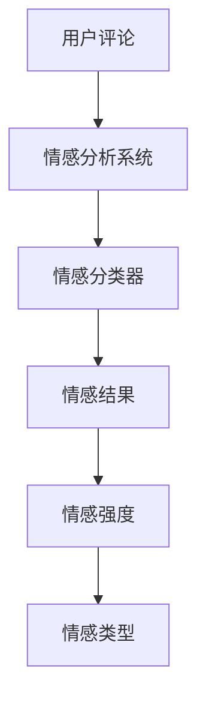
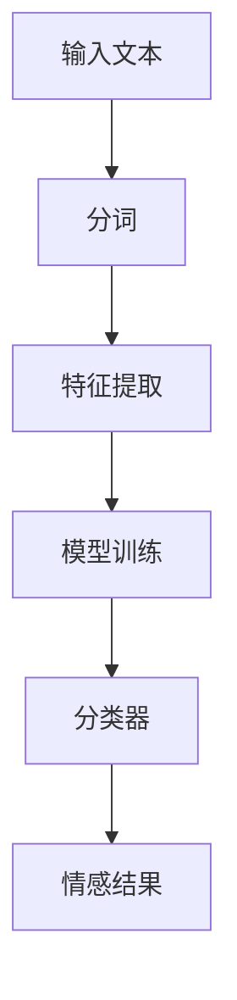
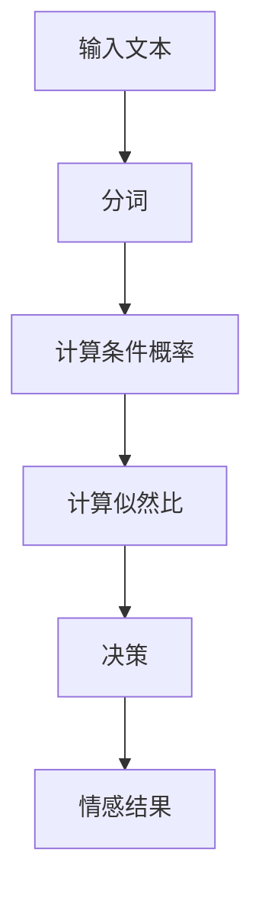
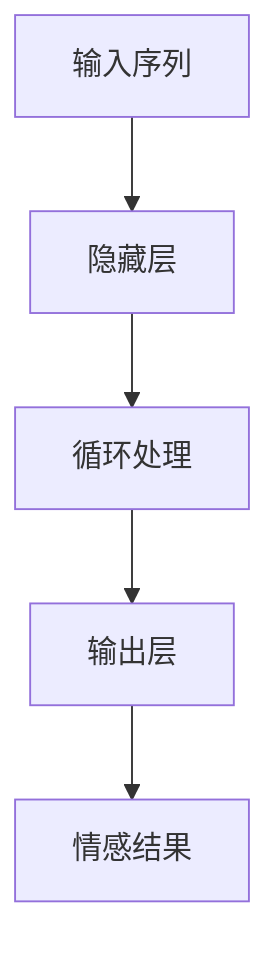
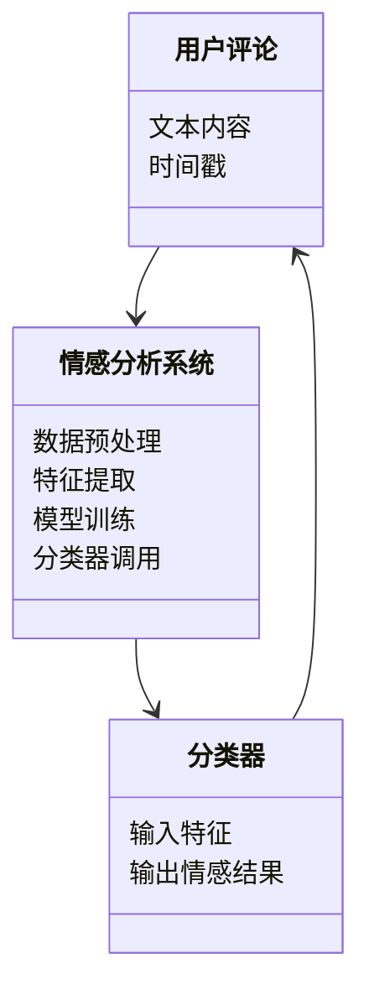
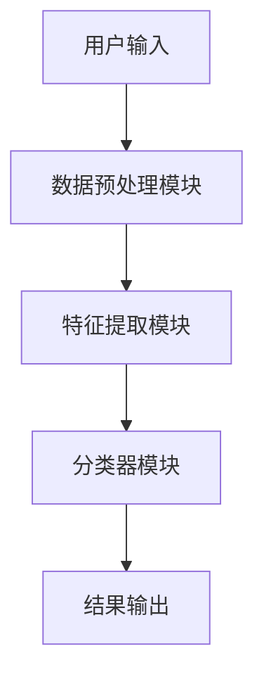
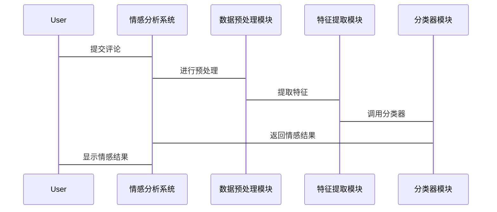

                 


# 情感分析：赋予AI Agent理解人类情绪的能力

## 关键词：情感分析、自然语言处理、AI Agent、深度学习、NLP

## 摘要：情感分析是自然语言处理中的重要任务，旨在让AI Agent能够理解人类语言中的情感信息。本文从情感分析的基本概念出发，详细探讨其核心算法、系统架构设计、项目实战等，帮助读者全面掌握情感分析的原理和应用。

---

# 第1章 情感分析概述

## 1.1 情感分析的核心概念

### 1.1.1 什么是情感分析
情感分析（Sentiment Analysis），也称为情绪分析，是自然语言处理（NLP）中的一个分支，旨在通过分析文本内容，判断其中的情感倾向。例如，判断一条用户评论是正面、负面还是中性。

### 1.1.2 情感分析的定义与范围
情感分析的目标是识别文本中隐含的情感信息。它的范围包括：
- **情感极性分析**：判断文本的情感倾向（如正面、负面、中性）。
- **情感强度分析**：量化情感的强烈程度。
- **情感原因分析**：识别导致情感的主要因素。

### 1.1.3 情感分析的应用场景
- **社交媒体分析**：分析用户评论、点赞、转发等情感倾向。
- **舆情监控**：帮助企业监控品牌声誉。
- **客服智能助手**：通过分析客户反馈优化服务。
- **电影评论分析**：预测电影票房。

## 1.2 情感分析的背景与意义

### 1.2.1 人类情绪与情感分析的关系
人类情感是复杂的，包括喜、怒、忧、思、悲、恐、惊七种基本情绪。情感分析通过技术手段，将这些复杂的情感信息转化为可计算的信号。

### 1.2.2 情感分析在AI Agent中的作用
AI Agent需要理解人类情感，才能更好地与人类交互。情感分析是实现这一目标的关键技术。

### 1.2.3 情感分析的技术发展史
情感分析起源于20世纪末，经历了从基于规则的方法到深度学习的转变。

## 1.3 情感分析的边界与外延

### 1.3.1 情感分析的边界
- 仅限于文本分析，不涉及图像或视频。
- 主要分析显式情感，隐式情感较难处理。

### 1.3.2 情感分析与其他NLP任务的区别
- **情感分析**：判断文本的情感倾向。
- **实体识别**：识别文本中的实体。
- **文本分类**：将文本归类到预定义类别中。

### 1.3.3 情感分析的外延应用
- **跨语言情感分析**：分析不同语言的文本情感。
- **时间序列情感分析**：分析情感随时间的变化趋势。

## 1.4 情感分析的核心要素

### 1.4.1 数据来源与特征
- 数据来源：社交媒体、评论、新闻等。
- 特征：词语频率、情感词、句式结构等。

### 1.4.2 分析模型与算法
- 统计模型：如朴素贝叶斯。
- 机器学习模型：如支持向量机。
- 深度学习模型：如LSTM、BERT。

### 1.4.3 结果解读与应用
- 正向应用：优化用户体验。
- 负向应用：预警负面舆情。

---

# 第2章 情感分析的核心概念与联系

## 2.1 情感分析的原理与流程

### 2.1.1 数据预处理
- 分词：将文本分割成词语。
- 去除停用词：去掉无意义的词语。
- 词干提取：还原词语到基本形式。

### 2.1.2 特征提取
- 词袋模型：统计词语频率。
- 词嵌入：如Word2Vec生成词向量。

### 2.1.3 分类器选择
- 根据任务选择合适的分类器：如SVM、随机森林、神经网络。

## 2.2 情感分析的核心算法

### 2.2.1 基于统计的方法
- **朴素贝叶斯**：基于概率论的分类方法，简单且高效。

### 2.2.2 基于机器学习的方法
- **支持向量机（SVM）**：适合小规模数据，分类性能好。

### 2.2.3 基于深度学习的方法
- **循环神经网络（RNN）**：适合处理序列数据。
- **卷积神经网络（CNN）**：适合提取局部特征。
- ** transformers（如BERT）**：当前最先进的模型。

## 2.3 情感分析的特征与属性

### 2.3.1 文本特征的提取方法
| 特征类型 | 描述 | 示例 |
|----------|------|------|
| 词频 | 某个词在文本中的频率 | TF-IDF |
| 词向量 | 词语的向量表示 | Word2Vec |
| 句式结构 | 句子的语法结构 | 主语、谓语等 |

### 2.3.2 情感极性的分类特征
| 情感类别 | 描述 | 示例 |
|----------|------|------|
| 正面 | 表达积极情感 | "这部电影太棒了" |
| 负面 | 表达消极情感 | "这部电影很无聊" |
| 中性 | 无明显情感倾向 | "这部电影一般" |

### 2.3.3 情感强度的度量特征
- 强度：如非常正面、比较正面、中性、比较负面、非常负面。

## 2.4 情感分析的ER实体关系图


## 2.5 本章小结

---

# 第3章 情感分析的算法原理与数学模型

## 3.1 常见情感分析算法

### 3.1.1 支持向量机（SVM）
SVM是一种监督学习算法，用于分类和回归。其核心思想是将数据映射到高维空间，找到一个超平面将数据分开。

### 3.1.2 朴素贝叶斯（Naive Bayes）
基于概率论的分类方法，假设特征之间相互独立，通过计算条件概率进行分类。

### 3.1.3 神经网络（RNN、CNN）

#### 3.1.3.1 循环神经网络（RNN）
适合处理序列数据，通过循环结构捕捉上下文信息。

#### 3.1.3.2 卷积神经网络（CNN）
适合提取局部特征，通过卷积操作捕捉文本中的语义信息。

## 3.2 算法原理与流程图

### 3.2.1 SVM算法流程图


### 3.2.2 Naive Bayes算法流程图


### 3.2.3 RNN算法流程图


## 3.3 数学公式

### 3.3.1 SVM数学模型
$$ y = \text{sign}(w \cdot x + b) $$

### 3.3.2 Naive Bayes数学模型
$$ P(y|x) = \frac{P(x|y)P(y)}{P(x)} $$

### 3.3.3 RNN数学模型
$$ h_t = \text{tanh}(W_h h_{t-1} + W_x x_t) $$
$$ y_t = \text{softmax}(W_y h_t) $$

---

# 第4章 系统分析与架构设计方案

## 4.1 项目背景与目标

### 4.1.1 项目背景
随着社交媒体的普及，用户生成的内容大量增加，情感分析的需求也日益增长。

### 4.1.2 项目目标
构建一个情感分析系统，能够对用户评论进行情感分类。

## 4.2 系统功能设计

### 4.2.1 领域模型


### 4.2.2 系统架构


### 4.2.3 系统接口设计
- 输入接口：用户评论文本。
- 输出接口：情感结果。

### 4.2.4 系统交互流程


---

# 第5章 项目实战

## 5.1 环境安装

### 5.1.1 安装Python
```bash
python --version
pip install --upgrade pip
```

### 5.1.2 安装依赖库
```bash
pip install numpy
pip install scikit-learn
pip install matplotlib
pip install transformers
```

## 5.2 系统核心实现源代码

### 5.2.1 数据预处理
```python
import re
from sklearn.feature_extraction.text import CountVectorizer

def preprocess(text):
    # 分词
    words = text.split()
    # 去除停用词
    stop_words = set(["是", "的", "了", "在"])
    filtered_words = [word for word in words if word not in stop_words]
    return ' '.join(filtered_words)
```

### 5.2.2 特征提取与模型训练
```python
from sklearn.naive_bayes import MultinomialNB
from sklearn.model_selection import train_test_split
from sklearn.metrics import accuracy_score

# 数据加载
texts = ["这部电影太棒了", "这部电影很无聊", " 电影还可以"]
labels = [1, 0, 0.5]

# 数据预处理
vectorizer = CountVectorizer()
X = vectorizer.fit_transform([preprocess(text) for text in texts])

# 划分训练集和测试集
X_train, X_test, y_train, y_test = train_test_split(X, labels, test_size=0.2)

# 模型训练
model = MultinomialNB()
model.fit(X_train, y_train)

# 模型预测
y_pred = model.predict(X_test)
print(accuracy_score(y_test, y_pred))
```

### 5.2.3 案例分析
```python
test_text = "这部电影真的很好看"
preprocessed = preprocess(test_text)
test_X = vectorizer.transform([preprocessed])
print(model.predict(test_X))
```

---

# 第6章 总结与展望

## 6.1 最佳实践
- 数据预处理要彻底。
- 选择合适的特征提取方法。
- 不断优化模型参数。

## 6.2 小结
情感分析是自然语言处理中的重要任务，能够帮助AI Agent更好地理解人类情感，提升人机交互体验。

## 6.3 注意事项
- 数据质量和标注是关键。
- 模型选择要根据具体任务。

## 6.4 拓展阅读
- 阅读相关论文，如“利用BERT进行情感分析”。
- 参与开源项目，如Kaggle上的相关比赛。

---

# 结语

情感分析作为自然语言处理的重要分支，正在不断进步。通过本文的学习，读者可以掌握情感分析的核心概念和实现方法，为构建智能AI Agent打下坚实的基础。

