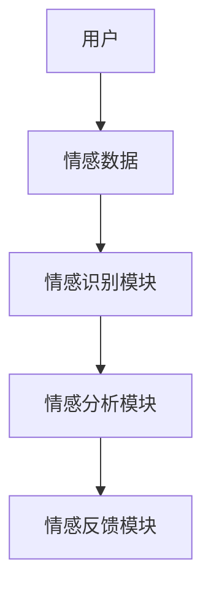
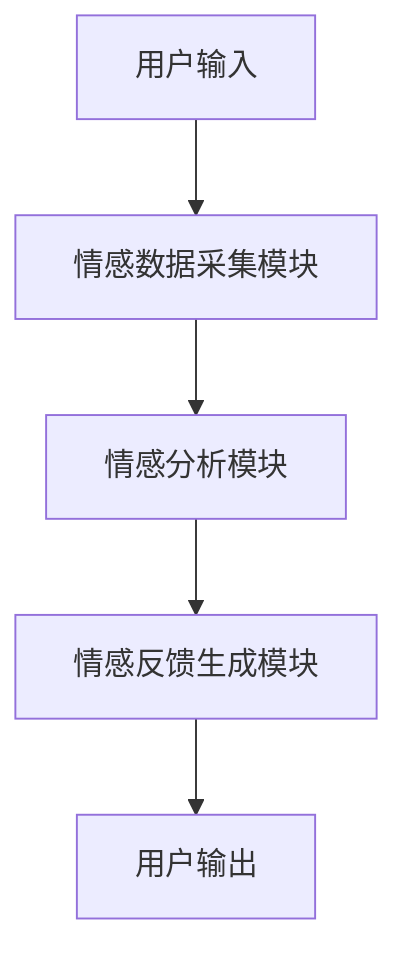
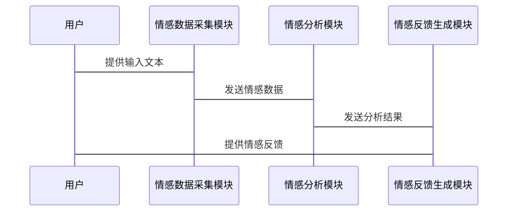

                 


# 情感智能 AI Agent：在 LLM 中植入 EQ

## 关键词：情感智能、AI Agent、LLM、EQ、人机交互

## 摘要：本文探讨了在大型语言模型（LLM）中植入情感智能（EQ）的重要性与实现方法。通过分析情感智能的核心概念、算法原理和系统架构，结合实际案例，展示了如何将情感智能与AI Agent结合，提升人机交互的体验和效果。

---

# 目录大纲：情感智能 AI Agent：在 LLM 中植入 EQ

---

## 第一部分：情感智能与 AI Agent 的背景介绍

### 第1章：情感智能与 AI Agent 的背景介绍

#### 1.1 情感智能（EQ）的核心概念
- 1.1.1 情感智能的定义与内涵
- 1.1.2 EQ 在人机交互中的重要性
- 1.1.3 情感智能的边界与外延

#### 1.2 情感智能与 AI Agent 的关系
- 1.2.1 AI Agent 的基本概念
- 1.2.2 情感智能如何增强 AI Agent 的能力
- 1.2.3 情感智能在 AI Agent 中的应用场景

#### 1.3 本书的核心目标与结构
- 1.3.1 本书的核心目标
- 1.3.2 本书的结构安排
- 1.3.3 本书的读者群体

---

## 第二部分：情感智能的核心概念与原理

### 第2章：情感智能的核心概念与联系

#### 2.1 情感智能的核心原理
- 2.1.1 情感识别的基本原理
- 2.1.2 情感记忆的机制
- 2.1.3 情感推理的逻辑

#### 2.2 情感智能与传统 AI 的区别
- 2.2.1 传统 AI 的局限性
- 2.2.2 情感智能的独特优势
- 2.2.3 情感智能与传统 AI 的结合

#### 2.3 情感智能的实体关系图


---

## 第三部分：情感智能的算法原理与数学模型

### 第3章：情感智能的算法原理

#### 3.1 情感识别算法
- 3.1.1 情感识别的基本流程
- 3.1.2 基于深度学习的情感识别算法
- 3.1.3 情感识别的实现代码示例
```python
def emotional_analysis(text):
    # 简化的情感识别算法
    positive_words = ["happy", "good", "excellent"]
    negative_words = ["sad", "bad", "terrible"]
    score = 0
    for word in text.split():
        if word in positive_words:
            score += 1
        elif word in negative_words:
            score -= 1
    return "positive" if score > 0 else "negative"
```

#### 3.2 情感增强算法
- 3.2.1 情感增强的基本原理
- 3.2.2 情感增强算法的实现步骤
- 3.2.3 情感增强算法的代码示例
```python
def emotional_enhancement(text):
    # 简化的情感增强算法
    keywords = {"happy": 1, "sad": -1, "good": 1, "bad": -1}
    score = 0
    for word in text.split():
        score += keywords.get(word, 0)
    return "enhanced_positive" if score > 0 else "enhanced_negative"
```

#### 3.3 情感智能的数学模型
- 3.3.1 情感相似度计算公式
$$ \text{相似度} = \frac{\sum_{i=1}^{n} w_i \cdot s_i}{\sqrt{\sum_{i=1}^{n} w_i^2} \cdot \sqrt{\sum_{i=1}^{n} s_i^2}} $$
- 3.3.2 情感分类的损失函数
$$ \text{损失函数} = -\sum_{i=1}^{n} y_i \cdot \log(p_i) + (1 - y_i) \cdot \log(1 - p_i) $$

---

## 第四部分：系统分析与架构设计

### 第4章：系统分析与架构设计

#### 4.1 项目场景介绍
- 4.1.1 项目背景
- 4.1.2 项目目标
- 4.1.3 项目范围

#### 4.2 系统功能设计
- 4.2.1 情感数据采集模块
- 4.2.2 情感分析模块
- 4.2.3 情感反馈生成模块

#### 4.3 系统架构设计


#### 4.4 系统接口设计
- 4.4.1 模块间的接口定义
- 4.4.2 接口的数据格式
- 4.4.3 接口的交互流程

#### 4.5 系统交互流程图


---

## 第五部分：项目实战

### 第5章：项目实战

#### 5.1 环境安装与配置
- 5.1.1 系统环境要求
- 5.1.2 软件依赖安装
- 5.1.3 开发工具配置

#### 5.2 核心代码实现
- 5.2.1 情感识别模块的实现
```python
def emotional_analysis(text):
    positive_words = ["happy", "good", "excellent"]
    negative_words = ["sad", "bad", "terrible"]
    score = 0
    for word in text.split():
        if word in positive_words:
            score += 1
        elif word in negative_words:
            score -= 1
    return "positive" if score > 0 else "negative"
```

- 5.2.2 情感增强模块的实现
```python
def emotional_enhancement(text):
    keywords = {"happy": 1, "sad": -1, "good": 1, "bad": -1}
    score = 0
    for word in text.split():
        score += keywords.get(word, 0)
    return "enhanced_positive" if score > 0 else "enhanced_negative"
```

#### 5.3 案例分析与实现
- 5.3.1 案例背景
- 5.3.2 案例分析
- 5.3.3 案例实现
- 5.3.4 实现结果与分析

#### 5.4 项目总结
- 5.4.1 项目成果
- 5.4.2 项目经验
- 5.4.3 项目改进建议

---

## 第六部分：最佳实践与总结

### 第6章：最佳实践与总结

#### 6.1 小结
- 6.1.1 情感智能的核心要点
- 6.1.2 AI Agent 的发展展望
- 6.1.3 情感智能与 AI 结合的趋势

#### 6.2 注意事项
- 6.2.1 实际应用中的常见问题
- 6.2.2 开发中的注意事项
- 6.2.3 使用中的禁忌

#### 6.3 拓展阅读
- 6.3.1 相关技术领域推荐书籍
- 6.3.2 相关学术论文推荐
- 6.3.3 行业动态与未来趋势

---

## 总结

通过以上目录结构，我们可以系统地从情感智能的基础概念，到算法实现，再到系统设计和项目实战，全面探讨在 LLM 中植入 EQ 的方法与实践。希望本文能够为读者提供有价值的技术参考和实践指导。

