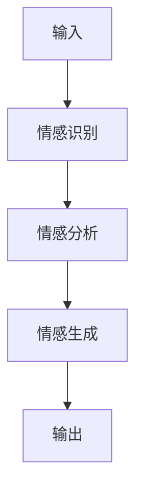
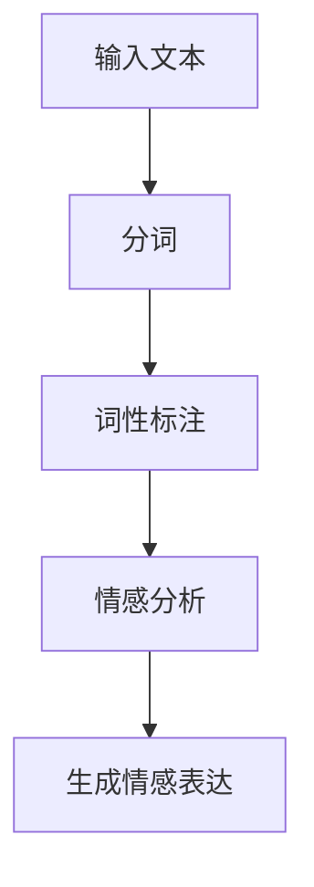
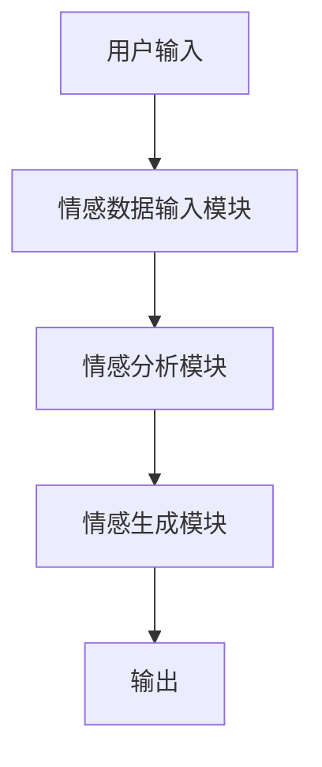
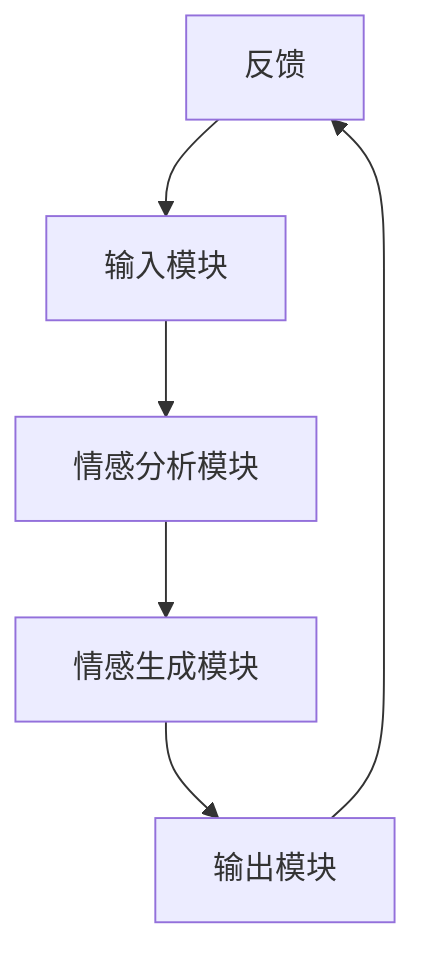

                 


# 情感计算：增强AI Agent的情感智能

> 关键词：情感计算、AI Agent、情感智能、人机交互、情感分析、情感生成

> 摘要：本文深入探讨了情感计算在增强AI Agent情感智能中的应用，从核心概念、算法原理到系统架构设计，再到实际项目实战，全面解析如何通过情感计算提升AI Agent的交互能力和用户体验。通过详细分析情感计算的数学模型、系统架构、实现案例等，为读者提供一套完整的解决方案。

---

# 第一部分：情感计算的背景与核心概念

## 第1章：情感计算的起源与定义

### 1.1 情感计算的起源
- 1.1.1 情感计算的提出背景
  - 人工智能从工具理性走向情感智能的转变。
  - 人机交互中情感因素的重要性逐渐凸显。
- 1.1.2 情感计算的研究现状
  - 学术界对情感计算的研究进展。
  - 工业界对情感计算的应用案例。
- 1.1.3 情感计算的核心目标
  - 提升AI Agent的情感理解能力。
  - 实现更自然的人机交互体验。

### 1.2 情感计算的定义与特点
- 1.2.1 情感计算的定义
  - 情感计算是通过分析和理解人类情感，增强AI Agent的智能水平。
- 1.2.2 情感计算的核心特点
  - 数据驱动：基于情感数据进行分析。
  - 实时性：快速响应用户情感变化。
  - 自适应性：根据情感反馈调整行为。
- 1.2.3 情感计算与传统计算的区别
  - 传统计算关注逻辑推理，情感计算关注情感理解。
  - 传统计算基于数据，情感计算基于情感数据。

### 1.3 情感计算的应用场景
- 1.3.1 情感计算在人机交互中的应用
  - 智能音箱、智能手机等设备的情感交互。
- 1.3.2 情感计算在智能客服中的应用
  - 根据用户情感调整回复策略。
- 1.3.3 情感计算在教育领域的应用
  - 根据学生情感状态调整教学策略。

---

## 第2章：情感计算的核心概念与联系

### 2.1 情感计算的核心概念
- 2.1.1 情感识别
  - 从输入中识别出情感信息。
- 2.1.2 情感分析
  - 对情感信息进行分类和理解。
- 2.1.3 情感生成
  - 根据情感信息生成相应的反馈。

### 2.2 情感计算的核心原理
- 2.2.1 情感计算的流程图


### 2.3 情感计算的实体关系图
```mermaid
entity 情感计算系统
entity 情感数据
entity 情感分析模型
entity 情感生成模块
```

---

## 第3章：情感计算的算法原理

### 3.1 情感计算的主要算法
- 3.1.1 基于规则的情感计算
  - 使用预定义的规则进行情感分类。
- 3.1.2 基于机器学习的情感计算
  - 使用训练数据进行情感分类模型的训练。
- 3.1.3 基于深度学习的情感计算
  - 使用神经网络模型进行情感分析。

### 3.2 情感计算的流程图


### 3.3 情感计算的数学模型
- 3.3.1 情感得分计算公式
$$ \text{情感得分} = \sum_{i=1}^{n} w_i \times e_i $$
其中，$w_i$ 是第 $i$ 个情感词的权重，$e_i$ 是情感词的情感值。

---

## 第4章：情感计算的系统架构设计

### 4.1 情感计算系统的功能设计
- 4.1.1 情感数据输入模块
  - 接收用户输入并进行初步处理。
- 4.1.2 情感分析模块
  - 对输入的情感数据进行分析和分类。
- 4.1.3 情感生成模块
  - 根据分析结果生成相应的反馈。

### 4.2 情感计算系统的架构图


### 4.3 情感计算系统的接口设计
- 4.3.1 输入接口
  - 接收用户输入的文本或语音数据。
- 4.3.2 输出接口
  - 返回情感分析结果或情感生成的反馈。

### 4.4 情感计算系统的交互流程图


---

## 第5章：情感计算的项目实战

### 5.1 项目背景与目标
- 5.1.1 项目背景
  - 构建一个简单的情感分析系统。
- 5.1.2 项目目标
  - 实现情感计算的核心功能。

### 5.2 项目环境与工具
- 5.2.1 开发环境
  - Python 3.8+
  - Jupyter Notebook
- 5.2.2 工具
  - NLTK库
  - Scikit-learn库

### 5.3 核心代码实现
```python
import nltk
from sklearn.feature_extraction.text import TfidfVectorizer
from sklearn.svm import SVC

# 数据预处理
corpus = ["I love this product!", "I hate this service!", "This is okay."]

# 分词
vectorizer = TfidfVectorizer()
X = vectorizer.fit_transform(corpus)

# 情感分类模型训练
model = SVC()
model.fit(X, ["positive", "negative", "neutral"])

# 情感生成
def generate_response(emotion):
    if emotion == "positive":
        return "Thank you for your positive feedback!"
    elif emotion == "negative":
        return "We apologize for your negative experience."
    else:
        return "We understand your neutral feedback."
```

### 5.4 代码解读与分析
- 5.4.1 数据预处理
  - 使用TF-IDF对文本数据进行特征提取。
- 5.4.2 情感分类模型训练
  - 使用SVM模型进行情感分类。
- 5.4.3 情感生成
  - 根据分类结果生成相应的反馈。

### 5.5 实际案例分析
- 5.5.1 输入案例
  - 输入文本："This service is terrible!"
- 5.5.2 情感分析
  - 情感分类结果：negative
- 5.5.3 情感生成
  - 反馈："We apologize for your negative experience."

### 5.6 项目小结
- 通过该项目，我们实现了情感计算的核心功能，验证了情感计算在实际应用中的可行性。

---

## 第6章：情感计算的应用与优化

### 6.1 情感计算在智能客服中的应用
- 6.1.1 情感计算如何提升用户体验
  - 根据用户情感调整回复策略。
- 6.1.2 情感计算如何提高客服效率
  - 快速识别用户情绪并提供解决方案。

### 6.2 情感计算在教育领域的应用
- 6.2.1 根据学生情感状态调整教学策略
  - 情感计算可以帮助教师更好地理解学生情绪。
- 6.2.2 情感计算在个性化学习中的作用
  - 根据学生情感状态推荐学习内容。

### 6.3 情感计算系统的优化方向
- 6.3.1 提高情感计算的准确性
  - 优化情感分析模型。
- 6.3.2 提高情感计算的实时性
  - 优化系统架构设计。
- 6.3.3 提高情感计算的可解释性
  - 提供情感计算的中间结果解释。

---

## 第7章：结论与展望

### 7.1 结论
- 情感计算是增强AI Agent情感智能的重要技术。
- 通过情感计算，我们可以实现更自然的人机交互。

### 7.2 展望
- 情感计算将在更多领域得到应用。
- 情感计算将更加智能化和个性化。

---

通过本文的详细分析，我们可以看到情感计算在增强AI Agent情感智能中的巨大潜力。未来，随着技术的进步，情感计算将在更多领域发挥重要作用。

