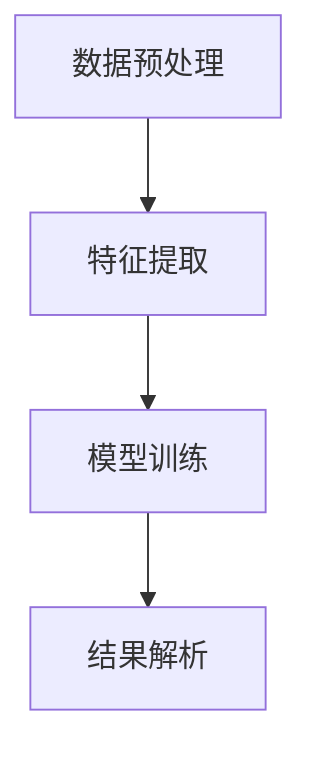

                 


# 意图识别：准确把握用户需求

## 关键词：
- 意图识别
- 自然语言处理
- 机器学习
- 实体识别
- 槽位填充
- 深度学习

## 摘要：
意图识别是自然语言处理中的关键任务，旨在理解用户话语背后的深层需求。本文从背景介绍、核心概念、算法原理、系统架构到项目实战，全面解析意图识别的技术要点，结合实际案例，探讨其应用价值及优化方法。

---

## 目录大纲：

### 第一章：意图识别背景与概念

#### 1.1 问题背景
- 1.1.1 自然语言处理的发展历程
  - 传统NLP的局限性
  - 深度学习的兴起与应用
- 1.1.2 深度学习在NLP中的应用
  - 词嵌入（如Word2Vec、BERT）
  - 模型结构（如RNN、Transformer）
- 1.1.3 意图识别的定义与目标
  - 意图识别的定义
  - 意图识别的目标：从输入中提取用户意图

#### 1.2 问题描述
- 1.2.1 用户需求的理解挑战
  - 语言的歧义性
  - 上下文的重要性
- 1.2.2 意图识别的核心问题
  - 如何准确提取意图
  - 如何处理多意图场景
- 1.2.3 意图识别的边界与外延
  - 意图识别的范围
  - 与其他任务（如实体识别）的区别

#### 1.3 问题解决
- 1.3.1 意图识别的解决方案
  - 数据驱动方法
  - 模型驱动方法
- 1.3.2 意图识别的关键技术
  - 词袋模型、词嵌入、序列模型
- 1.3.3 意图识别的应用场景
  - 智能音箱、聊天机器人、客服系统

#### 1.4 意图识别的核心要素
- 1.4.1 意图的定义与分类
  - 显式意图与隐式意图
  - 意图的粒度（如粗粒度与细粒度）
- 1.4.2 实体与槽位的定义
  - 实体识别：从文本中提取关键实体
  - 槽位填充：填充与意图相关的具体信息
- 1.4.3 意图识别系统的组成
  - 数据预处理、模型训练、结果解析

---

### 第二章：意图识别的核心概念与联系

#### 2.1 核心概念原理
- 2.1.1 意图识别的基本原理
  - 基于统计的方法（如朴素贝叶斯）
  - 基于深度学习的方法（如BERT）
- 2.1.2 实体识别与槽位填充
  - 实体识别的流程
  - 槽位填充的方法

#### 2.2 概念属性特征对比
| 概念 | 定义 | 示例 | 关联性 |
|------|------|------|--------|
| 意图 | 用户的需求目标 | “播放音乐” | 高 |
| 实体 | 文本中的关键信息 | “歌手名” | 中 |
| 槽位 | 实体的具体信息 | “歌手名=周杰伦” | 高 |

#### 2.3 ER实体关系图
```mermaid
er
actor User {
  id: integer
  name: string
}
actor Intent {
  id: integer
  name: string
}
actor Entity {
  id: integer
  name: string
  slot: string
}
User --> Intent: 提出
Intent --> Entity: 包含
```

---

### 第三章：意图识别的算法原理

#### 3.1 算法流程


#### 3.2 意图分类实现
- 3.2.1 数据预处理
  - 分词：将文本分割为词语或短语
  - 停用词处理：去除无意义词汇
- 3.2.2 特征提取
  - 词袋模型：统计词频（TF）
  - 词嵌入：生成词向量（如Word2Vec）
- 3.2.3 模型训练
  - 算法选择：随机森林、SVM、神经网络
  - 训练流程：输入特征向量，输出意图标签

#### 3.3 数学模型
- 3.3.1 条件概率公式
  $$ P(y|x) = \frac{P(x|y)P(y)}{P(x)} $$
- 3.3.2 神经网络模型
  $$ f(x) = \sigma(Wx + b) $$

---

### 第四章：系统分析与架构设计

#### 4.1 智能助手项目介绍
- 系统功能：接收用户输入，识别意图
- 核心功能：意图分类、实体识别

#### 4.2 系统功能设计


#### 4.3 系统架构设计


#### 4.4 系统接口设计
- 用户输入接口：接收文本输入
- 意图分类接口：返回意图标签

---

### 第五章：项目实战

#### 5.1 环境安装
- Python 3.x
- 安装库：numpy、scikit-learn、spacy

#### 5.2 核心实现
- 数据预处理代码
  ```python
  def preprocess(text):
      return text.lower().split()
  ```
- 模型训练代码
  ```python
  from sklearn.ensemble import RandomForestClassifier
  clf = RandomForestClassifier()
  clf.fit(X_train, y_train)
  ```

#### 5.3 实际案例分析
- 案例：识别用户意图“预订酒店”
- 步骤：输入文本、分词、特征提取、分类

---

### 第六章：最佳实践与总结

#### 6.1 最佳实践
- 数据质量：确保数据多样化
- 模型调优：选择合适的算法和参数
- 边缘情况：处理模糊表达和错误输入

#### 6.2 小结
意图识别是NLP中的重要任务，结合深度学习和传统算法，能够准确理解用户需求。

#### 6.3 注意事项
- 数据隐私：保护用户输入
- 模型泛化：提升鲁棒性

#### 6.4 拓展阅读
- 推荐书籍：《自然语言处理实战》
- 推荐论文：BERT论文

---

通过以上内容，我们详细探讨了意图识别的技术背景、核心概念、算法实现和实际应用，帮助读者全面掌握意图识别的核心技术与实践方法。

