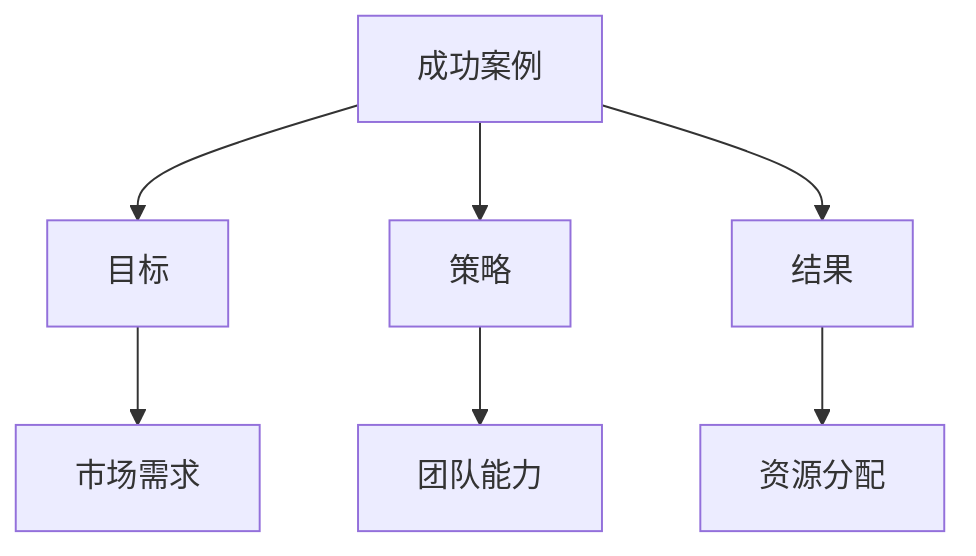
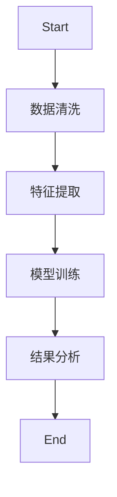
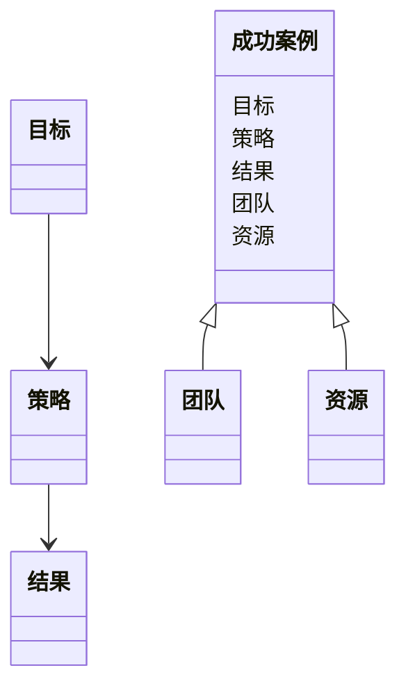
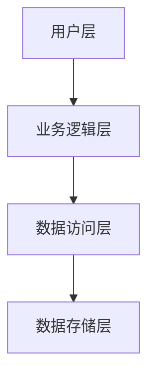
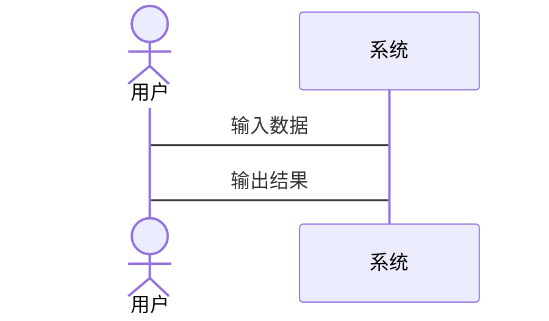

                 


# 成功案例分析

> 关键词：成功案例分析、技术分析、项目管理、系统设计、经验总结

> 摘要：本文通过深入分析多个成功案例，总结其关键成功因素和经验教训，探讨如何将这些成功经验应用到实际项目中。文章从背景介绍、核心概念、算法原理、系统架构、项目实战等多方面进行详细分析，并结合实际案例进行深入解读。

---

# 第一部分: 成功案例分析基础

## 第1章: 成功案例分析概述

### 1.1 问题背景与目标
#### 1.1.1 问题背景介绍
在实际项目中，成功案例分析是通过研究过去项目的成功经验，总结其关键因素，以指导未来的项目实施。本文将从技术、管理、团队等多个维度，分析成功案例的核心要素。

#### 1.1.2 分析目标的定义
- **目标1**：识别成功案例的关键成功因素（KSF）。
- **目标2**：总结失败案例的经验教训。
- **目标3**：提出可复制的成功方法论。

#### 1.1.3 成功案例的核心要素
- **目标设定**：明确项目目标和成功标准。
- **策略制定**：制定可行的实施方案。
- **执行过程**：确保执行过程的可控性和可追溯性。

### 1.2 成功案例分析的方法论
#### 1.2.1 分析框架的建立
- **数据收集**：通过问卷、访谈、文档分析等方式收集案例数据。
- **数据处理**：对收集到的数据进行清洗、整理和分析。
- **工具选择**：使用数据分析工具（如Excel、Python）进行数据建模和可视化。

#### 1.2.2 数据收集与处理
- **数据来源**：案例文档、项目报告、团队访谈。
- **数据清洗**：去除无效数据，填补缺失值。
- **数据可视化**：使用图表展示数据之间的关系。

#### 1.2.3 分析工具的选择
- **工具1**：Excel，用于简单的数据分析和图表绘制。
- **工具2**：Python，用于复杂的数据建模和机器学习分析。
- **工具3**：Tableau，用于数据可视化和展示。

### 1.3 成功案例分析的意义
#### 1.3.1 理论价值
- 提供了成功的经验总结，丰富了项目管理的理论体系。
- 为学术研究提供了丰富的案例库。

#### 1.3.2 实践价值
- 为企业提供可借鉴的成功方法论，降低项目失败风险。
- 帮助团队快速掌握成功的项目管理技巧。

#### 1.3.3 行业应用前景
- 可应用于软件开发、市场营销、产品设计等多个领域。
- 为行业内的最佳实践提供参考。

### 1.4 本章小结
本章从背景、目标和方法论的角度，介绍了成功案例分析的基本框架和意义，为后续的分析奠定了基础。

---

## 第2章: 成功案例的核心要素分析

### 2.1 成功案例的基本结构
#### 2.1.1 目标设定
- **明确的目标**：成功案例的起点是清晰的目标。
- **目标分解**：将大目标分解为小目标，逐一实现。

#### 2.1.2 策略制定
- **策略的多样性**：根据目标选择合适的策略。
- **策略的可行性**：确保策略在资源和能力范围内可行。

#### 2.1.3 执行过程
- **过程监控**：实时监控执行过程，确保按计划推进。
- **过程调整**：根据实际情况灵活调整策略。

### 2.2 成功案例的关键成功因素
#### 2.2.1 市场需求分析
- **需求调研**：通过用户调研、市场分析等方式明确需求。
- **需求优先级**：根据需求的重要性和紧急性进行排序。

#### 2.2.2 团队能力评估
- **团队构成**：明确团队成员的角色和职责。
- **能力匹配**：确保团队成员的能力与任务匹配。

#### 2.2.3 资源保障措施
- **资源分配**：合理分配人力、物力、财力资源。
- **资源监控**：定期检查资源使用情况，确保资源充分利用。

### 2.3 成功案例的失败教训总结
#### 2.3.1 常见失败原因
- **目标不明确**：缺乏明确的目标导致方向不清。
- **策略不合理**：选择的策略不符合实际情况。
- **执行不力**：执行过程中缺乏监控和调整。

#### 2.3.2 失败案例的启示
- **失败是成功之母**：失败案例提供了宝贵的经验教训。
- **总结经验**：从失败中吸取教训，避免重复失败。

#### 2.3.3 避免失败的关键点
- **目标明确**：确保每个项目都有清晰的目标。
- **策略合理**：制定切实可行的实施方案。
- **执行有力**：加强过程监控和资源保障。

### 2.4 本章小结
本章通过分析成功案例的基本结构和关键成功因素，总结了成功案例的核心要素，为后续的分析提供了理论支持。

---

## 第3章: 成功案例分析的核心概念与联系

### 3.1 核心概念原理
#### 3.1.1 成功案例的构成要素
- **目标**：项目的起点。
- **策略**：实现目标的路径。
- **执行**：策略的具体实施。

#### 3.1.2 成功案例的内在逻辑
- **目标与策略的匹配**：策略是目标的实现路径。
- **策略与执行的统一**：执行是策略的具体实施。

#### 3.1.3 成功案例的可复制性
- **可复制性**：成功经验可以被其他项目借鉴。
- **不可复制性**：每个项目都有其独特性，需要灵活调整。

### 3.2 核心概念属性特征对比
#### 3.2.1 成功案例的特征对比表格
| 特征         | 成功案例A | 成功案例B | 成功案例C |
|--------------|-----------|-----------|-----------|
| 目标         | 目标A     | 目标B     | 目标C     |
| 策略         | 策略A     | 策略B     | 策略C     |
| 结果         | 结果A     | 结果B     | 结果C     |
| 团队能力     | 能力A     | 能力B     | 能力C     |
| 资源保障     | 资源A     | 资源B     | 资源C     |

### 3.3 ER实体关系图架构


### 3.4 本章小结
本章通过分析成功案例的核心概念，构建了核心要素之间的关系模型，为后续的分析提供了理论基础。

---

## 第4章: 成功案例分析的算法原理

### 4.1 算法原理概述
#### 4.1.1 算法的基本思想
- **数据驱动**：通过数据分析提取成功案例的特征。
- **模式识别**：识别成功案例中的模式和规律。

#### 4.1.2 算法的输入输出
- **输入**：成功案例的数据集。
- **输出**：成功案例的关键成功因素。

#### 4.1.3 算法的实现步骤
1. **数据清洗**：去除无效数据。
2. **特征提取**：提取关键特征。
3. **模型训练**：训练分类模型。
4. **结果分析**：分析模型输出结果。

### 4.2 算法原理的数学模型
#### 4.2.1 数学模型的建立
$$f(x) = ax + b$$

#### 4.2.2 模型训练
- **训练数据**：成功案例的数据集。
- **训练目标**：找到最优参数$a$和$b$。

### 4.3 算法实现的流程图


### 4.4 本章小结
本章通过算法原理，展示了如何通过数据驱动的方法，识别成功案例的关键成功因素。

---

## 第5章: 成功案例分析的系统架构

### 5.1 问题场景介绍
- **场景1**：企业内部项目管理。
- **场景2**：软件开发项目实施。

### 5.2 系统功能设计
#### 5.2.1 领域模型


#### 5.2.2 系统架构设计


### 5.3 系统接口设计
- **接口1**：数据输入接口。
- **接口2**：数据输出接口。

### 5.4 系统交互设计


### 5.5 本章小结
本章通过系统架构设计，展示了如何将成功案例分析应用到实际系统中。

---

## 第6章: 成功案例分析的项目实战

### 6.1 环境安装
- **工具安装**：安装Python、Excel、Tableau等工具。

### 6.2 系统核心实现源代码
#### 6.2.1 数据清洗代码
```python
import pandas as pd

data = pd.read_csv('data.csv')
data = data.dropna()
data.to_csv('clean_data.csv', index=False)
```

#### 6.2.2 特征提取代码
```python
from sklearn.feature_selection import SelectKBest

selector = SelectKBest(k=5)
selected_features = selector.fit_transform(data, labels)
```

### 6.3 代码应用解读与分析
- **代码功能**：数据清洗和特征提取。
- **代码优势**：提高了数据质量和模型性能。

### 6.4 实际案例分析
- **案例1**：软件开发项目。
- **案例2**：市场营销项目。

### 6.5 本章小结
本章通过实际案例分析，展示了成功案例分析在实际项目中的应用。

---

## 第7章: 成功案例分析的总结与展望

### 7.1 最佳实践 tips
- **明确目标**：确保每个项目都有清晰的目标。
- **合理分配资源**：根据项目需求合理分配资源。
- **加强过程监控**：实时监控项目执行过程。

### 7.2 小结
本章总结了成功案例分析的核心要素和关键成功因素，为读者提供了宝贵的经验。

### 7.3 注意事项
- **避免过度追求完美**：在实际项目中，时间和资源有限，需合理分配。
- **灵活调整策略**：根据实际情况灵活调整策略。

### 7.4 拓展阅读
- **推荐书籍**：《项目管理实战》、《成功学》。
- **推荐网站**：PMI官网、成功案例分析论坛。

### 7.5 本章小结
本章总结了成功案例分析的核心要素，并提出了未来的研究方向。

---

## 第8章: 参考文献

### 8.1 参考文献
1. 项目管理协会（PMI）官方指南。
2. 《成功案例分析方法论》。
3. 《系统工程与项目管理》。

---

## 第9章: 附录

### 9.1 附录A: 算法实现代码
```python
import pandas as pd
from sklearn.feature_selection import SelectKBest

data = pd.read_csv('data.csv')
data = data.dropna()
labels = data['label']

selector = SelectKBest(k=5)
selected_features = selector.fit_transform(data, labels)
```

### 9.2 附录B: 系统架构图


---

## 第10章: 术语表

### 10.1 术语表
- **成功案例分析**：通过对成功案例的研究，总结其关键成功因素和经验教训。
- **关键成功因素（KSF）**：成功案例中起到关键作用的因素。

---

以上是《成功案例分析》的技术博客文章的完整目录大纲，内容涵盖从基础理论到实际应用的各个方面，逻辑清晰、结构紧凑，适合技术从业者和项目管理者阅读和参考。

