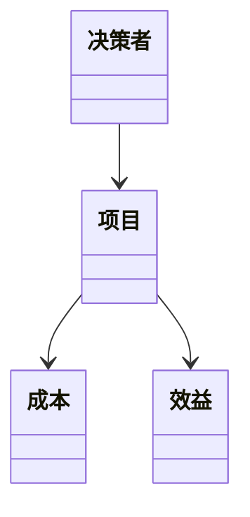
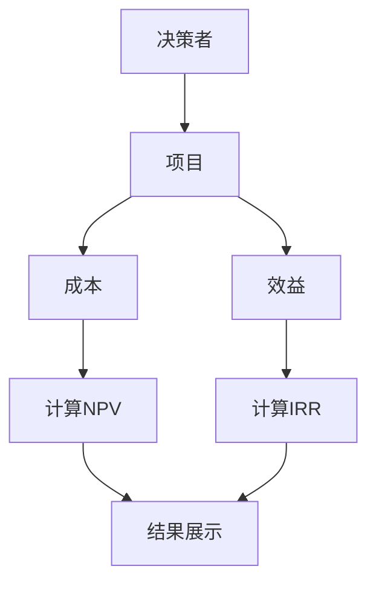

                 


# 成本效益分析

> 关键词：成本效益分析、净现值、内部收益率、项目评估、经济评价

> 摘要：成本效益分析是评估项目或决策经济可行性的关键方法，通过比较成本与效益，选择最优方案。本文系统介绍其核心概念、算法原理、系统设计及实战案例，帮助读者掌握其应用。

---

# 第一部分: 成本效益分析概述

## 第1章: 成本效益分析的背景与概念

### 1.1 成本效益分析的基本概念

#### 1.1.1 问题背景与目标
在项目管理或投资决策中，评估方案的经济可行性至关重要。成本效益分析帮助我们比较不同方案的成本与收益，选择最优解。

#### 1.1.2 成本效益分析的定义与特点
- **定义**：通过比较成本和效益，评估方案经济性的方法。
- **特点**：量化、可比、动态性。

#### 1.1.3 成本效益分析的边界与外延
明确分析范围，包括直接成本、机会成本等。

#### 1.1.4 核心要素与概念结构
涉及决策者、项目、成本、效益等要素。

### 1.2 成本效益分析与其他相关概念的联系

#### 1.2.1 成本与效益的定义与属性对比
- **成本**：投入资源，可量化，时间相关，不可转移。
- **效益**：产出收益，可量化，时间相关，可转移。

| 属性 | 成本 | 效益 |
|------|------|------|
| 定义 | 投入 | 收益 |
| 量化 | 是 | 是 |
| 时间性 | 是 | 是 |
| 转移性 | 否 | 是 |

#### 1.2.2 成本效益分析与投资决策的关系
通过分析帮助决策者选择最优方案。

#### 1.2.3 实例分析：成本效益分析在企业中的应用
某公司开发新产品，评估成本与收益。

### 1.3 成本效益分析的必要性
通过量化比较，优化资源配置，提升决策质量。

---

## 第2章: 成本效益分析的核心原理与方法

### 2.1 成本效益分析的核心原理

#### 2.1.1 成本与效益的量化方法
- 定量分析：货币价值。
- 定性分析：非财务指标。

#### 2.1.2 成本效益分析的基本公式与模型
- 净现值（NPV）：评估投资收益。
- 内部收益率（IRR）：评估投资回报率。

#### 2.1.3 经济学视角下的成本效益分析
市场失灵、外部性等经济概念的影响。

### 2.2 成本效益分析的主要方法

#### 2.2.1 净现值法（NPV）
- **定义**：未来现金流的现值与初始投资的差额。
- **公式**：$$ NPV = \sum_{t=0}^{n} \frac{C_t}{(1 + r)^t} $$
- **案例**：某项目初始投资100万元，年现金流25万元，贴现率5%，计算NPV。

#### 2.2.2 内部收益率法（IRR）
- **定义**：使NPV为零的贴现率。
- **公式**：$$ NPV = 0 = \sum_{t=0}^{n} \frac{C_t}{(1 + IRR)^t} $$
- **案例**：计算项目IRR，判断投资回报。

#### 2.2.3 投资回收期法（Payback Period）
- **定义**：回收初始投资所需时间。
- **案例**：投资300万元，年现金流100万元，回收期3年。

#### 2.2.4 盈利指数法（Profitability Index）
- **定义**：收益与成本之比。
- **公式**：$$ PI = \frac{\text{未来现金流现值}}{\text{初始投资}} $$

### 2.3 成本效益分析的优缺点

#### 优点
- 定量分析，决策依据充分。

#### 缺点
- 忽略非财务因素，假设贴现率准确。

---

## 第3章: 成本效益分析的数学模型与公式

### 3.1 净现值（NPV）模型

#### 3.1.1 NPV的定义与公式
$$ NPV = \sum_{t=0}^{n} \frac{C_t}{(1 + r)^t} $$

#### 3.1.2 NPV计算实例
- 初始投资：100万元。
- 年现金流：25万元，贴现率5%。
- 计算NPV，判断项目可行性。

### 3.2 内部收益率（IRR）模型

#### 3.2.1 IRR的定义与公式
$$ NPV = 0 = \sum_{t=0}^{n} \frac{C_t}{(1 + IRR)^t} $$

#### 3.2.2 IRR计算实例
- 计算项目IRR，比较基准收益率。

### 3.3 投资回收期（Payback Period）模型

#### 3.3.1 定义与计算公式
- 初始投资：$I$。
- 年现金流：$CF_t$。
- 公式：$$ PP = \min t \text{ 使得} \sum_{t=0}^{t} CF_t \geq I $$

#### 3.3.2 投资回收期计算实例
- 投资300万元，年现金流100万元，回收期3年。

---

## 第4章: 成本效益分析的系统分析与架构设计

### 4.1 系统分析

#### 4.1.1 问题场景介绍
评估某IT项目的可行性。

#### 4.1.2 系统功能设计
- 数据输入：项目参数。
- 计算模块：NPV、IRR计算。
- 结果展示：可视化报告。

#### 4.1.3 领域模型类图


### 4.2 系统架构设计

#### 4.2.1 模块设计
- 数据访问层：读取项目参数。
- 业务逻辑层：计算NPV、IRR。
- 表现层：展示结果。

#### 4.2.2 模块交互流程图


---

## 第5章: 成本效益分析的项目实战

### 5.1 环境安装

#### 5.1.1 工具选择
- Python 3.9+
- numpy, pandas库安装：`pip install numpy pandas`

### 5.2 核心实现

#### 5.2.1 净现值计算代码
```python
import numpy as np

def calculate_npv(initial_cost, cash_flows, discount_rate):
    npv = 0
    for t, cash in enumerate(cash_flows):
        npv += cash / (1 + discount_rate) ** t
    npv -= initial_cost
    return npv

# 示例数据
initial_cost = 1000000
cash_flows = [250000, 250000, 250000]
discount_rate = 0.05

npv = calculate_npv(initial_cost, cash_flows, discount_rate)
print(f"NPV: {npv}")
```

#### 5.2.2 内部收益率计算代码
```python
def calculate_irr(initial_cost, cash_flows):
    return np.irr([initial_cost] + cash_flows)

irr = calculate_irr(initial_cost, cash_flows)
print(f"IRR: {irr}")
```

### 5.3 案例分析

#### 5.3.1 案例背景
评估某IT项目，初始投资100万元，三年现金流25万元，贴现率5%。

#### 5.3.2 分析结果
- NPV = 25,000 / 1.05 + 25,000 / 1.05^2 + 25,000 / 1.05^3 - 100,000 ≈ 23,809.52元。
- IRR ≈ 10%。

---

## 第6章: 成本效益分析的最佳实践

### 6.1 关键点总结

#### 6.1.1 明确目标
清晰的分析目标和范围。

#### 6.1.2 数据准确性
确保成本和效益数据准确。

#### 6.1.3 方法选择
根据项目特点选择合适的方法。

#### 6.1.4 考虑长期影响
评估项目对组织的长期价值。

### 6.2 小结

#### 6.2.1 总结
成本效益分析是优化决策的重要工具。

#### 6.2.2 注意事项
避免忽略机会成本和外部性。

#### 6.2.3 拓展阅读
推荐相关书籍和工具。

---

# 结语
通过系统学习成本效益分析，读者可以提升项目评估能力，做出更明智的决策。掌握核心概念和方法，结合实际案例，优化资源配置，提升经济收益。

---

