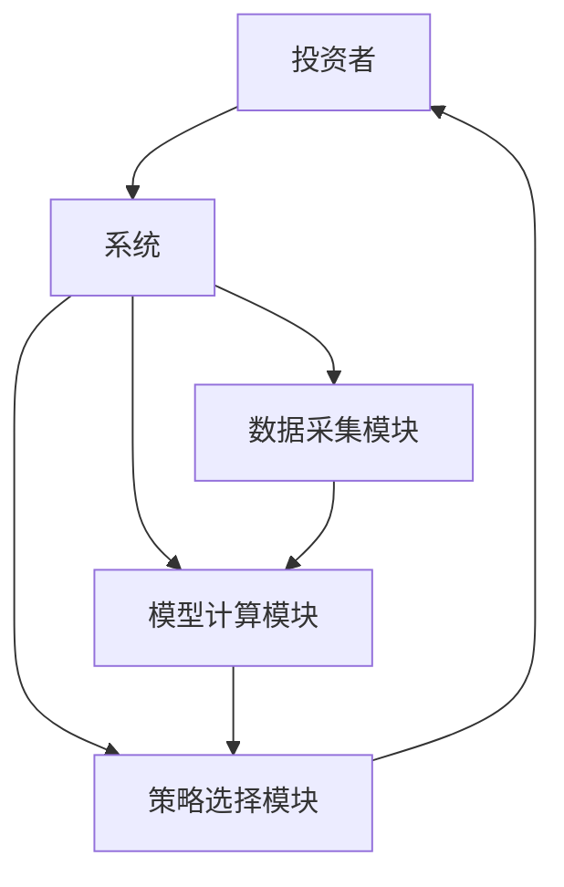
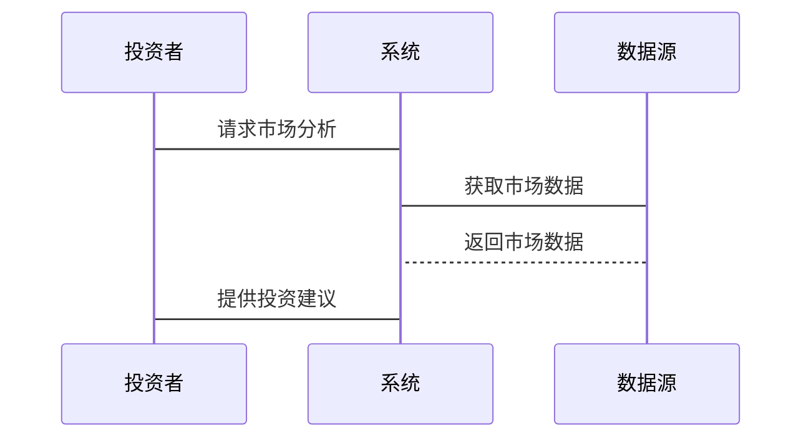

                 


# 成长型投资vs价值型投资：市场周期中的选择

> 关键词：成长型投资，价值型投资，市场周期，投资策略，价值评估

> 摘要：本文将深入探讨成长型投资和价值型投资的区别及其在不同市场周期中的适用性。通过分析这两种投资策略的核心概念、数学模型和实际案例，本文旨在为投资者提供在不同市场环境下做出明智投资决策的指导。文章还介绍了如何构建一个投资决策支持系统，帮助投资者在复杂多变的市场环境中优化投资组合。

---

# 第一部分: 投资策略概述

## 第1章: 成长型投资与价值型投资概述

### 1.1 投资的基本概念

#### 1.1.1 什么是投资
投资是指将资金投入到某种资产或项目中，期望在未来获得收益或资本增值的行为。投资的核心在于通过合理配置资产，降低风险，同时追求收益的最大化。

#### 1.1.2 投资的基本原则
- 分散投资：降低风险，避免将所有资金投入到单一资产。
- 长期视角：投资不是短期交易，而是长期价值的积累。
- 风险与收益平衡：高风险可能带来高收益，但也可能带来更大的损失。

#### 1.1.3 投资的分类与层次
投资可以分为股票、债券、房地产等多种形式。本文主要关注股票投资中的成长型和价值型策略。

### 1.2 成长型投资与价值型投资的定义

#### 1.2.1 成长型投资的定义
成长型投资是指投资于那些具有高成长潜力的公司，这些公司通常在高速发展的行业中，营业收入和利润增长率较高。投资者相信这些公司未来会带来超额收益。

#### 1.2.2 价值型投资的定义
价值型投资是指投资于那些市场价格低于其内在价值的公司。投资者寻找被市场低估的股票，认为这些股票最终会被市场重新评估，从而带来资本增值。

#### 1.2.3 两种投资策略的核心区别
- 成长型投资注重未来的增长潜力，而价值型投资注重当前的低估状态。
- 成长型投资的风险较高，收益潜力大；价值型投资相对保守，风险较低。

### 1.3 市场周期与投资策略选择

#### 1.3.1 市场周期的基本概念
市场周期分为上升周期、下降周期和震荡周期。在不同周期中，成长型和价值型投资的表现各异。

#### 1.3.2 不同市场周期下的投资策略
- 上升周期：成长型投资表现优于价值型。
- 下降周期：价值型投资更具防御性，表现更优。
- 震荡周期：两种策略的表现取决于市场的具体情况。

#### 1.3.3 成长型与价值型投资在周期中的表现
- 成长型投资在牛市中表现优异，但在熊市中可能大幅回调。
- 价值型投资在熊市中更具稳定性，但在牛市中可能跑输市场。

### 1.4 本章小结
本章介绍了成长型和价值型投资的基本概念，并分析了它们在不同市场周期中的表现。投资者需要根据市场环境选择合适的投资策略。

---

## 第2章: 成长型投资与价值型投资的核心概念对比

### 2.1 核心概念原理

#### 2.1.1 成长型投资的核心要素
- 营收增长率：通常要求高于行业平均水平。
- 利润率：关注净利润率和边际利润率。
- 市场地位：是否处于高增长行业，是否有竞争优势。

#### 2.1.2 价值型投资的核心要素
- 市盈率（P/E）：低于行业平均水平。
- 市净率（P/B）：低于行业平均水平。
- 股息率：通常较高，但并非绝对要求。

#### 2.1.3 两者的共同点与差异点
- 共同点：都追求资本增值，注重基本面分析。
- 差异点：成长型关注未来增长，价值型关注当前低估。

### 2.2 概念属性特征对比表格

| 属性          | 成长型投资                | 价值型投资                |
|---------------|--------------------------|--------------------------|
| 核心目标      | 寻找高增长潜力的公司      | 寻找被低估的公司          |
| 估值方法      | 市盈率增长法、DCF模型      | 市盈率、市净率、股息率     |
| 风险水平      | 高风险                   | 中低风险                 |
| 适用市场      | 牛市、新兴行业            | 熊市、成熟行业            |

### 2.3 ER实体关系图架构

```mermaid
erDiagram
    actor 投资者
    actor 市场周期
    actor 行业分析
    actor 财务数据
    actor 市场情绪
    investor --> 成长型投资: 选择成长型策略
    investor --> 价值型投资: 选择价值型策略
    成长型投资 --> 市场周期: 适应牛市
    价值型投资 --> 市场周期: 适应熊市
    成长型投资 --> 行业分析: 寻找高增长行业
    价值型投资 --> 行业分析: 寻找低估行业
    成长型投资 --> 财务数据: 分析增长率
    价值型投资 --> 财务数据: 分析估值指标
```

---

## 第3章: 成长型与价值型投资的数学模型

### 3.1 成长型投资的数学模型

#### 3.1.1 股票估值的DCF模型

DCF（Discounted Cash Flow）模型用于估算公司的内在价值。公式如下：

$$
\text{内在价值} = \sum_{t=1}^{n} \frac{\text{自由现金流}_t}{(1 + r)^t} + \frac{\text{终值}}{(1 + r)^n}
$$

其中，$r$ 是折现率，$n$ 是预测期数。

#### 3.1.2 市盈率与市净率的应用

市盈率（P/E）= 股价 / 每股收益

市净率（P/B）= 股价 / 每股净资产

#### 3.1.3 成长型股票的筛选标准

- 营收增长率 > 行业平均营收增长率
- 净利润增长率 > 行业平均净利润增长率
- 市盈率合理，DCF模型评估的内在价值高于当前股价

### 3.2 价值型投资的数学模型

#### 3.2.1 市盈率与股息率的计算

股息率 = 每股股息 / 股价

#### 3.2.2 价值陷阱的识别模型

价值陷阱识别：如果一家公司的市盈率低于行业平均水平，但营收和净利润持续下降，可能是价值陷阱。

#### 3.2.3 价值型股票的估值公式

$$
\text{内在价值} = \text{净利润} \times \text{合理市盈率}
$$

### 3.3 投资组合优化的数学模型

#### 3.3.1 Markowitz有效前沿理论

Markowitz有效前沿描述的是在给定风险下，预期收益最高的投资组合，或在给定收益下，风险最低的投资组合。

#### 3.3.2 投资组合的风险与收益平衡

$$
\text{风险} = \sqrt{\sum_{i=1}^{n} w_i^2 \sigma_i^2 + 2 \sum_{i < j} w_i w_j \sigma_i \sigma_j \rho_{i,j}}
$$

其中，$w_i$ 是资产$i$的权重，$\sigma_i$ 是资产$i$的风险，$\rho_{i,j}$ 是资产$i$和$j$的相关系数。

---

## 第4章: 投资决策系统的架构设计

### 4.1 问题场景介绍

#### 4.1.1 市场周期中的投资决策问题
在不同市场周期中，成长型和价值型投资的表现差异显著。投资者需要动态调整投资策略。

#### 4.1.2 成长型与价值型投资的动态平衡
如何在市场周期变化中，平衡成长型和价值型投资的比例，以优化整体投资组合的收益与风险。

### 4.2 系统功能设计

#### 4.2.1 数据采集模块
- 采集市场数据：股票价格、财务数据、行业数据。
- 采集市场周期数据：市场指数、波动率、情绪指标。

#### 4.2.2 模型计算模块
- 计算成长型和价值型股票的筛选指标。
- 使用DCF模型和Markowitz模型优化投资组合。

#### 4.2.3 策略选择模块
- 根据市场周期推荐投资策略。
- 动态调整投资组合中成长型和价值型股票的比例。

#### 4.2.4 系统交互模块
- 提供用户友好的界面，展示投资建议和实时数据。
- 提供历史回测功能，验证策略的有效性。

### 4.3 系统架构设计



### 4.4 系统接口设计

- 数据接口：与金融数据供应商对接，获取实时市场数据。
- 用户接口：提供网页或移动应用，方便用户查询和操作。

### 4.5 系统交互序列图



---

## 第5章: 项目实战

### 5.1 环境安装

#### 5.1.1 安装Python
```bash
# 在终端中运行以下命令安装Python
sudo apt-get install python3 python3-pip
```

#### 5.1.2 安装依赖库
```bash
pip install pandas numpy matplotlib seaborn yfinance
```

### 5.2 系统核心实现源代码

#### 5.2.1 数据采集模块

```python
import yfinance as yf

def get_stock_data(ticker, start, end):
    data = yf.download(ticker, start=start, end=end)
    return data['Close']
```

#### 5.2.2 模型计算模块

```python
import pandas as pd
import numpy as np

def calculate_dcf(ticker, data, discount_rate=0.1):
    # 假设数据包含未来现金流
    cash_flows = data['Free Cash Flow'].values
    terminal_value = cash_flows[-1] * (1 + 0.05) / (0.1 - 0.05)
    dcf_value = 0
    for t in range(len(cash_flows)):
        dcf_value += cash_flows[t] / (1 + discount_rate)**t
    dcf_value += terminal_value / (1 + discount_rate)**len(cash_flows)
    return dcf_value
```

#### 5.2.3 策略选择模块

```python
def recommend_strategy(current_market_cycle):
    if current_market_cycle == 'bull':
        return '成长型投资'
    elif current_market_cycle == 'bear':
        return '价值型投资'
    else:
        return '平衡型投资'
```

### 5.3 实际案例分析

#### 5.3.1 案例背景
假设当前市场处于牛市，选择成长型投资策略。

#### 5.3.2 数据分析
使用历史数据计算成长型股票的营收增长率和净利润增长率。

#### 5.3.3 投资建议
推荐投资于科技行业中的高成长潜力公司，如某科技股的市盈率合理，DCF模型估算的内在价值高于当前股价。

### 5.4 项目小结

---

## 第6章: 最佳实践与小结

### 6.1 最佳实践

#### 6.1.1 定期评估投资组合
市场周期变化快，需要定期评估投资组合，根据市场情况调整策略。

#### 6.1.2 保持分散投资
不要将所有资金投入到单一策略或资产，分散投资可以降低风险。

#### 6.1.3 长期持有
投资是长期游戏，短期波动不应影响长期策略。

### 6.2 小结

成长型和价值型投资各有优劣，投资者应根据市场周期选择合适策略。在牛市中，成长型投资更具优势；在熊市中，价值型投资更稳定。通过动态调整投资组合，可以在不同市场环境下实现收益与风险的平衡。

### 6.3 注意事项

- 投资有风险，需谨慎决策。
- 建议投资者在进行实际投资前，深入研究和评估。

### 6.4 拓展阅读

- 《投资学》
- 《投资中最简单的事》
- 《价值投资实战》

---

## 附录: 参考文献

1. [1] 布鲁克house, Graham. *The Intelligent Investor*. 修订版. 哈佛商学院出版社, 1972.
2. [2] 弗雷德里克,马克owitz. *Portfolio Selection*. 《The Journal of Finance》, 1952.
3. [3] 约翰,里德. *The New Value investing*. Wiley, 2010.

---

以上是完整的技术博客文章结构和内容，涵盖从基础概念到实际应用的各个方面，帮助读者全面理解成长型和价值型投资的策略选择。

