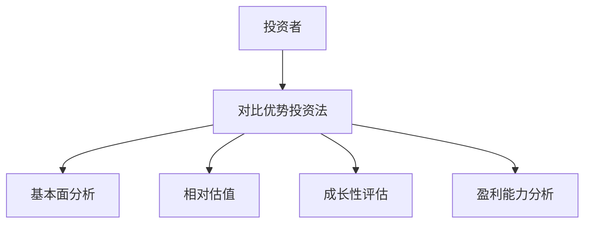
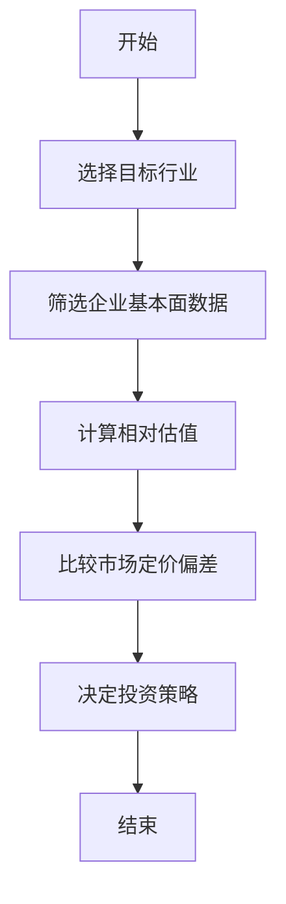

                 


# 戴维·德雷曼的对比优势投资法

> 关键词：对比优势投资法、戴维·德雷曼、价值投资、投资策略、投资分析

> 摘要：本文深入分析了戴维·德雷曼的对比优势投资法，从其理论基础到实际应用，结合技术与投资的结合，探讨了该方法在现代投资中的优势与挑战。文章通过详细阐述其核心概念、算法原理、系统架构以及实际案例分析，为读者提供了全面的理解和实践指导。

---

## 第一部分：对比优势投资法的背景与核心概念

### 第1章：投资的基本概念与对比优势的起源

#### 1.1 投资的基本概念

- 什么是投资
  - 投资是通过配置资源（如资金）以获得未来收益的行为。
  - 投资的核心目标是实现资产增值。
- 投资的基本原则
  - 风险与收益的平衡。
  - 长期视角的重要性。
  - 分散投资以降低风险。
- 投资的目标与风险
  - 目标：资产保值、增值。
  - 风险：市场波动、经济周期、企业经营状况等。

#### 1.2 对比优势的定义与起源

- 对比优势的定义
  - 对比优势投资法是一种基于相对估值和企业基本面分析的投资方法。
  - 通过对比同一行业内的企业，寻找被市场低估的投资机会。
- 对比优势的起源与发展
  - 由戴维·德雷曼提出，结合了价值投资和相对估值的思想。
  - 强调通过横向对比企业之间的差异，发现估值偏差。
- 对比优势与传统投资方法的区别
  - 传统价值投资：关注单个企业的内在价值。
  - 对比优势：通过对比同一行业内的企业，寻找相对低估的投资机会。

### 第2章：对比优势投资法的核心要素

#### 2.1 对比优势的核心原理

- 市场定价的偏差
  - 市场并非总是有效，存在定价偏差。
  - 通过对比分析，发现市场对某些企业的定价过高或过低。
- 相对估值法
  - 相对估值：通过比较企业的市盈率、市净率等指标，寻找估值差异。
  - 相对估值法的优势在于能够发现行业内的估值异常。
- 企业基本面分析
  - 通过分析企业的盈利能力、成长性、财务状况等，评估其内在价值。

#### 2.2 对比优势的属性特征对比

- 市场情绪与估值的关系
  - 市场情绪会影响企业的估值。
  - 对比优势通过分析市场情绪，寻找估值偏差。
- 盈利能力与成长性的对比
  - 盈利能力：衡量企业赚钱能力。
  - 成长性：衡量企业未来发展潜力。
  - 对比分析：寻找盈利能力稳定且成长性良好的企业。
- 行业周期与企业生命周期的结合
  - 行业周期：行业处于上升期或衰退期。
  - 企业生命周期：企业处于初创期、成长期或成熟期。
  - 对比分析：选择行业周期与企业生命周期匹配的企业。

#### 2.3 对比优势的ER实体关系图



---

## 第二部分：对比优势投资法的算法原理

### 第3章：对比优势算法的数学模型

#### 3.1 对比优势算法的流程



#### 3.2 对比优势的数学公式

- 相对估值公式
  $$ \text{相对估值} = \frac{\text{企业价值}}{\text{行业平均价值}} $$

- 市场定价偏差计算
  $$ \text{市场定价偏差} = \text{实际价值} - \text{市场估值} $$

---

## 第三部分：对比优势投资法的系统分析与架构设计

### 第4章：系统功能设计

#### 4.1 问题场景介绍

- 投资者希望通过对比优势投资法，寻找被低估的企业进行投资。
- 系统目标：构建一个基于对比优势投资法的投资分析系统。

#### 4.2 系统功能设计

- 领域模型
  ```mermaid
  graph TD
      User[用户] --> C[对比优势投资法系统]
      C --> F[数据输入]
      F --> D[数据处理]
      D --> V[估值计算]
      V --> G[结果输出]
  ```

- 系统架构
  ```mermaid
  graph TD
      C[对比优势投资法系统] --> D[数据处理模块]
      C --> V[估值计算模块]
      C --> G[结果输出模块]
  ```

- 系统接口设计
  - 输入接口：企业基本面数据、行业数据。
  - 输出接口：相对估值结果、投资建议。

- 系统交互
  ```mermaid
  graph TD
      User[用户] --> S[系统输入]
      S --> D[数据处理模块]
      D --> V[估值计算模块]
      V --> O[结果输出模块]
      O --> User[用户]
  ```

---

## 第四部分：对比优势投资法的项目实战

### 第5章：环境安装与核心代码实现

#### 5.1 环境安装

- Python 3.8+
- NumPy、Pandas、Matplotlib

#### 5.2 核心代码实现

```python
import numpy as np
import pandas as pd
import matplotlib.pyplot as plt

def calculate_relative_valuation(industry_data):
    # 计算行业平均价值
    industry_average = np.mean(industry_data['Value'])
    # 计算相对估值
    relative_valuation = industry_data['Value'] / industry_average
    return relative_valuation

# 示例数据
industry_data = pd.DataFrame({
    'Value': [100, 150, 200, 250, 300]
})

# 计算相对估值
relative_valuation = calculate_relative_valuation(industry_data)
print(relative_valuation)
```

#### 5.3 代码解读与分析

- 计算行业平均价值：通过numpy计算行业数据的平均值。
- 相对估值计算：将每家企业的价值除以行业平均价值，得到相对估值。

#### 5.4 案例分析与总结

- 案例分析：假设某行业有5家企业，计算相对估值，发现其中一家企业的相对估值显著低于1，可能存在低估。
- 总结：通过代码实现对比优势投资法，能够快速发现市场中的估值偏差。

---

## 第五部分：对比优势投资法的最佳实践

### 第6章：最佳实践与小结

#### 6.1 最佳实践

- 定期更新数据：确保企业基本面数据的准确性。
- 结合市场情绪：在市场波动较大时，对比优势投资法效果更显著。
- 多行业对比：通过横向对比不同行业，发现更多低估企业。

#### 6.2 小结

- 对比优势投资法通过横向对比企业，发现市场估值偏差，是一种有效的投资方法。
- 结合技术分析和基本面分析，能够提高投资决策的准确性。

---

## 第六部分：注意事项与拓展阅读

### 第7章：注意事项与拓展阅读

#### 7.1 注意事项

- 市场的有效性：市场存在无效性时，对比优势投资法效果更好。
- 数据质量：依赖于高质量的企业基本面数据。
- 估值模型的局限性：相对估值法可能存在一定的局限性。

#### 7.2 拓展阅读

- 《The NewFinance》：对比优势投资法的理论基础。
- 《Value Investing》：传统价值投资方法的深入探讨。

---

通过本文的详细分析，读者可以全面理解戴维·德雷曼的对比优势投资法，从理论到实践，掌握其核心概念、算法原理、系统设计和实际应用。希望本文能为投资者提供有价值的参考和指导。

