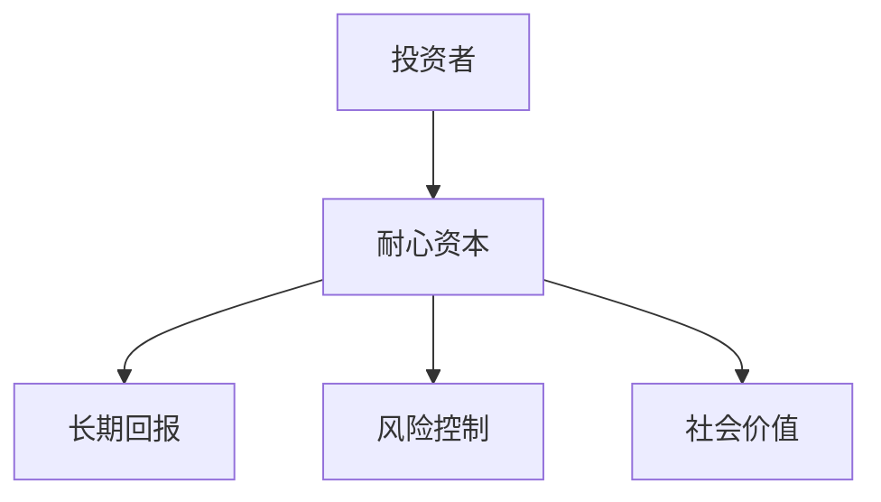

                 


# 戴维·斯文森的耐心资本：长期主义的回报

## 关键词
- 戴维·斯文森
- 耐心资本
- 长期主义
- 投资回报
- 资产配置
- 风险管理
- 投资策略

## 摘要
本文深入探讨了戴维·斯文森的耐心资本理念，分析了其核心概念、长期主义的回报机制，以及在投资策略中的应用。通过详细阐述耐心资本的定义、特点，与其他投资策略的对比，结合数学模型和系统架构设计，展示了如何通过长期主义实现稳健的投资回报。文章最后通过项目实战，指导读者如何在实际中应用这些策略，强调了长期主义在投资中的重要性。

---

# 第一部分：耐心资本与长期主义的背景

## 第1章：戴维·斯文森与耐心资本概述

### 1.1 戴维·斯文森的生平与投资理念
- **戴维·斯文森的教育与职业背景**：斯文森在耶鲁大学学习经济学，随后在哈佛大学获得博士学位，曾在世界银行和美联储工作，最终成为耶鲁大学首席投资官。
- **斯文森的投资哲学与耐心资本的起源**：斯文森倡导长期投资，认为市场短期波动不应影响长期投资决策。他强调资产配置的重要性，避免频繁交易和市场择时。
- **耐心资本的核心理念与实践**：耐心资本注重长期价值，强调通过多元化配置和长期持有来实现稳定回报，避免短期市场波动的影响。

### 1.2 长期主义的定义与特点
- **长期主义的定义**：长期主义是一种投资策略，强调关注长期价值，而非短期收益。它要求投资者具备耐心，能够在市场波动中保持冷静，避免因短期损失而做出错误决策。
- **长期主义与短期投资的对比**：短期投资注重市场波动和交易机会，而长期投资关注企业的基本面和长期增长潜力。短期投资风险较高，波动性大，而长期投资更注重稳定性。
- **长期主义在投资中的重要性**：长期主义能够帮助投资者避免情绪化决策，减少交易成本，同时利用复利效应实现财富增长。

### 1.3 耐心资本与长期主义的回报机制
- **耐心资本的回报来源**：耐心资本通过长期持有优质资产，获得企业盈利增长和价值提升带来的回报。
- **长期主义对投资回报的影响**：长期投资能够有效规避短期市场波动，降低投资风险，同时通过复利效应实现更高的回报。
- **耐心资本与社会价值的关系**：耐心资本不仅追求经济回报，还注重社会价值，支持可持续发展，投资于具有社会责任感的企业。

---

## 第2章：耐心资本的核心概念与联系

### 2.1 耐心资本的核心原理
- **耐心资本的定义**：耐心资本是一种长期投资策略，强调通过长期持有优质资产，实现稳健的回报。
- **耐心资本的三要素：时间、价值和风险**：时间是耐心资本的核心要素，价值是投资目标，风险是需要控制的关键因素。
- **耐心资本的内在逻辑**：耐心资本通过时间的积累，逐步实现资产增值，同时通过多元化配置降低风险。

### 2.2 耐心资本与其他投资策略的对比
- **耐心资本与短期投资的对比**：短期投资注重市场波动，而耐心资本关注长期价值；短期投资风险高，而耐心资本注重稳定性。
- **耐心资本与价值投资的对比**：价值投资寻找被市场低估的企业，而耐心资本注重长期持有，无论市场如何波动。
- **耐心资本与成长投资的对比**：成长投资关注企业成长潜力，而耐心资本更注重企业的稳定性和长期价值。

### 2.3 耐心资本的ER实体关系图


---

# 第二部分：耐心资本的核心概念与联系

## 第3章：耐心资本的核心概念与联系

### 3.1 耐心资本的核心原理
- **耐心资本的定义**：耐心资本是一种长期投资策略，强调通过长期持有优质资产，实现稳健的回报。
- **耐心资本的三要素：时间、价值和风险**：时间是耐心资本的核心要素，价值是投资目标，风险是需要控制的关键因素。
- **耐心资本的内在逻辑**：耐心资本通过时间的积累，逐步实现资产增值，同时通过多元化配置降低风险。

### 3.2 耐心资本与其他投资策略的对比
- **耐心资本与短期投资的对比**：短期投资注重市场波动，而耐心资本关注长期价值；短期投资风险高，而耐心资本注重稳定性。
- **耐心资本与价值投资的对比**：价值投资寻找被市场低估的企业，而耐心资本注重长期持有，无论市场如何波动。
- **耐心资本与成长投资的对比**：成长投资关注企业成长潜力，而耐心资本更注重企业的稳定性和长期价值。

### 3.3 耐心资本的ER实体关系图


---

# 第三部分：耐心资本的算法原理

## 第4章：耐心资本的算法原理

### 4.1 耐心资本的数学模型
- **CAPM模型**：资本资产定价模型（CAPM）用于评估资产的预期回报，公式为：
  $$ E(R_i) = R_f + \beta_i (R_m - R_f) $$
  其中，$R_f$是无风险利率，$\beta_i$是资产的贝塔系数，$R_m$是市场预期回报率。

### 4.2 资产配置优化模型
- **均值-方差优化**：通过优化资产配置，使投资组合的风险最小化，同时实现预期回报最大化。公式为：
  $$ \min_w \frac{1}{2} w^T \Sigma w $$
  约束条件为：
  $$ w^T \mu = T \quad \text{和} \quad w^T 1 = 1 $$

### 4.3 风险管理模型
- **VaR模型**：在给定置信水平下，投资组合可能承受的最大损失。公式为：
  $$ \text{VaR} = \text{quantile}(p) \text{ of portfolio return distribution} $$

---

## 第5章：耐心资本的系统分析与架构设计

### 5.1 系统分析
- **问题场景介绍**：分析长期投资中的风险和回报，设计一个基于耐心资本的投资系统。
- **项目介绍**：构建一个投资模拟系统，实现资产配置、风险管理和回报分析功能。
- **系统功能设计**：通过类图展示系统功能模块，包括数据采集、资产配置、风险评估和回报分析。
- **系统架构设计**：使用分层架构，包括数据层、业务逻辑层和用户界面层。
- **系统接口设计**：定义API接口，实现模块间的通信。
- **系统交互序列图**：展示用户与系统之间的交互流程。

---

## 第6章：耐心资本的项目实战

### 6.1 环境安装
- **Python安装**：安装Python 3.8及以上版本。
- **库安装**：使用pip安装numpy、pandas、scipy等库。

### 6.2 核心代码实现
```python
import numpy as np
import pandas as pd
from scipy.optimize import minimize

# 示例资产配置优化代码
def optimize_portfolio(returns):
    # 定义目标函数
    def objective(w):
        return -w.T @ returns.mean()  # 最大化预期收益
    
    # 约束条件
    constraints = [{'type': 'eq', 'fun': lambda w: sum(w) - 1},
                   {'type': 'eq', 'fun': lambda w: w.T @ returns.cov() @ w - 1}]
    
    # 约束条件
    bounds = [(0, None) for _ in range(len(returns.columns))]
    
    # 使用SLSQP求解器
    result = minimize(objective, np.ones(len(returns.columns)) / len(returns.columns),
                      bounds=bounds, constraints=constraints, method='SLSQP')
    
    return result.x

# 示例数据
data = pd.read_csv('stock_data.csv')
returns = data.pct_change().dropna()
weights = optimize_portfolio(returns)
```

### 6.3 案例分析
- **案例分析**：分析一个具体的投资组合，计算其预期回报和风险。
- **代码实现**：使用上述代码优化资产配置，计算各资产的权重。
- **结果解读**：解释优化结果，分析不同资产的配置比例对整体回报和风险的影响。

### 6.4 系统优化
- **动态调整**：根据市场变化，定期优化投资组合。
- **风险管理**：设定止损点，避免重大损失。
- **绩效评估**：定期评估投资组合的表现，调整策略。

---

## 第7章：总结与展望

### 7.1 总结
- **长期主义的重要性**：长期投资能够有效规避短期波动，实现稳健回报。
- **耐心资本的核心价值**：通过多元化配置和长期持有，降低风险，提升回报。
- **系统设计的关键点**：科学的系统设计能够帮助投资者更好地实施耐心资本策略。

### 7.2 注意事项
- **风险控制**：即使长期投资，也需要定期评估和调整投资组合，避免重大风险。
- **市场变化**：长期投资并不意味着完全忽视市场变化，需要根据市场情况动态调整。
- **时间选择**：耐心资本适合有长期资金需求的投资者，不适合需要短期回报的资金。

### 7.3 拓展阅读
- 推荐阅读《彼得·林奇的成功投资》、《投资之道》等书籍，深入了解长期投资策略。

---

通过以上内容，我们可以看到，耐心资本作为一种长期投资策略，强调时间和价值的重要性，通过科学的系统设计和合理的资产配置，能够在复杂的市场环境中实现稳健的回报。投资者需要具备长期的耐心和科学的方法，才能在投资道路上走得更远。

