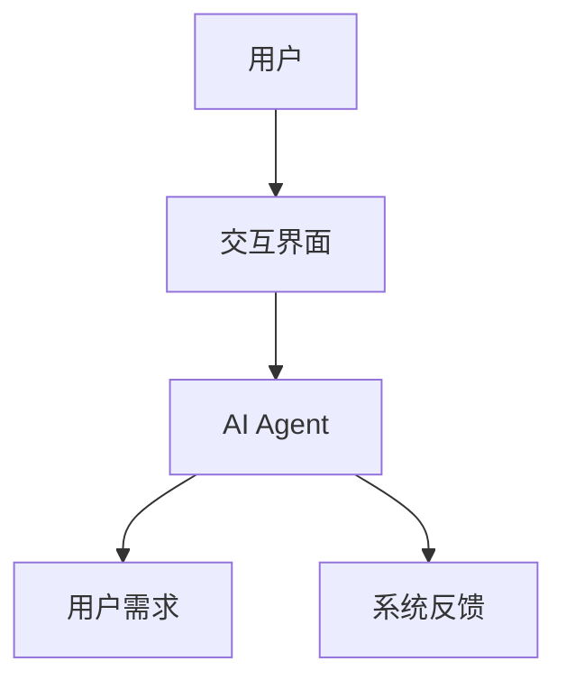
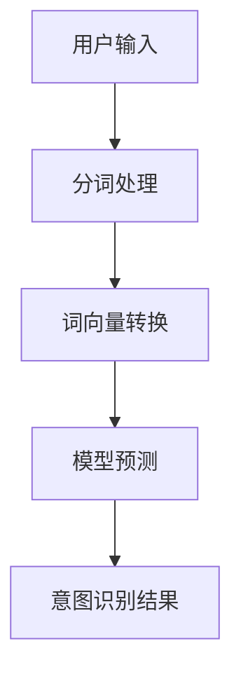
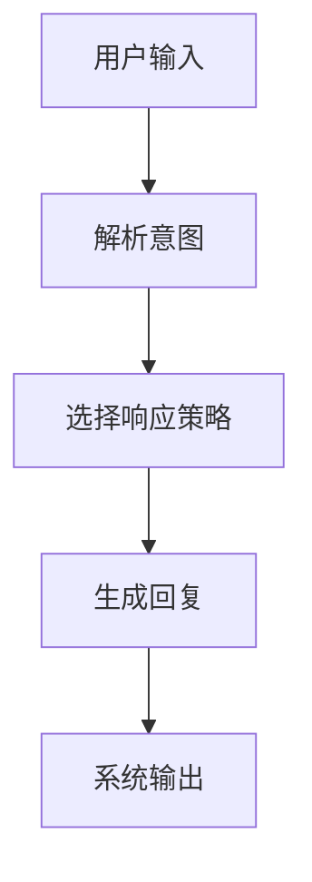
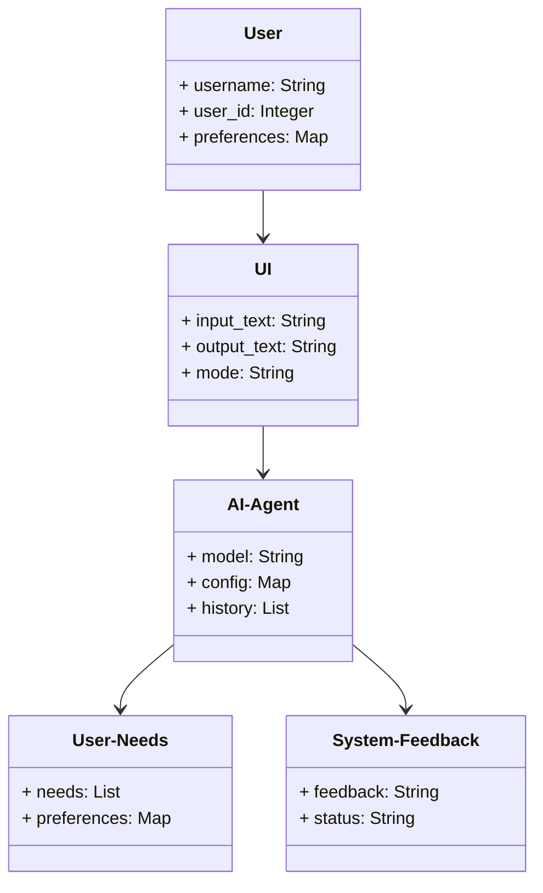
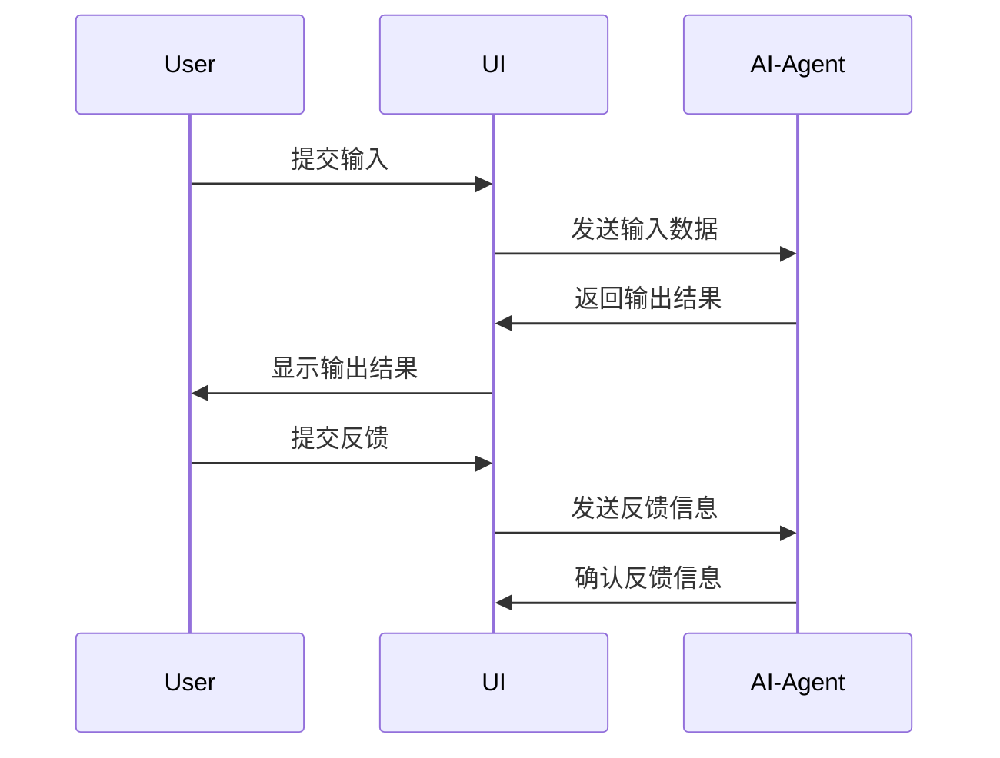

                 


# 打造用户友好的AI Agent交互界面

## 关键词：AI Agent，交互界面，自然语言处理，人机交互，用户心理学，可用性测试

## 摘要

本文详细探讨了打造用户友好的AI Agent交互界面的核心要素，从背景介绍、核心概念到技术实现、系统架构设计，再到项目实战，层层深入。通过分析用户需求、设计原则、算法原理、系统架构和实际案例，本文为读者提供了全面的指导，帮助他们在实际项目中构建高效、易用且人性化的AI Agent交互界面。

---

## 第一部分: AI Agent交互界面的背景与核心概念

### 第1章: AI Agent交互界面的背景介绍

#### 1.1 问题背景

随着人工智能技术的快速发展，AI Agent（智能代理）在各个领域的应用越来越广泛。从智能音箱到聊天机器人，AI Agent已经成为人们生活中不可或缺的工具。然而，AI Agent的核心价值不仅在于其功能的强大，更在于其与用户的交互体验。一个友好的交互界面能够显著提升用户体验，降低用户的学习成本，并提高用户满意度。

#### 1.2 问题描述

在实际应用中，AI Agent的交互界面存在以下主要问题：

- **用户需求的多样性**：不同用户对AI Agent的功能和交互方式有不同的需求，如何满足这些多样化的需求是一个挑战。
- **AI Agent理解能力的局限性**：当前的AI Agent在理解用户的意图时仍然存在一定的局限性，尤其是在处理复杂的语义和上下文关系时。
- **交互界面的易用性问题**：复杂的交互界面不仅会影响用户体验，还可能导致用户误操作，降低用户满意度。

#### 1.3 问题解决

为了应对上述问题，我们需要从以下几个方面入手：

- **提供多模态交互方式**：通过结合文本、语音、视觉等多种交互方式，满足不同用户的多样化需求。
- **增强AI Agent的理解能力**：通过改进自然语言处理算法，提升AI Agent对用户意图的理解能力。
- **提高交互界面的可用性**：通过优化交互界面的设计，使其更加简洁直观，降低用户的使用门槛。

#### 1.4 边界与外延

AI Agent交互界面的设计需要明确其边界和外延，以避免功能过于复杂或偏离核心目标。以下是AI Agent交互界面设计的边界与外延：

- **边界**：AI Agent交互界面仅负责与用户进行信息交换，不涉及后端业务逻辑的处理。
- **外延**：AI Agent交互界面的设计需要与前端开发、用户心理学等多个领域相关联，以实现最佳的用户体验。

#### 1.5 核心概念的结构与组成

AI Agent交互界面的核心概念可以分为以下几个部分：

- **AI Agent**：AI Agent是实现交互的核心技术，负责理解和处理用户的输入，并生成相应的输出。
- **交互界面**：交互界面是用户与AI Agent之间的桥梁，负责接收用户的输入并展示AI Agent的输出。
- **用户需求**：用户的多样化需求是设计AI Agent交互界面的出发点，需要通过用户调研和分析来明确。

### 第2章: AI Agent交互界面的核心概念与联系

#### 2.1 核心概念原理

AI Agent交互界面的设计需要结合多模态交互、自然语言处理和用户心理学等多方面的知识。

- **多模态交互**：通过结合文本、语音、视觉等多种交互方式，提升用户的交互体验。
- **自然语言处理**：利用自然语言处理技术，提升AI Agent对用户意图的理解能力。
- **用户心理学**：通过研究用户的心理和行为，设计出更加符合用户习惯的交互界面。

#### 2.2 概念属性特征对比表格

以下是对AI Agent交互界面相关概念的属性特征对比：

| 概念         | 属性               | 特征                                         |
|--------------|--------------------|----------------------------------------------|
| AI Agent     | 输入方式           | 文本、语音、视觉                             |
|              | 输出方式           | 文本、语音、视觉                             |
|              | 理解能力           | 基于训练数据                                 |
| 交互界面     | 易用性             | 简洁直观                                     |
|              | 可访问性           | 支持无障碍设计                               |
| 用户需求     | 多样性             | 不同用户需求各异                             |
|              | 明确性             | 需要通过调研明确需求                         |

#### 2.3 ER实体关系图

以下是一个简单的ER实体关系图，展示了AI Agent交互界面的核心要素：



---

## 第二部分: AI Agent交互界面的设计与实现

### 第3章: AI Agent交互界面的算法原理

#### 3.1 意图识别算法

意图识别是AI Agent交互界面的核心算法之一，其目的是理解用户的输入意图并生成相应的响应。以下是意图识别算法的实现步骤：

1. **用户输入**：用户通过交互界面输入文本或语音。
2. **分词处理**：将用户的输入进行分词处理，提取关键词汇。
3. **词向量转换**：将分词后的词语转换为对应的词向量。
4. **模型预测**：通过训练好的模型对词向量进行处理，预测用户的意图。
5. **意图识别结果**：输出用户的意图。

以下是一个意图识别算法的mermaid流程图：



#### 3.2 对话管理算法

对话管理是AI Agent交互界面的另一个重要算法，其目的是根据用户的意图生成合理的对话流程。以下是对话管理算法的实现步骤：

1. **用户输入**：用户通过交互界面输入文本或语音。
2. **解析意图**：通过意图识别算法解析用户的意图。
3. **选择响应策略**：根据用户的意图选择合适的响应策略。
4. **生成回复**：根据选择的响应策略生成回复内容。
5. **系统输出**：将生成的回复内容输出给用户。

以下是一个对话管理算法的mermaid流程图：



#### 3.3 代码实现

以下是意图识别算法的Python代码示例：

```python
def intent_recognition(user_input):
    # 分词处理
    words = tokenize(user_input)
    # 生成词向量
    vec = word_to_vector(words)
    # 模型预测
    intent = model.predict(vec)
    return intent
```

---

## 第三部分: 系统分析与架构设计方案

### 第4章: 系统分析与架构设计

#### 4.1 系统分析

在设计AI Agent交互界面时，需要进行系统的分析，包括功能需求分析、性能需求分析和用户需求分析。

- **功能需求分析**：明确AI Agent交互界面需要实现的核心功能，如意图识别、对话管理、多模态交互等。
- **性能需求分析**：分析系统在处理大量用户请求时的性能表现，确保系统的稳定性和响应速度。
- **用户需求分析**：通过用户调研和分析，明确用户的实际需求和使用习惯。

#### 4.2 系统架构设计

以下是AI Agent交互界面的系统架构设计：



#### 4.3 系统接口设计

以下是AI Agent交互界面的主要系统接口设计：

- **输入接口**：接收用户的输入，包括文本、语音和视觉输入。
- **输出接口**：展示AI Agent的输出，包括文本、语音和视觉输出。
- **配置接口**：允许用户配置AI Agent的参数和偏好设置。
- **反馈接口**：收集用户的反馈信息，用于优化系统性能。

#### 4.4 系统交互设计

以下是AI Agent交互界面的系统交互设计：



---

## 第四部分: 项目实战

### 第5章: 项目实战

#### 5.1 项目介绍

本项目旨在设计一个用户友好的AI Agent交互界面，实现多模态交互功能，包括文本输入、语音输入和视觉输入。

#### 5.2 系统功能设计

以下是系统功能设计的类图：


#### 5.3 系统实现

以下是系统的实现代码：

```python
class UI:
    def __init__(self):
        self.input_text = ""
        self.output_text = ""
        self.mode = "text"

    def set_input(self, text):
        self.input_text = text

    def get_output(self):
        return self.output_text

class AI-Agent:
    def __init__(self):
        self.model = "default"
        self.config = {}
        self.history = []

    def process_input(self, input_text):
        # 处理输入
        pass

    def generate_output(self):
        # 生成输出
        pass
```

#### 5.4 项目小结

通过本项目的实践，我们可以看到，设计一个用户友好的AI Agent交互界面需要综合考虑多方面的因素，包括用户需求、算法实现、系统架构等。只有在这些方面都做到位，才能真正提升用户体验。

---

## 第五部分: 总结与展望

### 第6章: 总结与展望

#### 6.1 总结

本文详细探讨了打造用户友好的AI Agent交互界面的核心要素，从背景介绍、核心概念到技术实现、系统架构设计，再到项目实战，层层深入。通过分析用户需求、设计原则、算法原理、系统架构和实际案例，本文为读者提供了全面的指导，帮助他们在实际项目中构建高效、易用且人性化的AI Agent交互界面。

#### 6.2 展望

未来，随着人工智能技术的不断发展，AI Agent交互界面的设计将更加智能化和个性化。我们可以期待以下发展趋势：

- **更强大的自然语言处理能力**：通过改进算法，提升AI Agent对用户意图的理解能力。
- **更加个性化的交互界面**：根据用户的偏好和行为习惯，动态调整交互界面的设计。
- **更加丰富的多模态交互方式**：结合更多的交互方式，如手势、表情等，提升用户体验。

---

通过本文的探讨，我们希望能够为读者在设计AI Agent交互界面时提供一些有益的思路和方法，帮助他们在实际项目中取得更好的成果。

