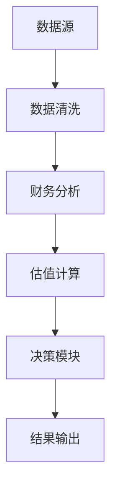

                 


# 托马斯·盖伊的高质量价值投资：寻找优质且低估的公司

---

## 关键词  
价值投资、高质量公司、低估公司、基本面分析、估值方法

---

## 摘要  
本文将深入探讨托马斯·盖伊的高质量价值投资理念，分析如何通过基本面分析和估值方法，寻找那些具有高质量但被市场低估的公司。文章结合技术与投资的视角，从理论到实践，详细解析高质量价值投资的核心概念、算法原理、系统架构以及实际案例，帮助读者掌握寻找优质且低估公司的方法。

---

## 第一章: 高质量价值投资的背景与核心概念

### 1.1 价值投资的起源与发展  
价值投资起源于20世纪30年代，由本杰明·格雷厄姆和戴维·多德提出，强调以低于内在价值的价格购买优质股票。托马斯·盖伊在此基础上发展了高质量价值投资理念，专注于寻找基本面强劲但市场价格被低估的公司。  

#### 1.1.1 价值投资的核心理念  
- **内在价值**：股票的真正价值是其未来现金流的现值，与市场波动无关。  
- **安全边际**：以低于内在价值的价格买入，降低投资风险。  

#### 1.1.2 价值投资与成长投资的区别  
- **价值投资**：注重低估值和高安全边际，适合防御型投资者。  
- **成长投资**：注重高成长性和高市盈率，适合风险偏好较高的投资者。  

### 1.2 高质量价值投资的核心概念  
#### 1.2.1 高质量公司的定义与特征  
- **定义**：具有强大的财务表现、竞争优势和稳定的管理层。  
- **特征**：  
  - 高ROE（净资产收益率）和ROA（资产净利率）。  
  - 稳定的现金流和低负债率。  
  - 护城河（竞争优势）如品牌、技术壁垒、成本优势等。  

#### 1.2.2 低估公司的定义与特征  
- **定义**：市场价格低于内在价值的公司。  
- **特征**：  
  - 低市盈率（P/E）和低市净率（P/B）。  
  - 市场情绪低迷，投资者关注度低。  

---

## 第二章: 高质量公司的基本面分析  

### 2.1 财务指标分析  
#### 2.1.1 净利润与ROE分析  
- 净利润是公司盈利能力的核心指标。  
- ROE（净资产收益率）= 净利润 / 平均股东权益。  
  $$ROE = \frac{\text{净利润}}{\text{平均股东权益}}$$  
- 高质量公司通常ROE > 15%，且逐年稳定。  

#### 2.1.2 营业收入与ROA分析  
- 营业收入是公司规模的体现。  
- ROA（资产净利率）= 净利润 / 总资产。  
  $$ROA = \frac{\text{净利润}}{\text{总资产}}$$  
- 高质量公司通常ROA > 10%。  

#### 2.1.3 现金流与负债率分析  
- 现金流是公司财务健康的重要指标。  
- 负债率 = 总负债 / 总资产。  
  $$\text{负债率} = \frac{\text{总负债}}{\text{总资产}}$$  
- 高质量公司通常负债率 < 50%。  

### 2.2 竞争优势分析  
#### 2.2.1 护城河的定义与类型  
- **护城河**：公司竞争优势的来源，防止竞争对手侵蚀市场份额。  
- **类型**：  
  - 品牌优势：如可口可乐、茅台。  
  - 技术壁垒：如专利和技术专有权。  
  - 成本优势：如规模效应和供应链优势。  

#### 2.2.2 市场地位与品牌影响力  
- 高质量公司通常在市场中占据领先地位，具有强大的品牌影响力。  

#### 2.2.3 管理层能力与企业治理  
- 高质量公司管理层通常具有长期的行业经验和优秀的企业治理能力。  

---

## 第三章: 低估公司的识别与估值方法  

### 3.1 低估公司的识别标准  
#### 3.1.1 市盈率与市净率分析  
- 市盈率（P/E）= 股价 / 每股收益。  
- 市净率（P/B）= 股价 / 每股净资产。  

#### 3.1.2 股价与内在价值的比较  
- 内在价值 = 未来现金流的现值。  
- 当股价 < 内在价值时，公司可能被低估。  

#### 3.1.3 市场情绪与投资者心理  
- 市场恐慌或低迷时，优质公司可能被错杀，出现低估机会。  

---

## 第四章: 数学模型与算法  

### 4.1 内在价值计算模型  
#### 4.1.1 DCF（Discounted Cash Flow）模型  
- 公式：  
  $$\text{内在价值} = \sum_{t=1}^{n} \frac{\text{现金流}}{(1+r)^t} + \frac{\text{终值}}{(1+r)^n}$$  
- 其中，\( r \) 是折现率，通常取10%~15%。  

#### 4.1.2 市盈率与行业平均比较  
- 公式：  
  $$\text{合理股价} = \text{行业平均P/E} \times \text{每股收益}$$  

### 4.2 代码实现（Python）  
```python
import pandas as pd
import numpy as np

# 示例数据
data = {
    '公司': ['A', 'B', 'C'],
    '股价': [10, 20, 15],
    '每股收益': [2, 3, 2.5],
    'ROE': [15, 20, 18],
    '市盈率': [10, 15, 12]
}
df = pd.DataFrame(data)

# 计算内在价值（简化模型）
def calculate_intrinsic_value(eps, pe_ratio):
    return eps * pe_ratio

# 应用模型
df['内在价值'] = df.apply(lambda x: calculate_intrinsic_value(x['每股收益'], x['市盈率']), axis=1)

print(df)
```

---

## 第五章: 系统架构设计  

### 5.1 系统功能设计  
- **数据收集**：获取公司财务数据和市场数据。  
- **分析模块**：计算财务指标、估值指标。  
- **决策模块**：筛选优质且低估的公司。  

### 5.2 系统架构图  


---

## 第六章: 项目实战  

### 6.1 消费行业案例分析  
#### 6.1.1 环境安装  
- 安装Python、Pandas、Matplotlib等库。  

#### 6.1.2 数据收集与分析  
```python
import pandas as pd

# 数据示例
data = {
    '公司': ['可口可乐', '百事可乐', ' PepsiCo'],
    '股价': [50, 45, 48],
    'ROE': [25, 20, 22],
    '市盈率': [15, 18, 16]
}
df = pd.DataFrame(data)

# 筛选优质且低估的公司
df['是否低估'] = df['股价'] < (df['ROE'] * 10)
print(df)
```

#### 6.1.3 结果分析  
- 可口可乐ROE = 25%，市盈率 = 15%，股价 = 50，计算内在价值：  
  $$\text{内在价值} = 25 \times 10 = 250$$  
  股价 < 内在价值，可口可乐是优质且低估公司。  

---

## 第七章: 最佳实践与小结  

### 7.1 最佳实践  
- **长期投资**：避免短期市场波动影响。  
- **分散投资**：降低单一公司风险。  
- **定期复盘**：评估投资组合的表现。  

### 7.2 注意事项  
- 市场波动可能影响股价，需保持耐心。  
- 宏观经济因素可能影响公司业绩，需关注行业趋势。  

### 7.3 未来趋势  
随着人工智能和大数据技术的发展，价值投资将更加精准和高效。  

---

## 第八章: 总结  

托马斯·盖伊的高质量价值投资理念强调基本面分析和估值方法，帮助投资者找到优质且低估的公司。通过系统的分析和实践，投资者可以在复杂多变的市场中把握长期投资机会，实现财富增值。

--- 

**附录**：  
- 更多价值投资书籍推荐。  
- 价值投资的Python代码库。  
- 数据可视化工具推荐。

