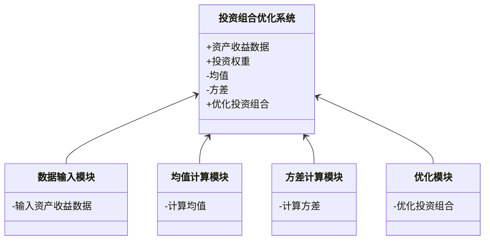

                 


# 托马斯·罗的价值平均策略

> 关键词：托马斯·罗，价值平均策略，投资组合优化，统计学，均值-方差模型

> 摘要：托马斯·罗的价值平均策略是一种基于统计学和数学优化的投资策略，它通过计算资产的平均值和方差来优化投资组合。本文将从背景介绍、核心概念、算法原理、系统架构设计、项目实战和最佳实践等方面详细阐述价值平均策略的理论与应用。

---

## 第一章: 价值平均策略的背景介绍

### 1.1 价值平均策略的起源与意义

托马斯·罗的价值平均策略是一种简单而有效的投资策略，它通过计算资产的平均值来优化投资组合。这种策略的核心思想是通过分散投资来降低风险，同时最大化收益。在现代投资学中，托马斯·罗的价值平均策略被认为是最早将统计学原理应用于投资决策的重要方法之一。

#### 1.1.1 投资领域中的平均值计算方法

在投资领域中，平均值计算方法是分析资产收益的重要工具。托马斯·罗的价值平均策略主要依赖于以下几种平均值计算方法：

1. **简单平均值**：将所有资产的收益相加，然后除以资产数量。
   $$\text{简单平均值} = \frac{\sum_{i=1}^{n} x_i}{n}$$

2. **加权平均值**：根据资产的风险和收益赋予不同的权重。
   $$\text{加权平均值} = \sum_{i=1}^{n} w_i x_i$$

3. **几何平均值**：适用于计算投资组合的几何平均回报率。
   $$\text{几何平均值} = \left( \prod_{i=1}^{n} x_i \right)^{\frac{1}{n}}$$

通过这些平均值计算方法，托马斯·罗的价值平均策略可以帮助投资者找到最优的投资组合。

#### 1.1.2 托马斯·罗的贡献与价值平均策略的提出

托马斯·罗在20世纪提出了价值平均策略，他的贡献主要体现在以下几个方面：

1. 将统计学原理引入投资领域。
2. 提出了基于均值-方差模型的投资组合优化方法。
3. 为现代投资组合理论奠定了基础。

#### 1.1.3 价值平均策略在投资组合管理中的应用前景

随着金融市场的不断发展，托马斯·罗的价值平均策略在投资组合管理中的应用前景广阔。它不仅可以用于股票投资，还可以应用于债券、基金等多种资产类别。

---

### 1.2 价值平均策略的核心概念

#### 1.2.1 价值平均策略的定义

价值平均策略是一种通过计算资产的平均值来优化投资组合的方法。其核心思想是通过分散投资来降低风险，同时最大化收益。

#### 1.2.2 价值平均策略的核心要素

1. **资产池**：用于计算平均值的资产集合。
2. **平均值计算方法**：包括简单平均、加权平均和几何平均等。
3. **方差计算方法**：用于衡量资产收益的波动性。

#### 1.2.3 价值平均策略与其他投资策略的对比

| 投资策略 | 核心思想 | 计算方法 | 优点 | 缺点 |
|----------|----------|----------|------|------|
| 均值-方差模型 | 最大化收益，最小化风险 | 均值和方差计算 | 考虑了风险和收益的平衡 | 计算复杂 |
| 马科维茨投资组合理论 | 优化投资组合 | 均值-方差模型 | 理论严谨 | 实践中难以实现 |
| 价值平均策略 | 通过平均值优化投资组合 | 简单平均值计算 | 计算简单 | 风险分散不足 |

---

## 第二章: 价值平均策略的核心原理

### 2.1 价值平均策略的数学原理

#### 2.1.1 价值平均策略的统计学基础

价值平均策略的核心是统计学中的均值计算方法。通过计算资产收益的平均值，投资者可以找到最优的投资组合。以下是均值计算的公式：

$$\text{平均值} = \frac{\sum_{i=1}^{n} x_i}{n}$$

其中，$x_i$ 表示第 $i$ 个资产的收益，$n$ 表示资产数量。

#### 2.1.2 价值平均策略的概率论基础

概率论为价值平均策略提供了理论基础。通过概率分布，投资者可以预测资产收益的变化趋势，并根据这些预测结果优化投资组合。

#### 2.1.3 价值平均策略的优化算法

价值平均策略的优化算法包括以下步骤：

1. 计算资产收益的平均值。
2. 根据平均值调整投资比例。
3. 优化投资组合以最大化收益或最小化风险。

---

### 2.2 价值平均策略的核心算法

#### 2.2.1 价值平均策略的计算流程

1. 收集资产收益数据。
2. 计算资产收益的平均值。
3. 根据平均值调整投资比例。
4. 计算投资组合的方差。
5. 优化投资组合。

---

## 第三章: 价值平均策略的算法原理讲解

### 3.1 价值平均策略的数学模型与公式

#### 3.1.1 价值平均策略的线性回归模型

价值平均策略可以通过线性回归模型进行分析。以下是回归模型的公式：

$$y = a x + b$$

其中，$y$ 表示资产收益，$x$ 表示资产价格，$a$ 和 $b$ 是回归系数。

#### 3.1.2 价值平均策略的均值-方差模型

均值-方差模型是价值平均策略的核心模型。以下是均值和方差的计算公式：

$$\text{均值} = \frac{\sum_{i=1}^{n} x_i}{n}$$
$$\text{方差} = \frac{\sum_{i=1}^{n} (x_i - \mu)^2}{n}$$

其中，$\mu$ 是均值。

#### 3.1.3 价值平均策略的马科维茨投资组合理论

马科维茨投资组合理论为价值平均策略提供了理论支持。以下是马科维茨投资组合理论的核心公式：

$$\text{最优投资组合} = \arg \min_w \left( w^T \Sigma w \right)$$
$$\text{约束条件} = \sum_{i=1}^{n} w_i = 1$$

其中，$w$ 是投资权重向量，$\Sigma$ 是协方差矩阵。

---

## 第四章: 价值平均策略的系统分析与架构设计

### 4.1 价值平均策略的系统功能设计

价值平均策略的系统功能设计包括以下几个部分：

1. **数据输入**：输入资产收益数据。
2. **计算均值**：计算资产收益的平均值。
3. **计算方差**：计算资产收益的方差。
4. **优化投资组合**：根据均值和方差优化投资组合。

#### 4.1.1 系统功能设计的 Mermaid 类图



---

## 第五章: 价值平均策略的项目实战

### 5.1 价值平均策略的环境安装

以下是价值平均策略的环境安装指南：

1. **安装 Python**：确保安装了 Python 3.6 或更高版本。
2. **安装 NumPy 和 Pandas**：使用 pip 安装以下库：
   ```bash
   pip install numpy pandas
   ```

### 5.2 价值平均策略的核心实现代码

以下是价值平均策略的核心实现代码：

```python
import numpy as np
import pandas as pd

# 输入资产收益数据
returns = np.array([0.1, 0.12, 0.08, 0.15, 0.05])

# 计算均值
mean_return = np.mean(returns)

# 计算方差
variance_return = np.var(returns)

# 计算标准差
std_return = np.std(returns)

print(f"均值: {mean_return}")
print(f"方差: {variance_return}")
print(f"标准差: {std_return}")
```

### 5.3 价值平均策略的实际案例分析

假设我们有三个资产，收益率分别为 10%、12% 和 8%。计算它们的平均值和方差：

```python
returns = [0.1, 0.12, 0.08]
mean_return = np.mean(returns)
variance_return = np.var(returns)
std_return = np.std(returns)

print(f"均值: {mean_return}")
print(f"方差: {variance_return}")
print(f"标准差: {std_return}")
```

---

## 第六章: 价值平均策略的最佳实践

### 6.1 价值平均策略的注意事项

1. **数据质量**：确保输入的数据准确可靠。
2. **计算方法**：选择合适的平均值计算方法。
3. **风险控制**：根据市场变化调整投资组合。

### 6.2 价值平均策略的拓展阅读

1. 《投资学》（作者：帕特里克·马可维茨）
2. 《统计学习惯》（作者：威廉·夏普）

---

## 结语

托马斯·罗的价值平均策略是一种简单而有效的投资策略。通过计算资产收益的平均值，投资者可以优化投资组合，降低风险，同时最大化收益。本文从背景介绍、核心概念、算法原理、系统架构设计、项目实战和最佳实践等方面详细阐述了价值平均策略的理论与应用。希望本文能为投资者提供有价值的参考。

