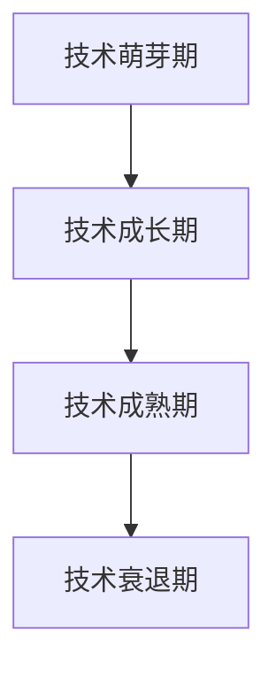
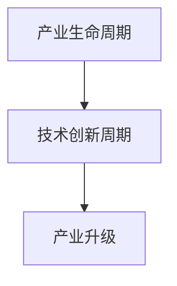

                 

# 技术创新周期与行业投资机会

## 关键词：技术创新周期、行业投资、技术驱动、产业升级、投资策略

## 摘要：  
技术创新周期是推动行业发展的核心动力，通过对技术创新周期的深入分析，我们可以更好地理解行业变革的趋势，并抓住其中的投资机会。本文从技术创新周期的基本概念出发，结合行业案例，分析技术创新周期对投资机会的影响，并提出相应的投资策略。

---

## 第1章：技术创新周期的基本概念

### 1.1 技术创新周期的定义与特征  
技术创新周期是指从一项新技术的出现到其成熟、衰退的完整过程。它通常包括以下几个阶段：  
1. **技术萌芽期**：新技术的概念提出，技术不成熟，市场认知度低。  
2. **技术成长期**：技术逐渐成熟，市场开始关注，投资热度上升。  
3. **技术成熟期**：技术广泛应用，市场饱和，竞争加剧。  
4. **技术衰退期**：技术逐渐被替代，市场需求下降。  

**技术生命周期模型图**（使用Mermaid绘制）：  

技术创新周期的核心特征包括：  
- **阶段性和周期性**：每个阶段的持续时间和强度因行业和技术而异。  
- **不确定性**：技术创新周期的长短和路径具有不确定性。  
- **驱动性**：技术创新是推动行业发展的主要动力。  

---

### 1.2 技术创新周期的理论基础  

技术创新周期的理论基础可以追溯到熊彼特的创新理论，他认为技术创新是经济发展的核心动力。技术创新周期的理论模型包括以下几个关键要素：  
1. **技术本身**：包括技术的复杂性、成熟度和可扩展性。  
2. **市场需求**：包括消费者需求的变化和技术的市场接受度。  
3. **竞争环境**：包括行业内竞争和替代技术的威胁。  
4. **政策环境**：包括政府政策、法规和技术标准的影响。  

技术创新周期与产业生命周期的关系可以表示为：  

技术创新周期的驱动因素包括：  
- **技术进步**：技术本身的改进和创新。  
- **市场需求**：消费者需求的变化推动技术创新。  
- **竞争压力**：行业内竞争推动技术升级。  
- **政策支持**：政府政策和技术标准的推动。  

---

### 1.3 技术创新周期的阶段划分  

技术创新周期的四个阶段：  

1. **技术萌芽期**：技术刚刚出现，市场认知度低，投资风险高。  
2. **技术成长期**：技术逐渐成熟，市场开始关注，投资热度上升。  
3. **技术成熟期**：技术广泛应用，市场饱和，竞争加剧。  
4. **技术衰退期**：技术逐渐被替代，市场需求下降。  

每个阶段的特点如下：  

| 阶段 | 特征 | 投资机会 |  
|------|------|----------|  
| 技术萌芽期 | 风险高，不确定性大 | 早期投资者有机会获得高回报 |  
| 技术成长期 | 技术逐渐成熟，市场关注度上升 | 投资者可以进入市场，分享增长红利 |  
| 技术成熟期 | 市场饱和，竞争加剧 | 投资者需要关注成本控制和差异化策略 |  
| 技术衰退期 | 技术被替代，市场需求下降 | 投资者需要寻找新的技术机会 |  

---

## 第2章：技术创新周期与行业投资机会

### 2.1 技术创新周期对行业发展的推动作用  

技术创新周期通过以下几个方面推动行业发展：  

1. **促进产业升级**：技术创新推动传统产业转型升级，提高生产效率和产品质量。  
2. **推动行业整合**：技术创新可能导致行业内整合，形成寡头垄断格局。  
3. **催生新兴行业**：新技术的应用催生新的行业和商业模式。  

技术创新周期对行业竞争力的影响可以通过以下公式表示：  

$$ \text{行业竞争力} = f(\text{技术创新速度}, \text{市场需求}, \text{竞争环境}) $$  

---

### 2.2 技术创新周期与投资机会分析  

技术创新周期为投资者提供了以下投资机会：  

1. **早期投资**：在技术萌芽期，早期投资者有机会以较低成本介入，分享技术成熟后的高回报。  
2. **成长期投资**：在技术成长期，投资者可以跟随市场热度，分享技术普及带来的收益。  
3. **成熟期投资**：在技术成熟期，投资者需要关注成本控制和差异化策略，寻找细分市场机会。  
4. **衰退期投资**：在技术衰退期，投资者需要关注新技术的替代机会，提前布局新技术领域。  

---

### 2.3 技术创新周期下的投资策略  

投资者可以根据技术创新周期的不同阶段，制定相应的投资策略：  

1. **技术萌芽期**：  
   - 风险高，回报潜力大。  
   - 投资者需要关注技术的可行性和市场需求。  

2. **技术成长期**：  
   - 市场关注度高，投资热度上升。  
   - 投资者可以介入市场，分享增长红利。  

3. **技术成熟期**：  
   - 市场饱和，竞争加剧。  
   - 投资者需要关注成本控制和差异化策略。  

4. **技术衰退期**：  
   - 技术被替代，市场需求下降。  
   - 投资者需要寻找新技术领域的投资机会。  

---

## 第3章：技术驱动的行业变革

### 3.1 技术创新对行业结构的影响  

技术创新通过以下方式改变行业结构：  

1. **改变行业格局**：技术创新可能导致行业集中度提高，形成寡头垄断格局。  
2. **重构行业生态**：技术创新推动行业生态重构，形成新的产业链和商业模式。  

技术创新对行业集中度的影响可以通过以下公式表示：  

$$ \text{行业集中度} = f(\text{技术创新速度}, \text{市场需求}, \text{竞争环境}) $$  

---

### 3.2 技术创新对行业商业模式的重塑  

技术创新通过以下方式重塑行业商业模式：  

1. **改变商业模式**：技术创新推动从传统模式向数字化、智能化转型。  
2. **重构价值链**：技术创新改变行业价值链，推动价值创造方式的转变。  
3. **创新盈利模式**：技术创新催生新的盈利模式，如订阅制、按需付费等。  

---

## 第4章：技术创新周期与投资机会分析

### 4.1 技术创新周期下的投资机会识别  

投资者可以通过以下方式识别技术创新周期下的投资机会：  

1. **关注技术萌芽期**：寻找具有潜力的新技术领域。  
2. **分析技术成长期**：跟随市场热度，介入高增长行业。  
3. **挖掘技术成熟期的细分市场**：寻找差异化机会。  
4. **布局新技术领域**：在技术衰退期，寻找替代技术的投资机会。  

---

### 4.2 技术创新周期下的投资策略  

投资者可以根据技术创新周期的不同阶段，制定相应的投资策略：  

1. **技术萌芽期**：  
   - 风险高，回报潜力大。  
   - 投资者需要关注技术的可行性和市场需求。  

2. **技术成长期**：  
   - 市场关注度高，投资热度上升。  
   - 投资者可以介入市场，分享增长红利。  

3. **技术成熟期**：  
   - 市场饱和，竞争加剧。  
   - 投资者需要关注成本控制和差异化策略。  

4. **技术衰退期**：  
   - 技术被替代，市场需求下降。  
   - 投资者需要寻找新技术领域的投资机会。  

---

## 第5章：技术创新周期的行业案例分析

### 5.1 科技行业技术创新周期分析  

科技行业是技术创新周期最为明显的行业之一。以下是对科技行业的技术创新周期分析：  

1. **技术萌芽期**：新技术概念提出，市场认知度低。  
2. **技术成长期**：技术逐渐成熟，市场关注度上升。  
3. **技术成熟期**：技术广泛应用，市场饱和。  
4. **技术衰退期**：技术被替代，市场需求下降。  

---

### 5.2 制造业技术创新周期分析  

制造业的技术创新周期受到技术复杂性和行业特点的影响。以下是对制造业技术创新周期的分析：  

1. **技术萌芽期**：新技术概念提出，技术不成熟。  
2. **技术成长期**：技术逐渐成熟，市场关注度上升。  
3. **技术成熟期**：技术广泛应用，市场饱和。  
4. **技术衰退期**：技术被替代，市场需求下降。  

---

## 第6章：技术创新周期与行业投资机会总结

### 6.1 本章总结  

技术创新周期是推动行业发展的核心动力，通过对技术创新周期的深入分析，我们可以更好地理解行业变革的趋势，并抓住其中的投资机会。技术创新周期的不同阶段为投资者提供了不同的投资机会和策略。  

---

### 6.2 未来展望  

随着技术的不断进步，技术创新周期将变得更加复杂和多样化。投资者需要密切关注新技术的发展，灵活调整投资策略，以抓住技术创新周期带来的投资机会。  

---

通过以上分析，我们可以看到技术创新周期对行业投资机会的重要影响。投资者需要结合技术创新周期的不同阶段，制定相应的投资策略，以实现投资收益的最大化。

