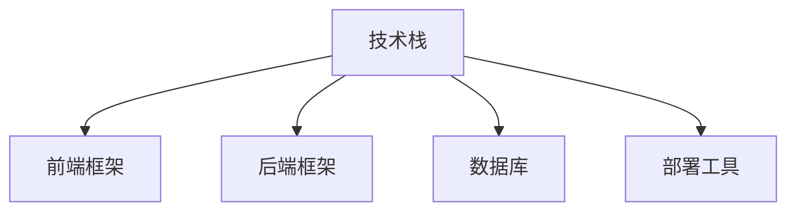
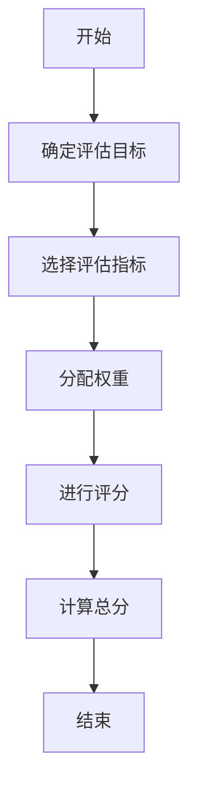
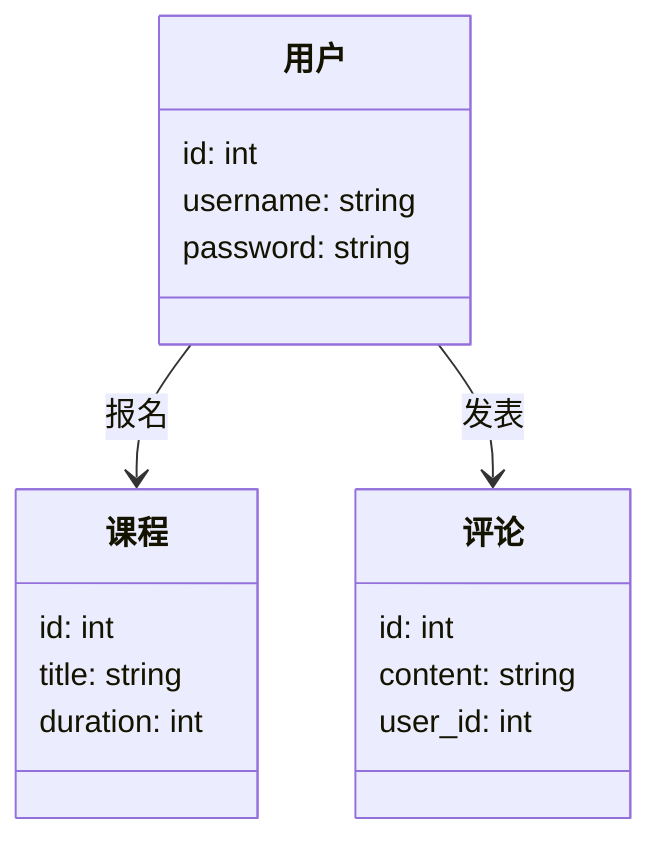
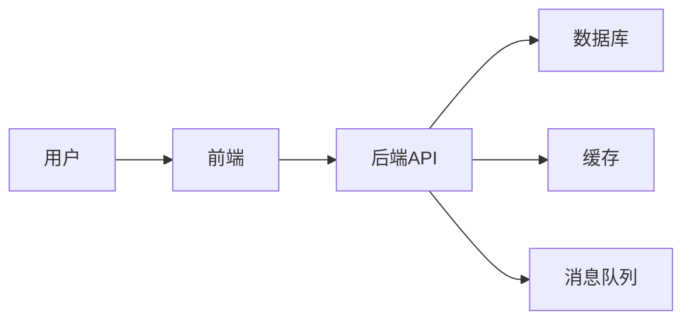
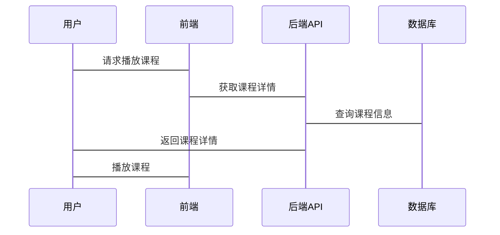

                 


# 技术栈选择与评估

> 关键词：技术栈选择、技术栈评估、系统架构、技术选型、项目开发

> 摘要：技术栈选择与评估是软件开发中的关键环节，涉及前端、后端、数据库、部署等多方面的技术选型。本文从技术栈的定义、核心概念、算法原理、系统架构设计、项目实战等多个维度，详细阐述技术栈选择与评估的全过程，帮助读者掌握技术栈选择的核心方法与实践技巧。

---

## 第一部分: 技术栈选择与评估背景介绍

---

### 第1章: 技术栈选择与评估概述

#### 1.1 技术栈的定义与核心概念

##### 1.1.1 技术栈的定义
技术栈是指在软件开发过程中，用于实现系统功能所需的各种技术的组合。它包括前端框架、后端框架、数据库、开发工具、部署工具等。技术栈的选择直接影响系统的性能、可扩展性、维护成本和开发效率。

##### 1.1.2 技术栈的核心要素
- **前端技术**：如React、Vue、Angular等。
- **后端技术**：如Node.js、Spring Boot、Django等。
- **数据库技术**：如MySQL、MongoDB、Redis等。
- **部署与运维技术**：如Docker、Kubernetes、Jenkins等。

##### 1.1.3 技术栈的分类与外延
技术栈可以分为前端栈、后端栈、数据库栈和部署栈。外延包括开发工具、版本控制工具、测试工具等。

#### 1.2 技术栈选择的重要性

##### 1.2.1 技术栈选择对企业的影响
技术栈的选择影响企业的技术路线、研发投入、团队能力以及未来的扩展性。

##### 1.2.2 技术栈选择对项目成功的关键作用
技术栈的选择决定了项目的开发效率、系统的稳定性和可维护性，是项目成功的关键因素之一。

##### 1.2.3 技术栈选择的常见问题与挑战
- 选择过多的技术栈，导致维护成本增加。
- 技术栈的更新迭代速度快，团队需要不断学习新技术。
- 不同团队的技术栈选择存在冲突。

#### 1.3 技术栈评估的基本原则

##### 1.3.1 可扩展性与可维护性
技术栈应具有良好的扩展性和可维护性，方便后续的功能扩展和技术迭代。

##### 1.3.2 性能与资源消耗
技术栈的选择需要考虑系统的性能需求和资源消耗，确保在有限的资源下达到最佳性能。

##### 1.3.3 社区支持与生态
选择有强大社区支持和技术生态的技术栈，可以降低技术风险，获得更多的开发资源和支持。

##### 1.3.4 成本与预算约束
技术栈的选择需要考虑开发成本、运维成本和迁移成本，确保在预算范围内实现最优选择。

#### 1.4 本章小结
本章从技术栈的定义、核心要素、分类以及选择的重要性等方面进行了概述，为后续的技术栈评估奠定了基础。

---

## 第二部分: 技术栈选择的核心概念与联系

---

### 第2章: 技术栈的核心概念与联系

#### 2.1 技术栈的组成要素

##### 2.1.1 前端技术栈
前端技术栈包括HTML、CSS、JavaScript以及前端框架（如React、Vue）。前端栈的选择直接影响用户体验和界面实现的复杂度。

##### 2.1.2 后端技术栈
后端技术栈包括编程语言（如Python、Java）、框架（如Django、Spring Boot）以及API设计规范（如RESTful API）。后端栈的选择影响系统的业务逻辑实现和接口设计。

##### 2.1.3 数据库技术栈
数据库技术栈包括关系型数据库（如MySQL）和非关系型数据库（如MongoDB）。数据库栈的选择影响数据存储、查询效率和数据一致性。

##### 2.1.4 部署与运维技术栈
部署与运维技术栈包括容器化技术（如Docker）、 orchestration工具（如Kubernetes）以及监控工具（如Prometheus）。部署栈的选择影响系统的上线效率和运维成本。

#### 2.2 技术栈的分类与对比

##### 2.2.1 常见技术栈分类
- **全栈技术栈**：前后端、数据库、部署等技术栈统一选择。
- **前端栈**：专注于前端技术的选择。
- **后端栈**：专注于后端技术的选择。
- **数据库栈**：专注于数据库技术的选择。

##### 2.2.2 技术栈的优缺点对比

| 技术栈 | 优点 | 缺点 |
|--------|------|------|
| React  | 组件化开发，高效 | 学习曲线较高，生态较新 |
| Vue    | 易用性强，轻量 | 社区支持相对较少 |
| Node.js | � 异步非阻塞，适合高并发 | 对新手不友好，调试复杂 |

##### 2.2.3 技术栈的适用场景分析
- **前端栈**：根据项目需求选择响应式设计或单页面应用。
- **后端栈**：根据业务逻辑复杂度选择合适的框架。
- **数据库栈**：根据数据类型和查询需求选择关系型或非关系型数据库。

#### 2.3 技术栈的实体关系分析

##### 2.3.1 ER实体关系图


#### 2.4 本章小结
本章通过技术栈的组成要素、分类与对比，以及实体关系分析，详细阐述了技术栈的核心概念与联系。

---

## 第三部分: 技术栈选择的算法原理

---

### 第3章: 技术栈评估的算法原理

#### 3.1 技术栈评估的权重分配

##### 3.1.1 权重分配的基本原理
技术栈评估的权重分配是根据项目需求和目标，对不同技术栈的影响因素赋予不同的权重。例如，性能需求高的项目可以给“性能”因素赋予更高的权重。

##### 3.1.2 常见权重分配方法
- 等权重分配：所有因素权重相同。
- 专家评分法：根据专家意见分配权重。
- 层次分析法：通过层次分析确定权重。

#### 3.2 技术栈评估的评分系统

##### 3.2.1 评分系统的构建
评分系统需要根据技术栈的性能、可扩展性、可维护性、社区支持等多个维度进行评分。

##### 3.2.2 评分系统的优缺点
- **优点**：量化评估，便于比较。
- **缺点**：评分标准主观性强，可能存在偏差。

#### 3.3 技术栈评估的流程图



#### 3.4 技术栈评估的数学模型

##### 3.4.1 加权评分公式
$$ 总分 = \sum (权重_i \times 评分_i) $$

##### 3.4.2 示例计算
$$ 总分 = 0.4 \times 90 + 0.3 \times 85 + 0.2 \times 80 + 0.1 \times 75 = 84.5 $$

#### 3.5 本章小结
本章通过权重分配、评分系统、流程图和数学模型，详细讲解了技术栈评估的算法原理。

---

## 第四部分: 技术栈选择的系统分析与架构设计

---

### 第4章: 技术栈选择的系统分析

#### 4.1 项目场景介绍

##### 4.1.1 项目目标
开发一个高并发、可扩展的在线教育平台。

##### 4.1.2 项目需求
- 用户注册与登录。
- 在线课程播放。
- 用户互动功能（评论、点赞）。

#### 4.2 系统功能设计

##### 4.2.1 领域模型设计


#### 4.3 系统架构设计

##### 4.3.1 系统架构图


#### 4.4 系统接口设计

##### 4.4.1 前端接口
- 登录接口：`POST /api/login`
- 课程详情接口：`GET /api/course/:id`

##### 4.4.2 后端接口
- 课程创建接口：`POST /api/course`
- 评论创建接口：`POST /api/comment`

#### 4.5 系统交互设计

##### 4.5.1 课程播放流程


#### 4.6 本章小结
本章通过项目场景介绍、系统功能设计、架构设计和交互设计，详细讲解了技术栈选择的系统分析过程。

---

## 第五部分: 技术栈选择的项目实战

---

### 第5章: 技术栈选择的项目实战

#### 5.1 环境安装

##### 5.1.1 开发环境
- 安装Node.js和npm
- 安装Python和pip
- 安装Docker和Docker Compose

#### 5.2 系统核心实现

##### 5.2.1 前端实现
```javascript
// package.json
{
  "name": "frontend",
  "version": "1.0.0",
  "scripts": {
    "start": "react-scripts start"
  },
  "dependencies": {
    "react": "^18.2.0",
    "react-dom": "^18.2.0"
  }
}
```

##### 5.2.2 后端实现
```python
# requirements.txt
Flask==2.0.3
pymysql==0.10.1
```

##### 5.2.3 数据库实现
```sql
CREATE TABLE users (
    id INT AUTO_INCREMENT PRIMARY KEY,
    username VARCHAR(255) NOT NULL UNIQUE,
    password VARCHAR(255) NOT NULL
);
```

#### 5.3 代码应用解读与分析

##### 5.3.1 前端代码解读
```javascript
function App() {
  return (
    <div className="app">
      <h1>在线教育平台</h1>
      <UserLogin />
    </div>
  );
}
```

##### 5.3.2 后端代码解读
```python
from flask import Flask, jsonify
app = Flask(__name__)

@app.route('/api/course', methods=['POST'])
def create_course():
    data = request.json
    # 数据库操作
    return jsonify({'status': 'success'})
```

#### 5.4 实际案例分析

##### 5.4.1 技术栈选择分析
- 前端选择React，后端选择Flask，数据库选择MySQL。
- 选择理由：React组件化开发高效，Flask轻量适合中小项目，MySQL关系型数据库适合结构化数据。

##### 5.4.2 项目部署
```bash
# 使用Docker部署
docker-compose up -d
```

#### 5.5 本章小结
本章通过环境安装、代码实现、案例分析，详细讲解了技术栈选择的项目实战过程。

---

## 第六部分: 技术栈选择的最佳实践

---

### 第6章: 技术栈选择的最佳实践

#### 6.1 技术栈选择的注意事项

##### 6.1.1 保持技术栈的简洁性
避免选择过多的技术栈，确保系统的简洁性和可维护性。

##### 6.1.2 关注技术栈的生命周期
选择有长期支持和技术更新的技术栈，避免因为技术栈过时导致的迁移成本。

##### 6.1.3 考虑团队的技术能力
技术栈的选择需要与团队的技术能力相匹配，避免选择过高或过低的技术栈。

#### 6.2 技术栈选择的误区

##### 6.2.1 过度追求新技术
新技术往往不够成熟，存在较高的技术风险。

##### 6.2.2 忽视社区支持
选择社区支持较弱的技术栈，可能导致后续维护困难。

##### 6.2.3 仅关注当前需求
技术栈的选择需要考虑未来的扩展性和可维护性，而不仅仅关注当前需求。

#### 6.3 技术栈选择的未来趋势

##### 6.3.1 微服务架构的普及
随着系统规模的增大，微服务架构逐渐成为主流。

##### 6.3.2 多云与混合云的兴起
多云和混合云部署成为趋势，技术栈需要支持多种云环境。

##### 6.3.3 AI与自动化工具的结合
AI和自动化工具的应用越来越广泛，技术栈需要与这些工具兼容。

#### 6.4 本章小结
本章从注意事项、误区、未来趋势等方面，总结了技术栈选择的最佳实践。

---

## 第七部分: 技术栈选择与评估的总结与展望

---

### 第7章: 技术栈选择与评估的总结与展望

#### 7.1 本章总结

##### 7.1.1 技术栈选择的核心方法
- 确定项目需求。
- 分析技术栈的优缺点。
- 综合评估技术栈的可行性。

##### 7.1.2 技术栈评估的关键点
- 权重分配与评分系统。
- 系统架构设计与接口设计。
- 项目实战与案例分析。

#### 7.2 未来展望

##### 7.2.1 技术栈选择的智能化
随着AI技术的发展，技术栈选择可能会更加智能化，通过算法推荐最优技术栈。

##### 7.2.2 技术栈评估的自动化
技术栈评估工具的自动化是未来的发展趋势，可以提高评估效率和准确性。

##### 7.2.3 技术栈的可持续性
技术栈选择需要考虑可持续性，包括技术的生命周期、社区支持和生态发展。

#### 7.3 本章小结
本章总结了技术栈选择与评估的核心方法，并展望了未来的发展趋势。

---

## 第八部分: 技术栈选择与评估的拓展阅读

---

### 第8章: 技术栈选择与评估的拓展阅读

#### 8.1 常用技术栈选型工具

##### 8.1.1 开源技术栈评估工具
- TechList：开源技术栈评估工具，支持多种技术栈的对比和评分。
- StackCompare：基于社区数据的技术栈对比工具。

##### 8.1.2 商业化技术栈评估工具
- AWS ServiceLens：基于AWS云服务的技术栈评估工具。
- Azure Advisor：基于微软云服务的技术栈评估工具。

#### 8.2 技术栈选择的书籍推荐

##### 8.2.1 经典书籍
- 《构建之法：现代软件架构实践》
- 《重构：改善既有代码的设计》

##### 8.2.2 最新技术书籍
- 《微服务设计模式》
- 《云原生应用开发：Kubernetes实战》

#### 8.3 技术栈选择的在线课程

##### 8.3.1 免费在线课程
- Coursera：《软件架构设计与实现》
- edX：《现代软件工程实践》

##### 8.3.2 付费在线课程
- Udemy：《微服务架构实战》
- Pluralsight：《云原生应用开发》

#### 8.4 本章小结
本章推荐了一些技术栈选择与评估的拓展阅读资源，包括工具、书籍和在线课程。

---

## 第九部分: 技术栈选择与评估的附录

---

### 第9章: 技术栈选择与评估的附录

#### 9.1 技术栈评估表

| 技术栈 | 优缺点 | 适用场景 |
|--------|--------|----------|
| React  | 组件化开发高效，但学习曲线较高 | 单页面应用 |
| Node.js | 异步非阻塞，适合高并发 | 实时应用 |
| MySQL  | 关系型数据库，适合结构化数据 | 传统业务系统 |

#### 9.2 技术栈评估流程图


#### 9.3 技术栈评估数学模型

$$ 总分 = \sum (权重_i \times 评分_i) $$

---

## 第十部分: 技术栈选择与评估的参考文献

---

### 第10章: 技术栈选择与评估的参考文献

1. [1] 《软件架构设计：现代方法》
2. [2] 《微服务设计模式》
3. [3] 《云原生应用开发：Kubernetes实战》
4. [4] 《重构：改善既有代码的设计》
5. [5] 《构建之法：现代软件架构实践》

---

## 第十一部分: 技术栈选择与评估的索引

---

### 第11章: 技术栈选择与评估的索引

- 技术栈选择与评估的背景介绍
- 技术栈选择的核心概念与联系
- 技术栈选择的算法原理
- 技术栈选择的系统分析与架构设计
- 技术栈选择的项目实战
- 技术栈选择的最佳实践
- 技术栈选择与评估的总结与展望
- 技术栈选择与评估的拓展阅读
- 技术栈选择与评估的附录
- 技术栈选择与评估的参考文献
- 技术栈选择与评估的索引

---

## 第十二部分: 技术栈选择与评估的后记

---

### 第12章: 技术栈选择与评估的后记

技术栈选择与评估是一个复杂而重要的任务，需要综合考虑技术、团队、项目需求和未来扩展性等多个方面。随着技术的快速发展，技术栈的选择需要更加灵活和前瞻。希望本文能够为读者提供有价值的参考，帮助他们在技术栈选择与评估的过程中少走弯路，做出更明智的决策。

