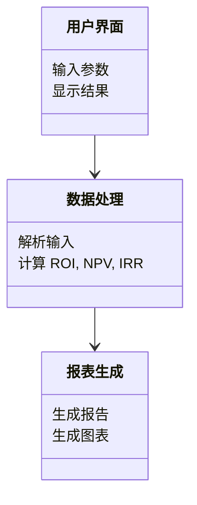
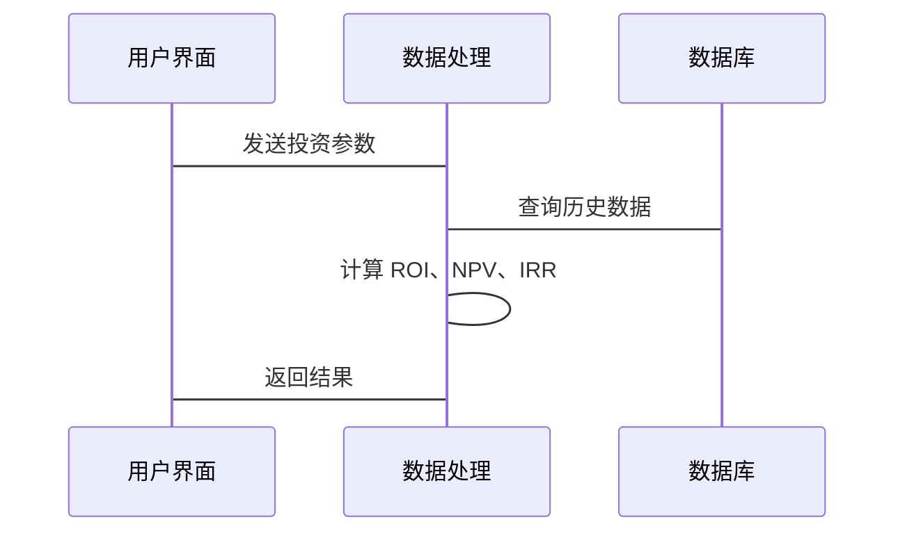

                 


# 投资回报率分析工具

## 关键词：投资回报率、财务分析、数据分析工具、项目评估、收益分析、投资决策

## 摘要：本文介绍投资回报率分析工具，探讨其核心概念、算法原理和系统架构，结合实际案例分析，帮助读者优化投资决策。

---

## 第一部分: 投资回报率分析工具概述

### 第1章: 投资回报率分析工具的背景与概念

#### 1.1 投资回报率的基本概念

##### 1.1.1 投资回报率的定义与计算公式
投资回报率（ROI）是衡量投资收益的重要指标，公式为：
$$ ROI = \frac{净收益}{投资成本} \times 100\% $$

##### 1.1.2 投资回报率的计算方法
投资回报率的计算通常基于净收益和投资成本。净收益是总收益减去总成本，投资成本是初始投入的资金。计算时需要注意时间价值，尤其是长期投资。

##### 1.1.3 投资回报率分析的必要性
在企业决策中，投资回报率分析是评估项目可行性的重要工具，帮助企业在多个项目中选择最优投资方案。

#### 1.2 投资回报率分析工具的背景

##### 1.2.1 传统投资回报率分析的局限性
传统方法依赖人工计算，容易出错，且无法处理复杂场景，如多期投资和现金流波动。

##### 1.2.2 现代投资回报率分析工具的发展
现代工具利用计算机技术，实现了自动化计算和复杂场景模拟，提高了分析效率和准确性。

##### 1.2.3 工具在企业决策中的作用
工具通过提供精确的分析结果，帮助企业优化资源配置，降低投资风险，提升决策质量。

---

## 第二部分: 投资回报率分析的核心概念

### 第2章: 投资回报率分析的关键要素

#### 2.1 投资回报率分析的核心要素

##### 2.1.1 现金流预测
现金流预测是投资回报率分析的基础，包括初始投资、运营成本和预期收入。预测方法有定性和定量分析，常用的历史数据回归分析法。

##### 2.1.2 投资成本
投资成本包括初始投入和后续维护费用，准确预测投资成本是计算净收益的关键。

##### 2.1.3 收益预测
收益预测基于市场需求、产品生命周期等因素，常用的方法包括趋势分析和情景分析。

##### 2.1.4 时间价值
时间价值考虑资金的时间价值，通常通过贴现率计算，确保未来现金流的现值准确反映其价值。

#### 2.2 投资回报率分析的关键公式

##### 2.2.1 净现值公式
净现值（NPV）计算公式为：
$$ NPV = \sum_{t=0}^{n} \frac{CF_t}{(1 + r)^t} $$
其中，CF_t是第t期的现金流，r是贴现率。

##### 2.2.2 内部收益率公式
内部收益率（IRR）是使净现值为零的贴现率：
$$ IRR = r \text{ 使得 } NPV = 0 $$

---

## 第三部分: 投资回报率分析的算法原理

### 第3章: 投资回报率分析的算法实现

#### 3.1 现金流预测算法

##### 3.1.1 现金流预测的步骤
1. 数据收集：收集历史销售数据、成本数据和市场趋势。
2. 数据清洗：处理缺失值和异常值。
3. 模型选择：选择合适的时间序列模型，如ARIMA。
4. 预测：基于模型生成预测现金流。
5. 验证：对比实际数据，调整模型。

##### 3.1.2 时间序列分析方法
使用ARIMA模型进行预测，步骤包括数据平稳化、模型参数估计和残差诊断。

##### 3.1.3 算法实现的Python代码示例
```python
from statsmodels.tsa.arima_model import ARIMA
import pandas as pd

# 假设data是时间序列数据
model = ARIMA(data, order=(1, 1, 1))
model_fit = model.fit()
forecast = model_fit.forecast(steps=5)
print(forecast)
```

#### 3.2 投资回报率计算算法

##### 3.2.1 ROI计算的步骤
1. 计算总收益。
2. 计算总成本。
3. 计算净收益。
4. 计算投资回报率。

##### 3.2.2 净现值计算的步骤
1. 确定现金流。
2. 确定贴现率。
3. 计算各期现金流的现值。
4. 求和得到净现值。

##### 3.2.3 内部收益率计算的步骤
1. 列出各期现金流。
2. 使用数值方法求解IRR。
3. 验证结果的合理性。

---

## 第四部分: 投资回报率分析系统的架构设计

### 第4章: 投资回报率分析系统的架构设计

#### 4.1 问题场景介绍
系统旨在帮助用户评估投资项目，提供 ROI、NPV 和 IRR 计算，支持多项目对比和风险分析。

#### 4.2 系统功能设计

##### 4.2.1 功能模块
- 用户界面：输入参数，显示结果。
- 数据处理：解析输入，计算 ROI、NPV 和 IRR。
- 报表生成：生成分析报告和可视化图表。

##### 4.2.2 领域模型Mermaid类图


#### 4.3 系统架构设计

##### 4.3.1 系统架构Mermaid架构图


#### 4.4 系统接口设计

##### 4.4.1 接口描述
- 输入接口：接收用户输入的投资参数。
- 输出接口：返回计算结果和图表。

#### 4.5 系统交互Mermaid序列图


---

## 第五部分: 项目实战

### 第5章: 投资回报率分析工具的项目实战

#### 5.1 项目环境安装

##### 5.1.1 安装Python和依赖库
```bash
pip install numpy pandas matplotlib
```

#### 5.2 系统核心实现源代码

##### 5.2.1 投资回报率计算函数
```python
def calculate ROI(cash_inflows, cash_outflows, discount_rate, periods):
    npv = 0
    for t in range(periods):
        cash_flow = cash_inflows[t] - cash_outflows[t]
        npv += cash_flow / (1 + discount_rate) ** t
    irr = 0
    # 简化IRR计算
    return npv, irr
```

##### 5.2.2 数据可视化
```python
import matplotlib.pyplot as plt

def plot_cash_flows(flows, title):
    plt.plot(flows, 'b-')
    plt.title(title)
    plt.xlabel('时间（年）')
    plt.ylabel('现金流（万元）')
    plt.show()
```

#### 5.3 代码应用解读与分析

##### 5.3.1 净现值计算
```python
cash_flows = [ -100, 30, 50, 40 ]
discount_rate = 0.1
npv = sum(flow / (1 + discount_rate) ** t for t, flow in enumerate(cash_flows))
print(f"净现值为：{npv:.2f}")
```

##### 5.3.2 投资回报率计算
```python
cash_inflows = [30, 50, 40]
cash_outflows = [100]
discount_rate = 0.1
roi = (sum(cash_inflows) - sum(cash_outflows)) / sum(cash_outflows) * 100
print(f"投资回报率为：{roi:.2f}%")
```

#### 5.4 实际案例分析

##### 5.4.1 案例背景
某公司考虑投资新项目，初始投资100万元，预计三年内现金流分别为30万、50万、40万，贴现率为10%。

##### 5.4.2 计算净现值和投资回报率
NPV计算：
$$ NPV = \frac{30}{1.1} + \frac{50}{1.1^2} + \frac{40}{1.1^3} - 100 \approx 23.41 + 39.68 + 28.28 - 100 = 11.37万元 $$

投资回报率计算：
$$ ROI = \frac{11.37}{100} \times 100\% = 11.37\% $$

##### 5.4.3 可视化现金流
```python
flows = [-100, 30, 50, 40]
plot_cash_flows(flows, "现金流折线图")
```

#### 5.5 项目小结

##### 5.5.1 经验总结
工具的应用提高了分析效率和准确性，帮助企业优化决策。

##### 5.5.2 注意事项
确保输入数据的准确性和合理性，选择合适的贴现率，考虑项目风险因素。

---

## 第六部分: 投资回报率分析工具的最佳实践

### 第6章: 投资回报率分析工具的最佳实践

#### 6.1 小结与回顾
工具的应用提升了企业投资分析的效率和精准度，帮助做出更优决策。

#### 6.2 注意事项
- 数据的准确性和完整性。
- 选择合适的贴现率和模型。
- 考虑项目风险和不确定性。

#### 6.3 拓展阅读
建议阅读相关书籍和文献，深入理解投资分析的理论和实践。

---

## 结语

通过本文的学习，读者能够系统地理解投资回报率分析工具的设计与应用，掌握其核心概念、算法原理和系统架构，提升在投资决策中的分析能力。

