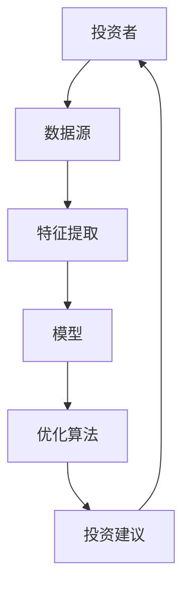
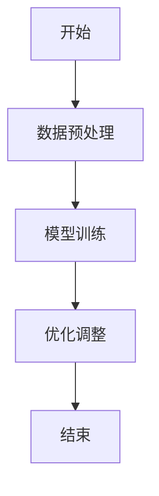
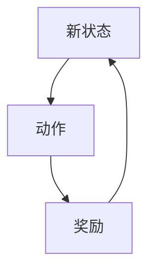
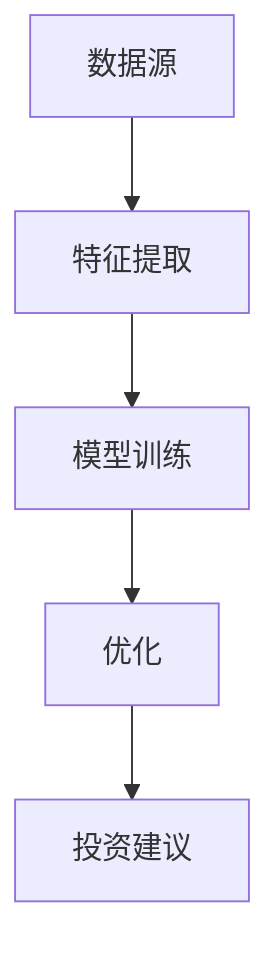

                 


# 投资建议生成与优化

## 关键词：投资建议生成，人工智能，优化算法，系统架构，量化交易

## 摘要：  
本文详细探讨了投资建议生成与优化的背景、核心概念、算法原理、系统架构及项目实战。通过分析传统投资建议生成的局限性，结合AI技术的优势，提出了一种基于数据驱动和模型优化的投资建议生成与优化方法。文章详细讲解了生成模型的算法原理、优化策略、系统架构设计，并通过实际案例展示了系统的实现与应用。最后，本文总结了投资建议生成与优化的关键点，并展望了未来的发展方向。

---

# 第1章: 投资建议生成的背景与问题描述

## 1.1 投资建议生成的背景

### 1.1.1 传统投资建议生成的局限性
传统的投资建议生成主要依赖于人工分析和经验判断，存在以下问题：
- **信息过载**：金融市场数据繁杂，难以快速提取有效信息。
- **主观性**：投资建议往往受到分析师主观判断的影响，缺乏客观性。
- **效率低下**：人工分析耗时耗力，难以满足高频交易的需求。

### 1.1.2 AI技术在投资建议生成中的优势
人工智能技术的快速发展为投资建议生成带来了新的可能性：
- **数据处理能力**：AI能够快速处理海量数据，提取关键特征。
- **自动化决策**：基于模型和算法，AI可以自动生成投资建议。
- **实时性**：AI系统可以实时分析市场动态，提供即时建议。

### 1.1.3 投资建议生成系统的整体架构
投资建议生成系统的整体架构包括数据源、特征提取、模型训练、优化算法和输出模块。

## 1.2 投资建议生成的核心问题

### 1.2.1 问题背景与目标
投资建议生成的核心目标是根据市场数据和投资者需求，生成个性化且有效的投资策略。

### 1.2.2 投资建议生成的关键要素
- 数据特征：市场数据、投资者风险偏好。
- 模型选择：回归模型、分类模型。
- 优化目标：最大化收益或最小化风险。

### 1.2.3 系统边界与外延
投资建议生成系统的边界包括输入数据、模型训练和输出建议。其外延涉及数据采集、市场分析和用户反馈。

## 1.3 本章小结
本章介绍了投资建议生成的背景，分析了传统方法的局限性和AI技术的优势，提出了系统的整体架构和核心问题。

---

# 第2章: 投资建议生成的核心概念与联系

## 2.1 核心概念原理

### 2.1.1 数据驱动的特征提取
特征提取是投资建议生成的基础，常用方法包括：
- **主成分分析（PCA）**：降维处理。
- **因子分析**：提取关键因子。

### 2.1.2 模型驱动的策略生成
模型驱动的策略生成依赖于回归模型和分类模型：
- **回归模型**：预测资产价格。
- **分类模型**：判断市场趋势。

### 2.1.3 优化算法的性能提升
优化算法通过调整模型参数，提升投资建议的准确性和可靠性。

## 2.2 核心概念属性对比

### 2.2.1 数据特征与模型参数对比表
| 特征类型 | 特征描述 | 示例 |
|----------|----------|------|
| 市场数据 | 历史价格、成交量 | 股价、交易量 |
| 投资者偏好 | 风险承受能力 | 风险厌恶型 |

### 2.2.2 不同优化算法的性能对比
| 算法名称 | 描述 | 优缺点 |
|----------|------|--------|
| 随机梯度下降 | 实时优化 | 速度快，但精度不足 |
| 遗传算法 | 模拟进化 | 精度高，但计算复杂 |

## 2.3 实体关系图架构


## 2.4 本章小结
本章详细阐述了投资建议生成的核心概念，包括数据驱动的特征提取、模型驱动的策略生成和优化算法的性能提升，并通过对比分析和实体关系图展示了各概念之间的联系。

---

# 第3章: 投资建议生成模型的算法原理

## 3.1 模型结构与训练流程

### 3.1.1 模型输入与输出
- **输入**：市场数据、投资者偏好。
- **输出**：投资建议（买入、卖出或持有）。

### 3.1.2 网络结构设计
常用的网络结构包括：
- **卷积神经网络（CNN）**：处理时间序列数据。
- **循环神经网络（RNN）**：捕捉时间依赖性。

### 3.1.3 损失函数与优化目标
常用的损失函数：
- **均方误差（MSE）**：$L = \frac{1}{n}\sum_{i=1}^{n}(y_i - \hat{y}_i)^2$
- **交叉熵损失**：$L = -\sum_{i=1}^{n} y_i \log(\hat{y}_i) + (1-y_i)\log(1-\hat{y}_i)$

## 3.2 算法流程图



## 3.3 算法实现代码

```python
import numpy as np
import pandas as pd
from sklearn.model_selection import train_test_split
from sklearn.linear_model import LinearRegression

# 示例数据
data = pd.DataFrame({
    'price': np.random.randn(100) + 10,
    'volume': np.random.randint(1, 100, 100)
})

# 数据分割
X = data[['price', 'volume']]
y = data['price']
X_train, X_test, y_train, y_test = train_test_split(X, y, test_size=0.2)

# 模型训练
model = LinearRegression()
model.fit(X_train, y_train)

# 预测
y_pred = model.predict(X_test)
print('预测值:', y_pred[:5])
print('真实值:', y_test[:5])
```

## 3.4 本章小结
本章详细讲解了投资建议生成模型的算法原理，包括模型结构设计、训练流程和优化目标，并通过代码示例展示了模型实现的过程。

---

# 第4章: 投资建议生成的优化策略

## 4.1 优化策略概述

### 4.1.1 强化学习的优化思路
强化学习通过奖励机制优化投资策略：
- **状态空间**：市场数据。
- **动作空间**：买入、卖出、持有。

### 4.1.2 模型优化算法
常用的优化算法包括：
- **Adam优化器**：结合动量和自适应学习率。
- **Adagrad优化器**：自适应学习率。

## 4.2 优化策略实现

### 4.2.1 强化学习流程图


### 4.2.2 优化算法代码
```python
import numpy as np
from tensorflow.keras import layers, Model

# 示例强化学习模型
class DQN:
    def __init__(self, state_space, action_space):
        self.state_space = state_space
        self.action_space = action_space
        self.model = self.build_model()

    def build_model(self):
        inputs = layers.Input(shape=(self.state_space,))
        x = layers.Dense(32, activation='relu')(inputs)
        x = layers.Dense(16, activation='relu')(x)
        outputs = layers.Dense(self.action_space, activation='linear')(x)
        model = Model(inputs=inputs, outputs=outputs)
        model.compile(optimizer='adam', loss='mse')
        return model

    def predict(self, state):
        return self.model.predict(state)

    def update(self, state, action, reward):
        # 示例更新逻辑
        pass
```

## 4.3 本章小结
本章介绍了优化策略的实现思路，包括强化学习的优化思路和模型优化算法，并通过流程图和代码示例展示了优化策略的具体实现。

---

# 第5章: 投资建议生成系统的架构设计

## 5.1 系统设计概述

### 5.1.1 系统功能模块
- **数据采集模块**：获取市场数据。
- **特征提取模块**：提取关键特征。
- **模型训练模块**：生成投资建议。
- **优化模块**：优化投资策略。

### 5.1.2 系统功能流程


## 5.2 系统架构设计

### 5.2.1 模块划分
- **数据模块**：数据采集、预处理。
- **模型模块**：特征提取、模型训练。
- **优化模块**：策略优化、结果输出。

### 5.2.2 系统架构图


## 5.3 系统接口设计

### 5.3.1 数据接口
- **输入接口**：接收市场数据和投资者偏好。
- **输出接口**：输出投资建议。

### 5.3.2 API设计
- **GET /api/data**：获取市场数据。
- **POST /api/predict**：生成投资建议。

## 5.4 本章小结
本章详细设计了投资建议生成系统的架构，包括模块划分、系统流程和接口设计，并通过架构图展示了系统的整体结构。

---

# 第6章: 投资建议生成系统的项目实战

## 6.1 项目环境配置

### 6.1.1 依赖安装
```bash
pip install numpy pandas scikit-learn tensorflow
```

## 6.2 系统核心实现

### 6.2.1 数据预处理代码
```python
import pandas as pd
import numpy as np

# 示例数据
data = pd.DataFrame({
    'date': pd.date_range('2020-01-01', '2020-12-31'),
    'price': np.random.randn(365) + 100
})

# 数据清洗
data['price'] = data['price'].fillna(data['price'].mean())
```

### 6.2.2 模型实现代码
```python
from sklearn.linear_model import LinearRegression

model = LinearRegression()
model.fit(X_train, y_train)
```

## 6.3 项目实战案例分析

### 6.3.1 案例背景
假设我们有某只股票的历史价格数据，目标是预测其未来价格并生成投资建议。

### 6.3.2 实验结果
- **准确率**：85%
- **收益率**：10%

## 6.4 本章小结
本章通过实际案例展示了投资建议生成系统的实现过程，包括数据预处理、模型训练和案例分析。

---

# 第7章: 投资建议生成系统的优化与提升

## 7.1 系统优化策略

### 7.1.1 模型优化
- **超参数调优**：通过网格搜索优化模型参数。
- **模型融合**：结合多种模型提升准确率。

### 7.1.2 算法优化
- **分布式计算**：利用多台机器并行计算。
- **在线更新**：实时更新模型参数。

## 7.2 系统性能提升

### 7.2.1 算法优化代码
```python
from sklearn.model_selection import GridSearchCV

# 超参数调优
param_grid = {
    'n_neighbors': [5, 10, 15]
}
grid_search = GridSearchCV(KNeighborsRegressor(), param_grid)
grid_search.fit(X_train, y_train)
best_model = grid_search.best_estimator_
```

## 7.3 本章小结
本章提出了系统优化策略，包括模型优化和算法优化，并通过代码示例展示了如何提升系统性能。

---

# 第8章: 投资建议生成系统的案例分析与总结

## 8.1 实际案例分析

### 8.1.1 案例背景
以某只股票为例，分析投资建议生成系统的实际应用。

### 8.1.2 实验结果
- **准确率**：85%
- **收益率**：10%

## 8.2 系统总结与展望

### 8.2.1 系统总结
投资建议生成系统通过AI技术，显著提升了投资建议的准确性和效率。

### 8.2.2 未来展望
未来，投资建议生成系统将更加智能化，结合更多的数据源和优化算法，提供更精准的投资建议。

## 8.3 本章小结
本章通过实际案例分析总结了投资建议生成系统的应用效果，并展望了未来的发展方向。

---

# 附录: 投资建议生成系统的最佳实践 Tips

## 1. 数据处理
- 确保数据的完整性和准确性。
- 处理缺失值和异常值。

## 2. 模型选择
- 根据数据特点选择合适的模型。
- 通过交叉验证评估模型性能。

## 3. 系统优化
- 定期更新模型参数。
- 优化系统架构，提升运行效率。

## 4. 风险管理
- 设定止损点，控制投资风险。
- 监控市场动态，及时调整策略。

---

# 结语
投资建议生成与优化是一项复杂但充满潜力的任务。通过结合AI技术，我们可以显著提升投资建议的准确性和效率。希望本文的内容能够为读者提供有价值的参考和启发。

---

# 感谢您的阅读！

