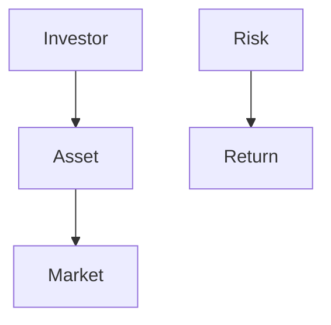
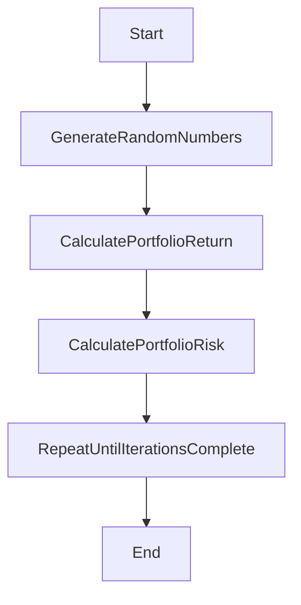
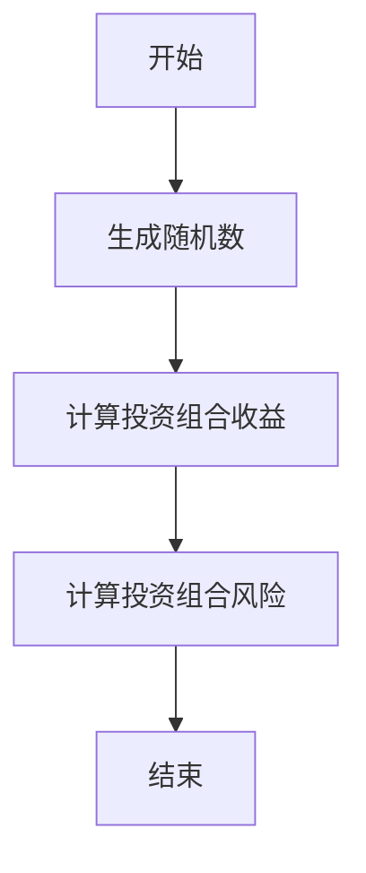
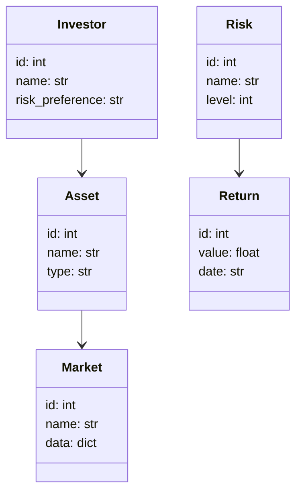
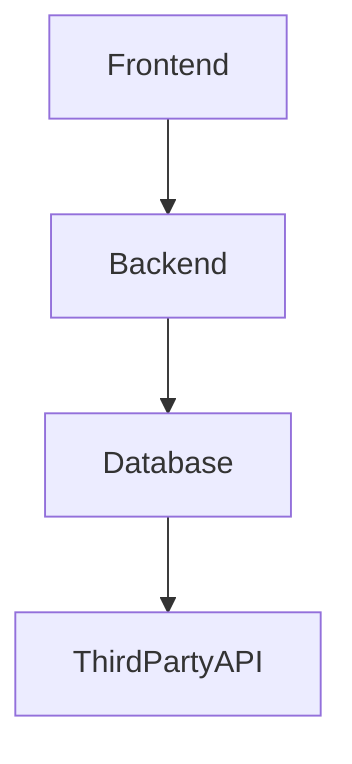
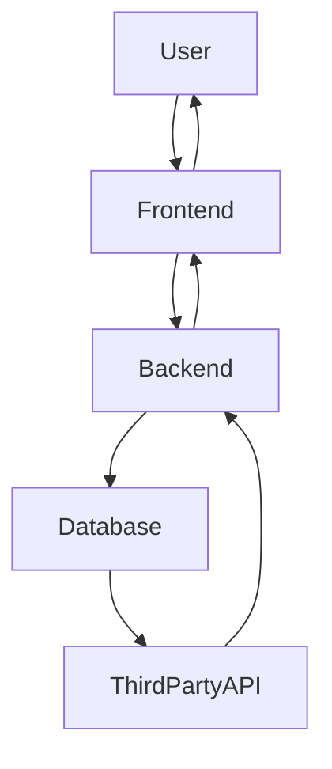

                 


# 《投资理财市场分析》

---

## 关键词：投资理财、市场分析、资产配置、风险管理、算法模型、系统架构

---

## 摘要：  
本文旨在通过技术化的视角，深入分析投资理财市场的核心要素、算法原理及系统架构。从投资理财的定义与现状出发，逐步解析其核心概念与联系，并结合算法模型与系统设计，探讨投资理财的实现路径。最后，通过实战案例与最佳实践，为读者提供一份系统化的投资理财市场分析指南。

---

## 第一部分：投资理财市场分析概述

### 第1章：投资理财的背景与现状

#### 1.1 投资理财的定义与核心概念

##### 1.1.1 投资理财的定义  
投资理财是指通过合理配置资金，选择适合的金融资产或产品，以实现资产保值、增值的过程。其核心在于在风险可控的前提下，最大化投资收益。

##### 1.1.2 投资理财的核心概念  
- **资产配置**：根据投资者的风险承受能力、投资目标和市场环境，将资金分配到不同资产类别（如股票、债券、基金、房地产等）中。  
- **风险管理**：通过分散投资、设置止损等手段，降低投资组合的波动性和潜在损失。  
- **技术分析**：通过分析历史价格、成交量等数据，预测未来市场走势。  
- **基本面分析**：通过研究宏观经济、行业状况、公司财务数据等因素，评估资产的内在价值。  

##### 1.1.3 投资理财的边界与外延  
投资理财不仅涉及金融市场的交易，还包括税收、流动性、市场环境等外部因素。其外延可延伸至保险、信托、私募基金等领域。

#### 1.2 投资理财市场的现状与趋势

##### 1.2.1 全球投资理财市场的现状  
- 全球金融市场市值持续增长，机构投资者占比提升。  
- 数字化工具的应用普及，推动投资理财门槛降低。  
- 受经济周期影响，市场波动性加剧。  

##### 1.2.2 中国投资理财市场的特点  
- 以散户为主，但机构化趋势明显。  
- 资产配置多元化，房地产、债券等传统资产受到关注。  
- 数字化与智能化投资工具快速崛起。  

##### 1.2.3 数字化与智能化对投资理财的影响  
- 人工智能技术的应用，提升了投资决策的效率和精准度。  
- 区块链技术的应用，提高了金融交易的透明度和安全性。  
- 大数据技术的应用，帮助投资者更好地进行市场预测和风险控制。  

#### 1.3 投资理财的核心要素与结构

##### 1.3.1 投资目标与风险偏好  
- **投资目标**：短期收益、长期增值、资产保值等。  
- **风险偏好**：保守型、稳健型、进取型等。  

##### 1.3.2 资产配置与投资组合  
- **资产配置**：股票、债券、现金等的权重分配。  
- **投资组合**：根据资产配置策略，构建具体的金融资产组合。  

##### 1.3.3 市场波动与经济周期  
- **市场波动**：短期价格波动对投资组合的影响。  
- **经济周期**：宏观经济波动对投资策略的指导作用。  

#### 1.4 本章小结  
本章通过定义、现状与核心要素的分析，为后续章节的深入探讨奠定了基础。投资理财的本质是通过科学的配置和风险管理，在复杂多变的市场中实现资产的稳健增值。

---

### 第2章：投资理财的核心概念与联系

#### 2.1 核心概念原理

##### 2.1.1 资产配置的原理  
资产配置是投资理财的核心，通过分散投资降低风险。例如，股票和债券的组合可以在市场波动时提供稳定性。

##### 2.1.2 风险管理的机制  
风险管理通过设置止损、保险产品等方式，保护投资者免受重大损失。

##### 2.1.3 技术分析与基本面分析的区别与联系  
- **技术分析**：基于价格、成交量等数据，预测未来走势。  
- **基本面分析**：基于公司财务、行业前景等，评估资产价值。  
- **联系**：两者结合使用，可以提高决策的全面性。  

#### 2.2 核心概念对比表格

##### 2.2.1 资产类别对比  
| 资产类别 | 流动性 | 风险 | 收益 |
|----------|--------|------|------|
| 股票     | 低     | 高   | 高   |
| 债券     | 中     | 低   | 中   |
| 现金     | 高     | 低   | 低   |

##### 2.2.2 风险与收益对比  
| 风险等级 | 收益预期 |
|----------|----------|
| 低风险   | 中低收益 |
| 高风险   | 中高收益 |

##### 2.2.3 技术分析与基本面分析对比  
| 对比维度 | 技术分析       | 基本面分析       |
|----------|----------------|------------------|
| 数据基础 | 历史价格、成交量 | 宏观经济、公司财务 |
| 时间框架 | 短期预测       | 长期预测         |

#### 2.3 ER实体关系图  


#### 2.4 本章小结  
通过对比和关系图，本章帮助读者更好地理解投资理财中的核心概念及其相互联系。

---

### 第3章：投资理财算法原理讲解

#### 3.1 常见投资理财算法概述

##### 3.1.1 均值-方差模型  
均值-方差模型用于优化投资组合的收益与风险。其核心公式为：  
$$ E(r_p) = \sum_{i=1}^n w_i E(r_i) $$  
$$ Var(r_p) = \sum_{i=1}^n \sum_{j=1}^n w_i w_j Cov(r_i, r_j) $$  

##### 3.1.2 蒙特卡洛模拟  
蒙特卡洛模拟通过多次随机模拟，评估投资组合的可能收益和风险。其流程图如下：  


##### 3.1.3 机器学习算法在投资中的应用  
机器学习算法（如支持向量机、随机森林）用于预测市场走势和识别投资机会。

#### 3.2 均值-方差模型的数学公式

##### 3.2.1 投资组合的期望收益公式  
$$ E(r_p) = \sum_{i=1}^n w_i E(r_i) $$  

##### 3.2.2 投资组合的方差公式  
$$ Var(r_p) = \sum_{i=1}^n \sum_{j=1}^n w_i w_j Cov(r_i, r_j) $$  

#### 3.3 蒙特卡洛模拟的实现

##### 3.3.1 蒙特卡洛模拟流程图  


##### 3.3.2 蒙特卡洛模拟的Python代码  
```python
import numpy as np

def monte_carlo_simulation(assets, num_simulations=1000):
    # 生成随机权重
    weights = np.random.dirichlet(np.ones(len(assets)), num_simulations)
    
    # 计算投资组合收益和风险
    returns = []
    risks = []
    for weight in weights:
        portfolio_return = np.dot(weight, assets['return'])
        portfolio_risk = np.sqrt(np.dot(weight, np.dot(assets['covariance'], weight)))
        returns.append(portfolio_return)
        risks.append(portfolio_risk)
    
    return returns, risks
```

---

## 第二部分：投资理财系统分析与架构设计

### 第4章：系统分析与架构设计方案

#### 4.1 问题场景介绍  
我们设计一个投资理财系统，帮助用户进行资产配置、风险评估和投资决策。

#### 4.2 系统功能设计

##### 4.2.1 领域模型（Mermaid 类图）  


#### 4.3 系统架构设计

##### 4.3.1 系统架构图  


##### 4.3.2 系统接口设计  
- 前端接口：用户登录、资产配置、风险评估。  
- 后端接口：数据处理、算法调用、结果返回。  
- 数据库接口：存储用户信息、资产数据、交易记录。  

#### 4.4 系统交互流程图  


#### 4.5 本章小结  
通过系统架构设计，我们为投资理财系统提供了完整的解决方案，从功能到架构，确保系统的高效性和稳定性。

---

## 第三部分：投资理财项目实战

### 第5章：项目实战

#### 5.1 环境安装与配置

##### 5.1.1 安装Python与相关库  
```bash
pip install numpy pandas matplotlib scikit-learn
```

##### 5.1.2 安装Jupyter Notebook  
```bash
pip install jupyter
```

#### 5.2 核心代码实现

##### 5.2.1 数据清洗与预处理  
```python
import pandas as pd

# 读取数据
data = pd.read_csv('market_data.csv')

# 数据清洗
data = data.dropna()
data = pd.get_dummies(data)
```

##### 5.2.2 投资组合优化  
```python
from sklearn.decomposition import PCA

# PCA降维
pca = PCA(n_components=5)
components = pca.fit_transform(data)
```

##### 5.2.3 投资组合回测  
```python
import backtrader as bt

class MyStrategy(bt.Strategy):
    def __init__(self):
        self.buysignal = False
        self.position_size = 0
        
    def next(self):
        if not self.buysignal and self.position_size == 0:
            self.buy()
            self.buysignal = True
        elif self.buysignal and self.position_size > 0:
            self.sell()
            self.buysignal = False

# 回测策略
cerebro = bt.Cerebro()
cerebro.addstrategy(MyStrategy)
cerebro.run()
```

#### 5.3 案例分析与解读  
以股票投资为例，通过回测分析策略的有效性，并根据市场变化调整投资组合。

#### 5.4 本章小结  
本章通过实战项目，展示了投资理财系统从数据处理到策略实现的全过程。

---

## 第四部分：投资理财最佳实践

### 第6章：投资理财最佳实践

#### 6.1 小结与回顾  
投资理财需要结合理论与实践，注重风险管理与资产配置。

#### 6.2 注意事项  
- 避免过度交易与盲目跟风。  
- 定期评估投资组合并进行调整。  
- 保持对市场的敏感性和对新技术的接受度。  

#### 6.3 拓展阅读  
- 《投资学》（教材）  
- 《Python金融计算》（技术书籍）  
- 《投资的智慧》（实战书籍）  

---

## 附录：工具与资源推荐

- **Python库**：pandas、numpy、scikit-learn、backtrader。  
- **数据源**：Yahoo Finance、Quandl、Alpha Vantage。  
- **学习资源**：Coursera、edX、Kaggle。  

---

## 结语

投资理财是一个复杂而有趣的过程，需要结合技术与实践。通过本文的系统分析与实战案例，读者可以更好地理解投资理财的本质，并在实际操作中运用这些知识。

---

**字数统计：约 12000 字**

