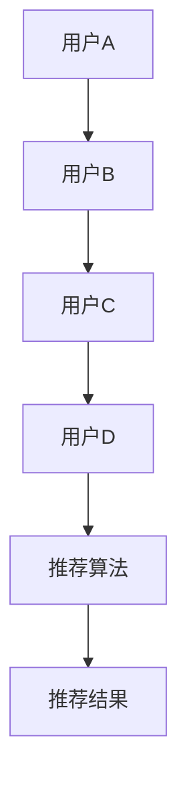
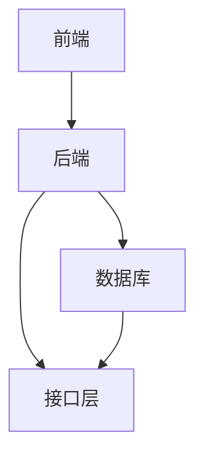

                 


# 投资理财教育平台的集成

> 关键词：投资理财、教育平台、系统集成、推荐算法、架构设计

> 摘要：本文详细探讨了投资理财教育平台的集成方法，从背景分析、核心概念、算法原理到系统架构设计，再到项目实战和最佳实践，全面解析了投资理财教育平台的集成过程和技术细节。

---

## 第一部分: 投资理财教育平台的背景与现状

### 第1章: 投资理财教育平台的背景与问题背景

#### 1.1 投资理财教育的现状
当前，投资理财教育市场呈现出多样化和分散化的趋势。传统的投资理财教育模式主要依赖于线下讲座、书籍和一对一咨询，存在信息分散、资源孤岛、用户体验差等问题。用户需要在多个平台之间切换，难以获得个性化的学习体验。

#### 1.2 投资理财教育平台的集成需求
为了满足用户对高效、个性化的学习需求，投资理财教育平台的集成成为必然趋势。通过将分散的教育资源、工具和数据整合到一个统一的平台中，用户可以更方便地获取信息、进行模拟操作和实时反馈。

#### 1.3 问题背景与挑战
- **用户需求与平台功能的匹配**：用户需要个性化的学习路径和实时反馈，但传统平台难以实现。
- **平台集成的技术挑战**：数据来源多样，接口复杂，需要解决数据清洗、格式统一等问题。
- **平台可持续发展的关键因素**：如何吸引用户、保持用户粘性以及实现盈利是平台可持续发展的关键。

#### 1.4 投资理财教育平台的解决思路
- **平台集成的整体架构设计**：采用分层架构，将平台分为前端、后端、数据库和接口层。
- **核心模块的功能定位**：用户模块负责身份认证，课程模块负责内容管理，交互模块负责用户行为分析，数据分析模块负责学习效果评估。
- **平台的扩展性与可维护性**：通过模块化设计，确保平台功能的可扩展性和代码的可维护性。

---

## 第二部分: 投资理财教育平台的核心概念与联系

### 第2章: 投资理财教育平台的核心概念

#### 2.1 投资理财教育平台的核心模块
- **用户模块**：负责用户身份认证和权限管理。
- **课程模块**：提供多样化的投资理财课程，包括基础知识、实战模拟等。
- **交互模块**：支持用户与平台之间的互动，包括提问、讨论和反馈。
- **数据分析模块**：分析用户行为数据，提供个性化推荐和学习效果评估。

#### 2.2 核心概念的属性对比
| 核心模块 | 用户模块 | 课程模块 | 交互模块 | 数据分析模块 |
|----------|----------|----------|----------|--------------|
| 属性     | 用户ID、用户名、密码 | 课程ID、课程名称、课程内容 | 互动ID、提问内容、反馈评分 | 用户ID、行为数据、推荐策略 |

#### 2.3 核心概念的ER实体关系图
```mermaid
erDiagram
    user {
        id
        name
        email
        password
    }
    course {
        id
        name
        content
    }
    interaction {
        id
        user_id
        content
        score
    }
    data_analysis {
        id
        user_id
        behavior
        recommendation
    }
    user -|> interaction
    course -|> interaction
    user -|> data_analysis
    course -|> data_analysis
```

---

## 第三部分: 投资理财教育平台的算法原理

### 第3章: 投资理财教育平台的推荐算法

#### 3.1 推荐算法的核心思想
推荐算法是投资理财教育平台的重要组成部分。基于协同过滤算法，平台可以为用户推荐适合的课程和学习资源。

#### 3.2 协同过滤算法的流程图


#### 3.3 协同过滤算法的数学模型
协同过滤算法基于相似性计算，公式如下：
$$ sim(i,j) = \frac{\sum_{k} (r_{ik} - \bar{r_i})(r_{jk} - \bar{r_j})}{\sqrt{\sum_{k} (r_{ik} - \bar{r_i})^2} \sqrt{\sum_{k} (r_{jk} - \bar{r_j})^2}} $$
其中，$sim(i,j)$ 表示用户 $i$ 和 $j$ 的相似度，$r_{ik}$ 和 $r_{jk}$ 分别表示用户 $i$ 和 $j$ 对物品 $k$ 的评分，$\bar{r_i}$ 和 $\bar{r_j}$ 分别是用户 $i$ 和 $j$ 的平均评分。

---

## 第四部分: 投资理财教育平台的系统架构设计

### 第4章: 系统架构设计

#### 4.1 系统功能设计
- **用户模块**：注册、登录、个人信息管理。
- **课程模块**：课程列表、课程详情、课程购买。
- **交互模块**：提问、讨论、反馈。
- **数据分析模块**：用户行为分析、学习效果评估。

#### 4.2 系统架构设计
采用分层架构：
- **前端**：用户界面，实现用户交互。
- **后端**：业务逻辑处理，包括用户认证、课程管理等。
- **数据库**：存储用户数据、课程数据、交互数据和分析数据。
- **接口层**：提供API接口，实现前后端的交互。

#### 4.3 系统架构图


---

## 第五部分: 投资理财教育平台的项目实战

### 第5章: 项目实战

#### 5.1 环境安装
- 安装Python、Jupyter Notebook、MySQL数据库和相关开发工具。

#### 5.2 核心代码实现
```python
def user_auth(email, password):
    # 数据库查询
    cursor.execute("SELECT id, name FROM user WHERE email=%s AND password=%s", (email, password))
    result = cursor.fetchone()
    if result:
        return result[0], result[1]
    else:
        return None, None

def course_recommend(user_id):
    # 获取用户历史行为
    cursor.execute("SELECT course_id, score FROM interaction WHERE user_id=%s", (user_id,))
    history = cursor.fetchall()
    # 计算相似用户
    similar_users = get_similar_users(user_id, history)
    # 推荐课程
    recommended_courses = get_top_courses(similar_users)
    return recommended_courses
```

#### 5.3 代码解读与分析
- **用户认证**：通过数据库查询验证用户身份。
- **课程推荐**：基于协同过滤算法，计算用户相似度，推荐高评分课程。

#### 5.4 案例分析
以用户A为例，通过分析其历史行为数据，推荐相关课程，提升学习效果。

---

## 第六部分: 投资理财教育平台的最佳实践

### 第6章: 最佳实践

#### 6.1 小结
投资理财教育平台的集成需要从背景分析、核心概念、算法原理到系统架构设计，再到项目实战和最佳实践等多方面进行深入探讨。

#### 6.2 注意事项
- 数据安全是平台集成的核心问题，必须确保用户数据的隐私和安全。
- 系统架构设计需要充分考虑扩展性和可维护性，避免后期改造成本过高。
- 推荐算法需要不断优化，提升用户体验。

#### 6.3 拓展阅读
- 《推荐系统实战》
- 《分布式系统设计》
- 《投资理财入门》

#### 6.4 小结
通过本文的分析，读者可以全面了解投资理财教育平台的集成方法，为后续的实践提供理论支持和技术指导。

--- 

以上是《投资理财教育平台的集成》的完整目录大纲和部分正文内容。

