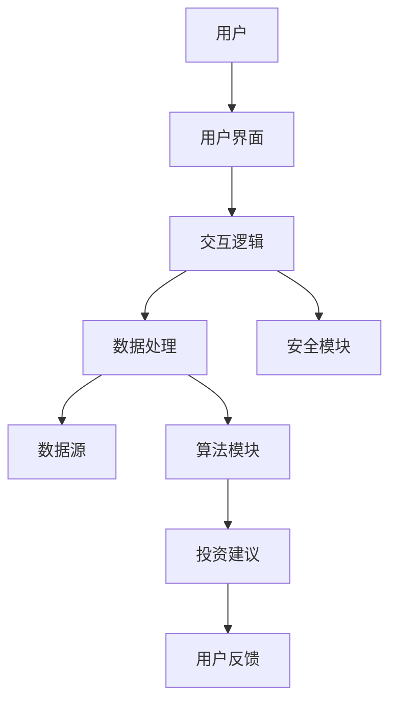

                 


# 《投资理财智能助手的前端开发最佳实践》

---

## 关键词：
投资理财、智能助手、前端开发、用户交互、数据可视化、算法推荐、系统架构

---

## 摘要：
本文将深入探讨投资理财智能助手的前端开发最佳实践，从背景分析、核心概念、算法实现到系统架构设计，再到项目实战与最佳实践，全面解析如何构建高效、安全、用户友好的智能投资理财助手。通过结合实际案例和详细的技术分析，帮助读者掌握投资理财智能助手开发的关键技能。

---

## 目录：

### 第一部分：投资理财智能助手的背景与目标

### 第二部分：投资理财智能助手的核心概念与技术

### 第三部分：投资理财智能助手的系统架构与设计

### 第四部分：投资理财智能助手的项目实战

### 第五部分：投资理财智能助手的最佳实践与总结

---

## 第一部分：投资理财智能助手的背景与目标

### 第1章：投资理财智能助手的背景介绍

#### 1.1 投资理财智能助手的重要性

投资理财是现代人生活中不可或缺的一部分，随着金融市场的复杂化和多样化的投资需求，传统的投资理财方式已经难以满足用户的需求。智能助手的出现，通过结合人工智能、大数据分析和用户行为研究，为用户提供个性化的投资建议、风险控制和高效的投资决策支持。

**关键词分析**：
- **个性化投资建议**：基于用户的财务状况、风险偏好和投资目标，提供定制化的投资方案。
- **智能风险控制**：通过实时数据分析和预测模型，帮助用户规避投资风险。
- **高效用户体验**：通过智能化的交互设计，提升用户的投资决策效率和体验。

**问题背景**：
- **信息过载**：金融市场信息繁杂，用户难以快速获取和分析有效信息。
- **决策疲劳**：面对大量信息和选择，用户容易产生决策疲劳，影响投资判断。
- **个性化需求**：不同用户的财务状况和风险承受能力不同，需要个性化的投资建议。

**问题解决**：
- 通过智能助手，用户可以快速获取适合自己的投资方案，减少信息筛选的时间和精力。
- 智能助手通过算法分析市场趋势和用户行为，提供实时的投资建议和风险预警。

**边界与外延**：
- **边界**：智能助手主要聚焦于投资理财领域，提供基于数据和算法的辅助决策支持。
- **外延**：智能助手的功能可以扩展到更多领域，如税务规划、财务分析等。

**概念结构**：
- 核心要素：用户需求、数据输入、算法处理、结果输出。
- 关键属性：个性化、实时性、交互性、安全性。

---

## 第二部分：投资理财智能助手的核心概念与技术

### 第2章：智能助手的交互设计

#### 2.1 用户需求分析与行为建模

**用户画像与需求分析**：
- **目标用户**：中高收入人群、投资者、理财新手。
- **核心需求**：个性化投资建议、实时市场动态、风险控制、便捷的操作体验。

**用户行为分析**：
- **登录与注册**：用户通过手机号或邮箱注册，进行身份认证。
- **投资目标设定**：用户填写财务状况、风险偏好、投资期限等信息。
- **交互流程**：用户输入需求，系统生成投资方案，用户查看并调整，最终确认。

**动态响应设计**：
- 基于用户实时输入，动态生成投资建议。
- 根据市场变化和用户行为，实时更新投资方案。

#### 2.2 数据可视化设计

**数据可视化的核心原则**：
- 简洁性：避免过多的信息干扰用户。
- 明确性：确保数据的准确性和清晰性。
- 可操作性：用户能够通过可视化数据快速做出决策。

**常用图表类型与场景选择**：
- **折线图**：展示市场趋势和资产价格波动。
- **柱状图**：比较不同资产类别的收益表现。
- **饼图**：展示资产配置的比例。
- **散点图**：分析相关资产之间的关联性。

**数据源与展示方式的优化**：
- **实时数据源**：对接实时行情接口，确保数据的及时性。
- **数据清洗**：去除无效数据，提升数据质量。
- **数据聚合**：根据用户需求，对数据进行聚合处理。

---

## 第三部分：投资理财智能助手的系统架构与设计

### 第3章：系统架构设计

#### 3.1 模块划分与功能设计

**模块划分**：
- **数据处理模块**：负责数据的采集、清洗、存储和分析。
- **用户界面模块**：实现与用户的交互，展示投资方案和数据可视化结果。
- **交互逻辑模块**：根据用户输入和系统反馈，动态调整投资方案。
- **安全模块**：保障用户数据和交易的安全性。

**功能设计**：
- **数据采集**：从多个数据源获取市场行情、用户行为数据等。
- **数据分析**：利用机器学习算法，分析市场趋势和用户需求。
- **投资建议生成**：基于算法结果，生成个性化投资方案。
- **用户反馈**：根据用户反馈，优化投资方案。

#### 3.2 系统架构图



---

## 第四部分：投资理财智能助手的项目实战

### 第4章：环境搭建与核心功能实现

#### 4.1 环境搭建

**工具与框架**：
- **前端框架**：React或Vue.js。
- **数据可视化库**：D3.js或ECharts。
- **后端框架**：Node.js或Python的Django框架。
- **数据源**：接入实时行情API（如Alpha Vantage、Yahoo Finance）。

**安装步骤**：
1. 安装Node.js和npm。
2. 安装React或Vue.js框架。
3. 安装数据可视化库和相关插件。
4. 配置API接口和数据源。

#### 4.2 核心功能实现

**投资组合优化算法**：
- **实现方式**：基于遗传算法的组合优化。
- **代码示例**：
  ```javascript
  function generatePopulation(populationSize, numAssets) {
    return Array.from({ length: populationSize }, () => 
      Array.from({ length: numAssets }, () => Math.random())
    );
  }
  ```

**风险评估模型**：
- **实现方式**：基于机器学习的风险评估。
- **代码示例**：
  ```javascript
  function riskScore/assetsValue) {
    // 简单示例，实际模型复杂得多
    return (assetsValue * riskFactor) / 100;
  }
  ```

---

## 第五部分：投资理财智能助手的最佳实践与总结

### 第5章：最佳实践

#### 5.1 开发注意事项

- **代码规范**：遵循行业标准，如ES6+规范。
- **测试方法**：单元测试、集成测试和端到端测试。
- **性能优化**：减少不必要的数据请求，优化前端渲染性能。
- **安全防护**：加密用户数据，防止数据泄露。

#### 5.2 总结与展望

投资理财智能助手的开发是一个复杂但极具价值的领域，通过结合前端开发、算法设计和用户行为研究，可以为用户提供高效、安全、个性化的投资理财服务。未来，随着人工智能和大数据技术的进一步发展，智能助手将更加智能化和个性化，为用户带来更好的投资体验。

---

## 参考文献

1. 《前端架构设计》
2. 《机器学习实战》
3. 《数据可视化基础》
4. 《投资学原理》

---

通过以上结构和内容，您可以逐步完成《投资理财智能助手的前端开发最佳实践》这篇文章。每个章节都详细展开了相关的技术点和实现细节，确保文章内容丰富、逻辑清晰。

