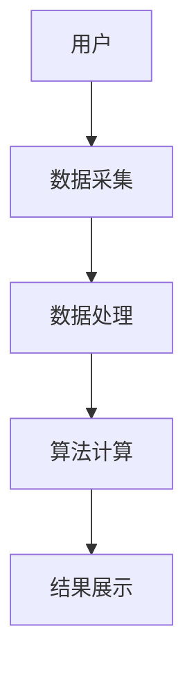
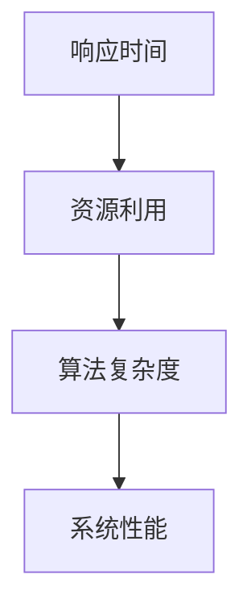

                 

# 《投资理财智能助手的性能调优技巧》

---

## 关键词：
投资理财智能助手、性能调优、算法优化、系统架构、数学模型

---

## 摘要：
本文深入探讨了投资理财智能助手的性能调优技巧，从系统背景到核心概念，再到算法优化和系统架构设计，结合实际项目案例，详细分析了如何提升系统的响应速度和资源利用效率。文章不仅介绍了性能调优的关键原理，还通过具体的代码实现和数学模型，展示了如何在实际项目中应用这些优化技巧。最后，总结了最佳实践经验和注意事项，为读者提供了全面的指导。

---

# 第一部分: 投资理财智能助手的背景与核心概念

## 第1章: 投资理财智能助手的背景与问题描述

### 1.1 投资理财智能助手的定义与目标
#### 1.1.1 投资理财智能助手的定义
投资理财智能助手是一款结合人工智能技术的工具，旨在为用户提供个性化的投资建议、风险评估和市场分析。它通过自然语言处理、机器学习和大数据分析等技术，帮助用户做出更明智的投资决策。

#### 1.1.2 助手的核心功能与应用场景
- **核心功能**：
  - 市场分析：实时跟踪股票、基金等市场的动态。
  - 投资建议：基于用户的财务状况和风险偏好，推荐合适的投资方案。
  - 风险评估：预测投资组合的风险并提供规避建议。
  - 个性化报告：生成定制化的投资报告。
- **应用场景**：
  - 个人用户：帮助用户优化个人投资组合。
  - 机构用户：为企业提供市场分析和投资策略。

#### 1.1.3 用户需求与目标
- 提高投资效率。
- 降低投资风险。
- 获取实时市场信息。
- 节省时间和成本。

### 1.2 性能调优的必要性
#### 1.2.1 系统性能对用户体验的影响
- 响应时间：直接影响用户的使用体验，响应时间过长会导致用户流失。
- 资源利用：系统资源的高效利用可以降低成本，提升服务稳定性。
- 算法效率：算法的优化直接影响系统的处理速度和结果准确性。

#### 1.2.2 当前系统存在的性能瓶颈
- 数据处理延迟：大数据量的处理导致系统响应变慢。
- 算法复杂度高：复杂的计算任务耗时较长。
- 资源分配不合理：CPU、内存等资源使用效率低下。

#### 1.2.3 性能调优的目标与边界
- **目标**：
  - 提高系统的响应速度。
  - 降低系统的资源消耗。
  - 提升算法的计算效率。
- **边界**：
  - 仅关注性能优化，不涉及安全性优化。
  - 不考虑系统架构的完全重构。

### 1.3 核心概念与联系
#### 1.3.1 核心概念对比分析
通过以下表格对比不同调优策略的优缺点：

| 调优策略 | 优点 | 缺点 |
|----------|------|------|
| 响应时间优化 | 提高用户体验 | 需要较高的计算资源 |
| 资源利用效率 | 降低成本 | 可能影响系统扩展性 |
| 算法复杂度 | 提高准确性 | 实现复杂度高 |

#### 1.3.2 系统组件之间的关系
通过以下 mermaid 图展示系统各组件之间的关系：

---

## 第2章: 投资理财智能助手的核心概念与联系

### 2.1 性能调优的关键概念
#### 2.1.1 响应时间优化
- **定义**：减少系统对用户请求的响应时间。
- **方法**：
  - 使用缓存技术减少重复计算。
  - 优化数据库查询，减少I/O操作。

#### 2.1.2 资源利用效率
- **定义**：最大化系统资源的使用效率。
- **方法**：
  - 合理分配CPU、内存资源。
  - 使用负载均衡技术分散请求压力。

#### 2.1.3 算法复杂度
- **定义**：算法在执行过程中所消耗的时间或空间资源的度量。
- **方法**：
  - 使用复杂度分析工具评估算法性能。
  - 通过优化算法减少计算量。

### 2.2 核心概念对比分析
#### 2.2.1 通过 mermaid 图展示概念关系

---

## 总结

通过以上章节的分析，我们已经明确了投资理财智能助手的性能调优背景、核心概念及其之间的关系。接下来，我们将深入探讨性能调优的核心算法与数学模型，帮助读者更好地理解和应用这些优化技巧。

