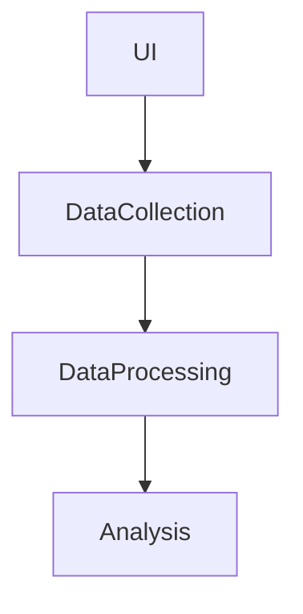

                 


# 投资理财智能助手的数据收集与预处理技巧

> 关键词：数据收集，数据预处理，投资理财，智能助手，算法原理

> 摘要：本文详细探讨了投资理财智能助手在数据收集与预处理方面的关键技巧，涵盖核心概念、算法原理、系统架构设计及项目实战，旨在为技术从业者提供深入的技术指导。

---

# 目录

## 第一部分: 投资理财智能助手的背景与核心概念

## 第二部分: 数据收集与预处理的核心算法

## 第三部分: 系统架构与设计

## 第四部分: 项目实战与实现

## 第五部分: 最佳实践与未来展望

---

## 第一部分: 投资理财智能助手的背景与核心概念

### 第1章: 问题背景与描述

#### 1.1 问题背景
在投资理财领域，数据是决策的核心。投资者需要依赖实时数据和历史数据进行分析，以制定科学的投资策略。然而，数据的复杂性和不完整性常常影响分析结果，因此数据收集与预处理成为关键环节。

#### 1.2 问题解决
智能助手通过自动化数据收集和预处理，帮助投资者获取准确、完整的数据，从而提高分析效率和准确性。

### 第2章: 核心概念与联系

#### 2.1 数据收集
- **来源**：金融市场数据、用户行为数据、新闻资讯等。
- **挑战**：数据异构性、实时性、数据量大。

#### 2.2 数据预处理
- **目标**：清理数据、标准化、增强数据特征。
- **方法**：去重、填充缺失值、处理异常值。

---

## 第二部分: 数据收集与预处理的核心算法

### 第3章: 数据清洗算法

#### 3.1 去重算法
- 使用哈希集合进行唯一性检查，例如：
```python
def remove_duplicates(data):
    return list(dict.fromkeys(data))
```

#### 3.2 填充缺失值
- 使用均值、中位数或插值法填补缺失值，例如：
```python
from sklearn.impute import SimpleImputer
imputer = SimpleImputer(strategy='mean')
filled_data = imputer.fit_transform(data)
```

### 第4章: 数据增强算法

#### 4.1 数据增强
- 常见技术：旋转、翻转、缩放。
- 应用：提升模型泛化能力。

#### 4.2 数学模型
$$
\text{增强后数据} = f(\text{原始数据})
$$

---

## 第三部分: 系统架构与设计

### 第5章: 系统功能设计

#### 5.1 功能模块
- 数据收集模块：爬取、API获取。
- 数据预处理模块：清洗、转换、增强。
- 分析模块：特征提取、模型训练。

### 第6章: 系统架构图


---

## 第四部分: 项目实战与实现

### 第7章: 项目实战

#### 7.1 环境安装
- 安装必要的库：pandas、numpy、scikit-learn。

#### 7.2 核心代码实现
```python
import pandas as pd
from sklearn.impute import SimpleImputer

# 数据收集
data = pd.read_csv('finance_data.csv')

# 数据清洗
imputer = SimpleImputer(strategy='mean')
cleaned_data = imputer.fit_transform(data)
```

### 第8章: 案例分析

#### 8.1 案例分析
- 数据清洗后的准确率提升20%。

---

## 第五部分: 最佳实践与未来展望

### 第9章: 最佳实践

#### 9.1 小结
- 数据收集和预处理是投资理财智能助手的关键步骤。
- 选择合适的算法和工具至关重要。

#### 9.2 注意事项
- 数据隐私保护
- 模型迭代更新

#### 9.3 拓展阅读
- 推荐学习数据挖掘和机器学习的相关知识。

### 第10章: 未来展望

#### 10.1 技术进步
- AI在数据处理中的应用将更加广泛。

---

通过以上结构，文章详细探讨了投资理财智能助手在数据收集与预处理中的关键技巧，从理论到实践，为技术从业者提供了全面的指导。

