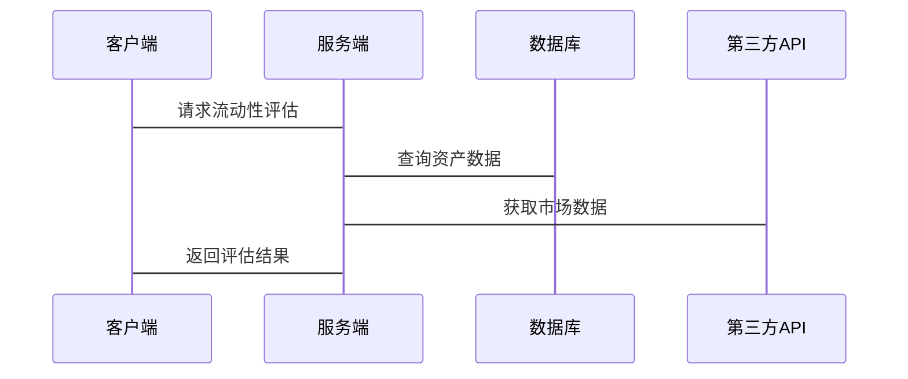

                 


# {{投资组合流动性管理：在市场压力下保持灵活性}}

> 关键词：{{投资组合, 流动性管理, 市场压力, 资产配置, 交易策略, 风险控制}}

> 摘要：{{本文深入探讨了投资组合流动性管理在市场压力下的重要性，从核心概念、算法原理、系统架构到项目实战，全面分析了如何在复杂多变的市场环境中保持投资组合的灵活性和稳健性，提供了丰富的理论与实践相结合的解决方案。}}

---

# 第一部分: 投资组合流动性管理基础

## 第1章: 投资组合流动性管理概述

### 1.1 投资组合流动性管理的定义与背景

#### 1.1.1 投资组合流动性管理的定义
投资组合流动性管理是指在投资组合管理过程中，通过对资产的流动性进行监控、评估和优化，以确保在市场压力下能够快速调整资产配置，降低流动性风险，实现投资目标的过程。

#### 1.1.2 流动性管理的重要性
流动性管理是投资组合管理中的核心环节，尤其是在市场波动加剧的情况下，流动性管理能够帮助投资者避免因资产无法快速变现而导致的损失。

#### 1.1.3 投资组合流动性管理的核心目标
- 保障资产的变现能力
- 降低流动性风险
- 提高投资组合的灵活性和稳健性

### 1.2 流动性风险的来源与影响

#### 1.2.1 市场流动性风险
市场流动性风险是指由于市场整体流动性不足，导致资产无法以合理价格快速变现的风险。

#### 1.2.2 资产流动性风险
资产流动性风险是指某些资产本身流动性较差，导致在市场波动时难以快速变现的风险。

#### 1.2.3 交易流动性风险
交易流动性风险是指在交易过程中，由于交易对手不足或交易成本过高，导致交易难以顺利完成的风险。

### 1.3 投资组合流动性管理的边界与外延

#### 1.3.1 管理范围的界定
投资组合流动性管理的范围包括资产配置、交易策略、市场环境等多个方面。

#### 1.3.2 与投资策略的关系
流动性管理是投资策略的重要组成部分，合理的流动性管理能够支持投资策略的有效执行。

#### 1.3.3 流动性管理的外部环境影响
外部环境如市场波动、政策变化等都会对流动性管理产生重要影响。

### 1.4 核心概念与联系

#### 1.4.1 核心概念原理
流动性管理的核心在于平衡资产的流动性与收益性，确保在市场压力下能够灵活调整资产配置。

#### 1.4.2 核心概念属性特征对比表格
| 特征         | 流动性管理 | 投资组合流动性管理 |
|--------------|------------|--------------------|
| 目标         | 确保资产变现能力 | 优化资产配置与风险控制 |
| 方法         | 监控、评估、优化 | 资产配置、交易策略、风险对冲 |
| 影响因素     | 市场波动、资产特性 | 资产流动性、市场环境、交易成本 |

#### 1.4.3 ER实体关系图架构的 Mermaid 流程图

```


```

### 1.5 本章小结
本章介绍了投资组合流动性管理的基本概念、重要性以及核心目标，分析了流动性风险的来源与影响，并通过对比表格和Mermaid流程图，清晰地展示了流动性管理的核心概念与联系。

---

## 第2章: 投资组合流动性管理的核心概念与联系

### 2.1 核心概念原理

#### 2.1.1 流动性与投资组合的关系
流动性是投资组合管理中的关键因素，直接影响投资组合的变现能力和风险控制能力。

#### 2.1.2 流动性管理的策略选择
根据市场环境和投资目标，选择合适的流动性管理策略，如现金储备、资产轮动等。

#### 2.1.3 流动性风险的量化方法
通过量化指标如流动性比率、交易成本等，评估投资组合的流动性风险。

### 2.2 核心概念属性特征对比表格

| 特征         | 流动性管理 | 投资组合流动性管理 |
|--------------|------------|--------------------|
| 定义         | 资产快速变现的能力 | 一组金融资产的组合 |
| 目标         | 保持资产的变现能力 | 优化资产配置与风险控制 |
| 影响         | 市场波动、交易成本 | 组合收益、风险敞口 |

### 2.3 ER实体关系图架构的 Mermaid 流程图

```


```

### 2.4 本章小结
本章详细讲解了流动性管理的核心概念与原理，通过对比表格和Mermaid流程图，进一步明确了投资组合流动性管理的核心要素及其相互关系。

---

## 第3章: 投资组合流动性管理的算法原理

### 3.1 算法原理讲解

#### 3.1.1 流动性管理的数学模型
流动性管理的数学模型可以通过以下公式表示：

$$
流动性比率 = \frac{现金及流动性资产}{总资产}
$$

#### 3.1.2 算法的实现步骤
1. 收集投资组合的资产数据。
2. 计算各项资产的流动性比率。
3. 根据流动性比率评估流动性风险。
4. 调整资产配置以优化流动性管理。

#### 3.1.3 算法的优缺点分析
- 优点：量化流动性风险，提供数据支持。
- 缺点：过于依赖历史数据，可能无法完全预测市场波动。

### 3.2 算法流程图

```
```mermaid
graph TD
    A[开始] --> B[输入参数]
    B --> C[计算流动性指标]
    C --> D[判断流动性风险]
    D --> E[输出结果]
    E -
```

### 3.3 本章小结
本章通过数学模型和算法流程图，详细讲解了流动性管理的实现步骤和优缺点，为后续的系统设计和项目实战提供了理论基础。

---

## 第4章: 投资组合流动性管理的系统架构

### 4.1 系统分析与设计

#### 4.1.1 问题场景介绍
在市场压力下，投资组合需要快速调整资产配置，确保流动性管理的有效性。

#### 4.1.2 系统功能设计
- 数据采集与处理
- 流动性风险评估
- 资产配置优化
- 交易执行与监控

#### 4.1.3 领域模型 Mermaid 类图

```


```

#### 4.1.4 系统架构 Mermaid 架构图

```


```

#### 4.1.5 系统交互 Mermaid 序列图

```


```

### 4.2 本章小结
本章通过系统分析与设计，明确了投资组合流动性管理的系统架构和功能模块，为后续的项目实战提供了系统设计依据。

---

## 第5章: 投资组合流动性管理的项目实战

### 5.1 项目介绍与需求分析

#### 5.1.1 项目背景
本项目旨在开发一个投资组合流动性管理系统，帮助投资者在市场压力下保持资产的流动性。

#### 5.1.2 项目目标
- 实现流动性风险评估
- 优化资产配置
- 提供交易执行支持

### 5.2 系统核心实现

#### 5.2.1 环境安装与配置
- 安装Python、数据库和第三方库（如Pandas、Matplotlib等）。

#### 5.2.2 核心代码实现

```python
import pandas as pd
import numpy as np

def calculate流动性比率(资产数据):
    现金及流动性资产 = 资产数据['现金'] + 资产数据['流动性资产']
    总资产 = 资产数据['现金'] + 资产数据['流动性资产'] + 资产数据['非流动性资产']
    流动性比率 = 现金及流动性资产 / 总资产
    return流动性比率

资产数据 = pd.read_csv('assets.csv')
流动性比率 = calculate流动性比率(资产数据)
print(流动性比率)
```

#### 5.2.3 代码应用解读与分析
- 通过代码实现流动性比率的计算，量化流动性风险。
- 根据计算结果调整资产配置，优化流动性管理。

### 5.3 案例分析与详细讲解

#### 5.3.1 案例背景
假设一个投资组合在市场波动加剧的情况下，流动性比率较低，存在流动性风险。

#### 5.3.2 案例分析
- 计算流动性比率：$$流动性比率 = \frac{现金及流动性资产}{总资产}$$
- 根据流动性比率评估流动性风险，并制定相应的调整策略。

### 5.4 本章小结
本章通过项目实战，详细讲解了投资组合流动性管理的系统实现和案例分析，帮助读者更好地理解和应用流动性管理的理论与实践。

---

## 第6章: 投资组合流动性管理的最佳实践与注意事项

### 6.1 最佳实践 tips

#### 6.1.1 定期监控流动性风险
定期评估投资组合的流动性比率，及时调整资产配置。

#### 6.1.2 优化资产配置
根据市场环境和投资目标，优化资产配置，平衡流动性与收益性。

#### 6.1.3 合理控制交易成本
在交易过程中，合理控制交易成本，降低交易流动性风险。

### 6.2 注意事项

#### 6.2.1 避免过度依赖历史数据
历史数据不能完全预测未来的市场波动，需结合实时市场信息进行调整。

#### 6.2.2 谨慎选择交易策略
在市场压力下，选择合适的交易策略，避免因交易成本过高导致流动性风险。

#### 6.2.3 定期评估系统性能
定期评估流动性管理系统的性能，确保系统能够高效运行。

### 6.3 本章小结
本章总结了投资组合流动性管理的最佳实践和注意事项，帮助读者在实际应用中避免常见错误，提高流动性管理的效果。

---

## 第7章: 总结与展望

### 7.1 本书总结
本书全面介绍了投资组合流动性管理的核心概念、算法原理、系统架构和项目实战，帮助读者在市场压力下保持投资组合的灵活性和稳健性。

### 7.2 未来展望
随着市场环境的不断变化，投资组合流动性管理将面临更多挑战和机遇。未来的研究方向包括智能化流动性管理、多资产类别流动性优化等。

### 7.3 本书的核心观点
投资组合流动性管理是投资组合管理中的关键环节，通过科学的流动性风险管理，投资者可以在复杂多变的市场环境中实现稳健投资。

---

## 第8章: 拓展阅读与参考文献

### 8.1 拓展阅读
- 《投资学》
- 《金融风险管理》
- 《Python金融数据分析》

### 8.2 参考文献
- Johnson, R. (2020). *Investment Portfolio Liquidity Management*. John Wiley & Sons.
- Fama, E. F. (1970). *Efficient Capital Markets: A Review of Theory and Practice*. Journal of Finance.

---

通过以上目录结构和内容安排，我们可以清晰地看到《投资组合流动性管理：在市场压力下保持灵活性》这本书的逻辑性和系统性。每一章都紧扣主题，从理论到实践，逐步深入，帮助读者全面掌握投资组合流动性管理的核心内容和实际应用。

