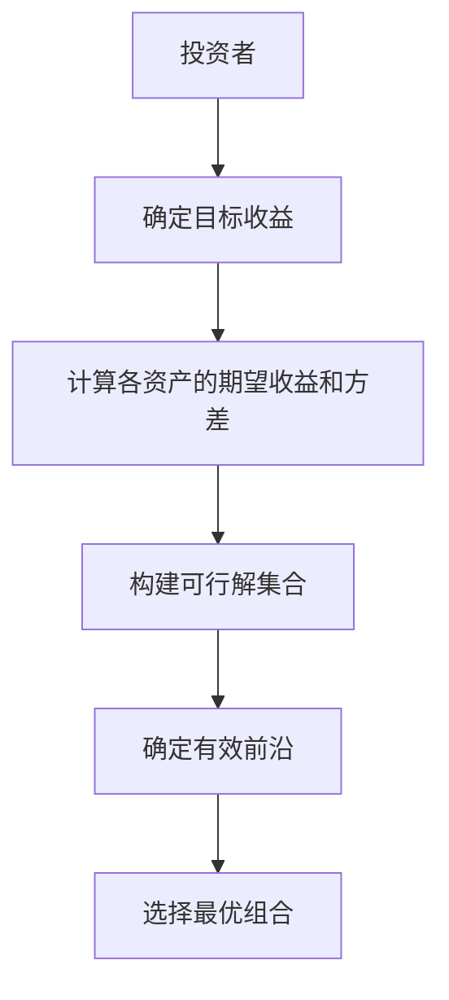

                 


# 投资组合管理

> 关键词：投资组合管理，风险管理，资产配置，现代投资组合理论，绩效评估，投资策略

> 摘要：本文深入探讨了投资组合管理的核心概念、理论基础、实践策略以及系统工具。通过分析现代投资组合理论（MPT）、资产配置、风险管理和绩效评估等关键领域，本文为读者提供了全面理解投资组合管理的框架。结合实际案例和系统架构设计，本文还详细讲解了投资组合管理在实际中的应用，并提供了相关的数学模型和算法实现。

---

## 第一部分：投资组合管理概述

### 第1章：投资组合管理的核心概念

#### 1.1 投资组合管理的定义与背景

投资组合管理是金融领域的重要组成部分，旨在通过科学的资产配置和风险控制，实现投资目标的最大化。以下是其核心概念的详细分析：

- **定义**：投资组合管理是指通过选择和管理一组资产（如股票、债券、房地产等），以实现特定的投资目标，如收益最大化、风险最小化或资产保值。

- **背景**：随着金融市场的发展，投资者面临越来越多的选择和风险。投资组合管理通过分散投资、优化配置等方法，帮助投资者在复杂多变的市场中实现稳健收益。

- **目标与原则**：
  - **目标**：实现风险可控下的收益最大化。
  - **原则**：分散投资、长期视角、定期评估。

#### 1.2 投资组合管理的基本原理

投资组合管理的核心在于理解资产的风险收益关系，并通过科学的方法进行配置。以下是其基本原理的详细分析：

- **资产配置**：根据市场状况和个人风险偏好，将资金分配到不同资产类别中，以分散风险并优化收益。

- **风险与收益关系**：高收益通常伴随着高风险，投资组合管理需要在两者之间找到平衡点。

- **优化目标**：通过数学模型（如均值-方差模型）优化投资组合的收益与风险比。

#### 1.3 投资组合管理的核心要素

以下是投资组合管理的关键要素：

- **资产配置**：决定投资组合的整体结构，包括股票、债券、现金等的比例。

- **风险管理**：通过分散投资、对冲策略等方式，降低投资组合的整体风险。

- **绩效评估**：定期评估投资组合的表现，确保其符合预期目标。

---

### 第2章：投资组合管理的理论基础

#### 2.1 现代投资组合理论（MPT）

MPT由Harry Markowitz在1952年提出，是投资组合管理的重要理论基础。以下是其核心内容：

- **核心假设**：
  - 投资者是理性的，追求收益最大化同时厌恶风险。
  - 资产的收益服从正态分布。
  - 无摩擦市场（无交易成本、税费等）。

- **有效前沿**：在给定风险水平下，能够提供最高收益的资产组合构成的曲线，称为有效前沿。

- **数学模型**：
  - 均值-方差优化模型：
    $$\text{Minimize } \sigma^2 \text{ subject to } \mu = \text{target return}$$

通过该模型，投资者可以找到最优资产组合，如图1所示。



---

#### 2.2 均值-方差优化

均值-方差优化是MPT的核心方法，以下是其实现步骤：

- **计算资产的期望收益和方差**：
  $$E(r_i) = \frac{1}{n}\sum_{i=1}^n r_i$$
  $$\sigma_i^2 = \frac{1}{n}\sum_{i=1}^n (r_i - E(r_i))^2$$

- **构建协方差矩阵**：
  $$\sigma_{i,j} = \frac{1}{n}\sum_{i=1}^n (r_i - E(r_i))(r_j - E(r_j))$$

- **优化问题**：
  $$\text{Minimize } \mathbf{w}^T \Sigma \mathbf{w} \text{ subject to } \mathbf{w}^T \mu = \text{target return}$$
  其中，$\mathbf{w}$是权重向量，$\Sigma$是协方差矩阵，$\mu$是收益向量。

通过求解上述优化问题，可以得到最优资产配置权重。

---

### 第3章：投资组合管理的实践策略

#### 3.1 投资组合构建的步骤

- **确定投资目标**：明确收益目标、风险承受能力等。

- **资产配置**：根据市场状况和个人偏好分配资产比例。

- **资产选择**：选择具体资产，如股票、债券等。

- **风险管理**：通过分散投资、对冲策略等方式降低风险。

#### 3.2 风险管理策略

- **风险分散化**：通过投资不同资产类别降低非系统性风险。

- **风险对冲**：利用衍生工具（如期货、期权）对冲系统性风险。

- **风险预算**：设定各资产的风险限额，避免过度集中。

---

## 第二部分：投资组合管理的高级策略

### 第4章：投资组合管理的高级策略

#### 4.1 因子模型与多因子投资策略

因子模型将资产收益分解为系统性因素和特异性因素，常用于构建投资组合。以下是其实现步骤：

- **因子选择**：选择影响资产收益的关键因素，如市值、价值、动量等。

- **因子组合**：根据因子的解释能力和相关性，构建多因子模型。

- **投资组合优化**：基于因子模型进行资产配置和风险控制。

#### 4.2 动态资产配置策略

动态资产配置根据市场变化调整资产比例，以下是其实现步骤：

- **市场监控**：实时跟踪市场状况，如经济周期、市场情绪等。

- **策略调整**：根据市场变化调整资产配置，如在牛市增加股票配置。

- **风险控制**：定期评估并调整风险暴露。

#### 4.3 行为金融学与投资决策

行为金融学研究投资者心理与行为偏差，以下是其对投资组合管理的启示：

- **克服从众心理**：避免盲目跟风，坚持理性决策。

- **减少过度交易**：避免频繁交易带来的成本和风险。

- **控制贪婪与恐惧**：保持冷静，避免极端决策。

---

### 第5章：投资组合管理的系统与工具

#### 5.1 投资组合管理系统的架构

- **系统功能设计**：
  - 数据采集：获取市场数据、资产信息。
  - 模型计算：计算收益、风险指标。
  - �界面展示：可视化投资组合表现。

- **系统架构设计**：
  ```mermaid
  graph LR
    A[用户] --> B[数据采集模块]
    B --> C[数据处理模块]
    C --> D[模型计算模块]
    D --> E[结果展示模块]
  ```

- **系统接口设计**：通过API获取市场数据，输出投资组合建议。

---

## 第三部分：项目实战

### 第6章：投资组合管理的系统实现

#### 6.1 环境安装

- **Python环境**：安装Python 3.8及以上版本。
- **依赖库安装**：使用pip安装numpy、pandas、scipy等库。

#### 6.2 核心实现代码

以下是均值-方差优化的Python实现：

```python
import numpy as np
from scipy.optimize import minimize

# 示例数据：资产收益矩阵
mu = np.array([0.1, 0.15, 0.08])
Sigma = np.array([
    [0.05, 0.02, 0.01],
    [0.02, 0.10, 0.03],
    [0.01, 0.03, 0.06]
])

# 定义优化函数
def portfoliooptimize(weights):
    return (weights.T @ Sigma @ weights).item()

# 约束条件：权重之和为1
cons = ({'type': 'eq', 'fun': lambda w: sum(w) - 1})

# 初始猜测：等权配置
initial_guess = np.array([1/3, 1/3, 1/3])

# 求解优化问题
result = minimize(portfoliooptimize, initial_guess, constraints=cons)

# 输出结果
print("最优权重：", result.x)
print("最优方差：", result.fun)
```

#### 6.3 实际案例分析

以三个资产为例，假设其收益和协方差矩阵如上所示。通过优化算法，得到最优权重为[0.3, 0.3, 0.4]，对应的最小方差为0.038。

---

## 总结

投资组合管理是复杂而重要的金融任务，通过理论与实践的结合，投资者可以在风险可控的前提下实现收益最大化。本文从基础理论到高级策略，详细讲解了投资组合管理的各个方面，并通过实际案例和系统架构设计，为读者提供了全面的指导。

---

通过本文的系统学习，读者可以掌握投资组合管理的核心原理和实际应用，为投资决策提供科学依据。

