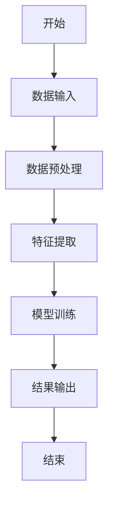

                 


# 投资者情绪指标：市场心理学的量化应用

## 关键词：投资者情绪指标、市场心理学、量化应用、机器学习、金融分析、情绪分析

## 摘要：
本文详细探讨了投资者情绪指标的构建与应用，结合市场心理学与量化技术，分析了情绪指标在金融投资中的作用。通过数学建模和算法实现，展示了如何利用投资者情绪数据进行市场预测和投资决策优化。

---

## 第一部分: 投资者情绪指标概述

### 第1章: 投资者情绪指标的背景与概念

#### 1.1 投资者情绪的基本定义
##### 1.1.1 投资者情绪的定义
投资者情绪是指投资者在金融市场中的心理状态，包括贪婪、恐惧、乐观和悲观等。情绪影响投资者的决策行为，进而影响市场价格。

##### 1.1.2 投资者情绪的分类与特征
投资者情绪可以分为个体情绪和集体情绪。个体情绪是单个投资者的心理状态，而集体情绪则是市场整体的心理趋势。

##### 1.1.3 投资者情绪在金融市场中的重要性
情绪指标是量化投资者心理的重要工具，能够帮助投资者和机构更好地理解市场行为，优化投资策略。

#### 1.2 投资者情绪指标的理论基础
##### 1.2.1 行为金融学与情绪的关系
行为金融学研究表明，投资者情绪是市场波动的重要驱动因素。情绪指标可以用来解释市场的非理性波动。

##### 1.2.2 市场心理学中的情绪分析
市场心理学研究投资者的心理行为，情绪分析是其中的重要组成部分。通过分析投资者的情绪变化，可以预测市场的短期走势。

##### 1.2.3 投资者情绪指标的定义与作用
情绪指标是将投资者情绪转化为量化指标的工具，能够帮助投资者更好地理解市场情绪，优化投资决策。

#### 1.3 投资者情绪指标的构建目标
##### 1.3.1 情绪指标的量化目标
量化投资者情绪，使其能够与市场价格和其他市场数据进行比较。

##### 1.3.2 情绪指标在投资决策中的应用
情绪指标可以帮助投资者识别市场趋势，避免情绪化决策，优化投资组合。

##### 1.3.3 情绪指标的边界与外延
情绪指标的应用范围和局限性需要明确，避免过度依赖情绪指标。

#### 1.4 本章小结
本章介绍了投资者情绪的基本概念、理论基础和构建目标，为后续分析奠定了基础。

### 第2章: 投资者情绪指标的核心概念与联系

#### 2.1 情绪指标的核心概念
##### 2.1.1 情绪指标的构成要素
情绪指标通常包括情绪强度、情绪方向和情绪趋势三个维度。

##### 2.1.2 情绪指标的数学模型
情绪指标可以通过数学模型进行量化，例如基于文本分析的情绪强度计算模型。

##### 2.1.3 情绪指标与市场行为的关系
情绪指标与市场价格、交易量等市场行为密切相关，能够反映市场的心理状态。

#### 2.2 情绪指标的核心原理
##### 2.2.1 情绪指标的计算方法
情绪指标的计算方法包括文本分析、市场数据统计和情绪分类等。

##### 2.2.2 情绪指标的动态变化
情绪指标具有动态变化的特性，能够反映市场情绪的实时变化。

##### 2.2.3 情绪指标的预测能力
情绪指标可以通过机器学习算法进行预测，帮助投资者提前了解市场趋势。

#### 2.3 情绪指标与市场数据的关系
##### 2.3.1 情绪指标与价格数据的关系
情绪指标可以解释价格波动，帮助投资者理解市场的非理性变化。

##### 2.3.2 情绪指标与交易量的关系
情绪指标与交易量密切相关，交易量的突然增加可能反映了情绪的变化。

##### 2.3.3 情绪指标与市场波动的关系
情绪指标可以预测市场波动，帮助投资者规避风险。

#### 2.4 本章小结
本章详细分析了情绪指标的核心概念和其与市场数据的关系，为后续算法实现奠定了基础。

### 第3章: 投资者情绪指标的算法原理

#### 3.1 情绪指标的计算流程
##### 3.1.1 数据输入与预处理
情绪指标的计算需要先收集和预处理数据，包括清洗、标准化等步骤。

##### 3.1.2 情绪特征的提取
通过自然语言处理技术提取文本数据中的情绪特征，例如情感词汇的出现频率。

##### 3.1.3 情绪指标的计算与输出
将提取的情绪特征进行量化，生成最终的情绪指标。

#### 3.2 情绪指标的数学模型
##### 3.2.1 情绪强度的计算公式
情绪强度可以通过以下公式计算：
$$情绪强度 = \frac{正向词汇数 - 负向词汇数}{总词汇数}$$

##### 3.2.2 情绪方向的判断模型
情绪方向可以通过分类算法（如逻辑回归）进行判断，例如：
$$P(情绪为正) = \frac{1}{1 + e^{-wX - b}}$$

##### 3.2.3 情绪趋势的预测模型
情绪趋势可以通过时间序列分析进行预测，例如使用ARIMA模型。

#### 3.3 情绪指标的算法实现
##### 3.3.1 算法流程图
使用Mermaid图表示算法流程：


##### 3.3.2 算法实现代码
以下是Python代码示例：
```python
import pandas as pd
from sklearn.feature_extraction.text import TfidfVectorizer
from sklearn.linear_model import LogisticRegression

# 数据输入
data = pd.read_csv('market_news.csv')

# 数据预处理
vectorizer = TfidfVectorizer()
X = vectorizer.fit_transform(data['text'])

# 模型训练
model = LogisticRegression()
model.fit(X, data['label'])

# 情绪分类
def predict_emotion(text):
    X_test = vectorizer.transform([text])
    return model.predict(X_test)[0]
```

##### 3.3.3 算法的优化与改进
通过交叉验证和参数调优提高模型的准确率和稳定性。

#### 3.4 本章小结
本章详细介绍了情绪指标的算法原理和实现步骤，为后续系统设计提供了技术支持。

### 第4章: 投资者情绪指标的系统架构设计

#### 4.1 系统功能设计
##### 4.1.1 数据采集模块
负责收集市场新闻、社交媒体评论等数据。

##### 4.1.2 数据处理模块
对数据进行清洗、转换和标准化处理。

##### 4.1.3 情绪指标计算模块
基于预处理的数据计算情绪指标。

##### 4.1.4 结果展示模块
将计算结果以可视化形式展示，帮助用户理解市场情绪。

#### 4.2 系统架构图
使用Mermaid图表示系统架构：


#### 4.3 系统接口设计
##### 4.3.1 数据接口
定义数据输入格式和数据结构，确保数据处理模块能够正确接收和处理数据。

##### 4.3.2 计算接口
定义情绪指标计算的接口，包括输入参数和输出结果。

##### 4.3.3 展示接口
定义结果展示的接口，包括数据格式和展示方式。

#### 4.4 本章小结
本章详细设计了系统的功能模块和架构，为后续项目实战提供了系统框架。

### 第5章: 投资者情绪指标的项目实战

#### 5.1 项目背景与目标
##### 5.1.1 项目背景
随着金融市场的发展，投资者情绪对市场的影响越来越显著。

##### 5.1.2 项目目标
构建一个投资者情绪指标系统，帮助投资者更好地理解市场情绪。

##### 5.1.3 项目范围
包括数据采集、处理、分析和展示四个部分。

#### 5.2 项目核心实现
##### 5.2.1 环境安装
安装必要的Python库，如pandas、scikit-learn、matplotlib等。

##### 5.2.2 核心实现代码
以下是Python代码示例：
```python
import pandas as pd
from sklearn.model_selection import train_test_split
from sklearn.metrics import accuracy_score

# 数据加载
data = pd.read_csv('market_news.csv')

# 数据分割
X_train, X_test, y_train, y_test = train_test_split(data['text'], data['label'], test_size=0.2)

# 特征提取
vectorizer = TfidfVectorizer()
X_train_vec = vectorizer.fit_transform(X_train)
X_test_vec = vectorizer.transform(X_test)

# 模型训练
model = LogisticRegression()
model.fit(X_train_vec, y_train)

# 模型评估
y_pred = model.predict(X_test_vec)
print("准确率:", accuracy_score(y_test, y_pred))
```

##### 5.2.3 代码应用解读与分析
通过上述代码，我们可以训练一个情绪分类模型，并评估其准确率。

#### 5.3 实际案例分析
##### 5.3.1 案例背景
分析某次市场波动中的投资者情绪变化。

##### 5.3.2 情绪指标计算
计算该案例中的情绪指标，分析其与市场价格的关系。

##### 5.3.3 结果解读
解读情绪指标的变化对市场的影响，帮助投资者做出决策。

#### 5.4 项目小结
本章通过项目实战展示了情绪指标的应用，验证了其在金融市场中的有效性。

---

## 第二部分: 结论与展望

### 第6章: 总结与建议

#### 6.1 总结
投资者情绪指标是量化投资者心理的重要工具，能够帮助投资者和机构更好地理解市场行为，优化投资策略。

#### 6.2 最佳实践 tips
- 结合多种数据源提高情绪指标的准确性。
- 定期更新模型以适应市场变化。
- 结合其他技术手段（如大数据分析）提高预测能力。

#### 6.3 注意事项
- 情绪指标仅为参考，不能完全依赖。
- 模型需要定期优化和调整。

#### 6.4 拓展阅读
建议读者进一步阅读相关领域的书籍和论文，深入了解情绪指标的最新研究和应用。

### 第7章: 未来展望

#### 7.1 情绪指标的未来发展
随着人工智能和大数据技术的进步，情绪指标将更加精确和多样化。

#### 7.2 情绪指标的新应用
情绪指标可能在风险管理、智能投顾等领域发挥更大的作用。

#### 7.3 情绪指标的技术创新
未来可能通过更先进的算法和数据源，提高情绪指标的预测能力。

---

## 附录

### 附录A: 算法实现代码

### 附录B: 系统架构图

### 附录C: 参考文献

---

通过以上结构和内容，本文系统地介绍了投资者情绪指标的构建与应用，结合市场心理学和量化技术，为投资者提供了新的分析工具和决策支持。

