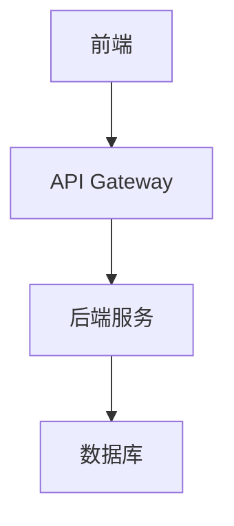
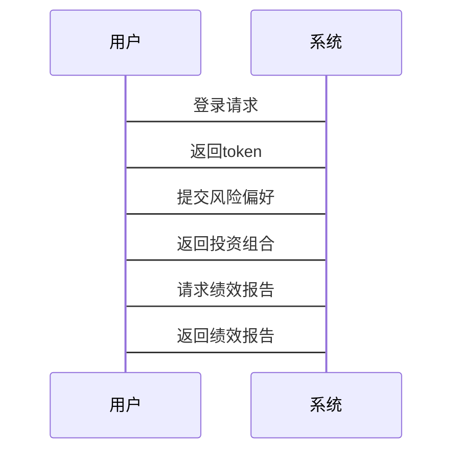

                 


## 第4章：基于风险偏好的投资组合构建算法

### 4.1 风险偏好驱动的投资组合优化

#### 4.1.1 风险偏好驱动的投资组合优化方法
##### 4.1.1.1 风险偏好系数在投资组合优化中的应用
##### 4.1.1.2 基于风险厌恶的均值-方差优化
##### 4.1.1.3 风险调整后的收益最大化

#### 4.1.2 投资组合优化的数学模型
##### 4.1.2.1 风险偏好系数的数学表达
$$ \text{风险偏好系数} = \alpha $$
##### 4.1.2.2 均值-方差优化模型
$$ \text{目标函数：} \min \sigma^2 \text{，在满足} \mu \text{和} \alpha \text{的条件下} $$
##### 4.1.2.3 风险调整后的收益模型
$$ \text{收益} = \mu - \alpha \sigma^2 $$

#### 4.1.3 风险偏好驱动的组合优化步骤
1. 收集资产的历史收益和风险数据
2. 确定投资者的风险偏好系数
3. 应用优化算法计算最优组合
4. 验证组合的有效性

### 4.2 投资组合构建算法实现

#### 4.2.1 算法实现步骤
1. 数据预处理
2. 计算资产协方差矩阵
3. 应用优化算法求解最优组合
4. 验证与调整

#### 4.2.2 Python代码实现
```python
import numpy as np
from scipy.optimize import minimize

def portfolio_optimization(returns, covariance, risk_preference):
    n = len(returns)
    # 定义目标函数
    def objective(weights):
        return np.dot(weights.T, covariance @ weights)
    
    # 约束条件
    constraints = [{'type': 'eq', 'fun': lambda w: np.sum(w) - 1.0}]
    
    # 初始权重
    initial_weights = np.array([1.0/n]*n)
    
    # 最优化问题
    result = minimize(objective, initial_weights, constraints=constraints)
    
    # 计算风险调整后的收益
    adjusted_return = np.dot(result.x, returns) - risk_preference * objective(result.x)
    
    return result.x, adjusted_return

# 示例数据
returns = np.array([0.1, 0.2, 0.15])
covariance = np.array([[0.04, 0.01, 0.005],
                       [0.01, 0.09, 0.002],
                       [0.005, 0.002, 0.05]])
risk_preference = 0.5

weights, adjusted_return = portfolio_optimization(returns, covariance, risk_preference)
print("最优权重:", weights)
print("风险调整后的收益:", adjusted_return)
```

### 4.3 算法优化与验证

#### 4.3.1 算法优化策略
1. 确保数据的准确性
2. 选择合适的优化算法
3. 考虑交易成本和税收

#### 4.3.2 算法验证步骤
1. 回测测试
2. 风险调整后收益的检验
3. 组合有效性的评估

### 4.4 投资组合构建的算法优化

#### 4.4.1 常见优化方法
1. 前面提到的均值-方差优化
2. 风险调整后的收益优化
3. 基于风险偏好的排序优化

#### 4.4.2 优化算法的比较
- 均值-方差优化
- 风险调整后的收益优化
- 基于风险偏好的排序优化

## 第5章：系统分析与架构设计

### 5.1 系统功能设计

#### 5.1.1 系统功能模块
1. 用户管理
2. 风险偏好评估
3. 投资组合优化
4. 绩效评估
5. 报告生成

#### 5.1.2 功能模块描述
- 用户管理：注册、登录、个人信息维护
- 风险偏好评估：问卷调查、数据分析
- 投资组合优化：算法应用、结果输出
- 绩效评估：定期评估、调整建议
- 报告生成：生成报告、导出数据

### 5.2 系统架构设计

#### 5.2.1 系统架构
- 前端：HTML、CSS、JavaScript
- 后端：Python（Django或Flask框架）
- 数据库：MySQL或MongoDB
- 接口：RESTful API

#### 5.2.2 系统架构图（Mermaid）


### 5.3 系统接口设计

#### 5.3.1 接口设计
- `/api/register`
- `/api/login`
- `/api/portfolio_optimizer`
- `/api/performance_report`

#### 5.3.2 接口描述
- 注册接口：接受用户信息，返回token
- 登录接口：验证用户身份，返回token
- 投资组合优化接口：接受用户风险偏好，返回优化后的组合
- 绩效报告接口：返回投资组合的绩效数据

### 5.4 系统交互设计

#### 5.4.1 用户与系统交互流程
1. 用户登录系统
2. 进行风险偏好评估
3. 系统生成投资组合
4. 用户查看绩效报告

#### 5.4.2 交互流程图（Mermaid）


## 第6章：项目实战——个性化投资组合管理系统

### 6.1 项目环境安装

#### 6.1.1 安装Python环境
- 安装Python 3.8+
- 安装Jupyter Notebook

#### 6.1.2 安装必要的库
- `pip install numpy`
- `pip install pandas`
- `pip install matplotlib`
- `pip install scipy`

#### 6.1.3 安装开发框架
- `pip install django` 或 `pip install flask`

### 6.2 核心系统实现

#### 6.2.1 数据收集与处理
- 数据源：Yahoo Finance API
- 数据处理：清洗、格式化

#### 6.2.2 系统功能实现
- 用户登录与注册
- 风险偏好评估
- 投资组合优化
- 绩效报告生成

#### 6.2.3 系统代码实现
```python
from flask import Flask, request, jsonify
import numpy as np
import pandas as pd

app = Flask(__name__)

@app.route('/api/register', methods=['POST'])
def register():
    data = request.json
    # 处理注册逻辑
    return jsonify({'status': 'success', 'message': '注册成功'})

@app.route('/api/portfolio_optimizer', methods=['POST'])
def portfolio_optimizer():
    data = request.json
    returns = data['returns']
    covariance = data['covariance']
    risk_preference = data['risk_preference']
    # 处理优化逻辑
    return jsonify({'weights': weights.tolist(), 'adjusted_return': adjusted_return})

if __name__ == '__main__':
    app.run(debug=True)
```

### 6.3 投资组合优化实现

#### 6.3.1 数据分析与处理
- 数据清洗
- 计算收益和风险

#### 6.3.2 投资组合优化
- 应用优化算法
- 返回优化后的权重

#### 6.3.3 优化结果展示
- 可视化图表
- 表格展示

### 6.4 项目小结

#### 6.4.1 项目实现的关键点
- 系统架构设计
- 数据处理与分析
- 算法实现与优化

#### 6.4.2 项目成果
- 个性化投资组合管理系统
- 投资组合优化算法实现
- 绩效报告生成

## 第7章：总结与展望

### 7.1 总结

#### 7.1.1 核心知识点回顾
- 风险偏好的测量与分类
- 投资组合优化算法
- 个性化投资管理系统构建

#### 7.1.2 实施过程中的关键点
- 系统架构设计
- 数据处理与分析
- 算法实现与优化

### 7.2 项目小结

#### 7.2.1 最佳实践
- 数据清洗的重要性
- 算法选择与优化
- 系统架构设计

#### 7.2.2 项目成果
- 实现了个性化投资组合管理系统
- 提供了风险偏好驱动的投资组合优化算法
- 生成了动态的绩效报告

### 7.3 展望

#### 7.3.1 未来改进方向
- 引入更多数据源
- 增加更多优化算法
- 实现实时监控功能

#### 7.3.2 技术发展趋势
- 人工智能在投资组合优化中的应用
- 大数据驱动的投资决策
- 自动化投资顾问系统

### 7.4 注意事项

#### 7.4.1 风险提示
- 数据来源的可靠性
- 算法的有效性
- 系统的安全性

#### 7.4.2 实施建议
- 数据预处理的重要性
- 算法选择与优化
- 系统架构设计

### 7.5 拓展阅读

#### 7.5.1 推荐书籍
- 《投资学》
- 《Python金融计算》
- 《投资组合管理》

#### 7.5.2 推荐文章
- 《基于机器学习的投资组合优化》
- 《大数据在投资决策中的应用》
- 《个性化投资组合构建的最新进展》

## 附录

### 附录A：常用的数据分析工具

- Python
- R
- SQL

### 附录B：优化算法的详细代码

```python
def portfolio_optimization(returns, covariance, risk_preference):
    n = len(returns)
    def objective(weights):
        return np.dot(weights.T, covariance @ weights)
    
    constraints = [{'type': 'eq', 'fun': lambda w: np.sum(w) - 1.0}]
    initial_weights = np.array([1.0/n]*n)
    
    result = minimize(objective, initial_weights, constraints=constraints)
    
    adjusted_return = np.dot(result.x, returns) - risk_preference * objective(result.x)
    
    return result.x, adjusted_return
```

### 附录C：系统架构图


### 附录D：系统交互流程图


通过以上章节的详细阐述，我们系统地介绍了投资者风险偏好测量与个性化投资组合构建的各个方面，从理论基础到算法实现，再到系统设计和项目实战，为读者提供了全面的知识和实践指导。希望这本书能够帮助投资者更好地理解和应用风险偏好测量，构建适合自己的个性化投资组合。

