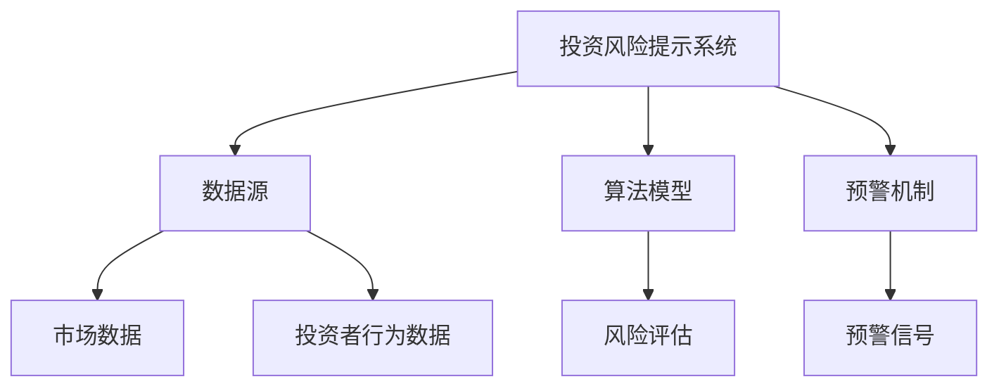

                 

# 投资风险提示系统

## 关键词：投资风险，风险提示，系统架构，数据分析，算法原理，预警机制

## 摘要：投资风险提示系统是一种利用数据分析和算法原理，通过实时监控和预警机制，帮助投资者识别和管理投资风险的智能化系统。本文将详细阐述投资风险提示系统的背景、核心概念、算法原理、系统架构以及实际应用，帮助读者全面理解该系统的构建与运行。

---

## 第一章：投资风险提示系统概述

### 1.1 投资风险的基本概念

#### 1.1.1 投资风险的定义

投资风险是指在投资过程中，由于市场波动、经济环境变化或其他不可预见因素，导致投资收益低于预期或出现损失的可能性。投资风险是投资者在追求收益的过程中不可避免的一部分，需要通过科学的方法进行识别、评估和管理。

#### 1.1.2 投资风险的分类

投资风险可以分为以下几类：

- **市场风险**：由于市场整体波动或经济环境变化引起的资产价格波动风险。
- **流动性风险**：资产在短期内无法以合理价格变现的风险。
- **信用风险**：债券发行人或交易对手方无法履行合同义务的风险。
- **操作风险**：由于操作失误或系统故障导致的投资损失风险。
- **利率风险**：利率变化对固定收益类资产价格的影响风险。

#### 1.1.3 投资风险提示系统的重要性

投资风险提示系统通过实时监控市场数据和投资者行为，利用先进的数据分析和算法模型，提前发现潜在风险并发出预警，帮助投资者做出及时的决策，从而降低投资损失，提高投资收益。

---

### 1.2 问题背景与描述

#### 1.2.1 当前投资市场中的风险挑战

随着金融市场的发展，投资品种日益多样化，投资者面临的市场风险、信用风险等也在不断增加。尤其是在全球化的背景下，经济波动、地缘政治风险等对投资市场的影响更加显著。传统的基于经验的投资决策方式已经难以应对复杂的市场环境，投资者需要更加智能化、自动化的风险管理工具。

#### 1.2.2 投资者面临的常见问题

投资者在实际操作中常常面临以下问题：

1. **信息过载**：市场数据繁多，投资者难以快速获取和处理关键信息。
2. **决策滞后**：传统的人工分析方法耗时较长，无法及时应对市场变化。
3. **风险识别不足**：投资者难以准确识别潜在风险，导致投资损失。
4. **缺乏个性化策略**：不同投资者的风险承受能力和收益目标不同，需要个性化的风险管理方案。

#### 1.2.3 系统解决的思路与方法

投资风险提示系统通过以下方式解决上述问题：

- **实时数据采集与处理**：系统实时采集市场数据，包括股票价格、债券收益率、宏观经济指标等。
- **智能化分析**：利用机器学习算法对数据进行分析，识别潜在风险因素。
- **多维度预警**：根据风险评估结果，通过多维度的预警机制向投资者发出警报。
- **个性化策略建议**：系统根据投资者的个性化需求，提供定制化的风险管理方案。

---

### 1.3 系统的边界与外延

#### 1.3.1 系统的功能边界

投资风险提示系统的主要功能包括：

1. **数据采集与处理**：实时采集市场数据和投资者行为数据。
2. **风险评估**：利用算法模型评估投资组合的风险。
3. **预警机制**：根据风险评估结果，向投资者发出预警。
4. **策略建议**：提供风险管理建议，帮助投资者优化投资组合。

#### 1.3.2 系统的适用范围

投资风险提示系统适用于各类投资者，包括个人投资者、机构投资者以及资产管理公司等。系统可以应用于股票、债券、基金等多种投资品种的风险管理。

#### 1.3.3 系统与相关领域的联系

投资风险提示系统与以下领域密切相关：

- **金融数据分析**：系统依赖于大量的市场数据进行分析。
- **机器学习**：利用机器学习算法对数据进行建模和预测。
- **投资策略**：系统提供的预警和建议为投资者的决策提供支持。
- **风险管理**：系统的最终目标是帮助投资者有效管理投资风险。

---

### 1.4 核心概念与结构

#### 1.4.1 核心要素的组成

投资风险提示系统的核心要素包括：

- **数据源**：市场数据、投资者行为数据等。
- **算法模型**：用于风险评估和预测的机器学习模型。
- **预警机制**：根据模型结果发出预警信号。
- **用户界面**：投资者与系统交互的界面。

#### 1.4.2 系统的逻辑架构

系统的逻辑架构可以分为以下几个层次：

1. **数据采集层**：负责数据的采集和预处理。
2. **算法层**：利用机器学习算法对数据进行分析和建模。
3. **预警层**：根据算法结果生成预警信号。
4. **用户层**：用户通过界面查看预警信息并做出决策。

#### 1.4.3 核心概念的层次结构

以下是一个核心概念的层次结构图：

---

## 第二章：核心概念与原理

### 2.1 风险评估模型

#### 2.1.1 风险评估的基本原理

风险评估是投资风险提示系统的核心任务之一。通过对市场数据和投资者行为数据的分析，系统可以识别潜在风险并评估其影响程度。常见的风险评估方法包括：

- **VaR（Value at Risk）**：衡量投资组合在一定置信水平下的最大可能损失。
- **CVaR（Conditional Value at Risk）**：VaR的改进版本，衡量在VaR水平下的平均损失。

#### 2.1.2 常用的风险评估指标

以下是几种常用的风

