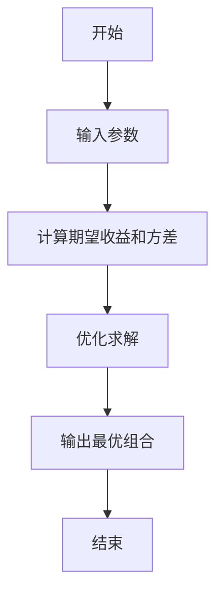

                 


# 拉尔夫·旺格的全天候投资组合理论

> 关键词：投资组合理论、风险调整收益、资产配置、投资组合优化、全天候投资组合、拉尔夫·旺格、数学模型

> 摘要：本文深入探讨了拉尔夫·旺格的全天候投资组合理论，从理论背景到核心概念，从算法原理到系统架构，再到项目实战，全面解析了如何构建和优化全天候投资组合。通过详细分析，本文为读者提供了一个系统化的投资组合管理框架，帮助投资者在不同市场条件下实现稳健收益。

---

## 第1章: 投资组合理论的背景与基础

### 1.1 投资组合理论的起源与发展

#### 1.1.1 投资组合理论的起源
投资组合理论是现代金融学的重要组成部分，起源于20世纪50年代。马科维茨在1952年提出了现代投资组合理论（MPT），奠定了投资组合优化的理论基础。马科维茨的理论认为，投资者可以通过优化资产配置来实现收益与风险的最佳平衡。

#### 1.1.2 投资组合理论的发展历程
随着金融市场的不断发展，投资组合理论也在不断演进。从马科维茨的均值-方差模型，到夏普的资本资产定价模型（CAPM），再到Fama的三因子模型，投资组合理论逐渐从单一资产分析扩展到多资产组合优化。

#### 1.1.3 传统投资组合理论的局限性
尽管传统投资组合理论在理论上取得了巨大成功，但在实际应用中仍然存在一些局限性。例如，传统理论假设资产收益服从正态分布，但在实际市场中，收益往往呈现“肥尾”特征，且存在市场 Crash 等极端情况。

---

### 1.2 拉尔夫·旺格的全天候投资组合理论

#### 1.2.1 旺格投资理论的核心理念
旺格的全天候投资组合理论旨在解决传统投资组合理论在实际应用中的不足。其核心理念是通过构建一个全天候的投资组合，能够在不同市场环境下实现稳健的收益。具体来说，旺格理论强调在极端市场条件下，投资组合的抗风险能力。

#### 1.2.2 旺格投资理论的创新点
相比传统投资组合理论，旺格理论的创新点在于：
1. 强调投资组合在极端市场条件下的表现；
2. 采用多因子模型，综合考虑价值、动量等多维度因素；
3. 引入风险调整收益的概念，优化投资组合的收益与风险比。

#### 1.2.3 旺格投资理论的应用范围
旺格理论广泛应用于机构投资、个人投资以及风险管理领域。其核心思想适用于各类资产配置，包括股票、债券、黄金、房地产等多种资产类别。

---

### 1.3 本书内容框架

#### 1.3.1 本书的核心目标
本书旨在通过系统化的方法，深入分析旺格的全天候投资组合理论，帮助读者掌握投资组合优化的核心原理和实际应用。

#### 1.3.2 本书的章节安排
本书共分为六章，内容安排如下：
- 第1章：介绍投资组合理论的背景与发展；
- 第2章：深入分析全天候投资组合的核心概念；
- 第3章：探讨投资组合优化的算法原理；
- 第4章：详细讲解数学模型与公式；
- 第5章：通过项目实战展示理论的应用；
- 第6章：总结全文并提出进一步思考。

#### 1.3.3 本书的学习方法
建议读者在阅读本书时，结合实际案例进行分析，并尝试通过编程实现相关算法。同时，建议读者在阅读过程中随时回顾相关数学公式，确保对理论的深入理解。

---

## 第2章: 全天候投资组合的核心概念

### 2.1 风险调整收益

#### 2.1.1 风险调整收益的定义
风险调整收益是指在考虑投资组合风险的前提下，调整后的收益。其核心思想是，在相同风险水平下，选择收益更高的投资组合；在相同收益水平下，选择风险更低的投资组合。

#### 2.1.2 风险调整收益的计算方法
风险调整收益可以通过夏普比率来衡量：
$$ \text{夏普比率} = \frac{E(r_i) - r_f}{\sigma_i} $$
其中，\( E(r_i) \) 是资产的期望收益，\( r_f \) 是无风险利率，\( \sigma_i \) 是资产收益的标准差。

#### 2.1.3 风险调整收益与投资决策的关系
风险调整收益是投资决策的重要依据。通过比较不同投资组合的夏普比率，投资者可以做出更优的投资决策。

---

### 2.2 资产配置

#### 2.2.1 资产配置的定义
资产配置是指将投资组合分配到不同的资产类别中，以实现收益与风险的最佳平衡。

#### 2.2.2 资产配置的分类
资产配置可以分为以下几类：
1. 战术性资产配置：根据市场短期变化进行调整；
2. 战略性资产配置：根据长期投资目标进行配置；
3. 保险资产配置：根据风险管理需求进行配置。

#### 2.2.3 资产配置与投资组合绩效的关系
资产配置是影响投资组合绩效的核心因素。通过合理的资产配置，投资者可以在不同市场环境下实现稳健收益。

---

### 2.3 投资组合优化

#### 2.3.1 投资组合优化的定义
投资组合优化是指在给定风险水平下，寻找收益最大的投资组合；或者在给定收益水平下，寻找风险最小的投资组合。

#### 2.3.2 投资组合优化的目标
投资组合优化的目标是最大化收益与风险的比值，即最大化夏普比率。

#### 2.3.3 投资组合优化的约束条件
常见的优化约束条件包括：
1. 投资比例非负；
2. 投资组合的总权重为1；
3. 行业或资产类别权重不超过一定比例。

---

## 第3章: 全天候投资组合的算法原理

### 3.1 投资组合优化的数学模型

#### 3.1.1 均值-方差优化模型
均值-方差优化模型是投资组合优化的基础模型，公式如下：
$$ \text{Minimize } \sigma^2 \text{ subject to } \mu \geq \text{目标收益} $$

其中，\( \sigma^2 \) 是投资组合的方差，\( \mu \) 是投资组合的期望收益。

#### 3.1.2 资本资产定价模型（CAPM）
CAPM模型用于估计资产的期望收益：
$$ E(r_i) = r_f + \beta_i (E(r_m) - r_f) $$

其中，\( \beta_i \) 是资产的贝塔系数，\( E(r_m) \) 是市场期望收益，\( r_f \) 是无风险利率。

#### 3.1.3 风险中性组合模型
风险中性组合模型的目标是在无风险条件下，优化投资组合的收益：
$$ \text{Minimize } \sigma^2 \text{ subject to } \sum w_i = 1 $$

---

### 3.2 投资组合优化的算法实现

#### 3.2.1 贯穿优化算法
贯穿优化算法是一种基于动态规划的投资组合优化方法。其核心思想是通过递归方式，逐步优化投资组合。

#### 3.2.2 最小二乘法优化
最小二乘法优化是一种基于回归分析的投资组合优化方法。其核心思想是通过最小化预测误差的平方和，找到最优资产配置。

#### 3.2.3 遗传算法优化
遗传算法优化是一种基于生物进化思想的投资组合优化方法。其核心步骤包括：
1. 初始化种群；
2. 计算适应度；
3. 选择优秀个体；
4. 进行交叉和变异；
5. 重复迭代。

---

### 3.3 投资组合优化的mermaid流程图



---

## 第4章: 全天候投资组合的数学模型与公式

### 4.1 均值-方差优化模型

#### 4.1.1 均值-方差优化的公式
$$ \text{Minimize } \sigma^2 \text{ subject to } \mu \geq \text{目标收益} $$

---

### 4.2 资本资产定价模型（CAPM）

#### 4.2.1 CAPM的公式
$$ E(r_i) = r_f + \beta_i (E(r_m) - r_f) $$

---

### 4.3 风险中性组合模型

#### 4.3.1 风险中性组合的公式
$$ \text{Minimize } \sigma^2 \text{ subject to } \sum w_i = 1 $$

---

### 4.4 投资组合优化的数学推导

#### 4.4.1 投资组合收益的计算
$$ \text{收益} = \sum w_i r_i $$

其中，\( w_i \) 是资产i的权重，\( r_i \) 是资产i的收益。

---

## 第5章: 项目实战

### 5.1 项目背景

#### 5.1.1 项目目标
本项目旨在通过旺格的全天候投资组合理论，构建一个稳健的投资组合。

#### 5.1.2 项目需求
- 数据采集：获取相关资产的历史收益数据；
- 数据分析：计算资产的期望收益和方差；
- 投资组合优化：基于优化算法，求解最优资产配置。

---

### 5.2 项目实现

#### 5.2.1 环境安装
- Python 3.8+
- NumPy、Pandas、Scipy等库

#### 5.2.2 核心代码实现
```python
import numpy as np
from scipy.optimize import minimize

# 假设returns是各资产的历史收益数组
# weights是资产权重的初始值

# 定义目标函数
def objective(weights, returns):
    return -np.mean(weights * returns)  # 最大化收益

# 定义约束条件
def constraint(weights):
    return np.sum(weights) - 1  # 权重和为1

# 求解优化问题
cons = {'type': 'eq', 'fun': constraint}
bounds = [(0, 1) for _ in range(len(weights))]

result = minimize(objective, weights, constraints=cons, bounds=bounds)
optimal_weights = result.x
```

---

### 5.3 项目小结

#### 5.3.1 项目成果
通过本项目，我们成功构建了一个基于旺格理论的投资组合优化模型，并通过代码实现优化过程。

#### 5.3.2 经验总结
在实际应用中，需要注意数据的准确性和模型的可解释性。此外，还需要结合市场实际情况，动态调整投资组合。

---

## 第6章: 总结与展望

### 6.1 全文总结
本文系统地介绍了拉尔夫·旺格的全天候投资组合理论，从理论基础到算法实现，再到项目实战，为读者提供了全面的知识体系。

### 6.2 进一步思考
未来的研究方向可以包括：
1. 多目标优化在投资组合中的应用；
2. 机器学习在投资组合优化中的应用；
3. 区块链技术在投资组合管理中的应用。

---

### 6.3 注意事项
在实际投资中，建议投资者结合市场实际情况，灵活调整投资策略。同时，需要定期评估和优化投资组合，以应对市场变化。

---

### 6.4 拓展阅读
推荐读者阅读以下书籍和论文：
1. 《投资学》——教材推荐；
2. 《投资组合优化的数学方法》——学术推荐；
3. 《机器学习与投资组合管理》——技术推荐。

---

通过本文的系统学习，读者可以全面掌握拉尔夫·旺格的全天候投资组合理论，并能够在实际投资中灵活应用这些理论和方法。

