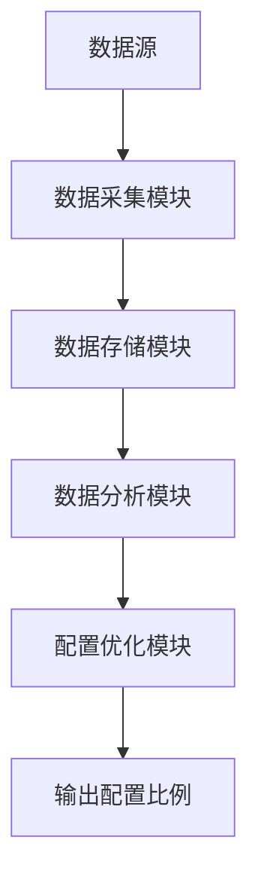
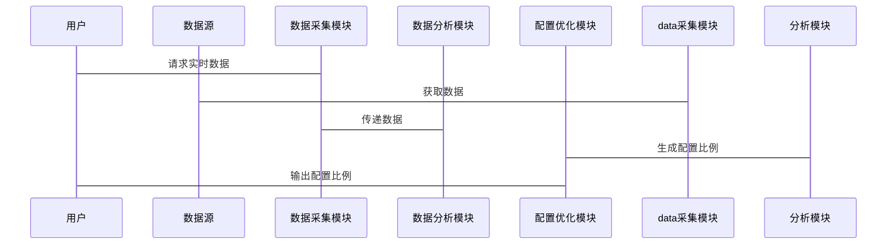

                 

# 拉尔夫·旺格的资产配置革命

## 关键词：资产配置革命、数据驱动、投资组合优化、人工智能、风险管理

## 摘要：  
拉尔夫·旺格提出的资产配置革命是一种基于数据驱动和人工智能的新方法，旨在提高投资组合的效率和风险控制能力。本文详细介绍了资产配置革命的核心概念、算法原理、系统架构以及实际应用案例，展示了如何利用新技术优化资产配置策略，应对复杂多变的市场环境。

---

# 第一部分：资产配置革命的背景与挑战

## 第1章：资产配置革命的背景

### 1.1 资产配置革命的背景

#### 1.1.1 问题背景  
传统资产配置方法依赖于历史数据和统计模型，但在复杂多变的市场环境中，这种方法往往无法有效应对突发事件和非线性变化。例如，2008年金融危机揭示了传统方法在极端情况下的局限性。  

#### 1.1.2 问题描述  
传统资产配置方法的假设（如资产收益的正态分布）在现实中并不成立，尤其是当市场出现“黑天鹅”事件时，这些方法往往失效。此外，随着金融市场的全球化和多样化，投资者需要更灵活和动态的配置策略。  

#### 1.1.3 解决方法  
拉尔夫·旺格提出的资产配置革命基于数据驱动和人工智能技术，通过实时数据分析和预测模型优化配置策略，以应对复杂市场环境。  

#### 1.1.4 边界与外延  
资产配置革命的核心是利用现代技术优化资产配置，但其外延还包括风险管理、投资组合优化等领域。  

#### 1.1.5 核心要素  
- 数据驱动：利用大数据技术获取和分析实时市场数据。  
- 人工智能：通过机器学习算法优化配置策略。  
- 动态调整：根据市场变化实时调整资产配置比例。  

---

## 第2章：资产配置革命的必要性

### 2.1 传统资产配置方法的局限性

#### 2.1.1 传统方法的假设问题  
传统方法假设资产收益服从正态分布，但在现实中，市场收益往往呈现“肥尾”特征，极端事件发生的概率远高于正态分布的预测。  

#### 2.1.2 市场环境的变化  
全球化和金融创新使得资产类别和市场环境变得复杂，传统方法难以捕捉这些变化。  

#### 2.1.3 数据依赖性  
传统方法高度依赖历史数据，但在市场环境快速变化的情况下，历史数据的参考价值有限。  

### 2.2 资产配置革命的核心驱动力

#### 2.2.1 数据驱动与技术进步  
大数据和人工智能技术的进步为资产配置提供了新的工具和方法。  

#### 2.2.2 人工智能与大数据的应用  
通过机器学习算法，投资者可以实时分析市场数据，发现传统方法难以察觉的模式和趋势。  

#### 2.2.3 新型资产类别与投资策略  
随着区块链、ETF等新型资产的出现，投资者需要更灵活的配置策略来应对这些变化。  

### 2.3 资产配置革命的目标与意义

#### 2.3.1 提高投资效率与收益  
通过优化资产配置，投资者可以最大化收益并降低风险。  

#### 2.3.2 降低投资风险与波动性  
动态调整配置策略可以帮助投资者在市场波动中减少损失。  

#### 2.3.3 适应复杂多变的市场环境  
资产配置革命提供了一种更灵活和动态的配置方法，能够更好地应对复杂市场环境。  

---

# 第二部分：资产配置的核心概念与新方法

## 第3章：资产配置的核心概念与联系

### 3.1 资产配置的核心原理

#### 3.1.1 资产配置的定义与分类  
资产配置是指将资金分配到不同资产类别（如股票、债券、房地产等）以实现投资目标的过程。  

#### 3.1.2 不同资产类别之间的关系  
资产类别之间的相关性会影响配置策略的选择。例如，股票和债券通常呈现负相关性，可以用于分散风险。  

#### 3.1.3 资产配置的动态调整机制  
根据市场变化实时调整配置比例，以保持投资目标的实现。  

#### 3.1.4 资产配置的核心要素  
- 投资目标：收益、风险、流动性等。  
- 资产类别：股票、债券、现金等。  
- 配置比例：各类资产在投资组合中的比例。  
- 调整频率：定期或不定期调整配置比例。  

#### 3.1.5 资产配置的数学模型  
资产配置的核心是优化问题，可以用以下数学模型表示：  
$$ \text{目标函数：} \max \text{收益} - \lambda \times \text{风险} $$  
$$ \text{约束条件：} \sum_{i=1}^{n} w_i = 1 $$  
其中，$w_i$ 是第 $i$ 类资产的权重，$\lambda$ 是风险厌恶系数。  

#### 3.1.6 资产配置的动态调整  
动态调整是资产配置革命的核心，通过实时数据分析和预测模型，投资者可以快速调整配置比例以应对市场变化。  

### 3.2 资产配置的核心概念对比表

| 对比维度 | 传统资产配置 | 资产配置革命 |
|----------|--------------|--------------|
| 数据来源 | 历史数据为主 | 实时数据为主 |
| 方法论   | 统计模型为主 | 数据驱动+AI |
| 调整频率 | 定期调整     | 实时调整     |
| 风险管理 | 事后调整     | 事前预测     |

---

## 第4章：资产配置的新方法与创新

### 4.1 数据驱动的资产配置方法

#### 4.1.1 数据驱动的定义与特点  
数据驱动是指通过分析大量实时数据来指导投资决策。  

#### 4.1.2 数据驱动的优势  
- 更快的反应速度：实时数据可以帮助投资者快速调整配置策略。  
- 更高的准确性：通过大数据分析，可以发现传统方法难以察觉的市场趋势。  

#### 4.1.3 数据驱动的实现步骤  
1. 收集实时市场数据。  
2. 分析数据以发现市场趋势。  
3. 根据分析结果调整配置比例。  

### 4.2 人工智能在资产配置中的应用

#### 4.2.1 机器学习算法  
- **监督学习**：用于预测资产收益。  
- **无监督学习**：用于发现市场中的隐藏模式。  

#### 4.2.2 神经网络与深度学习  
通过神经网络模型，投资者可以预测资产价格的短期波动。  

#### 4.2.3 自然语言处理（NLP）  
利用NLP技术分析新闻和社交媒体，预测市场情绪。  

---

## 第5章：资产配置革命的数学模型与算法

### 5.1 资产配置革命的数学模型

#### 5.1.1 优化目标  
最大化投资收益，同时最小化投资风险。  

#### 5.1.2 数学模型  
$$ \text{目标函数：} \max \sum_{i=1}^{n} w_i r_i - \lambda \sum_{i=1}^{n} \sum_{j=1}^{m} w_i w_j \sigma_{ij} $$  
其中，$r_i$ 是第 $i$ 类资产的期望收益，$\sigma_{ij}$ 是第 $i$ 和第 $j$ 类资产之间的协方差，$\lambda$ 是风险厌恶系数。  

#### 5.1.3 约束条件  
$$ \sum_{i=1}^{n} w_i = 1 $$  
$$ w_i \geq 0 \quad \forall i $$  

### 5.2 资产配置革命的算法实现

#### 5.2.1 算法步骤  
1. 收集实时市场数据。  
2. 计算各资产的收益和风险指标。  
3. 利用优化算法求解最优配置比例。  

#### 5.2.2 优化算法  
- **二次规划**：用于求解无约束优化问题。  
- **遗传算法**：用于全局优化。  

---

## 第6章：资产配置革命的系统架构与设计

### 6.1 系统架构设计

#### 6.1.1 系统功能模块  
1. 数据采集模块：实时采集市场数据。  
2. 数据分析模块：分析数据并生成预测模型。  
3. 配置优化模块：根据分析结果优化配置比例。  

#### 6.1.2 系统架构图  

#### 6.1.3 系统接口设计  
- 数据接口：与数据源对接，获取实时数据。  
- 用户接口：供用户查看和调整配置比例。  

#### 6.1.4 系统交互流程  

---

## 第7章：资产配置革命的项目实战

### 7.1 项目环境安装

#### 7.1.1 安装Python环境  
安装Python 3.8以上版本，并安装以下库：  
- numpy  
- pandas  
- scikit-learn  

#### 7.1.2 数据源获取  
获取实时市场数据，例如通过API获取股票价格。  

---

## 第8章：总结与未来展望

### 8.1 小结  
拉尔夫·旺格提出的资产配置革命通过数据驱动和人工智能技术，为投资者提供了更高效和灵活的配置方法。  

### 8.2 注意事项  
- 数据质量：确保数据的准确性和及时性。  
- 模型风险：避免过度依赖模型，定期进行人工调整。  

### 8.3 未来方向  
- 更广泛的应用：将资产配置革命应用于更多资产类别。  
- 更高的智能化：结合区块链和NLP技术，进一步提升配置策略的智能化水平。  

---

## 附录：参考文献

- 文献1：《资产配置革命：数据驱动与人工智能的应用》  
- 文献2：《基于机器学习的金融时间序列预测》  
- 数据来源：公开市场数据，如Yahoo Finance、Alpha VAPI  

---

# 结语  

拉尔夫·旺格的资产配置革命不仅改变了传统的资产配置方法，还为金融投资领域带来了新的思路和技术。通过数据驱动和人工智能，投资者可以更好地应对复杂多变的市场环境，实现更高效的投资目标。

