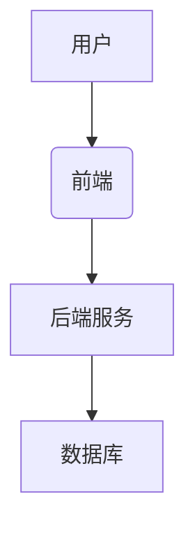

                 


# 持续集成与部署：AI Agent的开发流程优化

---

## 关键词：持续集成、持续部署、AI Agent、CI/CD管道、自动化测试、版本控制、系统架构

---

## 摘要：  
本文将深入探讨持续集成与部署在AI Agent开发中的应用，分析其核心概念、算法原理、系统架构设计以及项目实战，帮助读者理解如何通过优化开发流程来提高AI Agent的开发效率和质量。文章结合理论与实践，详细阐述了从代码提交到自动化测试、构建、部署的完整流程，并通过具体的代码示例和系统架构图，展示了如何实现高效的CI/CD流程。

---

# 第1章: 持续集成与部署概述

## 1.1 持续集成与部署的定义与背景

持续集成（CI）是一种软件开发实践，通过频繁地将代码合并到主分支，并自动进行构建、测试和验证，以确保代码的健康性。持续部署（CD）则是在CI的基础上，将代码自动部署到生产环境或其他指定的环境。两者的结合能够显著提高开发效率，减少集成风险。

AI Agent（人工智能代理）是一种能够感知环境、自主决策并执行任务的智能体。随着AI技术的快速发展，AI Agent的应用场景越来越广泛，例如智能助手、自动驾驶、智能客服等。然而，AI Agent的开发涉及复杂的算法实现、数据处理和系统集成，开发流程的优化显得尤为重要。

### 1.1.1 持续集成的起源与演变

持续集成的起源可以追溯到20世纪90年代，随着敏捷开发的兴起，CI逐渐成为一种重要的开发实践。早期的CI主要依赖于工具如Jenkins、Travis CI等，通过自动化脚本来实现代码的构建和测试。随着云计算和容器化技术的发展，CI/CD流程逐渐扩展到部署阶段，形成了完整的CI/CD管道。

### 1.1.2 持续部署的核心理念

持续部署的核心理念是通过自动化流程将代码从开发环境逐步部署到生产环境。与传统部署方式相比，持续部署能够显著减少人工干预，提高部署效率和稳定性。通过蓝绿部署、金丝雀部署等策略，可以有效降低部署风险。

### 1.1.3 AI Agent在持续集成与部署中的作用

AI Agent的开发涉及算法实现、数据处理和系统集成等多个环节。通过持续集成与部署，可以将AI Agent的开发流程自动化，确保每次代码提交都能经过严格的测试和验证，从而提高代码质量。同时，自动化部署能够快速将AI Agent交付到目标环境，加速产品迭代。

---

## 1.2 AI Agent的定义与特点

### 1.2.1 AI Agent的基本概念

AI Agent是一种智能体，能够感知环境、自主决策并执行任务。它可以基于规则、基于模型或基于学习的方式进行决策，具有感知能力、决策能力和执行能力。

### 1.2.2 AI Agent的核心功能与优势

- **感知能力**：通过传感器、API等方式获取环境信息。
- **决策能力**：基于感知的信息，通过算法进行决策。
- **执行能力**：通过执行器将决策结果转化为具体行动。
- **自适应能力**：能够根据环境变化动态调整行为。

### 1.2.3 AI Agent与传统软件开发的区别

AI Agent的开发不仅仅是代码的编写，还需要涉及模型训练、数据处理、算法优化等环节。与传统软件开发相比，AI Agent的开发更加复杂，且需要处理大量的不确定性。

---

## 1.3 持续集成与部署的流程与优势

### 1.3.1 持续集成的基本流程

1. **代码提交**：开发人员将代码提交到版本控制系统（如Git）。
2. **触发构建**：CI工具（如Jenkins）自动获取代码并进行构建。
3. **运行测试**：执行单元测试、集成测试和端到端测试。
4. **反馈结果**：测试结果通过邮件或消息通知开发人员。

### 1.3.2 持续部署的关键步骤

1. **构建镜像**：将代码打包成容器镜像（如Docker镜像）。
2. **部署到测试环境**：将镜像部署到测试环境，进行功能验证。
3. **蓝绿部署**：通过蓝绿部署策略将代码部署到生产环境，逐步 rollout。
4. **监控与回滚**：监控部署后的系统状态，发现异常立即回滚。

### 1.3.3 持续集成与部署的优势

- **快速反馈**：通过自动化测试，开发人员能够快速发现问题。
- **减少风险**：通过小步快跑的方式，降低集成和部署的风险。
- **提高效率**：自动化流程显著减少了人工干预，提高了开发效率。

---

## 1.4 本章小结

本章介绍了持续集成与部署的基本概念，以及AI Agent的定义和特点。通过对比传统软件开发，强调了AI Agent开发流程的复杂性和对自动化工具的需求。接下来的章节将详细探讨持续集成与部署的核心概念、算法原理、系统架构设计和项目实战。

---

# 第2章: 持续集成与部署的核心概念

## 2.1 CI/CD管道的原理与架构

### 2.1.1 CI/CD管道的定义

CI/CD管道是指从代码提交到最终部署的完整流程，包括构建、测试、验证、部署等多个阶段。通过管道的定义，可以将复杂的流程自动化，减少人工干预。

### 2.1.2 管道的核心组件与功能

- **源代码管理**：从版本控制系统获取代码。
- **构建与测试**：执行编译、单元测试、集成测试。
- **验证与审批**：通过自动化验证或人工审批决定是否继续部署。
- **部署**：将代码部署到指定环境。

### 2.1.3 管道的配置与管理

CI/CD管道的配置通常通过YAML文件实现，例如Jenkins pipeline、GitHub Actions等。通过配置文件，可以灵活定义管道的各个阶段。

### 2.1.4 管道的实现示例

以下是Jenkins pipeline的实现示例：

```yaml
pipeline {
    stages {
        stage('Build') {
            steps {
                sh 'mvn clean install'
            }
        }
        stage('Test') {
            steps {
                sh 'mvn test'
            }
        }
        stage('Deploy') {
            steps {
                sh 'mvn clean deploy'
            }
        }
    }
}
```

---

## 2.2 自动化测试的实现与优化

### 2.2.1 自动化测试的分类

- **单元测试**：测试单个函数或方法的行为。
- **集成测试**：测试模块之间的接口和协作。
- **端到端测试**：测试整个系统的流程和用户体验。

### 2.2.2 测试用例的设计与管理

测试用例的设计需要覆盖各种场景，包括正常流程、异常流程和边界条件。测试用例的管理可以通过测试框架（如JUnit、TestNG）实现。

### 2.2.3 测试覆盖率的计算与优化

测试覆盖率是衡量代码测试程度的重要指标，通常包括行覆盖率、方法覆盖率和分支覆盖率。通过工具如JaCoCo可以计算测试覆盖率，并根据结果优化测试用例。

---

## 2.3 版本控制与分支管理

### 2.3.1 Git的使用与分支策略

Git是目前最流行的版本控制系统，常用的分支策略包括Git Flow、GitHub Flow和Trunk-Based Development。通过合理的分支策略，可以避免代码冲突和混乱。

### 2.3.2 合并请求与代码审查

在分支开发完成后，通过合并请求（Pull Request）将代码合并到主分支，并通过代码审查（Code Review）确保代码质量。

### 2.3.3 分支模型的最佳实践

- **主分支**：通常是`main`或`master`分支，代表项目的最新稳定版本。
- **功能分支**：每个功能开发使用独立的分支，命名清晰，如`feature/task-id`。
- **修复分支**：用于修复主分支的bug，命名如`hotfix/task-id`。

---

## 2.4 本章小结

本章详细介绍了CI/CD管道的原理与架构，自动化测试的实现与优化，以及版本控制与分支管理的最佳实践。通过合理配置管道和优化测试策略，可以显著提高开发效率和代码质量。

---

# 第3章: 持续集成与部署的算法原理与数学模型

## 3.1 CI/CD管道的自动化流程

### 3.1.1 管道的阶段划分与任务分配

CI/CD管道通常分为开发、测试、验证和部署四个阶段。每个阶段的任务需要合理分配，确保流程高效运行。

### 3.1.2 任务队列的调度与执行

任务队列的调度需要考虑资源利用率和任务优先级。通过排队论（Queueing Theory）可以优化任务调度策略。

### 3.1.3 状态跟踪与反馈机制

通过状态跟踪，可以实时监控管道的执行状态，并根据结果反馈给开发人员。

---

## 3.2 自动化测试的算法实现

### 3.2.1 测试用例的生成算法

测试用例的生成可以通过随机测试、覆盖测试和边界测试等多种方法实现。随机测试可以通过随机生成输入数据来发现潜在的bug，覆盖测试则通过覆盖所有可能的路径来确保测试全面性。

### 3.2.2 测试执行的并行化策略

通过并行化测试可以显著减少测试时间。并行化策略需要考虑测试之间的依赖关系和资源限制。

### 3.2.3 测试结果的分析与报告生成

测试结果的分析需要考虑通过率、失败率和错误率。通过工具生成测试报告，并提供详细的错误信息和堆栈跟踪。

---

## 3.3 版本控制的数学模型

### 3.3.1 分支与合并的数学模型

分支与合并的数学模型可以通过图论来描述，其中每个分支可以看作图中的一个节点，合并操作则是将节点合并。

### 3.3.2 合并冲突的解决算法

合并冲突的解决可以通过比较每个文件的版本差异，并选择合适的版本进行合并。这可以通过合并算法（如三向合并）实现。

### 3.3.3 版本历史的记录与分析

版本历史的记录可以通过Git的提交历史来实现。通过分析提交历史，可以了解项目的开发趋势和问题分布。

---

## 3.4 本章小结

本章通过算法原理和数学模型，详细探讨了CI/CD管道的自动化流程和测试策略。通过合理配置和优化，可以显著提高开发效率和代码质量。

---

# 第4章: 持续集成与部署的系统架构与设计方案

## 4.1 系统功能设计

### 4.1.1 系统功能模块划分

系统功能模块通常包括代码管理、构建与测试、部署与监控等功能模块。

### 4.1.2 功能模块的交互流程

功能模块的交互流程需要清晰明了，确保各个模块协同工作。

### 4.1.3 功能模块的实现方式

功能模块的实现方式需要考虑技术选型和实现细节。

---

## 4.2 系统架构设计

### 4.2.1 分层架构设计

分层架构设计将系统划分为表现层、业务逻辑层和数据访问层。每一层都有明确的职责和接口。

### 4.2.2 微服务架构设计

微服务架构设计将系统分解为多个独立的服务，每个服务负责特定的功能。

### 4.2.3 系统扩展性设计

系统扩展性设计需要考虑横向扩展和纵向扩展的方式，确保系统能够应对高并发和大规模数据的挑战。

---

## 4.3 系统接口设计

### 4.3.1 接口定义与规范

系统接口需要定义清晰的接口规范，包括接口名称、输入参数、输出参数和错误处理。

### 4.3.2 接口的调用流程

接口的调用流程需要考虑调用顺序和依赖关系。

### 4.3.3 接口的安全性设计

接口的安全性设计需要考虑身份认证、权限控制和数据加密。

---

## 4.4 系统交互设计

### 4.4.1 用户与系统的交互流程

用户与系统的交互流程需要考虑用户体验和操作流程。

### 4.4.2 系统内部组件的交互流程

系统内部组件的交互流程需要确保各组件协同工作。

### 4.4.3 交互

---

## 4.5 系统架构图

以下是系统的架构图：



---

## 4.6 本章小结

本章详细介绍了系统的功能设计、架构设计和接口设计。通过合理设计系统架构，可以确保系统的可扩展性和可维护性。

---

# 第5章: 持续集成与部署的项目实战

## 5.1 环境安装与配置

### 5.1.1 安装Jenkins

Jenkins的安装可以通过官网下载安装包，或者使用Docker容器安装。

### 5.1.2 安装Git

Git的安装可以通过官网下载安装包，或者使用brew（Mac）或包管理器（Linux）安装。

### 5.1.3 安装Maven

Maven的安装可以通过官网下载安装包，或者使用brew（Mac）或包管理器（Linux）安装。

---

## 5.2 核心代码实现

### 5.2.1 Jenkins pipeline的实现

以下是Jenkins pipeline的实现示例：

```groovy
pipeline {
    stages {
        stage('Build') {
            steps {
                sh 'mvn clean install'
            }
        }
        stage('Test') {
            steps {
                sh 'mvn test'
            }
        }
        stage('Deploy') {
            steps {
                sh 'mvn clean deploy'
            }
        }
    }
}
```

### 5.2.2 测试用例的实现

以下是JUnit测试用例的实现示例：

```java
import org.junit.jupiter.api.Test;
import static org.junit.jupiter.api.Assertions.*;

class MyTest {
    @Test
    void testExample() {
        assertEquals(2, 1 + 1);
    }
}
```

---

## 5.3 代码应用解读与分析

### 5.3.1 代码解读

通过解读代码，可以了解系统的实现细节和设计思路。

### 5.3.2 代码分析

通过代码分析，可以发现潜在的问题和优化点。

---

## 5.4 实际案例分析

### 5.4.1 案例背景

通过实际案例分析，可以了解持续集成与部署在实际项目中的应用。

### 5.4.2 案例实现

通过具体实现，可以验证持续集成与部署的效果。

---

## 5.5 项目小结

本章通过项目实战，详细讲解了环境安装、代码实现和案例分析。通过实际操作，读者可以更好地理解和掌握持续集成与部署的实现方法。

---

# 第6章: 总结与展望

## 6.1 总结

本文详细探讨了持续集成与部署在AI Agent开发中的应用，通过理论与实践的结合，展示了如何优化开发流程。通过合理配置CI/CD管道、优化测试策略和设计系统架构，可以显著提高开发效率和代码质量。

## 6.2 展望

随着AI技术的不断发展，持续集成与部署在AI Agent开发中的应用将更加广泛。未来，需要进一步研究如何将AI技术应用于CI/CD流程中，例如通过机器学习优化测试用例生成和自动化部署策略。

---

# 结束语

通过本文的讲解，读者可以全面了解持续集成与部署的核心概念和实现方法。希望本文能够为AI Agent的开发流程优化提供有价值的参考和指导。

