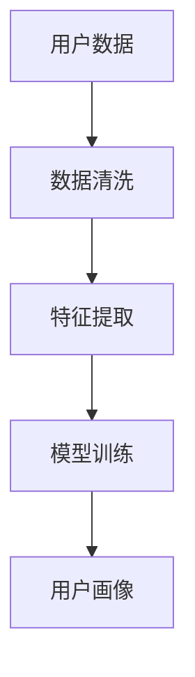
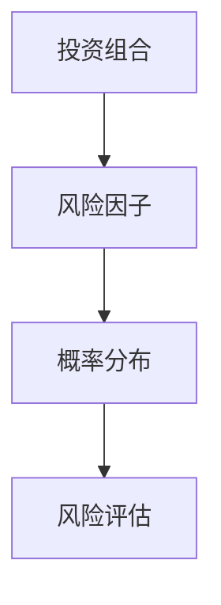
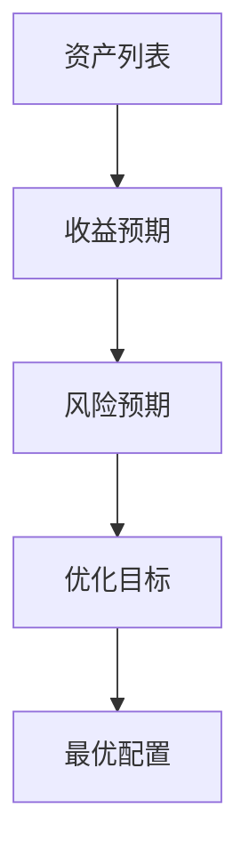
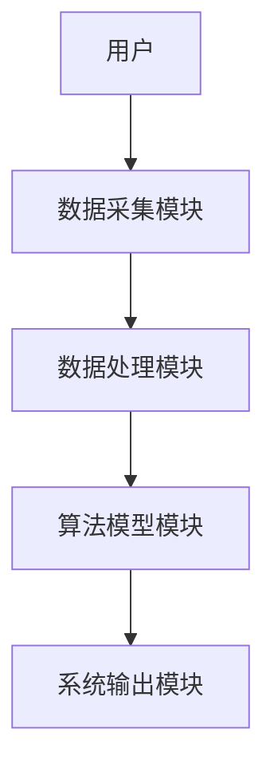
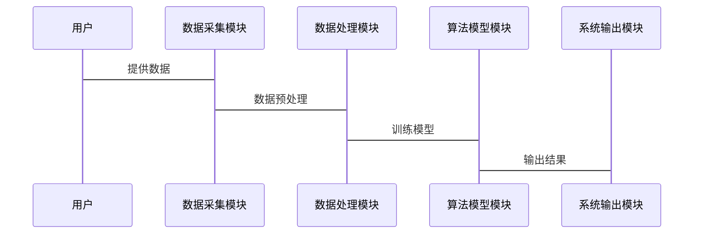

                 


# 第一部分: 下一代投资理财智能助手的发展背景与核心概念

# 第1章: 投资理财智能助手的背景与问题背景

## 1.1 投资理财智能助手的背景

### 1.1.1 传统投资理财的局限性

传统投资理财主要依赖人工分析和经验判断，存在以下局限性：
1. **信息不对称**：普通投资者难以获取专业机构投资者的资源和信息。
2. **决策延迟**：人工分析耗时较长，难以及时捕捉市场机会。
3. **人为情绪影响**：投资者的贪婪和恐惧会导致非理性决策。
4. **成本高昂**：高端投顾服务通常只面向高净值客户，普通投资者难以负担。

### 1.1.2 人工智能技术在金融领域的应用

人工智能技术的快速发展为投资理财领域带来了革命性的变化：
1. **数据处理能力**：AI能够快速处理海量数据，发现隐藏的模式和趋势。
2. **自动化决策**：通过算法模型实现自动化投资决策，提高效率。
3. **个性化服务**：AI可以根据用户的财务状况和风险偏好，提供个性化的投资建议。

### 1.1.3 智能投顾的概念与现状

智能投顾是一种基于人工智能技术的投资顾问服务，通过算法模型为用户提供个性化的投资建议。目前，智能投顾已经在财富管理、风险管理等领域得到了广泛应用，并取得了显著的成效。

## 1.2 问题背景与问题描述

### 1.2.1 投资者面临的痛点

1. **信息过载**：投资者面对海量的信息，难以快速筛选和分析。
2. **决策不确定性**：市场波动大，投资者难以准确预测市场走势。
3. **缺乏个性化建议**：传统投顾服务往往缺乏针对性，难以满足不同投资者的需求。

### 1.2.2 传统投顾服务的不足

1. **服务成本高**：传统投顾服务通常针对高净值客户，普通投资者难以获得专业服务。
2. **服务效率低**：人工分析耗时长，难以快速响应客户需求。
3. **缺乏数据支持**：传统投顾服务依赖经验判断，缺乏数据支持。

### 1.2.3 智能投顾的核心问题

智能投顾的核心问题是如何通过AI技术，实现个性化、自动化、高效的投资顾问服务，解决投资者在信息获取、决策支持和风险管理方面的痛点。

## 1.3 问题解决与边界定义

### 1.3.1 智能投顾的解决方案

智能投顾通过以下方式解决问题：
1. **数据驱动**：利用大数据分析技术，为投资者提供精准的市场分析。
2. **算法优化**：通过机器学习算法，实现个性化的投资组合优化。
3. **实时监控**：利用实时数据监控市场变化，及时调整投资策略。

### 1.3.2 边界与外延

智能投顾的边界在于其服务范围和功能限制：
1. **服务范围**：主要针对个人投资者，提供财富管理、资产配置等服务。
2. **功能限制**：无法完全替代人类的投资决策，仍需结合人工判断。

### 1.3.3 核心要素与组成

智能投顾的核心要素包括：
1. **数据源**：包括市场数据、用户数据等。
2. **算法模型**：包括用户画像、资产配置、风险评估等算法。
3. **交互界面**：用户与系统交互的界面，提供个性化的投资建议。

# 第2章: 下一代投资理财智能助手的核心概念与联系

## 2.1 核心概念原理

### 2.1.1 用户画像与需求分析

用户画像是智能投顾服务的核心，通过对用户的行为数据、财务数据等进行分析，构建用户的画像，从而更好地理解用户的需求。

### 2.1.2 资产配置与风险评估

资产配置是智能投顾的重要组成部分，通过分析用户的财务状况、风险承受能力等，制定最优的资产配置方案。

### 2.1.3 智能推荐与动态调整

智能推荐是智能投顾的核心功能，通过算法模型为用户提供个性化的投资建议，并根据市场变化动态调整投资组合。

## 2.2 核心概念的属性特征对比

### 2.2.1 用户画像的特征对比

| 特征 | 描述 |
|------|------|
| 数据来源 | 行为数据、财务数据、市场数据等 |
| 数据类型 | 结构化数据、非结构化数据 |
| 数据处理 | 数据清洗、特征提取、模型训练 |

### 2.2.2 资产配置的特征对比

| 特征 | 描述 |
|------|------|
| 配置目标 | 最大化收益、最小化风险 |
| 配置策略 | 均衡配置、集中配置、动态调整 |
| 配置工具 | 基金、股票、债券等 |

### 2.2.3 智能推荐的特征对比

| 特征 | 描述 |
|------|------|
| 推荐算法 | 基于协同过滤、基于内容的推荐、基于模型的推荐 |
| 推荐策略 | 静态推荐、动态推荐、个性化推荐 |
| 推荐效果 | 准确性、多样性、可解释性 |

## 2.3 ER实体关系图

```mermaid
er
  actor: 用户
  actor: 投资顾问系统
  actor: 资产管理平台
  actor: 数据源
  relation: 用户画像
  relation: 资产配置
  relation: 风险评估
  relation: 智能推荐
```

# 第3章: 下一代投资理财智能助手的算法原理

## 3.1 用户画像构建算法

### 3.1.1 算法原理

用户画像是通过收集和分析用户的行为数据、财务数据等，构建用户的画像。常用算法包括聚类分析、因子分析等。

### 3.1.2 算法实现



### 3.1.3 代码实现

```python
import pandas as pd
from sklearn.preprocessing import StandardScaler
from sklearn.decomposition import PCA

# 数据清洗
data = pd.read_csv('user_data.csv')
data.dropna(inplace=True)

# 特征提取
features = data[['age', 'income', 'investment_experience']]
scaler = StandardScaler()
features_scaled = scaler.fit_transform(features)

# 模型训练
pca = PCA(n_components=2)
principal_components = pca.fit_transform(features_scaled)

# 用户画像
user_profiles = pd.DataFrame(principal_components, columns=['PC1', 'PC2'])
```

### 3.1.4 实例分析

假设我们有一个用户的年龄、收入和投资经验数据，通过PCA算法将其降维，得到两个主成分，从而构建用户的画像。

## 3.2 风险评估模型

### 3.2.1 算法原理

风险评估模型通过分析用户的财务状况、市场波动等，评估投资组合的风险。常用算法包括VaR、CVaR等。

### 3.2.2 算法实现



### 3.2.3 代码实现

```python
import numpy as np
import pandas as pd

# 风险因子
risk_factors = pd.read_csv('risk_factors.csv')

# 概率分布
returns = risk_factors.apply(lambda x: np.random.normal(x.mean(), x.std()), axis=0)

# 风险评估
VaR = returns.quantile(0.05)
```

### 3.2.4 实例分析

假设我们有一个投资组合，通过VaR算法计算出5%的VaR值，从而评估投资组合的风险。

## 3.3 资产配置优化

### 3.3.1 算法原理

资产配置优化是通过优化算法，找到最优的投资组合。常用算法包括均值-方差优化、风险平价优化等。

### 3.3.2 算法实现



### 3.3.3 代码实现

```python
import numpy as np
from scipy.optimize import minimize

# 收益预期
returns = np.array([0.1, 0.15, 0.08])

# 风险预期
cov_matrix = np.array([[0.02, 0.01, 0.01],
                        [0.01, 0.03, 0.02],
                        [0.01, 0.02, 0.03]])

# 优化目标
def objective(weights):
    return np.dot(weights.T, np.dot(cov_matrix, weights))

# 约束条件
def constraint(weights):
    return np.sum(weights) - 1

# 最优配置
b = (0, 1)
cons = {'type': 'eq', 'fun': constraint}
result = minimize(objective, [1/3, 1/3, 1/3], constraints=cons, bounds=b)
optimal_weights = result.x
```

### 3.3.4 实例分析

假设我们有三个资产，通过均值-方差优化算法，找到最优的投资组合权重，从而实现风险最小化。

# 第4章: 下一代投资理财智能助手的数学模型

## 4.1 用户画像的构建模型

### 4.1.1 模型公式

$$
\text{主成分分析模型} = PCA(n\_components=2)
$$

### 4.1.2 实例分析

假设我们有以下用户数据：

| 年龄 | 收入 | 投资经验 |
|-----|------|----------|
| 30  | 50000| 5年      |
| 40  | 100000| 10年     |

通过PCA算法，将数据降维为两个主成分，从而构建用户的画像。

## 4.2 风险评估模型

### 4.2.1 模型公式

$$
\text{VaR} = \text{quantile}(0.05)
$$

### 4.2.2 实例分析

假设我们有以下风险因子数据：

| 风险因子1 | 风险因子2 | 风险因子3 |
|-----------|-----------|-----------|
| 0.02      | 0.01      | 0.01      |
| 0.01      | 0.03      | 0.02      |
| 0.01      | 0.02      | 0.03      |

通过VaR算法，计算出5%的VaR值，从而评估投资组合的风险。

## 4.3 资产配置优化模型

### 4.3.1 模型公式

$$
\text{优化目标} = \min_{\mathbf{w}} \mathbf{w}^T \mathbf{C} \mathbf{w}
$$

### 4.3.2 实例分析

假设我们有以下资产收益和协方差矩阵：

| 资产1 | 资产2 | 资产3 |
|-------|-------|-------|
| 0.1    | 0.15   | 0.08   |
| 0.15   | 0.08   | 0.02   |
| 0.08   | 0.02   | 0.03   |

通过均值-方差优化算法，找到最优的投资组合权重，从而实现风险最小化。

# 第5章: 下一代投资理财智能助手的系统分析与架构设计

## 5.1 系统功能设计

### 5.1.1 领域模型


### 5.1.2 功能模块

1. 数据采集模块：负责采集用户数据、市场数据等。
2. 数据处理模块：负责对数据进行清洗、特征提取等预处理。
3. 算法模型模块：负责构建用户画像、资产配置、风险评估等模型。
4. 系统输出模块：负责将模型输出结果呈现给用户。

## 5.2 系统架构设计

### 5.2.1 系统架构图



### 5.2.2 系统接口设计

1. 用户接口：提供用户与系统交互的界面，包括数据输入、结果查看等。
2. 数据接口：提供与数据源交互的接口，包括数据采集、数据存储等。
3. 算法接口：提供与算法模型交互的接口，包括模型训练、模型预测等。

## 5.3 系统交互设计

### 5.3.1 交互流程图



## 5.4 系统交互设计

### 5.4.1 交互流程

1. 用户提供数据。
2. 数据采集模块采集数据。
3. 数据处理模块对数据进行预处理。
4. 算法模型模块训练模型。
5. 系统输出模块输出结果。

### 5.4.2 交互界面

1. 数据输入界面：用户输入相关数据。
2. 结果展示界面：系统输出模型结果。

# 第6章: 下一代投资理财智能助手的项目实战

## 6.1 项目环境安装

### 6.1.1 环境要求

1. Python 3.8以上
2. 安装必要的库：pandas、numpy、scikit-learn、mermaid、matplotlib等。

### 6.1.2 环境配置

```bash
pip install pandas numpy scikit-learn mermaid matplotlib
```

## 6.2 系统核心实现

### 6.2.1 核心代码实现

```python
import pandas as pd
import numpy as np
from sklearn.decomposition import PCA
from sklearn.preprocessing import StandardScaler

# 数据清洗
data = pd.read_csv('user_data.csv')
data.dropna(inplace=True)

# 特征提取
features = data[['age', 'income', 'investment_experience']]
scaler = StandardScaler()
features_scaled = scaler.fit_transform(features)

# PCA降维
pca = PCA(n_components=2)
principal_components = pca.fit_transform(features_scaled)

# 用户画像
user_profiles = pd.DataFrame(principal_components, columns=['PC1', 'PC2'])
```

### 6.2.2 代码解读与分析

1. 数据清洗：去除缺失值。
2. 特征提取：选择相关特征进行分析。
3. 数据标准化：对特征进行标准化处理。
4. PCA降维：将高维数据降维为低维数据，便于分析。

## 6.3 项目案例分析

### 6.3.1 案例背景

假设我们有一个包含用户年龄、收入、投资经验等数据的CSV文件，需要构建用户的画像。

### 6.3.2 数据处理

```python
data = pd.read_csv('user_data.csv')
data.dropna(inplace=True)
```

### 6.3.3 模型训练

```python
features = data[['age', 'income', 'investment_experience']]
scaler = StandardScaler()
features_scaled = scaler.fit_transform(features)

pca = PCA(n_components=2)
principal_components = pca.fit_transform(features_scaled)
```

### 6.3.4 结果展示

```python
user_profiles = pd.DataFrame(principal_components, columns=['PC1', 'PC2'])
print(user_profiles)
```

## 6.4 项目小结

通过本项目，我们成功构建了用户的画像，为后续的投资决策提供了数据支持。

# 第7章: 下一代投资理财智能助手的最佳实践

## 7.1 最佳实践

### 7.1.1 数据质量管理

1. 数据清洗：去除缺失值、异常值等。
2. 数据标准化：对数据进行标准化处理，确保模型训练的有效性。

### 7.1.2 模型优化

1. 参数调整：通过调整模型参数，提高模型的准确性和稳定性。
2. 模型评估：通过交叉验证等方法，评估模型的性能。

### 7.1.3 系统维护

1. 数据更新：定期更新数据，保持模型的准确性。
2. 系统监控：实时监控系统的运行状态，及时发现并解决问题。

## 7.2 小结

智能投顾的发展前景广阔，随着AI技术的不断进步，智能投顾将在投资理财领域发挥越来越重要的作用。

## 7.3 注意事项

1. 数据隐私：在处理用户数据时，需要注意数据隐私保护。
2. 模型风险：在使用模型时，需要注意模型的局限性和风险。
3. 系统稳定性：在系统运行时，需要注意系统的稳定性和安全性。

## 7.4 拓展阅读

1. 《机器学习实战》
2. 《Python数据处理与分析》
3. 《投资学基础》

# 总结

通过本文的详细介绍，我们了解了下一代投资理财智能助手的发展方向，包括其背景、核心概念、算法原理、系统架构、项目实战和最佳实践。希望本文能够为读者提供有价值的参考和启示。

