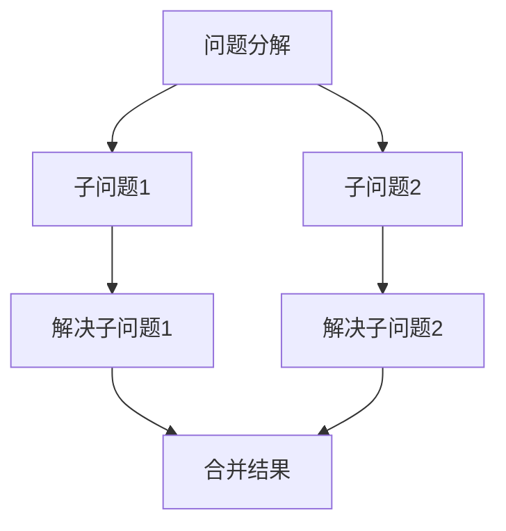
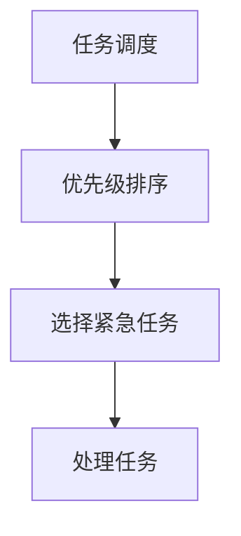

                 

# 提升AI Agent响应速度：优化策略与技巧

## 关键词

AI Agent, 响应速度优化, 并行计算, 系统架构, 项目实战, 最佳实践

## 摘要

本文深入探讨了提升AI Agent响应速度的关键策略与技巧，涵盖背景介绍、核心概念、算法优化、系统架构设计、项目实战及最佳实践等方面。通过分析AI Agent响应速度的优化，我们从算法优化、系统设计、并行计算等多个角度出发，结合实际案例和数学模型，提供了一套系统化的优化方案，帮助读者显著提升AI Agent的响应速度，优化用户体验和系统性能。

---

## 第一部分：AI Agent响应速度优化基础

### 第1章：AI Agent概述与问题背景

#### 1.1 AI Agent的基本概念

AI Agent（智能体）是指能够感知环境并采取行动以实现目标的实体。它可以分为简单反射型、基于模型的反应型、目标驱动型和实用驱动型四种类型。AI Agent的响应机制依赖于感知、决策和执行三个步骤，能够广泛应用于自动驾驶、智能助手、机器人控制等领域。

#### 1.2 响应速度优化的必要性

AI Agent的响应速度直接影响用户体验和系统性能。在实时应用中，响应速度过慢会导致用户体验下降，甚至引发系统崩溃。因此，优化AI Agent的响应速度是提升系统性能和用户满意度的关键。

#### 1.3 问题背景与挑战

当前AI Agent响应速度的瓶颈主要体现在算法复杂度高、数据处理效率低、系统架构不合理等方面。优化过程中需要克服计算资源限制、数据同步问题以及算法并行化等挑战。通过优化算法、改进系统架构和引入并行计算技术，可以显著提升AI Agent的响应速度。

---

## 第二部分：AI Agent响应速度优化的核心策略

### 第2章：AI Agent响应速度优化的核心策略

#### 2.1 并行计算与任务分解

并行计算通过分解任务并同时执行，显著提升了计算效率。任务分解策略包括分治算法和流水线处理。分治算法将问题分解为子问题，分别解决后再合并结果。流水线处理将任务分为多个阶段，每个阶段并行执行，减少了总执行时间。在AI Agent中，任务分解可以优化算法复杂度，提升整体响应速度。

#### 2.2 缓存机制与数据优化

缓存机制通过存储常用数据减少访问次数，降低了数据访问延迟。数据结构优化，如使用哈希表和平衡树，可以提升数据访问效率。此外，缓存一致性协议（如MESI）确保了缓存数据的一致性，避免了数据冲突问题。缓存机制在AI Agent中尤为重要，可以显著减少数据访问时间。

#### 2.3 算法优化与模型精简

算法优化通过降低复杂度和减少计算量来提升响应速度。模型剪枝和量化技术可以减少模型参数数量，降低计算开销。例如，剪枝算法通过移除冗余节点减少计算量，量化技术通过降低数据精度减少存储和计算需求。数学模型和公式为优化策略提供了理论基础，如并行计算的加速公式：$$T_{\text{parallel}} = \frac{T_{\text{serial}}}{n}$$，其中n是并行处理的线程数。

---

## 第三部分：AI Agent响应速度优化的算法与系统设计

### 第3章：响应速度优化的算法原理

#### 3.1 分治算法与并行处理

分治算法将问题分解为子问题，分别解决后再合并结果。并行处理通过同时执行子问题减少总时间。分治算法在AI Agent中的应用如图1所示：

#### 3.2 贪心算法与局部优化

贪心算法通过局部最优选择达到全局最优。例如，在任务调度中，优先处理紧急任务可以减少整体响应时间。贪心算法在AI Agent中的应用如图2所示：

#### 3.3 响应速度优化的数学模型

响应时间的数学表达式为：$$T_{\text{response}} = T_{\text{perceive}} + T_{\text{decide}} + T_{\text{execute}}$$。优化目标是通过降低各部分时间提升响应速度。算法复杂度的数学分析为：$$O(n \log n)$$，其中n是数据量。

---

## 第四部分：AI Agent响应速度优化的系统设计

### 第4章：系统架构与响应速度优化

#### 4.1 系统架构设计原则

系统分层设计将AI Agent划分为感知层、决策层和执行层。模块化设计确保各部分独立性，便于维护和扩展。可扩展性设计允许系统轻松添加新功能或扩展容量。

#### 4.2 系统架构优化

分层架构优化通过明确各层职责提升系统效率。模块间通信优化减少数据传输延迟，提升整体响应速度。系统资源分配优化确保各模块合理使用资源，避免资源争抢。

#### 4.3 系统接口与交互优化

接口设计遵循统一标准，确保模块间高效通信。交互优化通过减少接口调用次数和优化数据格式提升响应速度。接口性能优化技术包括压缩数据和减少数据传输量。

---

## 第五部分：AI Agent响应速度优化的项目实战

### 第5章：AI Agent响应速度优化的项目实战

#### 5.1 项目背景与需求分析

项目目标是提升AI Agent的响应速度，优化用户体验。需求分析包括性能测试、用户反馈和系统监控。系统设计包括模块划分、接口设计和流程优化。

#### 5.2 项目实现与代码优化

代码结构设计采用分层架构，各层独立实现功能。并行计算的实现通过多线程或分布式计算减少响应时间。算法优化的代码实现包括任务分解和数据结构优化。

#### 5.3 测试与优化

性能测试通过工具（如JMeter）测量响应时间。优化措施包括代码审查、资源分配和系统调优。测试结果分析提供优化方向和改进措施。

---

## 第六部分：AI Agent响应速度优化的最佳实践

### 第6章：最佳实践与注意事项

#### 6.1 最佳实践

代码审查与优化确保代码质量，减少潜在问题。性能监控与调优通过实时监控数据优化系统性能。团队协作与知识共享提升整体技术水平。

#### 6.2 注意事项

避免过度优化导致系统复杂性增加。定期进行系统维护和更新，保持系统性能。注意数据安全和隐私保护，确保系统合规性。

---

## 总结

通过以上步骤，我们可以系统化地提升AI Agent的响应速度，优化用户体验和系统性能。从算法优化到系统设计，再到项目实战，每一步都需要细致考虑和实践。希望本文提供的策略和技巧能够为读者在优化AI Agent响应速度的过程中提供有价值的指导和帮助。

