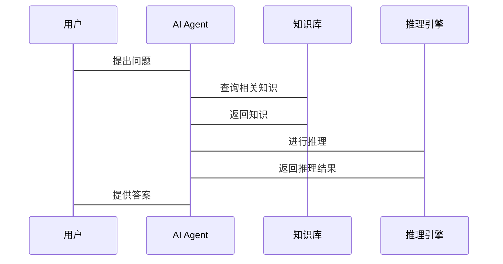

                 


# 提升AI Agent的推理能力：技巧与方法

## 关键词：AI Agent、推理能力、知识图谱、逻辑推理、概率推理、深度学习

## 摘要：本文系统地探讨了提升AI Agent推理能力的核心技巧与方法。从AI Agent的基本概念和推理能力的重要性入手，详细分析了推理能力的核心概念与相关算法原理，包括逻辑推理、概率推理和深度学习中的推理方法。通过实际案例和系统架构设计，展示了如何在实际项目中提升AI Agent的推理能力，并提供了最佳实践和注意事项。本文旨在为AI Agent的开发人员和研究者提供一套实用的提升推理能力的方法论。

---

# 第一部分: 提升AI Agent推理能力的背景与基础

## 第1章: AI Agent与推理能力概述

### 1.1 AI Agent的基本概念

#### 1.1.1 什么是AI Agent

AI Agent（人工智能代理）是指能够感知环境、做出决策并采取行动的智能实体。它具备自主性、反应性、目标导向和社交能力等核心特征。

#### 1.1.2 AI Agent的核心特征

- **自主性**：能够在没有外部干预的情况下独立运行。
- **反应性**：能够实时感知环境变化并做出反应。
- **目标导向**：具备明确的目标，并能采取行动以实现目标。
- **社交能力**：能够与其他AI Agent或人类进行交互和协作。

#### 1.1.3 推理能力在AI Agent中的重要性

推理能力是AI Agent实现智能决策的核心能力。没有有效的推理能力，AI Agent将无法根据环境信息做出合理的判断和行动。

---

### 1.2 推理能力的定义与分类

#### 1.2.1 推理的定义

推理是基于已有知识和证据，通过逻辑推理或概率推理等方法，推导出新的结论或解决方案的过程。

#### 1.2.2 推理的分类

- **逻辑推理**：基于逻辑规则进行推导，如命题逻辑和一阶逻辑推理。
- **概率推理**：基于概率论进行推导，如贝叶斯网络和马尔可夫逻辑网络推理。
- **类比推理**：通过类比和相似性进行推导。
- **归纳推理**：从具体实例中总结一般性规律。
- **演绎推理**：从一般性规律推导出具体实例。

#### 1.2.3 不同类型推理的优缺点对比

| 推理类型 | 优点 | 缺点 |
|----------|------|------|
| 逻辑推理 | 准确性高，结果可解释 | 对复杂问题处理能力有限 |
| 概率推理 | 能处理不确定性问题 | 计算复杂度高 |
| 类比推理 | 能处理复杂场景 | 准确性较低 |
| 归纳推理 | 能发现新规律 | 结论可能不准确 |
| 演绎推理 | 结论确定 | 需要完整的知识库 |

#### 1.2.4 推理能力的核心要素

- **知识表示**：如何表示和存储知识。
- **推理规则**：推理的逻辑规则或概率模型。
- **上下文理解**：对环境和任务的理解能力。

---

### 1.3 提升推理能力的意义

#### 1.3.1 提升推理能力对企业的影响

- 提高AI Agent的决策效率和准确性。
- 增强AI Agent的智能化水平，提升用户体验。
- 增强企业的核心竞争力，推动业务创新。

#### 1.3.2 提升推理能力对用户体验的改善

- 提供更智能、更个性化的服务。
- 提高问题解决效率，减少用户等待时间。
- 提升用户对AI Agent的信任感和满意度。

#### 1.3.3 推理能力在AI Agent未来发展中的作用

随着AI技术的不断发展，推理能力将成为区分AI Agent智能化水平的关键因素。提升推理能力将推动AI Agent在更多领域中的应用，如智能客服、自动驾驶、智能医疗等。

---

## 1.4 本章小结

本章介绍了AI Agent的基本概念和核心特征，重点阐述了推理能力在AI Agent中的重要性。通过对比不同类型的推理方法，明确了提升推理能力的关键要素和重要意义。下一章将深入探讨推理能力的核心概念与联系。

---

# 第二部分: 推理能力的核心概念与联系

## 第2章: 推理能力的核心概念

### 2.1 推理能力的关键要素

#### 2.1.1 知识表示

知识表示是AI Agent推理的基础。常用的知识表示方法包括：

- **语义网络**：通过节点和边表示概念及其关系。
- **知识图谱**：通过结构化的知识库表示实体及其属性。
- **逻辑表示**：通过逻辑公式表示知识。

#### 2.1.2 推理规则

推理规则是AI Agent进行推理的逻辑基础。常见的推理规则包括：

- **命题逻辑规则**：如“如果A，则B”。
- **一阶逻辑规则**：如“对于所有x，如果x属于A，则x属于B”。
- **概率推理规则**：如贝叶斯网络中的条件概率公式。

#### 2.1.3 上下文理解

上下文理解是指AI Agent能够根据环境和任务的上下文信息调整推理策略。例如，在医疗领域，AI Agent需要根据患者的病史和症状进行推理。

---

### 2.2 推理能力与相关概念的关系

#### 2.2.1 推理与学习的联系

推理是基于已有知识进行推导，而学习是通过数据获取新知识。两者相辅相成，共同提升AI Agent的智能水平。

#### 2.2.2 推理与决策的差异

推理是基于知识和证据进行推导，而决策是基于推理结果做出选择。推理是决策的基础，决策是推理的目标。

#### 2.2.3 推理与自然语言处理的结合

自然语言处理（NLP）为推理提供了语义理解和文本分析的能力。结合NLP，AI Agent能够更好地处理和理解非结构化数据。

---

### 2.3 推理能力的评估指标

#### 2.3.1 准确率

准确率是指推理结果与实际结果的匹配程度。准确率越高，推理能力越强。

#### 2.3.2 响应时间

响应时间是指AI Agent完成推理所需的时间。响应时间越短，用户体验越好。

#### 2.3.3 可解释性

可解释性是指推理过程和结果能够被人类理解。可解释性越高，用户对AI Agent的信任度越高。

---

## 2.4 本章小结

本章详细探讨了推理能力的核心概念，包括知识表示、推理规则和上下文理解。同时，分析了推理能力与相关概念的关系，并提出了评估推理能力的指标。下一章将重点介绍提升推理能力的算法原理。

---

# 第三部分: AI Agent推理能力的算法原理

## 第3章: 常见推理算法解析

### 3.1 逻辑推理算法

#### 3.1.1 命题逻辑推理

命题逻辑推理是基于命题逻辑公式进行推理。例如，假设A和B是两个命题，推理规则可以表示为：

$$
\text{如果 } A \land B \text{，则 } C
$$

其中，$\land$表示逻辑与，$C$是推理结果。

#### 3.1.2 一阶逻辑推理

一阶逻辑推理是在命题逻辑的基础上引入了量词（如存在量词和全称量词）。例如：

$$
\forall x (P(x) \rightarrow Q(x))
$$

表示对于所有x，如果P(x)成立，则Q(x)成立。

#### 3.1.3 逻辑推理的优缺点

- 优点：推理结果准确，可解释性强。
- 缺点：需要完整的知识库，对复杂问题处理能力有限。

#### 3.1.4 逻辑推理的实现步骤

1. 构建知识库：将知识表示为逻辑公式。
2. 定义推理规则：定义推理的逻辑规则。
3. 推理过程：基于知识库和推理规则进行推理。
4. 输出结果：返回推理结果。

---

### 3.2 概率推理算法

#### 3.2.1 贝叶斯网络推理

贝叶斯网络是一种基于概率论的推理方法。它通过构建贝叶斯网络模型，计算变量之间的条件概率。例如：

$$
P(A|B) = \frac{P(B|A)P(A)}{P(B)}
$$

其中，$P(A|B)$表示在B发生的条件下，A发生的概率。

#### 3.2.2 马尔可夫逻辑网络推理

马尔可夫逻辑网络（MLN）是将一阶逻辑和概率论结合起来的推理方法。它通过将逻辑公式转换为概率公式进行推理。

#### 3.2.3 概率推理的数学模型

概率推理的数学模型通常包括概率分布、条件概率和联合概率等。例如，联合概率公式：

$$
P(A,B) = P(A|B)P(B)
$$

表示A和B同时发生的概率等于A在B发生的条件下发生的概率乘以B发生的概率。

---

### 3.3 类比推理算法

#### 3.3.1 类比推理的基本原理

类比推理是通过比较不同事物的相似性，推导出新的结论。例如，如果A和B在某些方面相似，那么A在某方面成立，B在该方面也可能成立。

#### 3.3.2 基于向量的类比推理

基于向量的类比推理通常使用向量空间模型（如Word2Vec）进行。例如，向量表示为：

$$
\text{king} - \text{man} + \text{woman} = \text{queen}
$$

表示“king”和“man”在性别上的关系类似于“queen”和“woman”。

#### 3.3.3 类比推理的应用场景

类比推理常应用于自然语言处理、图像识别等领域。例如，在自然语言处理中，类比推理可以用于词义相似性计算。

---

### 3.4 深度学习中的推理算法

#### 3.4.1 Transformer模型在推理中的应用

Transformer模型通过自注意力机制和前馈网络进行推理。例如，在自然语言处理中，Transformer模型可以用于机器翻译和文本摘要。

#### 3.4.2 图神经网络推理

图神经网络（Graph Neural Network, GNN）通过处理图结构数据进行推理。例如，在社交网络分析中，GNN可以用于节点分类和链路预测。

#### 3.4.3 深度学习推理的优势

- **强大的特征提取能力**：深度学习能够自动提取数据的高层次特征。
- **处理复杂任务**：深度学习能够处理复杂的非结构化数据。
- **可扩展性**：深度学习模型可以扩展到更大的数据规模。

---

## 3.5 本章小结

本章详细介绍了几种常见的推理算法，包括逻辑推理、概率推理和类比推理。通过分析这些算法的原理和优缺点，明确了不同场景下的适用算法。下一章将探讨如何在实际系统中提升AI Agent的推理能力。

---

# 第四部分: AI Agent推理能力的系统分析与架构设计

## 第4章: 系统分析与架构设计

### 4.1 问题场景介绍

#### 4.1.1 AI Agent推理能力的应用场景

AI Agent推理能力的应用场景包括智能客服、自动驾驶、智能医疗、智能金融等领域。例如，在智能客服中，AI Agent需要根据用户的提问进行推理，提供准确的解答。

#### 4.1.2 问题需求分析

- **准确性**：推理结果需要准确。
- **实时性**：推理需要在较短时间内完成。
- **可扩展性**：系统需要能够处理大规模数据。

#### 4.1.3 系统目标设定

系统目标是通过优化推理算法和知识表示，提升AI Agent的推理能力，满足实际应用场景的需求。

---

### 4.2 系统功能设计

#### 4.2.1 领域模型设计

领域模型是AI Agent推理的基础。领域模型通常包括实体、属性和关系。例如，在医疗领域，实体可以是“患者”、“疾病”、“症状”，属性可以是“年龄”、“性别”，关系可以是“患者患有疾病”。

#### 4.2.2 领域模型的Mermaid类图


---

#### 4.2.3 系统架构设计


---

#### 4.2.4 接口设计与交互流程



---

## 4.3 本章小结

本章通过实际问题场景，详细分析了AI Agent推理能力的系统功能设计和架构设计。通过Mermaid图展示了领域模型和系统架构，明确了各模块的交互流程。下一章将通过实际案例，展示如何在项目中提升AI Agent的推理能力。

---

# 第五部分: 项目实战

## 第5章: 项目实战

### 5.1 环境安装与配置

#### 5.1.1 系统环境

- 操作系统：Linux/MacOS/Windows
- Python版本：3.8及以上
- JDK版本：1.8及以上

#### 5.1.2 安装依赖

```bash
pip install numpy
pip install scikit-learn
pip install networkx
pip install pymermaid
```

---

### 5.2 系统核心实现

#### 5.2.1 知识表示实现

```python
# 知识表示为知识图谱
from networkx import DiGraph

knowledge_base = DiGraph()
knowledge_base.add_edge("症状1", "疾病1")
knowledge_base.add_edge("疾病1", "治疗方案1")
```

#### 5.2.2 推理引擎实现

```python
# 逻辑推理引擎实现
def logical_inference(knowledge_base, query):
    # 从知识库中获取相关知识
    # 进行逻辑推理
    # 返回推理结果
    pass

# 概率推理引擎实现
def probabilistic_inference(knowledge_base, query):
    # 从知识库中获取相关知识
    # 计算概率
    # 返回推理结果
    pass
```

#### 5.2.3 接口实现

```python
# 提供RESTful接口
from flask import Flask

app = Flask(__name__)

@app.route('/infer', methods=['POST'])
def infer():
    data = request.json
    result = logical_inference(knowledge_base, data['query'])
    return jsonify(result)
```

---

### 5.3 案例分析与结果展示

#### 5.3.1 实际案例分析

以智能客服为例，用户提问：“我的订单状态是什么？”

AI Agent需要根据知识库中的订单信息和推理引擎进行推理，最终返回准确的订单状态。

#### 5.3.2 推理结果展示

推理结果可以以JSON格式返回：

```json
{
    "status": "completed",
    "order_id": "12345"
}
```

---

## 5.4 本章小结

本章通过实际项目实战，展示了如何在AI Agent中提升推理能力。通过环境安装、核心代码实现和案例分析，读者可以掌握提升推理能力的具体方法。下一章将总结最佳实践和注意事项。

---

# 第六部分: 最佳实践与总结

## 第6章: 最佳实践

### 6.1 小结

- 提升AI Agent的推理能力需要从知识表示、推理算法和系统架构等多个方面进行优化。
- 选择合适的推理算法能够显著提升推理效率和准确性。
- 系统设计需要考虑可扩展性、实时性和可解释性。

### 6.2 注意事项

- **知识表示**：确保知识库的准确性和完整性。
- **算法选择**：根据具体场景选择合适的推理算法。
- **系统优化**：优化推理引擎和知识库的性能。

### 6.3 拓展阅读

- 推荐阅读《逻辑推理与机器学习》和《概率图模型：原理与应用》。

---

## 6.4 总结

提升AI Agent的推理能力是一个复杂而重要的任务。通过本文的探讨，读者可以系统地掌握提升推理能力的核心技巧与方法。未来，随着AI技术的不断发展，推理能力将成为AI Agent智能化水平的关键指标。希望本文能够为读者在提升AI Agent推理能力的实践中提供有价值的参考和指导。

--- 

感谢您的阅读！希望本文对您有所帮助！

