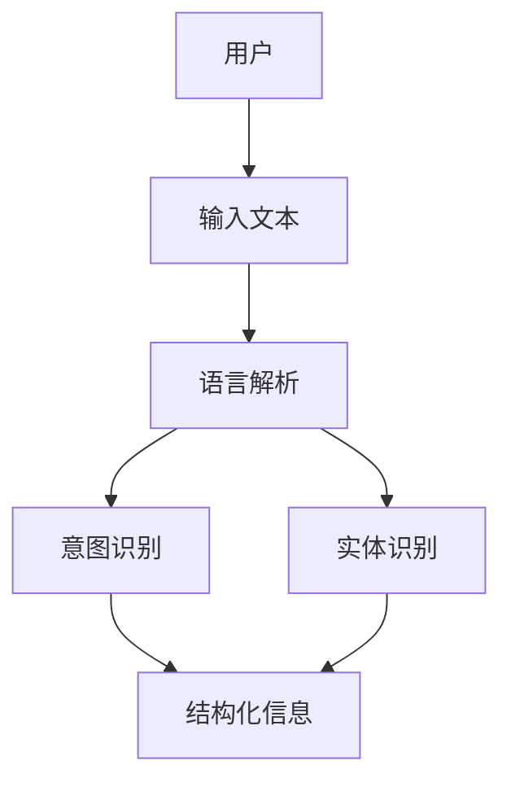
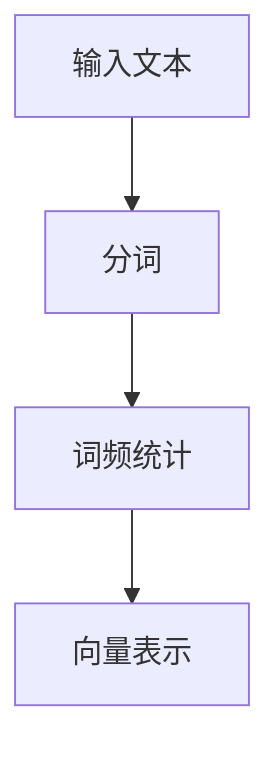
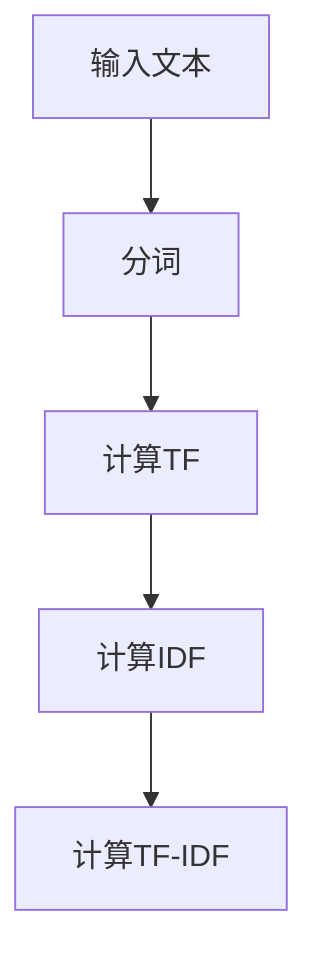
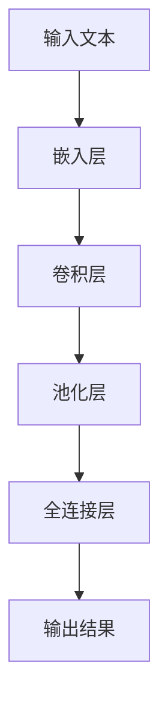
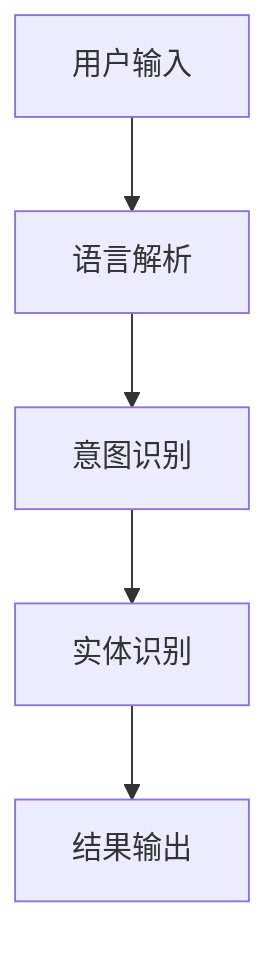
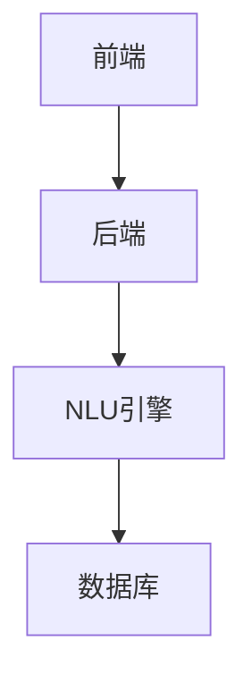
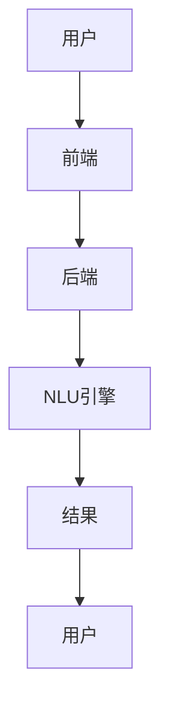

                 


# 提升客户服务质量：NLU技术的应用

## 关键词：
- 自然语言理解（NLU）
- 客户服务质量
- 人工智能
- 机器学习
- 聊天机器人

## 摘要：
自然语言理解（NLU）技术是人工智能领域的重要分支，用于帮助计算机理解人类的自然语言。在客户服务领域，NLU技术可以通过智能客服系统、聊天机器人等方式，显著提升客户服务质量。本文将深入探讨NLU技术的核心概念、算法原理、系统架构设计以及实际应用案例，为读者提供全面的解析。

---

## 第1章：NLU技术与客户服务质量提升概述

### 1.1 NLU技术的基本概念

#### 1.1.1 自然语言理解（NLU）的定义
自然语言理解（NLU）是人工智能领域的重要组成部分，旨在让计算机能够理解并解析人类的自然语言输入。NLU的核心任务包括语言解析、意图识别和实体识别。

#### 1.1.2 NLU技术的核心目标
NLU技术的目标是将人类语言转化为计算机可理解的结构化信息，从而实现人与计算机之间的高效交互。

#### 1.1.3 NLU在客户服务质量提升中的作用
通过NLU技术，企业可以实现智能化的客户服务，例如通过智能客服系统快速响应客户需求，提高客户满意度。

### 1.2 NLU技术的技术背景

#### 1.2.1 NLU技术的发展历程
从早期基于规则的NLU方法到现代基于深度学习的NLU模型，技术不断进步，性能显著提升。

#### 1.2.2 NLU技术的主要应用场景
NLU技术广泛应用于智能客服、聊天机器人、语音助手等领域。

#### 1.2.3 NLU技术对客户服务质量的影响
NLU技术能够提高客户服务质量，减少人工客服的工作量，提升客户满意度。

### 1.3 NLU技术在客户服务质量提升中的问题与挑战

#### 1.3.1 NLU技术的局限性
NLU技术目前仍面临语义理解不准确、数据依赖性强等问题。

#### 1.3.2 数据质量和多样性的影响
数据的质量和多样性直接影响NLU模型的性能。

#### 1.3.3 模型的可解释性
NLU模型的可解释性是实际应用中的一个重要挑战。

---

## 第2章：NLU技术的核心概念与原理

### 2.1 NLU技术的核心概念

#### 2.1.1 语言解析
语言解析是NLU技术的基础，旨在将自然语言文本转化为结构化的信息。

#### 2.1.2 意图识别
意图识别是NLU技术的重要组成部分，用于确定用户输入的主要目的。

#### 2.1.3 实体识别
实体识别用于从文本中提取特定的实体信息，例如人名、地名等。

### 2.2 NLU技术的关键特征

| 特征             | 描述                                                                 |
|------------------|----------------------------------------------------------------------|
| 意图识别能力     | 能够识别用户的意图                                                         |
| 实体识别能力     | 能够提取文本中的实体信息                                                 |
| 语言解析能力     | 能够将自然语言文本转化为结构化信息                                       |
| 鲁棒性           | 能够处理多种语言、方言和口音                                               |

### 2.3 NLU技术的实体关系图



---

## 第3章：NLU技术的算法原理

### 3.1 词袋模型

#### 3.1.1 词袋模型的定义
词袋模型是一种简单的文本表示方法，将文本表示为词的集合。

#### 3.1.2 词袋模型的流程



#### 3.1.3 词袋模型的数学模型
词袋模型的向量表示可以表示为：
$$
v_i = \sum_{j=1}^{n} w_{ij}
$$
其中，\( v_i \) 表示第i个词的向量，\( w_{ij} \) 表示第i个词在第j个文本中的权重。

### 3.2 TF-IDF模型

#### 3.2.1 TF-IDF模型的定义
TF-IDF是一种常用的文本权重计算方法，用于衡量一个词在文本中的重要性。

#### 3.2.2 TF-IDF模型的流程



#### 3.2.3 TF-IDF模型的数学公式
TF-IDF的计算公式为：
$$
TF-IDF(t) = TF(t) \times IDF(t)
$$
其中，\( TF(t) \) 是词t在文本中的频率，\( IDF(t) \) 是词t的逆文档频率。

### 3.3 神经网络模型

#### 3.3.1 神经网络模型的定义
神经网络模型是一种基于深度学习的NLU技术，能够自动学习文本的特征。

#### 3.3.2 神经网络模型的流程



#### 3.3.3 神经网络模型的数学公式
神经网络模型的输出结果可以表示为：
$$
y = f(Wx + b)
$$
其中，\( W \) 是权重矩阵，\( x \) 是输入向量，\( b \) 是偏置项，\( f \) 是激活函数。

---

## 第4章：NLU技术的系统分析与架构设计

### 4.1 项目背景与目标

#### 4.1.1 项目背景
本项目旨在利用NLU技术提升客户服务质量，通过智能客服系统实现高效的服务响应。

#### 4.1.2 项目目标
- 实现智能客服系统的意图识别功能。
- 提高客户满意度和问题解决效率。

### 4.2 系统功能设计

#### 4.2.1 系统功能模块
- 用户输入模块
- 语言解析模块
- 意图识别模块
- 实体识别模块
- 结果输出模块

#### 4.2.2 系统功能流程图



### 4.3 系统架构设计

#### 4.3.1 系统架构图



#### 4.3.2 系统接口设计
- 用户输入接口
- NLU引擎接口
- 数据库接口

#### 4.3.3 系统交互流程图



---

## 第5章：NLU技术的项目实战

### 5.1 环境安装与配置

#### 5.1.1 安装Python
```bash
python --version
```

#### 5.1.2 安装相关库
```bash
pip install numpy
pip install scikit-learn
pip install spacy
```

### 5.2 核心代码实现

#### 5.2.1 训练词袋模型

```python
from sklearn.feature_extraction.text import CountVectorizer

# 输入文本
texts = ["Hello, how are you?", "I need help with my account."]

# 创建词袋模型
vectorizer = CountVectorizer()
X = vectorizer.fit_transform(texts)

# 输出结果
print(X.toarray())
```

#### 5.2.2 实体识别代码

```python
import spacy

# 加载模型
nlp = spacy.load("en_core_web_sm")

# 处理文本
doc = nlp("My name is Alice and I live in London.")

# 提取实体
entities = [ent.text for ent in doc.ents]

# 输出结果
print(entities)
```

### 5.3 实际案例分析

#### 5.3.1 案例背景
一家电子商务公司希望通过NLU技术优化其智能客服系统。

#### 5.3.2 案例分析
通过训练NLU模型，系统能够准确识别客户的意图，例如“退款请求”或“产品咨询”。

#### 5.3.3 分析结果
- 提高了客户满意度。
- 减少了人工客服的工作量。

### 5.4 项目小结

#### 5.4.1 项目收获
掌握了NLU技术的核心概念和实现方法。

#### 5.4.2 项目经验
在实际应用中，数据质量对模型性能有重要影响。

---

## 第6章：NLU技术的最佳实践、小结与注意事项

### 6.1 最佳实践

#### 6.1.1 数据预处理
确保数据的多样性和代表性。

#### 6.1.2 模型调优
通过交叉验证和超参数优化提升模型性能。

#### 6.1.3 模型部署
将NLU模型部署到实际系统中，并进行持续监控和优化。

### 6.2 小结

#### 6.2.1 核心概念回顾
NLU技术的核心概念包括语言解析、意图识别和实体识别。

#### 6.2.2 技术总结
通过深度学习算法和系统架构设计，NLU技术能够有效提升客户服务质量。

### 6.3 注意事项

#### 6.3.1 数据隐私
确保客户数据的安全性和隐私性。

#### 6.3.2 模型可解释性
在实际应用中，模型的可解释性是重要的考虑因素。

#### 6.3.3 持续优化
定期更新和优化NLU模型，以应对语言的变化和客户的需求。

---

## 第7章：拓展阅读与深入学习

### 7.1 拓展阅读

#### 7.1.1 推荐书籍
- 《自然语言处理实战：基于Python的机器学习和深度学习》
- 《深度学习入门：基于Python的CNN、RNN、GAN等模型原理与实践》

#### 7.1.2 推荐博客
- https://towardsdatascience.com/natural-language-processing
- https://medium.com/ai-in-action

### 7.2 深入学习

#### 7.2.1 深度学习框架
- TensorFlow
- PyTorch

#### 7.2.2 NLU技术的前沿研究
- 预训练语言模型（如BERT）
- 多任务学习

---

## 附录：工具与资源

### 附录A：工具安装命令

```bash
pip install scikit-learn
pip install spacy
pip install transformers
```

### 附录B：数据集链接
- 通用语料库：https://www.kaggle.com/datasets
- 自然语言处理数据集：https://huggingface.co/datasets

### 附录C：API接口
- OpenAI API：https://openai.com/api
- Google Cloud NLP API：https://cloud.google.com/natural-language/docs

---

通过以上内容，您可以系统地学习和应用NLU技术，提升客户服务质量。

