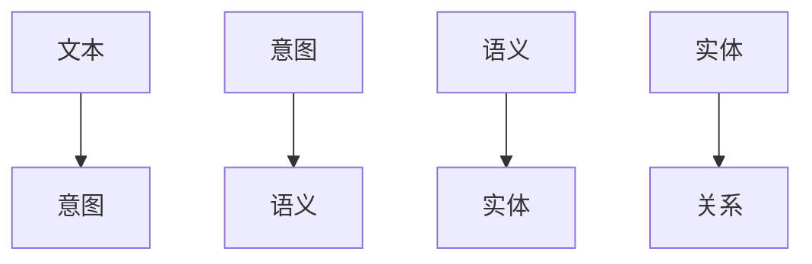
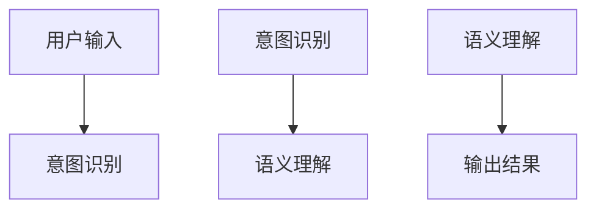
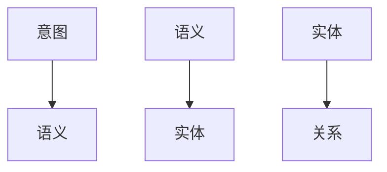
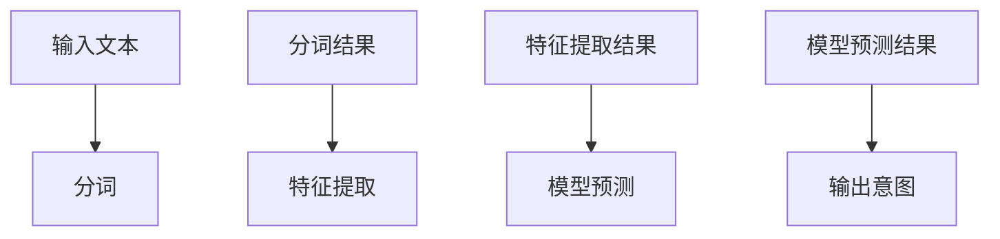
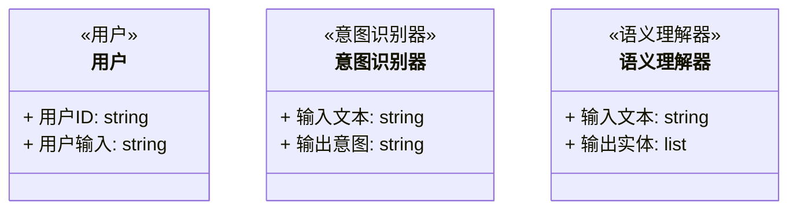
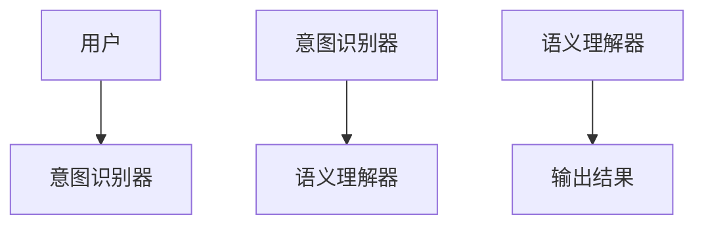
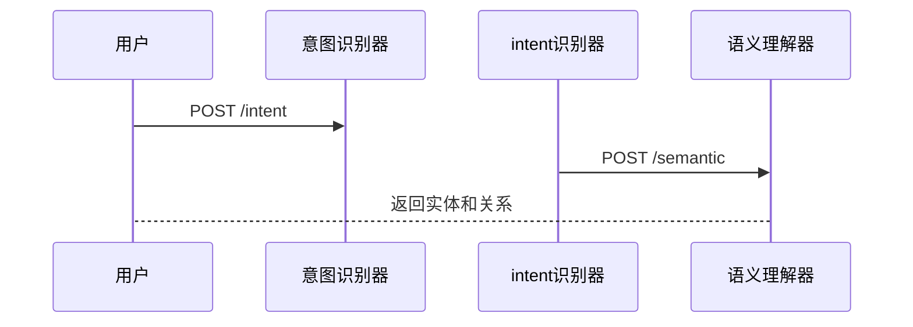

                 


# 提升金融领域语义理解与意图识别的准确性

## 关键词：语义理解、意图识别、金融领域、深度学习、NLP、准确率

## 摘要：本文深入探讨了在金融领域提升语义理解与意图识别准确性的关键方法和技术。从背景到核心概念，再到算法原理和系统设计，结合实际案例，详细分析了如何通过优化模型结构和引入先进的技术手段，显著提升金融场景下自然语言处理的准确性和实用性。

---

# 第1章 金融领域语义理解与意图识别的背景

## 1.1 问题背景与描述

### 1.1.1 金融领域语义理解的重要性

在金融领域，语义理解与意图识别是实现智能投顾、风险管理、客户交互等场景的关键技术。例如，投资者可能通过文本描述其财务状况和投资目标，系统需要准确理解其需求并提供个性化的建议。语义理解的准确性直接影响金融决策的可靠性和用户体验。

### 1.1.2 当前语义理解技术的局限性

尽管自然语言处理（NLP）技术近年来取得了显著进展，但在金融领域的复杂场景中，语义理解仍面临诸多挑战。例如，金融领域的术语多样性、上下文依赖性以及用户输入的模糊性，使得现有的通用NLP模型难以直接适应金融场景。

### 1.1.3 提升准确性的必要性

提升语义理解与意图识别的准确性，不仅能够提高金融服务的效率，还能降低金融风险。例如，在智能投顾系统中，准确识别用户的财务状况和投资目标，可以避免推荐不合适的金融产品，从而减少潜在的经济损失。

## 1.2 问题解决与边界

### 1.2.1 提升语义理解准确性的关键点

1. **领域特定优化**：针对金融领域的特点，构建专门的领域词典和知识库。
2. **上下文-aware模型**：引入上下文感知的模型，如BERT，以更好地理解金融文本的语境。
3. **多模态数据融合**：结合文本、语音、用户行为等多种数据源，提升意图识别的准确性。

### 1.2.2 技术边界与应用范围

1. **技术边界**：
   - 数据范围：限于金融领域的文本数据。
   - 精度范围：专注于高精度的意图识别，适用于需要精确决策的场景。
   - 场景限制：主要用于客户服务、投资建议等领域，不适用于实时交易监控等高风险场景。
   
2. **应用范围**：
   - 客户服务：通过智能客服系统理解客户问题并提供解决方案。
   - 投资建议：根据用户描述生成投资建议。
   - 风险管理：识别潜在风险信号，提前采取措施。

## 1.3 核心概念与联系

### 1.3.1 意图识别与语义理解的关系

意图识别是语义理解的上层任务，依赖于语义理解的结果。例如，系统首先通过语义理解确定文本的主要内容，然后进一步识别用户的意图。

### 1.3.2 核心概念对比分析表

| 概念 | 定义 | 目的 | 输入 | 输出 |
|------|------|------|------|------|
| 意图识别 | 确定文本背后的用户意图 | 提供精准的用户需求 | 文本 | 意图标签（如“查询账户余额”） |
| 语义理解 | 解释文本的含义和上下文 | 提供对文本的深度理解 | 文本 | 实体、关系、摘要 |

### 1.3.3 ER实体关系图（Mermaid）



---

# 第2章 语义理解与意图识别的核心概念

## 2.1 核心概念原理

### 2.1.1 意图识别的基本原理

意图识别通常包括以下步骤：
1. **文本预处理**：分词、去除停用词。
2. **特征提取**：提取文本的关键特征，如关键词、句法结构。
3. **模型训练**：使用机器学习或深度学习模型进行分类。

### 2.1.2 语义理解的实现机制

语义理解依赖于上下文感知模型，如BERT，通过预训练和微调来理解金融文本的语境。

### 2.1.3 两者结合的逻辑框架



## 2.2 核心概念对比分析

### 2.2.1 意图识别与语义理解的特征对比

| 特征 | 意图识别 | 语义理解 |
|------|----------|----------|
| 输入 | 文本 | 文本 |
| 输出 | 意图标签 | 实体、关系 |
| 精度 | 中高 | 高 |
| 复杂度 | 中 | 高 |

### 2.2.2 ER实体关系图（Mermaid）



---

# 第3章 常见算法原理与流程

## 3.1 基础算法

### 3.1.1 基于规则的意图识别

**规则定义**：
- 如果文本中包含“查询”或“查看”，则意图是“查询账户”。

### 3.1.2 基于统计的语义理解

**统计模型**：
- 使用TF-IDF提取关键词，计算文本的相关性。

### 3.1.3 基于深度学习的混合模型

**模型结构**：
1. **词嵌入层**：使用Word2Vec生成词向量。
2. **编码层**：使用RNN编码文本。
3. **解码层**：使用全连接层输出意图。

---

## 3.2 算法流程图（Mermaid）



## 3.3 数学模型与公式

### 3.3.1 朴素贝叶斯分类器

$$ P(y|x) = \frac{P(x|y)P(y)}{P(x)} $$

### 3.3.2 深度学习模型的损失函数

$$ L = -\sum_{i=1}^{n} \log P(y_i|x_i) $$

---

# 第4章 系统分析与架构设计

## 4.1 系统功能设计

### 4.1.1 领域模型设计（Mermaid 类图）



### 4.1.2 系统架构设计（Mermaid 架构图）



### 4.1.3 系统接口设计

| 接口 | 输入 | 输出 |
|------|------|------|
| POST /intent | {text: string} | {intent: string} |
| POST /semantic | {text: string} | {entities: list} |

### 4.1.4 系统交互流程（Mermaid 序列图）



---

# 第5章 项目实战

## 5.1 环境安装

```bash
pip install numpy pandas scikit-learn transformers
```

## 5.2 核心实现代码

```python
from sklearn.feature_extraction.text import TfidfVectorizer
from sklearn.naive_bayes import MultinomialNB

# 初始化向量器
vectorizer = TfidfVectorizer()
model = MultinomialNB()

# 训练模型
X_train = vectorizer.fit_transform(X)
model.fit(X_train, y_train)

# 预测意图
X_test = vectorizer.transform([text])
y_pred = model.predict(X_test)
```

## 5.3 实际案例分析

### 5.3.1 案例介绍

假设用户输入文本为“我需要查询我的账户余额”，系统应识别意图“查询账户”。

### 5.3.2 代码解读

```python
# 预处理文本
text = "我需要查询我的账户余额"
processed_text = text.lower().replace("查询", "check")

# 特征提取
X_test = vectorizer.transform([processed_text])

# 预测意图
y_pred = model.predict(X_test)
print(y_pred)
```

### 5.3.3 案例小结

通过案例分析可以看出，基于统计的模型在简单场景下表现良好，但在复杂金融场景中，可能需要引入更复杂的模型，如BERT。

---

# 第6章 最佳实践与小结

## 6.1 最佳实践

1. **数据预处理**：清洗数据，去除噪声。
2. **领域优化**：构建金融领域的词典和知识库。
3. **模型调优**：使用交叉验证优化模型参数。

## 6.2 小结

本文系统地探讨了提升金融领域语义理解与意图识别准确性的关键方法和技术，从背景到算法，再到系统设计和实战案例，全面分析了如何在金融场景中优化NLP技术。

## 6.3 注意事项

1. 数据隐私：确保金融数据的安全性和合规性。
2. 模型可解释性：在复杂场景中，确保模型的可解释性。

## 6.4 拓展阅读

1. BERT模型在金融领域的应用。
2. 多模态数据融合的意图识别技术。

---

# 结语

通过本文的分析，读者可以深入了解如何在金融领域提升语义理解与意图识别的准确性，掌握从理论到实践的完整流程，为实际应用提供有力的技术支持。

