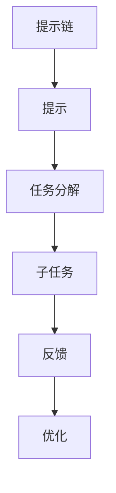
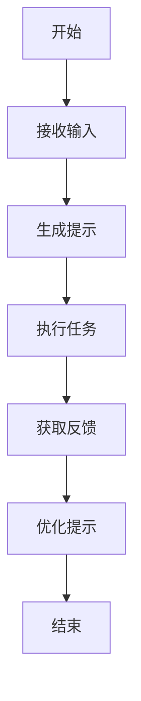

                 


# 提示链：设计复杂任务的AI Agent解决方案

## 关键词：提示链、AI Agent、复杂任务、强化学习、系统架构、项目实战、最佳实践

## 摘要：  
在复杂任务的设计与实现中，AI Agent需要具备高度的智能性和灵活性。提示链作为一种新兴的解决方案，通过将任务分解为多个提示，并通过动态交互的方式逐步优化任务执行，为AI Agent的设计提供了新的思路。本文从提示链的定义、原理、算法实现、系统架构到实际应用案例，全面探讨了提示链在AI Agent中的应用，帮助读者理解如何通过提示链设计和优化复杂任务。

---

# 第1章: 提示链与AI Agent的背景介绍

## 1.1 提示链的定义与核心概念  
提示链是一种基于提示的动态任务分解方法，通过将任务分解为多个提示，并通过提示之间的关联和动态交互，逐步优化任务执行。提示链的核心要素包括：任务目标、提示生成、提示执行、反馈优化和上下文关联。

---

## 1.2 问题背景与问题描述  
在复杂任务中，传统的规则引擎和知识图谱推理方法难以应对任务的动态性和不确定性。AI Agent需要具备灵活的决策能力和快速的响应能力，而提示链通过动态生成和优化提示，为AI Agent提供了新的解决方案。

---

## 1.3 提示链的应用场景  
提示链在以下场景中表现出色：
- **任务分解**：将复杂任务分解为多个子任务，逐步执行。
- **多阶段任务**：在任务的不同阶段生成不同的提示，动态调整执行策略。
- **动态任务**：根据实时反馈优化提示，适应任务的变化。

---

## 1.4 提示链与相关技术的对比  
以下是提示链与其他技术的对比：

| 技术 | 提示链 | 传统规则引擎 | 基于知识图谱的推理 |
|------|--------|--------------|-------------------|
| 表达能力 | 强大 | 较弱 | 较强 |
| 可扩展性 | 高 | 中 | 高 |
| 灵活性 | 高 | 低 | 中 |

---

## 1.5 提示链的优缺点分析  
### 1.5.1 提示链的优点  
- 灵活性高：能够动态调整提示，适应任务变化。
- 表达能力强：能够处理复杂的任务逻辑。
- 可扩展性强：适用于大规模任务分解。

### 1.5.2 提示链的缺点  
- 计算开销大：动态生成和优化提示需要较高的计算资源。
- 易用性较低：需要对提示链的机制有较深的理解。

### 1.5.3 提示链的适用场景总结  
提示链适用于复杂度高、动态性强、需要灵活调整的任务场景。

---

# 第2章: 提示链的核心概念与联系  

## 2.1 提示链的原理与机制  
提示链通过动态生成提示、执行提示并根据反馈优化提示，形成一个闭环。其核心机制包括：
- 提示生成：基于任务目标生成初始提示。
- 提示执行：根据提示执行任务并获取反馈。
- 提示优化：根据反馈优化提示，调整任务执行策略。

---

## 2.2 提示链的核心属性对比  
以下是提示链的核心属性对比：

| 属性 | 提示链 | 传统规则引擎 |
|------|--------|--------------|
| 灵活性 | 高 | 低 |
| 可扩展性 | 高 | 中 |
| 处理复杂性 | 强 | 弱 |

---

## 2.3 提示链的实体关系图  


---

# 第3章: 提示链的算法原理与实现  

## 3.1 提示链算法的数学模型  
提示链的数学模型基于强化学习，核心公式为：
$$ Q(s, a) = r + \gamma \max_{a'} Q(s', a') $$
其中，$s$ 表示当前状态，$a$ 表示动作，$r$ 表示奖励，$\gamma$ 表示折扣因子。

---

## 3.2 提示链算法的实现流程  
### 3.2.1 算法流程图  


---

## 3.3 提示链算法的Python实现  
```python
class PromptChain:
    def __init__(self):
        self.prompts = []
        self.current_prompt = None

    def generate_prompt(self, task):
        # 根据任务生成提示
        self.prompts = [f"Subtask {i+1}: {task[i]}" for i in range(len(task))]
        return self.prompts

    def execute_prompt(self, prompt):
        # 执行提示并获取反馈
        feedback = f"Feedback for {prompt}"
        return feedback

    def optimize_prompt(self, feedback):
        # 根据反馈优化提示
        self.prompts = [f"Optimized Subtask {i+1}: {feedback[i]}" for i in range(len(feedback))]
        return self.prompts
```

---

## 3.4 提示链算法的数学模型解读  
提示链的数学模型 $Q(s, a) = r + \gamma \max_{a'} Q(s', a')$ 表示：在状态 $s$ 下，选择动作 $a$ 的奖励 $r$，加上折扣因子 $\gamma$ 乘以后续状态 $s'$ 下的最大值，形成一个闭环优化过程。

---

# 第4章: 提示链的系统分析与架构设计  

## 4.1 问题场景介绍  
在复杂任务中，AI Agent需要通过提示链动态分解任务，逐步优化执行策略。

---

## 4.2 系统功能设计  
- 提示生成模块：根据任务目标生成提示。
- 提示执行模块：根据提示执行任务并获取反馈。
- 提示优化模块：根据反馈优化提示。

---

## 4.3 系统架构设计  


---

## 4.4 系统接口设计  
- 提示生成接口：`generate_prompt(task: List[str]) -> List[str]`
- 提示执行接口：`execute_prompt(prompt: str) -> str`
- 提示优化接口：`optimize_prompt(feedback: str) -> List[str]`

---

## 4.5 系统交互流程图  


---

# 第5章: 提示链的项目实战  

## 5.1 环境安装  
```bash
pip install prompt-chain
```

---

## 5.2 核心代码实现  
```python
from prompt_chain import PromptChain

# 初始化提示链
pc = PromptChain()

# 生成提示
prompts = pc.generate_prompt(["任务1", "任务2", "任务3"])

# 执行提示
feedback = pc.execute_prompt(prompts[0])

# 优化提示
optimized_prompts = pc.optimize_prompt(feedback)
```

---

## 5.3 代码解读与分析  
- `generate_prompt`：根据任务目标生成提示。
- `execute_prompt`：根据提示执行任务并获取反馈。
- `optimize_prompt`：根据反馈优化提示。

---

## 5.4 实际案例分析  
假设任务目标是“完成一个在线购物流程”，提示链会生成以下提示：
1. 提示1：选择商品。
2. 提示2：填写收货信息。
3. 提示3：完成支付。

根据反馈优化提示，最终生成的提示会更具体。

---

## 5.5 项目小结  
通过提示链实现复杂任务的分解与优化，能够显著提高AI Agent的执行效率和灵活性。

---

# 第6章: 提示链的最佳实践  

## 6.1 小结  
提示链是一种高效的设计复杂任务的AI Agent解决方案，通过动态生成和优化提示，能够适应任务的动态变化。

---

## 6.2 注意事项  
- 提示链的计算开销较大，需要优化算法性能。
- 提示链的灵活性较高，需要合理设计提示生成规则。

---

## 6.3 拓展阅读  
- 《强化学习实战》
- 《AI Agent设计与实现》
- 《复杂任务分解方法研究》

---

# 第7章: 总结与展望  

## 7.1 总结  
提示链通过动态生成和优化提示，为AI Agent的设计提供了新的思路，能够高效地解决复杂任务。

## 7.2 展望  
未来，提示链可以结合其他技术（如知识图谱和图灵模型）进一步优化任务执行效率和灵活性。

---

通过本文的详细讲解，读者可以全面理解提示链在AI Agent设计中的应用，并能够实际操作提示链的实现和优化。

