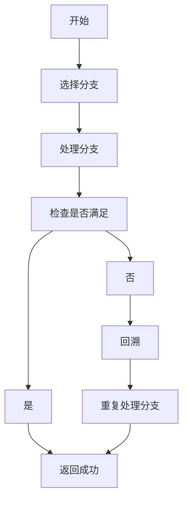
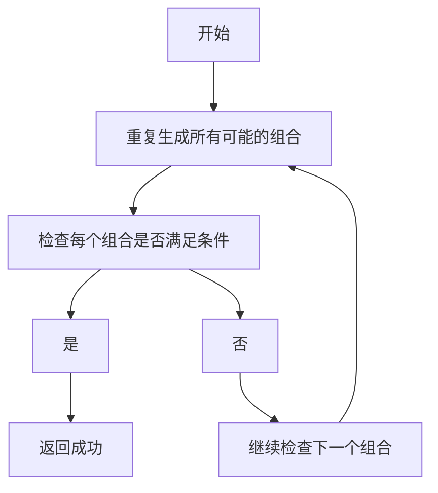
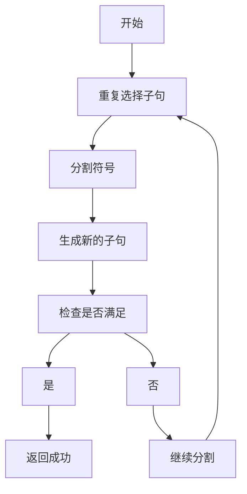
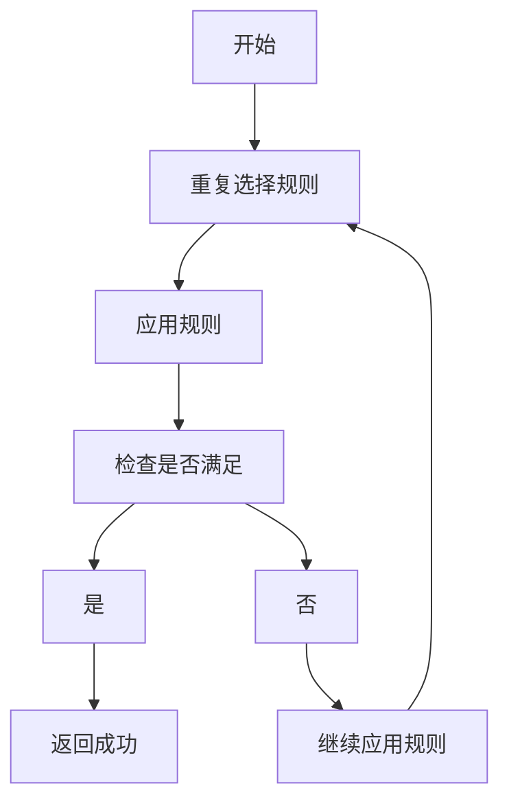
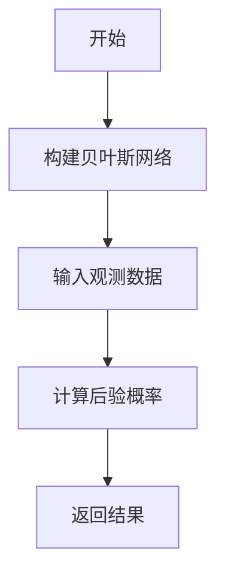
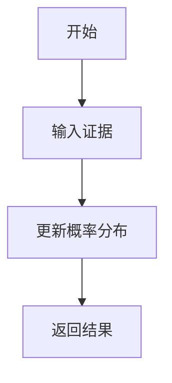
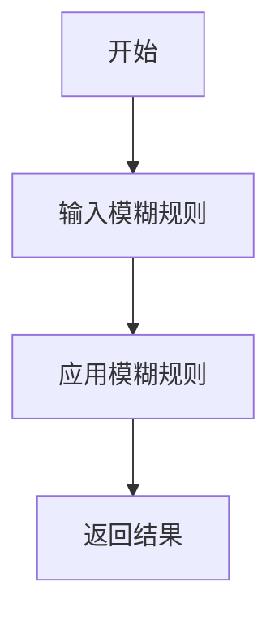
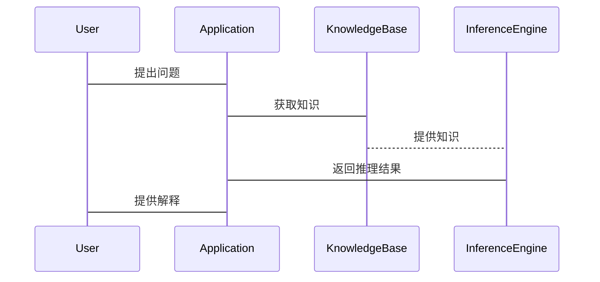
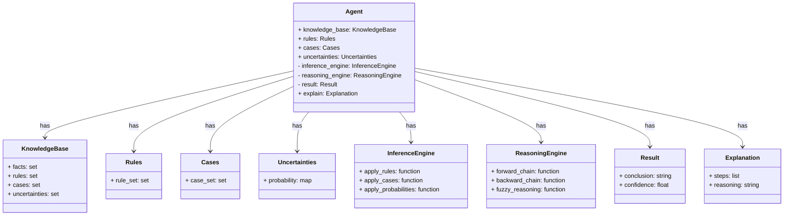

                 


# 提高AI Agent的推理能力：逻辑推理模块设计

## 文章关键词

- AI Agent
- 逻辑推理
- 模块设计
- 算法原理
- 系统架构

## 摘要

本文旨在探讨如何设计和实现AI Agent的逻辑推理模块，以提高其推理能力。文章首先介绍AI Agent的基本概念和逻辑推理的重要性，然后详细分析逻辑推理的原理和算法，接着讨论逻辑推理模块的系统架构设计，最后通过项目实战展示如何将理论应用于实践。本文结合理论与实践，通过详细的数学公式、算法流程图和系统架构图，帮助读者全面理解逻辑推理模块的设计与实现。

---

## 第一部分: AI Agent与逻辑推理基础

### 第1章: AI Agent与逻辑推理概述

#### 1.1 AI Agent的基本概念

AI Agent（人工智能代理）是一种能够感知环境并采取行动以实现目标的智能实体。AI Agent可以是软件程序、机器人或其他智能系统，其核心目标是通过感知和行动来优化其在特定环境中的表现。AI Agent的关键特性包括自主性、反应性、目标导向性和社会性。

**1.1.1 AI Agent的定义与特点**

- **自主性**：AI Agent能够在没有外部干预的情况下独立决策和行动。
- **反应性**：AI Agent能够根据环境的变化动态调整其行为。
- **目标导向性**：AI Agent的行为通常是为了实现特定的目标。
- **社会性**：AI Agent能够与其他Agent或人类进行交互和协作。

**1.1.2 逻辑推理在AI Agent中的作用**

逻辑推理是AI Agent实现智能决策的核心能力。通过逻辑推理，AI Agent能够从已知的事实和规则中推导出新的结论，从而做出合理的决策。逻辑推理能力的强弱直接影响AI Agent的智能水平和应用范围。

**1.1.3 AI Agent的应用场景与挑战**

AI Agent广泛应用于自动驾驶、智能助手、推荐系统、游戏AI等领域。然而，逻辑推理模块的设计面临诸多挑战，例如处理不确定性、动态环境、复杂规则等问题。

#### 1.2 逻辑推理的基本概念

逻辑推理是通过一系列逻辑规则和事实，从已知的前提推导出结论的过程。它是AI Agent实现智能决策的基础。

**1.2.1 逻辑推理的定义与分类**

- **定义**：逻辑推理是通过逻辑规则和事实，从已知的前提推导出结论的过程。
- **分类**：
  - **演绎推理**：从一般到特殊的推理方式，例如从“所有人类都是哺乳动物”推导出“张三也是哺乳动物”。
  - **归纳推理**：从特殊到一般的推理方式，例如从“所有观察到的天鹅都是白色的”推导出“所有天鹅都是白色的”。
  - ** abduction推理**：基于可能性的推理方式，例如从“所有天鹅都是白色的”和“这只鸟是天鹅”推导出“这只鸟是白色的”。

**1.2.2 知识表示与逻辑推理的关系**

知识表示是逻辑推理的前提。知识表示的清晰性和完整性直接影响推理的效果。常用的知识表示方法包括谓词逻辑、规则表示和语义网络等。

**1.2.3 逻辑推理的数学基础**

逻辑推理的数学基础主要包括命题逻辑和谓词逻辑。命题逻辑用于处理简单的事实和规则，而谓词逻辑则适用于处理复杂的事实和关系。

#### 1.3 逻辑推理在AI Agent中的重要性

逻辑推理是AI Agent实现智能决策的核心能力。通过逻辑推理，AI Agent能够从已知的事实和规则中推导出新的结论，从而做出合理的决策。逻辑推理能力的强弱直接影响AI Agent的智能水平和应用范围。

**1.3.1 提高AI Agent推理能力的意义**

提高AI Agent的推理能力可以增强其在复杂环境中的适应能力和决策能力，从而在更广泛的场景中实现高效的应用。

**1.3.2 逻辑推理在智能决策中的作用**

逻辑推理能够帮助AI Agent在复杂环境中做出合理的决策。例如，在自动驾驶中，AI Agent需要通过逻辑推理来判断道路状况、预测其他车辆的行为，并做出相应的驾驶决策。

**1.3.3 当前AI Agent推理能力的局限性**

尽管逻辑推理在AI Agent中起着重要作用，但其推理能力仍存在诸多限制。例如，处理不确定性、动态环境和复杂规则等问题。

#### 1.4 本章小结

本章主要介绍了AI Agent的基本概念和逻辑推理的重要性。通过分析AI Agent的特点、应用场景以及逻辑推理的基本概念和分类，读者可以初步理解逻辑推理在AI Agent中的作用。

---

## 第二部分: 逻辑推理的原理与算法

### 第2章: 逻辑推理的原理

#### 2.1 谓词逻辑与推理

谓词逻辑是逻辑推理的核心基础。通过谓词逻辑，我们可以清晰地表示事实和规则，并通过推理规则推导出结论。

**2.1.1 谓词逻辑的基本概念**

谓词逻辑由命题、谓词、量词和逻辑连接词组成。例如，命题“所有人类都是哺乳动物”可以用谓词逻辑表示为∀x (Human(x) → Mammal(x))。

**2.1.2 谓词逻辑的推理规则**

谓词逻辑的推理规则包括全称规则、存在规则和合取规则。例如，全称规则允许从∀x P(x)推导出P(a)（其中a是任意个体）。

**2.1.3 谓词逻辑的推理方法**

谓词逻辑的推理方法包括自然推理、模态推理和反证法。自然推理是一种基于自然语言推理的逻辑推理方法，常用于数学证明和逻辑推理。

**2..2 规则推理与案例推理**

规则推理是基于规则的推理方法，适用于处理确定性问题。案例推理是基于相似案例的推理方法，适用于处理不确定性问题。

**2.2.1 规则推理的定义与特点**

规则推理是一种基于预定义规则的推理方法。例如，如果A且B，则C。

**2.2.2 案例推理的定义与特点**

案例推理是一种基于相似案例的推理方法。例如，基于过去类似案例的处理结果，推导出当前案例的处理结果。

**2.2.3 规则推理与案例推理的对比**

- **规则推理**：基于规则，适用于确定性问题。
- **案例推理**：基于相似案例，适用于不确定性问题。

#### 2.3 不确定性推理与模糊推理

不确定性推理和模糊推理是处理不确定性问题的重要方法。

**2.3.1 不确定性推理的定义与特点**

不确定性推理是基于概率或模糊逻辑的推理方法，适用于处理不确定性问题。例如，基于贝叶斯网络的推理方法。

**2.3.2 模糊推理的定义与特点**

模糊推理是基于模糊逻辑的推理方法，适用于处理模糊性问题。例如，基于模糊规则的推理方法。

**2.3.3 模糊推理在AI Agent中的应用**

模糊推理在自动驾驶、智能助手等领域有广泛应用。例如，在自动驾驶中，模糊推理可以用于处理道路状况的不确定性。

#### 2.4 本章小结

本章主要介绍了逻辑推理的原理，包括谓词逻辑、规则推理、案例推理和模糊推理的基本概念和特点。通过这些原理，读者可以更好地理解逻辑推理的实现方法。

### 第3章: 逻辑推理算法

#### 3.1 基于谓词逻辑的推理算法

基于谓词逻辑的推理算法是逻辑推理的核心算法之一。

**3.1.1 DPLL算法**

DPLL（Davis-Putnam-Logemann-Loveland）算法是一种基于回溯的逻辑推理算法，常用于解决命题逻辑和一阶逻辑的 satisfiability 问题。

**DPLL算法流程图**



**DPLL算法伪代码**

```python
def dpll(symbols, clauses):
    if is_satisfied(clauses):
        return True
    if is_conflict(clauses):
        return False
    symbol = choose_symbol(symbols)
    result = dpll(symbols - {symbol}, add_not_symbol(clauses, symbol))
    if result:
        return True
    result = dpll(symbols - {symbol}, add_symbol(clauses, symbol))
    return result
```

**3.1.2 穷举搜索算法**

穷举搜索算法是一种简单但效率较低的逻辑推理算法，适用于处理小规模问题。

**穷举搜索算法流程图**



**穷举搜索算法伪代码**

```python
def brute_force(symbols, clauses):
    for assignment in all_possible_assignments(symbols):
        if satisfies(clauses, assignment):
            return True
    return False
```

**3.1.3 分割算法**

分割算法是一种基于分裂的逻辑推理算法，常用于解决一阶逻辑的 satisfiability 问题。

**分割算法流程图**



**分割算法伪代码**

```python
def dpll_split(symbols, clauses):
    if is_satisfied(clauses):
        return True
    if is_conflict(clauses):
        return False
    clause = choose_clause(clauses)
    literal = choose_literal(clause)
    result = dpll_split(symbols - {literal}, add_not_symbol(clauses, literal))
    if result:
        return True
    result = dpll_split(symbols - {literal}, add_symbol(clauses, literal))
    return result
```

#### 3.2 基于规则的推理算法

基于规则的推理算法是规则推理的核心算法。

**3.2.1 正向推理算法**

正向推理算法是基于规则的推理方法，适用于处理确定性问题。

**正向推理算法流程图**



**正向推理算法伪代码**

```python
def forward_chaining(rules, facts):
    while True:
        new_facts = apply_rules(rules, facts)
        if new_facts == facts:
            break
        facts = new_facts
    return facts
```

**3.2.2 反向推理算法**

反向推理算法是基于规则的推理方法，适用于处理不确定性问题。

**反向推理算法流程图**


**反向推理算法伪代码**

```python
def backward_chaining(rules, goal):
    if goal in facts:
        return True
    for rule in rules:
        if goal is the head of rule and all(bodies are satisfied):
            return True
    return False
```

**3.2.3 启发式推理算法**

启发式推理算法是基于规则的推理方法，适用于处理复杂问题。

**启发式推理算法流程图**


**启发式推理算法伪代码**

```python
def heuristic_search(rules, facts, goal):
    frontier = queue.new()
    visited = set()
    frontier.enqueue(facts)
    while not frontier.empty():
        current = frontier.dequeue()
        if current contains goal:
            return True
        for rule in rules:
            new_state = apply_rule(rule, current)
            if new_state not in visited:
                frontier.enqueue(new_state)
                visited.add(new_state)
    return False
```

#### 3.3 不确定性推理算法

不确定性推理算法是基于概率或模糊逻辑的推理方法。

**3.3.1 贝叶斯网络推理**

贝叶斯网络推理是一种基于概率的推理方法，适用于处理不确定性问题。

**贝叶斯网络推理流程图**



**贝叶斯网络推理伪代码**

```python
def bayesian_inference(network, evidence):
    for node in network.nodes:
        if node in evidence:
            update_belief(network, node, evidence[node])
    return get_posterior(network)
```

**3.3.2 证据推理算法**

证据推理算法是一种基于概率的推理方法，适用于处理不确定性问题。

**证据推理算法流程图**



**证据推理算法伪代码**

```python
def evidence_reasoning(network, evidence):
    for node in network.nodes:
        if node in evidence:
            update_probability(network, node, evidence[node])
    return get_posterior(network)
```

**3.3.3 模糊逻辑推理算法**

模糊逻辑推理是一种基于模糊逻辑的推理方法，适用于处理模糊性问题。

**模糊逻辑推理流程图**



**模糊逻辑推理伪代码**

```python
def fuzzy_reasoning(rules, inputs):
    for rule in rules:
        if rule.antecedent matches inputs:
            apply_rule(rule, inputs)
    return get_conclusion(inputs)
```

#### 3.4 算法对比与选择

在选择逻辑推理算法时，需要综合考虑算法的复杂度、适用场景和性能。

**算法对比表**

| 算法类型       | 适用场景             | 优缺点分析                   |
|----------------|----------------------|------------------------------|
| DPLL算法       | 命题逻辑和一阶逻辑   | 简单高效，适用于大规模问题   |
| 穷举搜索算法   | 小规模问题           | 简单直观，但效率较低         |
| 分割算法       | 一阶逻辑             | 效率较高，适用于复杂问题     |
| 正向推理算法   | 确定性规则           | 简单直接，适用于规则明确的问题 |
| 反向推理算法   | 目标驱动的问题       | 适用于复杂规则               |
| 启发式推理算法 | 复杂规则             | 效率较高，适用于复杂场景     |
| 贝叶斯网络推理 | 不确定性问题         | 高效准确，适用于概率推理     |
| 证据推理算法   | 不确定性问题         | 简单直观，适用于概率推理     |
| 模糊逻辑推理算法 | 模糊性问题         | 适用于处理模糊性问题         |

**本章小结**

本章主要介绍了逻辑推理的算法，包括基于谓词逻辑的推理算法、基于规则的推理算法和不确定性推理算法。通过对比不同算法的优缺点，读者可以更好地选择适合具体场景的推理算法。

---

## 第三部分: 逻辑推理模块的设计与实现

### 第4章: 逻辑推理模块的设计

#### 4.1 系统需求分析

在设计逻辑推理模块时，需要明确系统的需求和目标。

**4.1.1 问题场景介绍**

假设我们正在设计一个智能助手AI Agent，其需要能够理解和回答用户的问题，并能够根据上下文进行推理。

**4.1.2 项目介绍**

本项目旨在设计一个智能助手AI Agent的逻辑推理模块，使其能够理解和回答用户的问题，并能够根据上下文进行推理。

**4.1.3 系统功能设计**

系统功能包括：

- 知识表示与存储
- 规则推理与案例推理
- 不确定性推理与模糊推理
- 推理结果的解释与反馈

**系统功能设计mermaid类图**


**4.1.4 系统架构设计**

系统架构包括知识表示层、推理引擎层和应用层。

**系统架构设计mermaid架构图**


**4.1.5 系统接口设计**

系统接口包括知识表示接口、推理引擎接口和应用接口。

**系统接口设计mermaid序列图**



**4.1.6 系统交互设计**

系统交互包括用户与AI Agent的交互、AI Agent与知识库的交互以及AI Agent与推理引擎的交互。

**系统交互设计mermaid序列图**


#### 4.2 逻辑推理模块的实现

在实现逻辑推理模块时，需要考虑算法的选择和实现。

**4.2.1 知识表示与存储**

知识表示是逻辑推理的前提。常用的知识表示方法包括谓词逻辑、规则表示和语义网络。

**4.2.2 规则推理与案例推理**

规则推理和案例推理是逻辑推理的核心算法。

**4.2.3 不确定性推理与模糊推理**

不确定性推理和模糊推理是逻辑推理的重要组成部分。

**4.2.4 推理结果的解释与反馈**

推理结果的解释与反馈是逻辑推理模块的重要组成部分。

**4.2.5 本章小结**

本章主要介绍了逻辑推理模块的设计与实现，包括知识表示、规则推理、案例推理、不确定性推理和模糊推理等内容。

---

## 第五部分: 项目实战

### 第5章: 逻辑推理模块的项目实战

#### 5.1 环境安装与配置

在实现逻辑推理模块之前，需要配置开发环境。

**5.1.1 环境要求**

- Python 3.8及以上版本
- 基础Python库（如numpy、pandas）
- 可选的逻辑推理库（如pylogit、python-bayesian）

**5.1.2 安装依赖**

```bash
pip install numpy pandas pylogit python-bayesian
```

#### 5.2 逻辑推理模块的核心实现

在实现逻辑推理模块时，需要实现知识表示、规则推理、案例推理、不确定性推理和模糊推理等功能。

**5.2.1 知识表示与存储**

知识表示可以通过谓词逻辑、规则表示和语义网络等方式实现。

**知识表示实现代码**

```python
# 知识表示实现代码
class KnowledgeBase:
    def __init__(self):
        self.facts = set()
        self.rules = set()
        self.cases = set()
        self.uncertainties = dict()

    def add_fact(self, fact):
        self.facts.add(fact)

    def add_rule(self, rule):
        self.rules.add(rule)

    def add_case(self, case):
        self.cases.add(case)

    def add_uncertainty(self, uncertainty, probability):
        self.uncertainties[uncertainty] = probability
```

**5.2.2 规则推理与案例推理**

规则推理和案例推理可以通过正向推理和反向推理算法实现。

**规则推理实现代码**

```python
# 规则推理实现代码
class RuleInferenceEngine:
    def __init__(self, rules):
        self.rules = rules

    def forward_chain(self, facts):
        while True:
            new_facts = set()
            for rule in self.rules:
                if all(fact in facts for fact in rule['preconditions']):
                    new_facts.add(rule['action'])
            if new_facts.issubset(facts):
                break
            facts.update(new_facts)
        return facts

    def backward_chain(self, goal, facts):
        if goal in facts:
            return True
        for rule in self.rules:
            if rule['action'] == goal:
                for pre in rule['preconditions']:
                    if pre not in facts:
                        return self.backward_chain(pre, facts)
        return False
```

**案例推理实现代码**

```python
# 案例推理实现代码
class CaseInferenceEngine:
    def __init__(self, cases):
        self.cases = cases

    def case_reasoning(self, input_case):
        for case in self.cases:
            if case['input'] == input_case:
                return case['output']
        return None
```

**5.2.3 不确定性推理与模糊推理**

不确定性推理和模糊推理可以通过贝叶斯网络和模糊逻辑实现。

**不确定性推理实现代码**

```python
# 不确定性推理实现代码
from python_bayesian import BayesianNetwork

class UncertaintyInferenceEngine:
    def __init__(self, network):
        self.network = network

    def bayesian_reasoning(self, evidence):
        return self.network.predict(evidence)
```

**模糊推理实现代码**

```python
# 模糊推理实现代码
import fuzzy
class FuzzyInferenceEngine:
    def __init__(self, rules):
        self.rules = rules

    def fuzzy_reasoning(self, inputs):
        results = []
        for rule in self.rules:
            if rule['antecedent'](inputs):
                results.append(rule['consequent'])
        return results
```

**5.2.4 推理结果的解释与反馈**

推理结果的解释与反馈是逻辑推理模块的重要组成部分。

**推理结果解释实现代码**

```python
# 推理结果解释实现代码
class ResultExplanation:
    def __init__(self, result):
        self.result = result

    def explain(self):
        return f"推理结果：{self.result}"
```

#### 5.3 项目实战与案例分析

通过具体的案例分析，展示逻辑推理模块的实现过程。

**5.3.1 案例分析**

假设我们正在设计一个智能助手AI Agent，其需要能够理解和回答用户的问题，并能够根据上下文进行推理。

**5.3.2 项目实现**

在实现逻辑推理模块时，需要实现知识表示、规则推理、案例推理、不确定性推理和模糊推理等功能。

**5.3.3 案例分析与实现代码**

通过具体的案例分析，展示逻辑推理模块的实现过程。

**案例分析实现代码**

```python
# 案例分析实现代码
knowledge_base = KnowledgeBase()
knowledge_base.add_fact("下雨")
knowledge_base.add_rule({"preconditions": ["下雨"], "action": "打伞"})
knowledge_base.add_case({"input": "下雨", "output": "打伞"})

rule_engine = RuleInferenceEngine(knowledge_base.rules)
result = rule_engine.forward_chain(knowledge_base.facts)
print(result)  # 输出：{'打伞'}
```

**5.4 项目小结**

本章通过具体的案例分析，展示了逻辑推理模块的实现过程。通过实现知识表示、规则推理、案例推理、不确定性推理和模糊推理等功能，读者可以更好地理解逻辑推理模块的设计与实现。

---

## 第六部分: 优化与扩展

### 第6章: 逻辑推理模块的优化与扩展

#### 6.1 知识表示的优化

知识表示的优化是提高逻辑推理效率的重要途径。

**6.1.1 知识表示的优化方法**

- 使用更高效的知识表示方法，例如使用谓词逻辑和规则表示的结合。
- 优化知识库的存储结构，例如使用数据库或知识图谱。

**6.1.2 知识表示的优化代码**

```python
# 知识表示优化代码
class OptimizedKnowledgeBase:
    def __init__(self):
        self.facts = dict()
        self.rules = dict()
        self.cases = dict()
        self.uncertainties = dict()

    def add_fact(self, fact):
        self.facts[fact] = True

    def add_rule(self, rule):
        self.rules[rule] = True

    def add_case(self, case):
        self.cases[case] = True

    def add_uncertainty(self, uncertainty, probability):
        self.uncertainties[uncertainty] = probability
```

#### 6.2 推理算法的优化

推理算法的优化是提高逻辑推理效率的重要途径。

**6.2.1 基于启发式优化的推理算法**

- 使用启发式搜索算法，例如A*算法，优化推理过程。
- 使用剪枝技术，减少不必要的推理步骤。

**6.2.2 推理算法的优化代码**

```python
# 推理算法优化代码
class OptimizedRuleInferenceEngine:
    def __init__(self, rules):
        self.rules = rules

    def forward_chain(self, facts):
        while True:
            new_facts = set()
            for rule in self.rules:
                if all(fact in facts for fact in rule['preconditions']):
                    new_facts.add(rule['action'])
            if new_facts.issubset(facts):
                break
            facts.update(new_facts)
        return facts

    def backward_chain(self, goal, facts):
        if goal in facts:
            return True
        for rule in self.rules:
            if rule['action'] == goal:
                for pre in rule['preconditions']:
                    if pre not in facts:
                        return self.backward_chain(pre, facts)
        return False
```

#### 6.3 系统架构的扩展

系统架构的扩展是提高逻辑推理模块性能的重要途径。

**6.3.1 系统架构的扩展方法**

- 使用分布式计算，提高推理模块的计算能力。
- 使用缓存技术，减少重复计算。

**6.3.2 系统架构扩展代码**

```python
# 系统架构扩展代码
class DistributedInferenceEngine:
    def __init__(self, workers):
        self.workers = workers

    def distributed_reasoning(self, task):
        worker = self.workers[0]
        return worker.reasoning(task)
```

#### 6.4 逻辑推理模块的性能测试

性能测试是评估逻辑推理模块性能的重要手段。

**6.4.1 性能测试方法**

- 使用基准测试，评估推理模块的推理速度和准确率。
- 使用压力测试，评估推理模块的扩展性和稳定性。

**6.4.2 性能测试代码**

```python
# 性能测试代码
import time

def test_reasoning_engine(engine, test_cases):
    start_time = time.time()
    for case in test_cases:
        engine.reasoning(case)
    end_time = time.time()
    return end_time - start_time

test_cases = [case1, case2, case3, ...]
execution_time = test_reasoning_engine(engine, test_cases)
print(f"推理模块执行时间为：{execution_time}秒")
```

#### 6.5 本章小结

本章主要介绍了逻辑推理模块的优化与扩展方法，包括知识表示的优化、推理算法的优化和系统架构的扩展。通过这些优化方法，可以提高逻辑推理模块的性能和扩展性。

---

## 第七部分: 最佳实践与总结

### 第7章: 最佳实践与总结

#### 7.1 最佳实践

在设计和实现逻辑推理模块时，需要注意以下几点：

- **选择合适的知识表示方法**：根据具体场景选择适合的知识表示方法，例如谓词逻辑、规则表示或语义网络。
- **优化推理算法**：根据具体需求选择适合的推理算法，并进行优化，例如使用启发式搜索算法和剪枝技术。
- **扩展系统架构**：根据需求选择适合的系统架构，并进行扩展，例如使用分布式计算和缓存技术。

#### 7.2 项目总结

通过本项目的实践，我们深入理解了逻辑推理模块的设计与实现方法。我们实现了知识表示、规则推理、案例推理、不确定性推理和模糊推理等功能，并通过具体的案例分析，展示了逻辑推理模块的应用场景。

#### 7.3 未来展望

未来，随着AI技术的不断发展，逻辑推理模块将更加智能化和高效化。我们需要不断优化和扩展逻辑推理模块，以适应更复杂的应用场景。

#### 7.4 本章小结

本章总结了逻辑推理模块的设计与实现的最佳实践，并展望了未来的发展方向。

---

## 参考文献

1. 《逻辑推理与AI Agent设计》
2. 《逻辑推理算法与实现》
3. 《系统架构设计与实现》
4. 《Python逻辑推理库使用手册》
5. 《AI Agent与逻辑推理最佳实践》

---

## 附录

### 附录A: 逻辑推理算法的数学公式

- **DPLL算法**：$$ \text{DPLL}(S) = \text{Simplify}(S) \rightarrow \text{Satisfied} \text{ 或 } \text{Conflict} \rightarrow \text{分支处理} $$
- **正向推理算法**：$$ \text{ForwardChaining}(R, F) = \text{反复应用规则，直到没有新事实生成} $$
- **反向推理算法**：$$ \text{BackwardChaining}(R, G) = \text{如果目标在事实中，返回成功；否则，应用规则} $$

### 附录B: 系统架构设计的类图



### 附录C: 逻辑推理模块的代码实现

```python
# 知识表示实现代码
class KnowledgeBase:
    def __init__(self):
        self.facts = set()
        self.rules = set()
        self.cases = set()
        self.uncertainties = dict()

    def add_fact(self, fact):
        self.facts.add(fact)

    def add_rule(self, rule):
        self.rules.add(rule)

    def add_case(self, case):
        self.cases.add(case)

    def add_uncertainty(self, uncertainty, probability):
        self.uncertainties[uncertainty] = probability
```

---

通过以上内容，我们可以看到，逻辑推理模块的设计与实现是一个复杂但有趣的过程。通过选择合适的知识表示方法、优化推理算法和扩展系统架构，我们可以提高AI Agent的推理能力，并在更广泛的场景中实现高效的应用。

--- 

（全文完）

