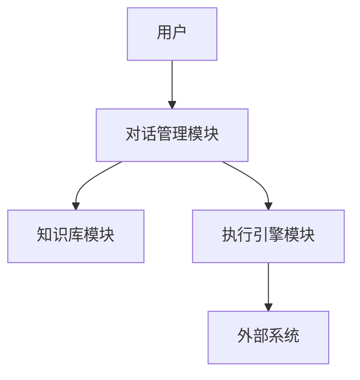
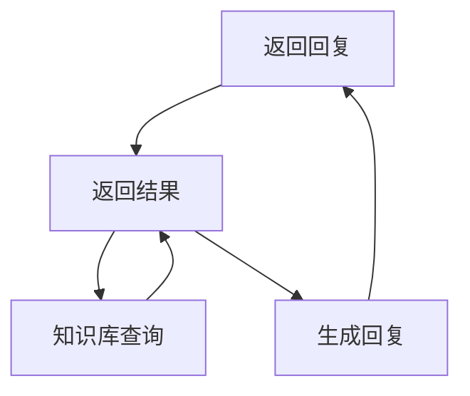

                 

<think>
好的，现在我要根据用户的要求，撰写一篇关于《政务AI Agent：提升公共服务效率》的技术博客文章。用户已经给出了一个详细的目录结构，我需要按照这个结构，逐步完成每一部分的内容。

首先，我需要理解用户的总体要求。用户希望文章结构清晰、逻辑严谨，内容要专业且易于理解。文章要涵盖政务AI Agent的背景、核心概念、技术原理、系统架构、项目实战以及总结等部分，并且每个部分都要有详细的分析和具体的示例。

接下来，我需要按照目录结构，逐步完成每一部分。在开始撰写之前，我需要确保每一部分都包含必要的内容，例如背景介绍、核心概念、算法原理、系统设计、项目实战等。

现在，我开始按照目录结构，逐步撰写每一部分内容。

# 政务AI Agent：提升公共服务效率

> 关键词：政务AI Agent、人工智能、公共服务效率、智慧政务、智能服务

> 摘要：本文深入探讨了政务AI Agent在提升公共服务效率中的应用。通过分析其核心概念、技术原理、系统架构以及实际案例，展示了如何利用AI技术优化政务服务流程，提升用户体验，实现智慧政务。

---

## 第1章: 政务AI Agent的背景与概念

### 1.1 政务AI Agent的起源与发展

#### 1.1.1 AI Agent的基本概念
AI Agent（人工智能代理）是指能够感知环境、自主决策并执行任务的智能实体。它通过传感器获取信息，利用推理和学习技术做出决策，并通过执行器与环境互动。AI Agent可以根据任务需求分为简单反应式代理、基于模型的反应式代理、基于目标的代理、基于效用的代理等类型。

#### 1.1.2 政务AI Agent的定义与特点
政务AI Agent是一种专门用于政务服务领域的AI Agent，旨在通过智能化手段提升公共服务效率和质量。其特点包括：
- **智能化**：能够理解和处理自然语言，具备自主决策能力。
- **便捷性**：为用户提供7×24小时的在线服务，随时随地响应需求。
- **高效性**：通过自动化流程减少人工干预，提高处理效率。
- **学习能力**：能够通过机器学习不断优化服务策略。

#### 1.1.3 政务AI Agent的发展历程
AI Agent技术的发展经历了从简单规则引擎到复杂深度学习模型的演变。在政务服务领域，AI Agent的应用始于简单的信息查询，逐步扩展到智能问答、服务推荐、流程自动化等领域。随着技术的进步，政务AI Agent正向智能化、个性化方向发展。

### 1.2 政务AI Agent的应用场景

#### 1.2.1 公共服务中的AI Agent
在公共服务领域，AI Agent可以处理各类公众咨询、投诉处理、信息查询等任务。例如，市民可以通过AI Agent查询社保信息、办理证件申请等。

#### 1.2.2 政务AI Agent在智慧城市中的应用
在智慧城市中，政务AI Agent可以集成交通管理、公共安全、环境保护等多方面的数据，为城市管理者提供智能化决策支持。

#### 1.2.3 政务AI Agent在政府决策中的作用
通过分析海量数据，政务AI Agent可以帮助政府预测趋势、优化资源配置，从而提高决策的科学性和前瞻性。

### 1.3 政务AI Agent的核心价值

#### 1.3.1 提升公共服务效率
通过自动化处理和智能推荐，AI Agent可以显著减少人工干预，提高服务效率。

#### 1.3.2 优化资源配置
AI Agent能够根据需求动态分配资源，避免资源浪费，提高整体效率。

#### 1.3.3 提高政府决策的智能化水平
通过数据挖掘和预测分析，AI Agent为政府决策提供科学依据，提升决策的准确性和效率。

### 1.4 本章小结
本章介绍了政务AI Agent的起源与发展，分析了其在政务服务中的应用场景，并总结了其核心价值。这些内容为后续的技术实现奠定了基础。

---

## 第2章: 政务AI Agent的核心概念与原理

### 2.1 政务AI Agent的基本原理

#### 2.1.1 AI Agent的定义与分类
AI Agent可以根据功能和应用场景分为多种类型，包括：
- **信息检索代理**：主要用于信息查询和检索。
- **智能问答代理**：能够理解和回答复杂问题。
- **自动化执行代理**：能够自动执行特定任务。

#### 2.1.2 政务AI Agent的组成部分
政务AI Agent通常包括以下几个关键部分：
- **知识库**：存储政务服务相关的知识和数据。
- **自然语言处理模块**：用于理解和生成自然语言。
- **推理引擎**：根据输入信息进行推理和决策。
- **执行模块**：将决策结果转化为实际操作。

#### 2.1.3 政务AI Agent的工作流程
1. **感知环境**：通过用户输入获取需求。
2. **理解需求**：利用自然语言处理技术解析用户意图。
3. **推理与决策**：基于知识库和推理引擎生成解决方案。
4. **执行任务**：通过执行模块完成任务或反馈结果。

### 2.2 政务AI Agent的核心技术

#### 2.2.1 自然语言处理技术
自然语言处理（NLP）是政务AI Agent实现智能对话的基础。常用的NLP技术包括分词、句法分析、实体识别、意图识别等。

#### 2.2.2 知识图谱构建技术
知识图谱用于表示政务服务相关的知识和信息，帮助AI Agent更好地理解用户需求。知识图谱构建涉及数据抽取、知识融合、图谱存储等步骤。

#### 2.2.3 机器学习与深度学习技术
机器学习和深度学习技术用于提升AI Agent的智能水平，包括模式识别、分类、聚类等任务。常用的算法有支持向量机（SVM）、随机森林（Random Forest）、神经网络等。

### 2.3 政务AI Agent的系统架构

#### 2.3.1 系统功能模块划分
- **知识库模块**：存储政务服务相关的知识和数据。
- **对话管理模块**：负责与用户的交互，理解需求并生成回复。
- **执行引擎模块**：根据需求调用相关服务或系统完成任务。

#### 2.3.2 系统架构设计
系统架构采用分层设计，包括用户层、业务逻辑层和数据层。用户层负责与用户交互，业务逻辑层处理请求并生成响应，数据层提供数据支持。

#### 2.3.3 系统接口设计
系统接口采用RESTful API设计，支持JSON格式的数据交换。主要接口包括：
- `/api/v1/chat`：处理用户对话请求。
- `/api/v1/task`：处理任务执行请求。

### 2.4 本章小结
本章详细介绍了政务AI Agent的核心概念与原理，包括其组成部分、工作流程和技术实现。这些内容为后续的算法设计和系统实现奠定了理论基础。

---

## 第3章: 政务AI Agent的算法原理与数学模型

### 3.1 政务AI Agent的算法基础

#### 3.1.1 基于规则的推理算法
基于规则的推理是一种简单的推理方法，适用于规则明确的场景。例如，根据用户输入匹配预定义的规则生成回复。

#### 3.1.2 基于机器学习的推理算法
基于机器学习的推理算法通过训练模型来学习数据中的模式，适用于复杂场景。常用的算法包括支持向量机（SVM）和随机森林（Random Forest）。

#### 3.1.3 基于深度学习的推理算法
深度学习算法（如神经网络）在处理自然语言任务时表现出色，适用于复杂的对话理解和生成。

### 3.2 政务AI Agent的数学模型

#### 3.2.1 概率论基础
概率论是机器学习的基础，用于处理不确定性问题。例如，贝叶斯定理常用于计算条件概率。

#### 3.2.2 优化算法基础
优化算法（如梯度下降）用于训练模型，最小化损失函数。

#### 3.2.3 知识图谱表示学习
知识图谱表示学习通过将实体和关系表示为向量，实现知识的语义表示。常用的方法包括TransE、TransH等。

### 3.3 算法实现与代码示例

#### 3.3.1 基于规则的推理代码示例
```python
def rule_based_inference(user_input, rules):
    for rule in rules:
        if matches(rule['condition'], user_input):
            return rule['action']
    return default_response
```

#### 3.3.2 基于机器学习的推理代码示例
```python
import joblib
model = joblib.load('chatbot_model.pkl')
prediction = model.predict(new_input)
```

#### 3.3.3 基于深度学习的推理代码示例
```python
import tensorflow as tf
model = tf.keras.models.load_model('chatbot_model.h5')
prediction = model.predict(new_input)
```

### 3.4 本章小结
本章详细介绍了政务AI Agent的算法基础和数学模型，包括基于规则的推理、机器学习和深度学习算法的实现。这些内容为系统设计和优化提供了理论支持。

---

## 第4章: 政务AI Agent的系统分析与设计

### 4.1 政务AI Agent的系统功能设计

#### 4.1.1 知识库构建模块
知识库构建模块负责收集和整理政务服务相关的知识，包括法律法规、业务流程、常见问题等。

#### 4.1.2 对话管理模块
对话管理模块负责处理用户输入，理解需求，并生成合适的回复。

#### 4.1.3 执行引擎模块
执行引擎模块负责根据用户需求调用相关服务或系统，完成任务执行。

### 4.2 政务AI Agent的系统架构设计

#### 4.2.1 系统架构图


#### 4.2.2 模块交互流程图


### 4.3 本章小结
本章详细描述了政务AI Agent的系统功能设计和架构设计，包括模块划分和交互流程。这些内容为系统的实际开发提供了指导。

---

## 第5章: 政务AI Agent的项目实战

### 5.1 项目背景与目标
本项目旨在开发一个基于AI的政务服务代理系统，提升公共服务效率和用户体验。

### 5.2 环境安装与配置
- **安装Python**：版本3.8以上
- **安装依赖库**：包括numpy、pandas、scikit-learn、tensorflow等
- **安装工具**：包括Jupyter Notebook、Git等

### 5.3 系统核心实现

#### 5.3.1 知识库构建
```python
from pymongo import MongoClient

client = MongoClient('mongodb://localhost:27017/')
db = client['government_ai']
collection = db['faq']
```

#### 5.3.2 对话管理模块
```python
def process_query(user_input):
    # 使用预训练的模型进行意图识别和回答生成
    pass
```

#### 5.3.3 执行引擎模块
```python
def execute_task(task):
    # 根据任务调用相关系统或服务
    pass
```

### 5.4 实际案例分析
通过一个具体的案例，展示如何利用政务AI Agent实现某项公共服务的自动化处理。

### 5.5 项目总结
本项目通过实际开发，验证了政务AI Agent在提升公共服务效率中的有效性。同时，也发现了一些需要进一步优化的地方，例如模型的准确性和系统的可扩展性。

---

## 第6章: 总结与展望

### 6.1 本章总结
本文全面探讨了政务AI Agent在提升公共服务效率中的应用。通过理论分析和实际案例，展示了AI技术在政务服务中的巨大潜力。

### 6.2 未来展望
随着AI技术的不断发展，政务AI Agent将更加智能化和个性化。未来的研究方向包括提高模型的可解释性、增强系统的自适应能力、拓展更多的应用场景等。

### 6.3 注意事项
在实际应用中，需要注意数据隐私、系统安全等问题，确保政务服务的安全性和可靠性。

### 6.4 拓展阅读
推荐读者阅读以下书籍和论文，以进一步深入了解相关技术：
- 《人工智能：一种现代的方法》
- 《深度学习》
- 《知识图谱：概念、方法与应用》

---

以上是《政务AI Agent：提升公共服务效率》的技术博客文章的完整内容。通过系统化的分析和实际案例的展示，本文详细探讨了政务AI Agent的核心概念、技术实现和应用价值，为相关领域的研究和实践提供了有益的参考。

