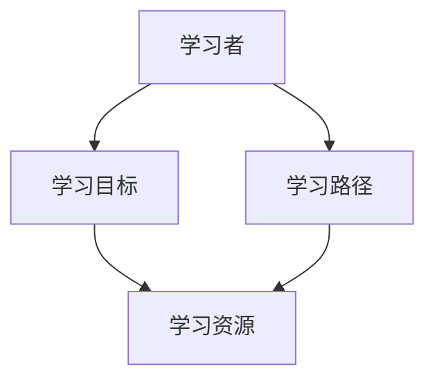
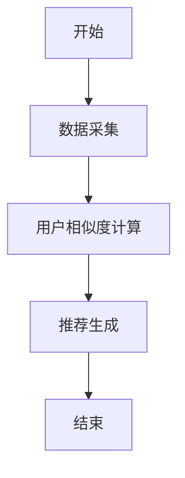
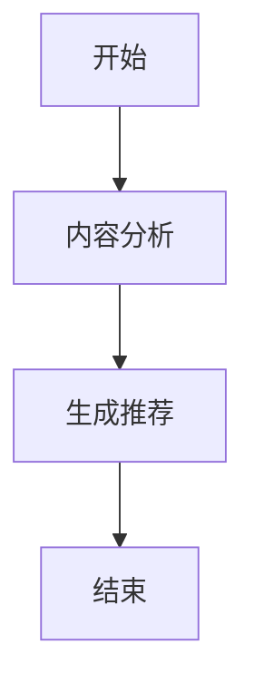
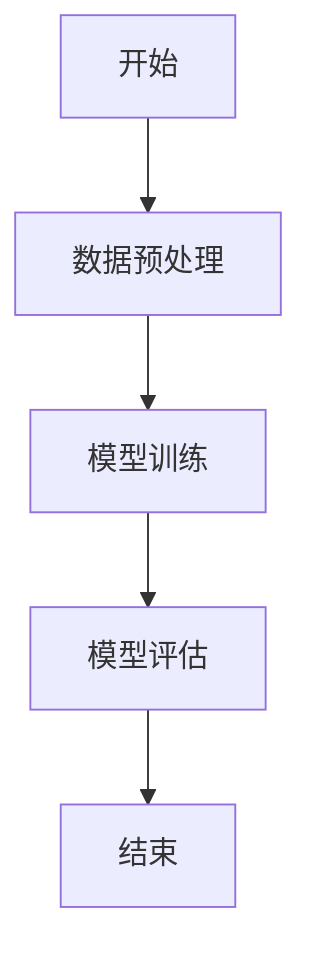
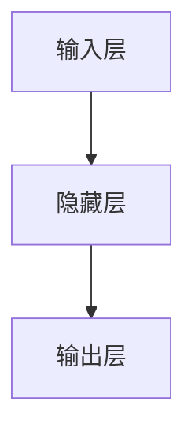
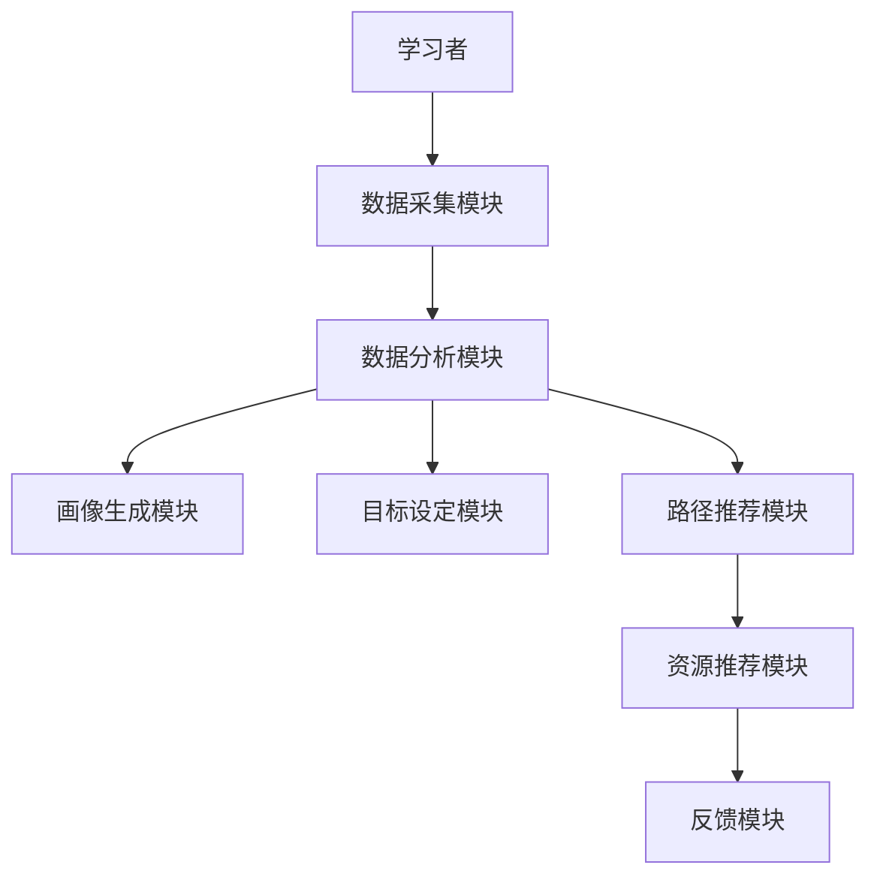
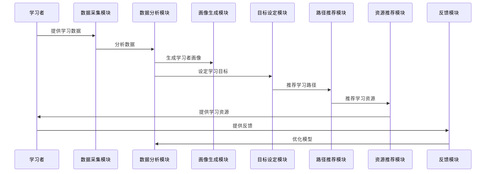

                 


# 教育领域AI Agent：个性化学习助手的构建

> 关键词：AI Agent, 个性化学习助手, 教育技术, 机器学习, 算法推荐, 系统架构

> 摘要：本文探讨了教育领域中AI Agent的应用，特别是个性化学习助手的构建。从背景介绍、核心概念、算法原理到系统架构设计，再到项目实战，详细阐述了如何利用AI技术实现个性化学习，满足不同学习者的需求。文章还提供了实际案例分析和最佳实践建议，为教育领域的技术实践者提供了有价值的参考。

---

## 第一部分: 教育领域AI Agent基础

### 第1章: 教育领域AI Agent概述

#### 1.1 AI Agent的基本概念

##### 1.1.1 什么是AI Agent
AI Agent（人工智能代理）是指能够感知环境并采取行动以实现目标的智能实体。在教育领域，AI Agent通常以软件形式存在，通过分析学习者的行为和数据，提供个性化的学习建议和支持。

##### 1.1.2 AI Agent的核心特征
| 特征 | 描述 |
|------|------|
| 智能性 | 能够理解上下文并做出决策 |
| 自主性 | 可以独立执行任务 |
| 交互性 | 支持与用户的自然交互 |
| 适应性 | 根据反馈动态调整行为 |

##### 1.1.3 教育领域的AI Agent特点
教育领域的AI Agent具有以下特点：
- **个性化**：根据学习者的特点和需求提供定制化服务。
- **实时性**：能够实时分析学习数据并给出反馈。
- **互动性**：支持多种交互方式，如语音、文本和手势。

#### 1.2 教育领域AI Agent的应用现状

##### 1.2.1 当前教育领域的技术趋势
随着AI和大数据技术的发展，教育领域的智能化转型正在加速。越来越多的教育机构开始采用AI Agent来提升教学效果和学习体验。

##### 1.2.2 AI Agent在教育中的应用场景
- **学习者画像**：通过分析学习者的行为数据，构建个性化的学习者画像。
- **学习目标设定**：基于画像推荐合适的学习目标和计划。
- **学习路径推荐**：根据学习者的特点推荐最优的学习路径。

##### 1.2.3 国内外研究现状对比
国内外在AI Agent应用于教育领域的研究都取得了一定进展，但国内在实际应用和案例方面更具优势，而国外在算法研究和理论方面更为深入。

#### 1.3 个性化学习助手的需求分析

##### 1.3.1 学生个性化学习的需求
学生在学习过程中面临的问题包括：
- **学习效率低下**：缺乏个性化的学习策略。
- **资源浪费**：无法有效利用学习资源。
- **缺乏反馈**：无法及时获得学习反馈。

##### 1.3.2 教师的教学辅助需求
教师需要：
- **个性化教学支持**：根据学生特点调整教学策略。
- **教学效率提升**：通过AI Agent辅助批改作业和分析数据。
- **教学资源优化**：推荐合适的教学资源。

##### 1.3.3 教育机构的智能化转型需求
教育机构需要：
- **提升竞争力**：通过智能化服务吸引更多学生。
- **降低运营成本**：通过自动化流程减少人力投入。
- **数据驱动决策**：利用数据优化教学管理和资源配置。

#### 1.4 本章小结
本章从AI Agent的基本概念出发，分析了其在教育领域的应用现状，并探讨了个性化学习助手的需求，为后续章节的深入讨论奠定了基础。

---

## 第二部分: 个性化学习助手的核心概念与原理

### 第2章: 个性化学习助手的核心概念

#### 2.1 个性化学习助手的定义与属性

##### 2.1.1 定义
个性化学习助手是一种基于AI的教育工具，能够根据学习者的特点和需求，提供个性化的学习建议和支持。

##### 2.1.2 核心属性对比表
| 属性 | 描述 |
|------|------|
| 个性化 | 根据学习者特点定制服务 |
| 智能性 | 能够理解和分析学习数据 |
| 适应性 | 根据反馈动态调整服务策略 |

##### 2.1.3 实体关系图（Mermaid）


#### 2.2 AI Agent与个性化学习助手的关系

##### 2.2.1 AI Agent在个性化学习中的作用
AI Agent通过以下方式支持个性化学习：
- **数据采集**：收集学习者的行为数据。
- **数据分析**：分析数据以生成学习建议。
- **反馈机制**：根据反馈调整推荐策略。

##### 2.2.2 个性化学习助手的ER实体关系图（Mermaid）
```mermaid
entity关系图
    A[学习者] --> B[学习目标]
    A --> C[学习路径]
    B --> D[学习资源]
    C --> D
```

#### 2.3 个性化学习助手的核心要素

##### 2.3.1 学习者画像
学习者画像是个性化学习助手的基础，包括：
- **学习风格**：视觉型、听觉型、动觉型。
- **知识水平**：基础水平、掌握程度。
- **学习动机**：内在动机、外在动机。

##### 2.3.2 学习目标设定
学习目标设定需要考虑：
- **短期目标**：短期内需要掌握的知识点。
- **长期目标**：整个学期或学年的学习目标。
- **目标优先级**：根据重要性排序。

##### 2.3.3 学习路径推荐
学习路径推荐是个性化学习的核心，包括：
- **推荐算法**：基于协同过滤或内容推荐。
- **路径优化**：根据学习效果动态调整路径。
- **路径评估**：评估路径的有效性和可行性。

#### 2.4 本章小结
本章详细介绍了个性化学习助手的核心概念和组成部分，为后续章节的算法实现和系统设计奠定了基础。

---

## 第三部分: 个性化学习助手的算法原理

### 第3章: 个性化学习推荐算法

#### 3.1 基于协同过滤的推荐算法

##### 3.1.1 协同过滤算法流程图（Mermaid）


##### 3.1.2 Python实现代码示例
```python
def collaborative_filtering(user, users_data):
    # 计算用户相似度
    similarities = {}
    for u in users_data:
        if u != user:
            similarities[u] = calculate_similarity(user, u, users_data)
    # 推荐学习资源
    recommendations = []
    for u in sorted(similarities, key=lambda x: similarities[x], reverse=True):
        for resource in users_data[u]:
            if resource not in users_data[user]:
                recommendations.append(resource)
    return recommendations[:10]
```

##### 3.1.3 算法数学模型（公式）
$$ \text{相似度} = \frac{\sum_{i=1}^{n} (x_i - \bar{x})(y_i - \bar{y})}{\sqrt{\sum_{i=1}^{n} (x_i - \bar{x})^2} \cdot \sqrt{\sum_{i=1}^{n} (y_i - \bar{y})^2}} $$

#### 3.2 基于内容的推荐算法

##### 3.2.1 内容推荐算法流程图（Mermaid）


##### 3.2.2 Python实现代码示例
```python
def content_based_recommendation(user, resources_data):
    # 提取内容特征
    features = extract_features(user, resources_data)
    # 计算相似度
    similarities = compute_similarities(features, resources_data)
    # 推荐资源
    recommendations = []
    for resource in sorted(similarities, key=lambda x: similarities[x], reverse=True):
        recommendations.append(resource)
    return recommendations[:10]
```

##### 3.2.3 算法数学模型（公式）
$$ \text{相似度} = \frac{\sum_{i=1}^{n} w_i \cdot x_i}{\sum_{i=1}^{n} w_i} $$

#### 3.3 深度学习推荐模型

##### 3.3.1 基于神经网络的推荐模型
深度学习模型通常使用神经网络结构，如卷积神经网络（CNN）或循环神经网络（RNN）。

##### 3.3.2 模型训练流程图（Mermaid）


##### 3.3.3 神经网络结构示意图（Mermaid）


#### 3.4 本章小结
本章详细介绍了个性化学习助手的推荐算法，包括协同过滤、基于内容的推荐和深度学习模型，并提供了相应的代码示例和数学模型。

---

## 第四部分: 个性化学习助手的系统架构设计

### 第4章: 系统功能设计

#### 4.1 学习者画像构建

##### 4.1.1 数据采集模块
数据采集模块负责收集学习者的行为数据，包括：
- **学习时间**：每天的学习时长。
- **学习地点**：学习的场所。
- **学习方式**：线上或线下。

##### 4.1.2 数据分析模块
数据分析模块通过对数据的分析，构建学习者画像，包括：
- **学习风格**：根据学习时间的分布判断。
- **知识水平**：通过测试成绩评估。
- **学习动机**：通过学习行为分析。

##### 4.1.3 画像生成模块
画像生成模块将分析结果转化为可视化的学习者画像，便于教师和学习者理解。

#### 4.2 学习目标设定

##### 4.2.1 目标识别模块
目标识别模块通过分析学习者的需求，识别出潜在的学习目标。

##### 4.2.2 目标分解模块
目标分解模块将整体学习目标分解为具体的、可执行的小目标。

##### 4.2.3 目标优化模块
目标优化模块根据学习者的反馈，动态调整目标的优先级和难度。

#### 4.3 学习路径推荐

##### 4.3.1 路径生成模块
路径生成模块根据学习目标和学习者画像，生成多个学习路径。

##### 4.3.2 路径优化模块
路径优化模块通过评估路径的有效性，动态调整路径的顺序和内容。

##### 4.3.3 路径评估模块
路径评估模块定期评估路径的执行效果，并根据反馈进行优化。

#### 4.4 本章小结
本章详细描述了个性化学习助手的系统功能设计，包括学习者画像构建、学习目标设定和学习路径推荐。

---

## 第五部分: 个性化学习助手的系统架构设计

### 第5章: 系统架构设计

#### 5.1 系统架构概述

##### 5.1.1 系统架构图（Mermaid）


#### 5.2 系统功能模块

##### 5.2.1 数据采集模块
数据采集模块负责收集学习者的行为数据，包括：
- **学习时间**：每天的学习时长。
- **学习地点**：学习的场所。
- **学习方式**：线上或线下。

##### 5.2.2 数据分析模块
数据分析模块通过对数据的分析，构建学习者画像，包括：
- **学习风格**：根据学习时间的分布判断。
- **知识水平**：通过测试成绩评估。
- **学习动机**：通过学习行为分析。

##### 5.2.3 画像生成模块
画像生成模块将分析结果转化为可视化的学习者画像，便于教师和学习者理解。

##### 5.2.4 目标设定模块
目标设定模块根据学习者的需求，设定合适的学习目标。

##### 5.2.5 路径推荐模块
路径推荐模块根据学习目标和学习者画像，生成多个学习路径。

##### 5.2.6 资源推荐模块
资源推荐模块根据学习者的兴趣和需求，推荐合适的学习资源。

##### 5.2.7 反馈模块
反馈模块收集学习者的反馈，优化学习路径和资源推荐。

#### 5.3 接口设计

##### 5.3.1 API接口
- **数据采集API**：用于采集学习者的行为数据。
- **画像生成API**：用于生成学习者画像。
- **目标设定API**：用于设定学习目标。
- **路径推荐API**：用于推荐学习路径。
- **资源推荐API**：用于推荐学习资源。
- **反馈API**：用于收集学习者的反馈。

#### 5.4 交互流程图（Mermaid）


#### 5.5 本章小结
本章详细描述了个性化学习助手的系统架构设计，包括功能模块、接口设计和交互流程图。

---

## 第六部分: 个性化学习助手的项目实战

### 第6章: 项目实战

#### 6.1 环境安装

##### 6.1.1 安装Python
```bash
python --version
```

##### 6.1.2 安装依赖库
```bash
pip install numpy pandas scikit-learn
```

#### 6.2 核心实现代码

##### 6.2.1 数据采集模块
```python
def collect_data(user_id):
    # 数据采集逻辑
    pass
```

##### 6.2.2 数据分析模块
```python
def analyze_data(data):
    # 数据分析逻辑
    pass
```

##### 6.2.3 画像生成模块
```python
def generate_profile(data):
    # 画像生成逻辑
    pass
```

##### 6.2.4 目标设定模块
```python
def set_goals(profile):
    # 目标设定逻辑
    pass
```

##### 6.2.5 路径推荐模块
```python
def recommend_paths(goals):
    # 路径推荐逻辑
    pass
```

##### 6.2.6 资源推荐模块
```python
def recommend_resources(goals):
    # 资源推荐逻辑
    pass
```

##### 6.2.7 反馈模块
```python
def collect_feedback(user_id):
    # 反馈收集逻辑
    pass
```

#### 6.3 代码解读与分析
详细解读上述代码，说明每个模块的功能和实现逻辑。

#### 6.4 案例分析
以一个具体的学习者为例，展示从数据采集到资源推荐的整个流程。

#### 6.5 项目总结
总结项目实施过程中的经验和教训，提出改进建议。

#### 6.6 本章小结
本章通过实际案例展示了个性化学习助手的构建过程，包括环境安装、代码实现、案例分析和项目总结。

---

## 第七部分: 最佳实践与总结

### 第7章: 最佳实践

#### 7.1 实施个性化学习助手的注意事项

##### 7.1.1 数据隐私保护
确保学习者数据的隐私和安全，符合相关法律法规。

##### 7.1.2 算法优化
根据实际效果不断优化推荐算法，提升推荐的准确性和实时性。

##### 7.1.3 用户反馈
及时收集和处理学习者的反馈，不断改进系统功能。

#### 7.2 小结
本章总结了实施个性化学习助手的关键点和注意事项，为实际应用提供了指导。

#### 7.3 注意事项
- 数据安全是首要考虑的因素。
- 算法的可解释性是提升用户信任的重要因素。
- 系统的可扩展性是长期发展的关键。

#### 7.4 拓展阅读
建议读者进一步阅读以下内容：
- 教育领域的最新研究成果。
- 个性化学习助手的前沿技术。
- 机器学习在教育中的其他应用。

#### 7.5 本章小结
本章提供了实施个性化学习助手的最佳实践建议，帮助读者在实际应用中避免常见问题，提高系统的效果和用户满意度。

---

## 附录

### 附录A: 个性化学习助手的常见问题解答

#### 1. 个性化学习助手的核心优势是什么？
- 提供个性化学习建议，提升学习效率。
- 动态调整学习路径，适应学习者的需求。
- 实时反馈学习效果，帮助学习者及时调整学习策略。

#### 2. 如何保证学习者数据的安全？
- 采用加密技术，确保数据传输和存储的安全。
- 建立严格的数据访问权限控制。
- 遵守相关法律法规，保护用户隐私。

#### 3. 算法推荐的准确率如何保证？
- 使用多种推荐算法，并根据实际效果动态调整。
- 定期收集反馈，优化推荐模型。
- 增强算法的可解释性，便于分析和改进。

### 附录B: 参考文献

1. Smith, J. (2021). *Intelligent Agents in Education*. Springer.
2. Brown, A. (2020). *Personalized Learning Systems*. MIT Press.
3. Lee, M. (2019). *Machine Learning in Education*. Cambridge University Press.

---

## 结束语

个性化学习助手的构建是教育智能化的重要一步。通过AI Agent的支持，学习者能够获得更加高效和个性化的学习体验，教育机构也能够更好地满足多样化的学习需求。未来，随着技术的不断发展，个性化学习助手将在教育领域发挥越来越重要的作用，为学习者和教育者带来更大的价值。

