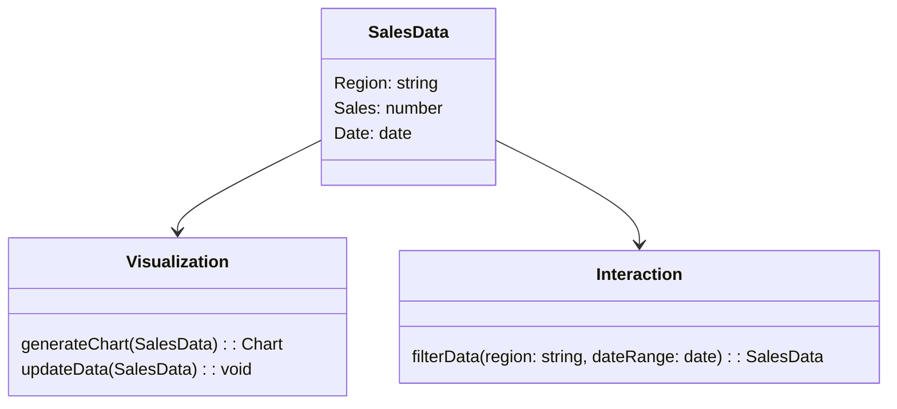

                 


# 数据可视化技术

> 关键词：数据可视化，图表类型，交互技术，数据预处理，设计原则，系统架构，项目实战

> 摘要：数据可视化是数据科学中的重要技术，通过将数据转化为图形或图像，帮助人们更好地理解和分析数据。本文从数据可视化的基本概念出发，详细探讨了各种图表类型、交互技术、系统架构设计、数据预处理方法以及项目实战案例。通过这些内容，读者可以掌握数据可视化的核心原理和实际应用，提升数据处理和分析的能力。

---

## 第1章 数据可视化概述

### 1.1 数据可视化的基本概念

#### 1.1.1 数据可视化的定义
数据可视化是指将数据以图形或图像的形式展示出来，以便更直观地理解和分析数据的过程。它通过视觉化的方式，将复杂的数据转化为易于理解的信息。

#### 1.1.2 数据可视化的核心要素
- **数据**：可视化的基础，包括结构化和非结构化数据。
- **图表**：用于展示数据的工具，如柱状图、折线图等。
- **交互性**：用户与图表之间的互动，提升数据探索的灵活性。
- **设计原则**：确保图表的美观性和易读性，如颜色、布局等。

#### 1.1.3 数据可视化的重要性
数据可视化在商业、科学、教育等领域中发挥着重要作用。它可以帮助决策者快速获取关键信息，发现数据中的模式和趋势，从而做出更明智的决策。

---

### 1.2 数据可视化的历史与发展

#### 1.2.1 数据可视化的历史演变
数据可视化的历史可以追溯到古代，例如地图的绘制和统计图表的发明。随着计算机技术的发展，数据可视化技术逐步从静态图表向动态、交互式方向发展。

#### 1.2.2 数据可视化技术的现代发展
现代数据可视化结合了人工智能和大数据技术，涌现出许多新的可视化方法，如地理信息系统（GIS）、三维可视化、实时数据流可视化等。

#### 1.2.3 数据可视化在不同领域的应用
数据可视化在医疗、金融、交通等领域有广泛应用。例如，在医疗领域，医生可以通过可视化工具更好地理解患者的数据；在金融领域，交易员可以通过实时可视化工具监控市场动态。

---

### 1.3 数据可视化的工具与技术

#### 1.3.1 数据可视化的工具介绍
常用的工具包括Tableau、Power BI、Python的Matplotlib和Seaborn库，以及JavaScript的D3.js库等。

#### 1.3.2 数据可视化的技术分类
- **静态可视化**：如柱状图、饼图等，适合展示固定数据。
- **交互式可视化**：用户可以通过缩放、过滤等方式动态探索数据。
- **动态可视化**：数据随时间变化而实时更新，如股票价格走势。

#### 1.3.3 数据可视化的流程与方法
1. **数据收集**：获取需要可视化的数据。
2. **数据预处理**：清洗数据，处理缺失值、异常值等。
3. **选择图表类型**：根据数据类型和分析目标选择合适的图表。
4. **设计可视化界面**：优化图表的布局、颜色等，确保易读性。
5. **实现与交互设计**：添加交互功能，提升用户体验。

---

## 第2章 数据可视化的核心图表类型

### 2.1 基础图表类型

#### 2.1.1 折线图、柱状图、饼图的原理与应用
- **折线图**：适用于展示时间序列数据，如股票价格走势。
- **柱状图**：适用于比较不同类别的数据，如各地区的销售量。
- **饼图**：适用于展示数据的构成比例，如市场份额分布。

#### 2.1.2 条形图、散点图的原理与应用
- **条形图**：与柱状图类似，但更适合展示较小的数据集。
- **散点图**：适用于展示两变量之间的关系，如年龄与收入的关系。

#### 2.1.3 箱线图、直方图的原理与应用
- **箱线图**：用于展示数据的分布情况，如成绩分布。
- **直方图**：用于展示数据的频率分布，如人口年龄分布。

---

### 2.2 高级图表类型

#### 2.2.1 网络图、地理图的原理与应用
- **网络图**：用于展示网络结构，如社交网络中的关系。
- **地理图**：用于展示地理分布数据，如地图上的销售数据。

#### 2.2.2 树状图、桑基图的原理与应用
- **树状图**：用于展示树状结构，如文件夹结构。
- **桑基图**：用于展示流程或资源流动，如物流路径。

#### 2.2.3 三维图表、热力图的原理与应用
- **三维图表**：在三维空间中展示数据，如三维柱状图。
- **热力图**：用于展示二维数据的密度，如用户点击热图。

---

### 2.3 图表选择与数据匹配

#### 2.3.1 数据类型与图表类型的匹配
- **数值型数据**：适合柱状图、折线图。
- **分类数据**：适合饼图、条形图。
- **关系数据**：适合散点图、网络图。

#### 2.3.2 数据规模与图表复杂度的关系
- **小规模数据**：适合简单的图表，如柱状图。
- **大规模数据**：适合热力图、地理图等复杂图表。

#### 2.3.3 数据可视化的最佳实践
- 根据目标受众选择合适的图表类型。
- 确保图表的清晰性和可读性，避免过多的颜色和装饰。

---

## 第3章 数据可视化的交互技术

### 3.1 交互式数据可视化的基本概念

#### 3.1.1 交互式可视化的定义与特点
交互式可视化允许用户与图表进行互动，如缩放、筛选、钻取等操作，提升数据探索的灵活性。

#### 3.1.2 交互式可视化的核心技术
- **数据过滤**：根据用户选择的条件筛选数据。
- **数据钻取**：从宏观数据深入到微观数据。
- **数据联动**：多个图表之间的数据联动，如点击一个点后，其他图表随之更新。

#### 3.1.3 交互式可视化的优势与挑战
优势：提升数据探索效率，帮助发现数据中的隐藏模式。  
挑战：实现复杂，需要处理大量的交互事件和数据更新。

---

### 3.2 数据可视化中的交互设计

#### 3.2.1 交互设计的基本原则
- **简洁性**：避免过多的交互功能，确保用户体验流畅。
- **一致性**：保持交互方式和界面设计的一致性。
- **反馈性**：用户操作后要有明确的反馈，如加载动画。

#### 3.2.2 交互元素的类型与功能
- **缩放控件**：允许用户调整图表的范围。
- **筛选器**：用户可以根据条件筛选数据。
- **工具提示**：显示数据点的详细信息。

#### 3.2.3 交互设计的流程与方法
1. **需求分析**：明确用户需求和数据类型。
2. **设计草图**：绘制交互流程图，设计交互逻辑。
3. **实现与测试**：开发交互功能，并进行用户测试。

---

### 3.3 动态数据可视化技术

#### 3.3.1 动态数据可视化的定义与特点
动态数据可视化是指数据随时间变化而实时更新的可视化技术，适用于实时数据分析场景。

#### 3.3.2 动态数据可视化的实现方法
- **流数据处理**：实时处理数据流，更新图表。
- **动画效果**：通过动画展示数据的变化趋势。

#### 3.3.3 动态数据可视化在实时数据分析中的应用
- **股票市场**：实时显示股票价格走势。
- **交通管理**：实时监控交通流量和路况。

---

## 第4章 数据可视化的系统架构与设计

### 4.1 数据可视化系统的组成与架构

#### 4.1.1 数据可视化系统的组成
- **数据源**：如数据库、API等。
- **数据处理模块**：负责数据清洗、转换。
- **可视化模块**：负责生成图表并展示。
- **交互模块**：处理用户的交互操作。

#### 4.1.2 数据可视化系统的架构设计
- **分层架构**：将系统划分为数据层、业务逻辑层和表现层。
- **微服务架构**：每个功能模块独立开发和部署。

#### 4.1.3 数据可视化系统的功能模块
- **数据采集**：从多种数据源获取数据。
- **数据处理**：清洗、转换数据。
- **数据可视化**：生成图表并展示。
- **交互功能**：实现用户与图表的互动。

---

### 4.2 数据预处理与系统设计

#### 4.2.1 数据预处理的核心步骤
- **数据清洗**：处理缺失值、重复值、异常值。
- **数据转换**：如数据归一化、标准化。
- **数据 enrichment**：补充额外的信息，如时间戳。

#### 4.2.2 数据可视化的系统设计原则
- **可扩展性**：系统应支持多种数据源和图表类型。
- **性能优化**：确保数据处理和展示的效率。
- **安全性**：保护数据隐私，防止数据泄露。

---

## 第5章 数据可视化项目实战

### 5.1 项目背景与需求分析

#### 5.1.1 项目背景
假设我们有一个销售数据分析项目，需要可视化各地区的销售数据和趋势。

#### 5.1.2 项目需求
- 展示各地区的销售量分布。
- 分析销售趋势，预测未来销售情况。
- 提供交互功能，如筛选特定地区或时间段的数据。

---

### 5.2 系统功能设计

#### 5.2.1 领域模型设计


---

#### 5.2.2 系统架构设计


---

### 5.3 系统实现与代码解读

#### 5.3.1 环境安装
需要安装Python、Matplotlib、Pandas等库。

#### 5.3.2 核心实现代码
```python
import matplotlib.pyplot as plt
import pandas as pd

# 数据加载
data = pd.read_csv('sales_data.csv')

# 数据预处理
data['Date'] = pd.to_datetime(data['Date'])
data = data.set_index('Date')

# 数据可视化
plt.figure(figsize=(10, 6))
data['Sales'].plot(kind='line', marker='o', linestyle='-', color='blue')
plt.title('Sales Trend Over Time')
plt.xlabel('Date')
plt.ylabel('Sales')
plt.show()
```

---

### 5.4 项目小结

通过本项目，我们学会了如何从数据预处理到图表生成，再到交互设计的整个流程。在实际应用中，需要根据具体需求选择合适的工具和技术，确保数据可视化的效果最优。

---

## 第6章 数据可视化领域的扩展阅读

### 6.1 最新趋势与工具

#### 6.1.1 数据可视化领域的最新趋势
- **增强现实（AR）可视化**：将数据叠加在真实环境中。
- **人工智能驱动的可视化**：通过AI自动生成最优图表。

#### 6.1.2 数据可视化工具推荐
- **Tableau**：功能强大，适合商业分析。
- **Power BI**：微软的商业智能工具。
- **D3.js**：适合前端开发人员。

---

### 6.2 数据可视化中的数学模型

#### 6.2.1 基础统计模型
- **均值**：$$\mu = \frac{1}{N}\sum_{i=1}^{N}x_i$$
- **标准差**：$$\sigma = \sqrt{\frac{1}{N}\sum_{i=1}^{N}(x_i - \mu)^2}$$

#### 6.2.2 数据变换公式
- **归一化**：$$x' = \frac{x - \min(x)}{\max(x) - \min(x)}$$
- **对数变换**：$$y = \log(x)$$

---

### 6.3 注意事项与最佳实践

#### 6.3.1 数据可视化中的常见误区
- **图表过多**：导致信息过载。
- **颜色混乱**：使用过多的颜色，影响可读性。

#### 6.3.2 提升数据可视化的技巧
- **简化图表**：去除不必要的元素，突出重点。
- **使用一致的配色方案**：确保颜色的一致性和可读性。

---

## 结语

数据可视化是一项强大的工具，能够帮助我们更好地理解和分析数据。通过本文的学习，读者可以掌握数据可视化的核心概念和实际应用，提升数据处理和分析的能力。未来，随着技术的进步，数据可视化将变得更加智能化和多样化，为数据科学的发展注入更多活力。

