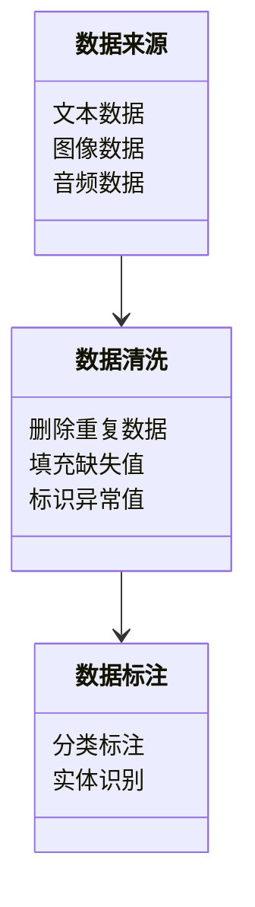

                 


# 数据收集策略：为AI Agent打造高质量数据集

> 关键词：数据收集策略、AI Agent、数据集、数据质量、特征提取

> 摘要：本文详细探讨了为AI Agent打造高质量数据集的关键策略，涵盖数据收集的背景、核心概念、算法原理、系统设计及项目实战等内容，旨在帮助读者系统性地理解和应用数据收集策略，从而提升AI Agent的性能和效果。

---

## 第一部分: 数据收集策略的背景与核心概念

### 第1章: 数据收集策略的背景与重要性

#### 1.1 数据收集在AI Agent中的作用

##### 1.1.1 数据收集的核心概念

数据收集是AI Agent系统中至关重要的一步，它决定了模型后续的学习和推理能力。高质量的数据集能够为AI Agent提供丰富的知识库，使其能够准确理解和响应用户的需求。

##### 1.1.2 数据收集的背景与问题描述

随着AI技术的快速发展，AI Agent的应用场景越来越广泛，从智能助手到自动驾驶，数据收集的重要性日益凸显。然而，数据收集过程中面临诸多挑战，如数据来源多样性、数据清洗复杂性以及数据偏差问题。

##### 1.1.3 数据收集对AI Agent的影响

数据质量直接影响AI Agent的性能。高质量的数据能够提升模型的准确性和泛化能力，而低质量的数据可能导致模型决策失误。

---

#### 1.2 数据集质量与AI Agent性能的关系

##### 1.2.1 数据质量对模型性能的影响

数据质量包括完整性、一致性和准确性。高质量的数据能够减少模型训练中的噪声，提升学习效果。

##### 1.2.2 数据多样性与模型泛化能力

多样化的数据能够帮助模型更好地适应不同场景，提升模型的泛化能力。

##### 1.2.3 数据偏差对模型决策的影响

数据偏差可能导致模型在特定群体或场景中表现不佳，甚至产生不公平的结果。

---

## 第2章: 数据收集策略的核心概念

### 2.1 数据来源与分类

#### 2.1.1 数据来源的多样性

数据来源可以是文本、图像、音频等多种形式，每种来源都有其独特的特点和挑战。

#### 2.1.2 数据的分类与特征

数据可以通过结构化、半结构化和非结构化进行分类，每种类型的数据都需要不同的处理方法。

#### 2.1.3 数据收集的边界与外延

数据收集需要明确边界，避免收集无关或敏感信息，同时要考虑数据的扩展性和可维护性。

---

### 2.2 数据收集策略的原理与方法

#### 2.2.1 数据收集的原理

数据收集的目的是获取高质量、多样化的数据，为模型训练提供坚实的基础。

#### 2.2.2 数据收集的主要方法

包括主动收集（如爬虫技术）、被动收集（如用户输入）和合成数据生成等方法。

#### 2.2.3 数据收集策略的优缺点对比

主动收集数据量大但成本高，被动收集数据真实但覆盖面有限，合成数据生成灵活但可能缺乏真实性。

---

## 第3章: 数据收集策略的系统分析与架构设计

### 3.1 数据收集的系统功能设计

#### 3.1.1 数据来源的领域模型

使用Mermaid类图展示数据来源的实体关系，明确各实体之间的关联和作用。



#### 3.1.2 数据清洗与预处理功能

数据清洗是去除噪声、填补缺失值和处理异常值的过程，确保数据的完整性和一致性。

#### 3.1.3 数据标注与增强功能

数据标注为数据打上标签，数据增强则通过技术手段提升数据的多样性。

---

### 3.2 数据收集策略的系统架构设计

#### 3.2.1 系统架构的分层设计

系统架构分为数据采集层、数据处理层和数据存储层，每层负责不同的功能。

#### 3.2.2 数据流的处理流程

数据从采集到存储的整个流程，包括采集、清洗、标注和存储。

#### 3.2.3 系统接口的设计与交互

系统接口设计包括数据输入接口、数据处理接口和数据输出接口，确保各模块之间的高效协作。

---

## 第4章: 数据收集策略的算法原理与实现

### 4.1 数据清洗算法

#### 4.1.1 数据清洗的流程

数据清洗的流程包括识别异常值、删除重复数据和填补缺失值。

#### 4.1.2 数据清洗的算法实现

使用Python代码实现数据清洗，例如处理缺失值和异常值。

```python
import pandas as pd

# 示例数据
data = {'A': [1, 2, 3, None, 5],
        'B': [None, 6, 7, 8, 9]}
df = pd.DataFrame(data)

# 删除重复数据
df.drop_duplicates()

# 填补缺失值
df.fillna(df.mean())
```

#### 4.1.3 数据清洗的数学模型

数据清洗中的均值计算公式：

$$ \text{均值} = \frac{1}{n}\sum_{i=1}^{n}x_i $$

---

### 4.2 数据特征提取算法

#### 4.2.1 特征提取的原理

特征提取是从数据中提取有用特征的过程，常见的方法包括主成分分析（PCA）。

#### 4.2.2 特征提取的实现步骤

使用PCA进行特征降维，代码示例如下：

```python
from sklearn.decomposition import PCA

# 示例数据
X = df.values

# PCA降维
pca = PCA(n_components=2)
principal_components = pca.fit_transform(X)
```

#### 4.2.3 特征提取的数学公式

主成分分析的协方差矩阵公式：

$$ \text{协方差矩阵} = \frac{1}{n-1}X^T X $$

---

## 第5章: 数据收集策略的项目实战

### 5.1 数据收集的环境搭建

#### 5.1.1 开发环境的安装与配置

安装必要的库，如Pandas、NumPy和Scikit-learn。

#### 5.1.2 数据来源的获取与准备

从公开数据集获取数据，如Kaggle或UCI Machine Learning Repository。

---

### 5.2 数据收集的核心实现

#### 5.2.1 数据清洗的代码实现

```python
import pandas as pd

# 示例数据
data = {'A': [1, 2, 3, None, 5],
        'B': [None, 6, 7, 8, 9]}
df = pd.DataFrame(data)

# 删除重复数据
df.drop_duplicates(inplace=True)

# 填补缺失值
df['A'].fillna(df['A'].mean(), inplace=True)
df['B'].fillna(df['B'].mean(), inplace=True)
```

#### 5.2.2 数据特征提取的代码实现

```python
from sklearn.decomposition import PCA

# 示例数据
X = df.values

# PCA降维
pca = PCA(n_components=2)
principal_components = pca.fit_transform(X)

print(principal_components)
```

#### 5.2.3 数据标注与增强的代码实现

使用图像增强库（如OpenCV）对图像数据进行增强。

---

## 第6章: 数据收集策略的最佳实践与小结

### 6.1 数据收集策略的注意事项

#### 6.1.1 数据收集中的常见问题

包括数据偏差、数据隐私和数据安全问题。

#### 6.1.2 数据收集的优化技巧

如使用分布式爬虫、数据预处理和数据验证技术。

#### 6.1.3 数据收集的法律与伦理问题

确保数据收集符合相关法律法规，尊重用户隐私。

---

### 6.2 数据收集策略的拓展阅读

#### 6.2.1 数据收集的前沿技术

如联邦学习、差分隐私和生成对抗网络（GAN）生成数据。

#### 6.2.2 数据收集的未来趋势

更加智能化、自动化和个性化的数据收集方式。

#### 6.2.3 数据收集的行业应用案例

如金融行业的风险评估、医疗行业的疾病诊断和自动驾驶的环境感知。

---

### 6.3 本章小结

#### 6.3.1 核心知识点回顾

数据收集是AI Agent的基础，高质量的数据能够显著提升模型性能。

#### 6.3.2 学习成果总结

通过本文的学习，读者掌握了数据收集的核心概念、算法原理和系统设计方法。

#### 6.3.3 未来学习方向

进一步学习数据增强技术、数据隐私保护和数据质量管理方法。

