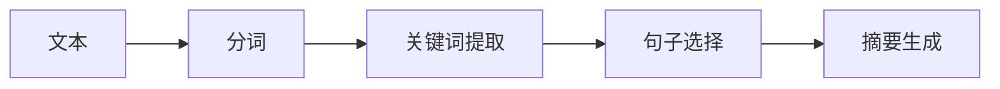
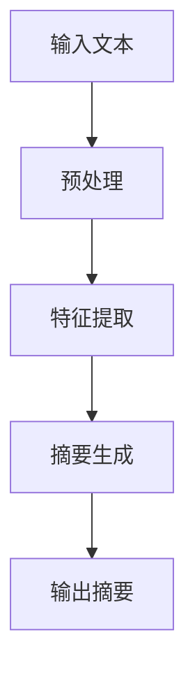
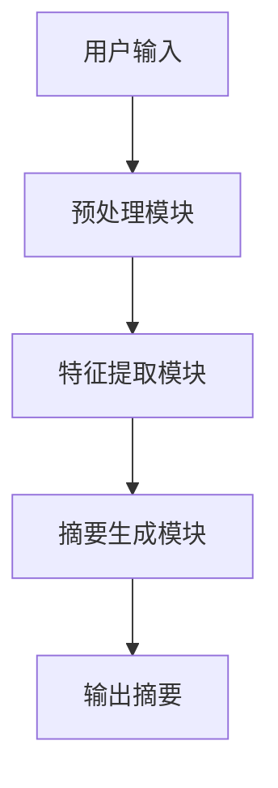

                 


# 文本摘要技术：AI Agent信息处理的利器

> 关键词：文本摘要技术、AI Agent、自然语言处理（NLP）、深度学习、信息提取、信息压缩

> 摘要：本文将深入探讨文本摘要技术的核心概念、算法原理、系统架构及应用场景，旨在帮助读者全面理解并掌握这一技术，提升AI Agent的信息处理能力。

---

## 第一部分: 文本摘要技术的背景与应用

### 第1章: 文本摘要技术的背景与应用

#### 1.1 文本摘要的定义与背景
- **文本摘要的定义**：文本摘要是指从大量文本中提取关键信息，生成简洁、准确的摘要的过程。
- **技术背景**：随着互联网信息的爆炸式增长，如何快速获取关键信息成为一个重要挑战。文本摘要技术应运而生，帮助人们高效处理信息。

#### 1.2 文本摘要技术的技术基础
- **自然语言处理（NLP）**：NLP是文本摘要的核心技术，涉及分词、句法分析等。
- **信息提取与信息压缩**：通过提取文本中的关键信息并进行压缩，生成摘要。
- **相似度计算与文本生成**：利用相似度计算确定文本中最重要的部分，并通过文本生成技术生成摘要。

#### 1.3 文本摘要技术的应用场景
- **学术研究**：帮助研究人员快速阅读论文。
- **工商领域**：用于商业报告、市场分析等。
- **信息检索**：提高搜索效率。

#### 1.4 文本摘要技术的挑战与未来方向
- **技术挑战**：如何平衡摘要的长度与信息量。
- **未来方向**：结合多模态数据，提升摘要的准确性和可读性。

---

## 第二部分: 文本摘要技术的核心概念与原理

### 第2章: 文本摘要的核心概念与联系

#### 2.1 文本摘要的核心概念
- **输入与输出**：输入是原始文本，输出是摘要。
- **质量评估标准**：包括准确度、简洁度、流畅度等。
- **长度与信息保留度**：摘要长度通常为原文的10%-20%。

#### 2.2 文本摘要的模型与算法
- **基于统计的模型**：如TF-IDF。
- **基于深度学习的模型**：如Transformer。

#### 2.3 文本摘要的实体关系图


#### 2.4 文本摘要的算法流程图


---

## 第三部分: 文本摘要技术的算法原理

### 第3章: 基于统计的文本摘要算法

#### 3.1 基于TF-IDF的文本摘要
- **定义与计算公式**：TF-IDF(t, d) = TF(t, d) × IDF(t)。
- **应用**：通过计算词的重要性，提取关键词。

#### 3.2 基于LSA的文本摘要
- **定义与原理**：通过降维技术，提取文本的主题信息。
- **实现**：将文本矩阵进行奇异值分解（SVD），得到主题向量。

#### 3.3 对比分析
- **TF-IDF与LSA对比**：TF-IDF简单但不够准确，LSA能够捕捉语义信息。

---

### 第4章: 基于深度学习的文本摘要算法

#### 4.1 基于RNN的文本摘要
- **定义与原理**：RNN通过循环结构处理序列数据。
- **实现**：将文本编码为向量，生成摘要。

#### 4.2 基于Transformer的文本摘要
- **定义与原理**：Transformer通过自注意力机制捕捉全局信息。
- **实现**：使用编码器-解码器结构生成摘要。

#### 4.3 对比分析
- **RNN与Transformer对比**：RNN处理长文本时效果差，Transformer性能优越。

---

## 第四部分: 文本摘要技术的系统架构设计

### 第5章: 文本摘要系统的架构与实现

#### 5.1 系统功能设计
- **功能模块**：预处理模块、特征提取模块、摘要生成模块。

#### 5.2 系统架构设计


#### 5.3 接口设计
- **输入接口**：接收文本数据。
- **输出接口**：返回摘要结果。

---

## 第五部分: 项目实战

### 第6章: 文本摘要项目实战

#### 6.1 环境安装
- **工具安装**：安装Python、TensorFlow、Keras等。

#### 6.2 核心实现
```python
import tensorflow as tf
from tensorflow.keras import layers

# 模型定义
def text_summarization_model():
    encoder = layers.Input(shape=(None, 128))
    decoder = layers.Input(shape=(None, 128))
    # 编码器
    encoder_output = layers.Bidirectional(layers.LSTM(128, return_sequences=True))(encoder)
    encoder_output = layers.Dropout(0.5)(encoder_output)
    encoder_output = layers.TimeDistributed(layers.Dense(128, activation='relu'))(encoder_output)
    # 解码器
    decoder_output = layers.LSTM(128, return_sequences=True)(decoder, initial_state=[encoder_output[-1], encoder_output[-1]])
    decoder_output = layers.TimeDistributed(layers.Dense(128, activation='relu'))(decoder_output)
    # 输出层
    output = layers.Dense(128, activation='softmax')(decoder_output)
    return tf.keras.Model(inputs=[encoder, decoder], outputs=output)
```

#### 6.3 案例分析
- **案例**：对一篇新闻文章进行摘要生成，展示算法的效果。

#### 6.4 总结与优化
- **总结**：文本摘要技术的应用前景广阔。
- **优化方向**：结合领域知识，提升摘要的准确性。

---

## 第六部分: 最佳实践与总结

### 第7章: 最佳实践与总结

#### 7.1 最佳实践
- **小结**：文本摘要技术的关键在于模型选择和参数调优。
- **注意事项**：注意数据预处理和模型的泛化能力。

#### 7.2 拓展阅读
- **推荐书籍**：《Deep Learning》、《自然语言处理入门》。

---

通过以上结构，我们可以全面、系统地了解文本摘要技术的核心原理和实际应用。希望这篇博客能够帮助读者深入理解并掌握这一技术，为AI Agent的信息处理能力提供强有力的支撑。

