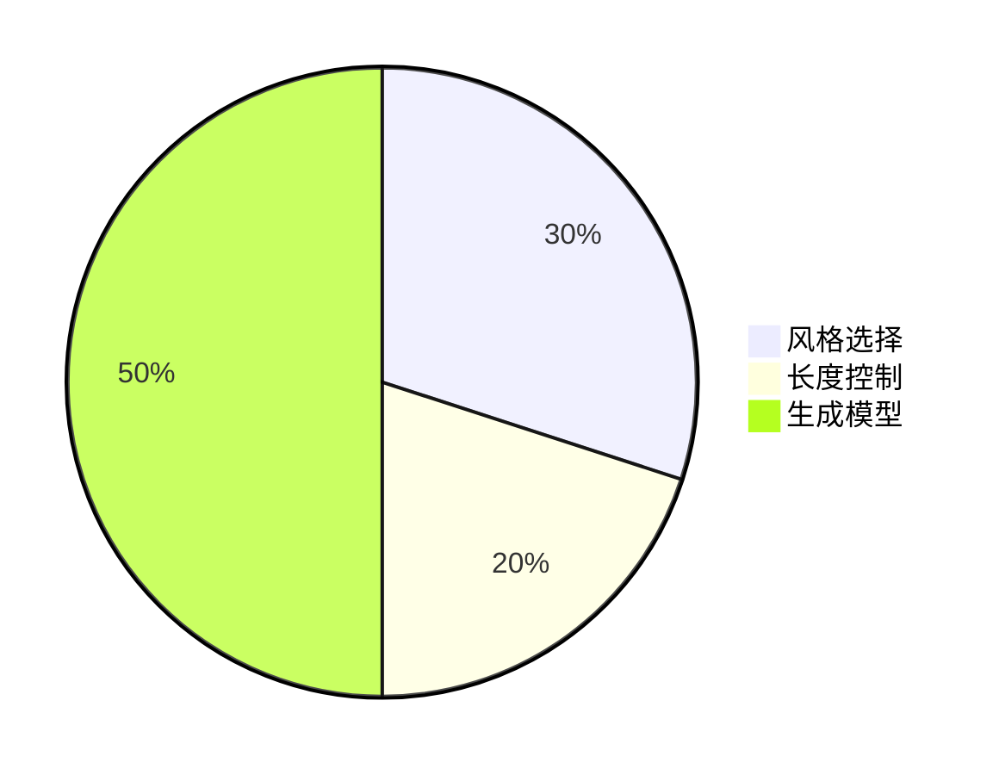

                 


# 文本生成控制：调节AI Agent的输出风格和长度

## 关键词：
- 文本生成控制
- AI Agent
- 风格调节
- 长度控制
- 自然语言处理
- 生成模型
- 用户需求定制

## 摘要：
本文深入探讨了如何调节AI Agent生成文本的输出风格和长度，旨在帮助读者理解文本生成控制的核心概念、算法原理、系统架构及实际应用。文章从背景介绍、核心概念、算法实现、系统设计、项目实战到最佳实践，全面解析了文本生成控制的关键技术与应用方法，为AI开发者和研究人员提供了理论与实践的双重指导。

---

## 第1章: 引言

### 1.1 研究背景
AI生成技术在自然语言处理领域取得了显著进展，文本生成模型如GPT、BERT等被广泛应用。然而，这些模型生成的文本往往缺乏对风格和长度的精准控制，导致输出结果难以满足特定场景下的用户需求。例如，在商业文案中，用户可能需要简洁明了的风格；在文学创作中，用户可能需要更具个性化和复杂的表达。

### 1.2 研究意义
文本生成控制技术能够帮助AI Agent更好地适应不同场景和用户需求，提升用户体验和生成内容的实用性。通过调节文本风格和长度，AI Agent可以在教育、医疗、金融等领域提供更加精准和专业的服务。

### 1.3 内容框架
本文从定义、原理、算法、系统设计、项目实战到最佳实践，全面解析文本生成控制技术。通过案例分析和代码实现，帮助读者掌握如何在实际项目中应用这些技术。

---

## 第2章: 文本生成控制的核心概念

### 2.1 文本生成控制的定义
文本生成控制是指通过特定的算法和策略，调节生成文本的风格和长度，使其符合用户需求的过程。

### 2.2 文本生成控制的类型
#### 2.2.1 风格控制
- **语言风格**：包括正式、口语化、技术性、文学性等风格。
- **实现方法**：基于条件的生成模型，通过调整模型参数或输入条件来实现风格切换。

#### 2.2.2 长度控制
- **文本长度**：通常通过设置生成步数或使用长度惩罚因子来实现。
- **实现策略**：结合生成模型的内在机制，动态调整生成过程中的参数。

### 2.3 文本生成控制的关键要素
- **输入条件**：包括用户意图、上下文信息等。
- **控制参数**：如风格标签、长度限制等。
- **输出结果**：生成的文本需符合指定风格和长度要求。

---

## 第3章: 文本生成模型的原理与架构

### 3.1 生成模型的基本原理
文本生成模型通常基于概率分布和生成式模型。例如，Transformer模型通过自注意力机制捕捉文本中的长程依赖关系，生成连贯的上下文信息。

### 3.2 常见生成模型的架构
- **Transformer架构**：
  - **编码器**：将输入文本转换为上下文向量。
  - **解码器**：根据上下文生成目标文本。
- **LSTM架构**：
  - 通过循环神经网络处理序列数据，捕捉时序信息。

### 3.3 模型训练与优化
- **监督学习**：使用大量标注数据进行训练。
- **参数优化**：通过梯度下降等方法优化模型参数。

---

## 第4章: 风格控制的算法实现

### 4.1 风格控制的基本思路
通过引入条件变量，如风格标签，来指导生成模型的输出。例如，生成一段技术性文本时，输入条件可以是“技术性”。

### 4.2 基于条件的生成模型
- **条件式生成**：
  ```mermaid
  graph TD
      A[输入文本] --> B[编码器]
      B --> C[风格标签]
      C --> D[解码器]
      D --> E[输出文本]
  ```

---

## 第5章: 长度控制的算法实现

### 5.1 长度控制的基本思路
通过设置生成步数或在损失函数中引入长度惩罚因子，控制生成文本的长度。

### 5.2 长度控制的实现策略
- **生成步数限制**：设置生成的token数量上限。
- **长度惩罚因子**：
  - 在损失函数中加入惩罚项，如交叉熵损失乘以长度因子。

---

## 第6章: 系统分析与架构设计

### 6.1 问题场景介绍
用户希望AI Agent生成符合特定风格和长度要求的文本，如生成一段正式的商业邮件。

### 6.2 系统功能设计
- **风格选择模块**：提供多种风格选项，用户选择或输入风格标签。
- **长度控制模块**：根据用户需求调整生成文本的长度。

### 6.3 系统架构设计


---

## 第7章: 项目实战

### 7.1 环境安装
安装必要的库，如TensorFlow、Keras、numpy。

### 7.2 核心代码实现
```python
import tensorflow as tf
from tensorflow.keras.layers import Dense, Input, LSTM, Dropout
from tensorflow.keras.models import Model

# 定义生成模型
def build_model(vocab_size, embedding_dim, units):
    input_layer = Input(shape=(None,))
    x = LSTM(units, return_sequences=True)(input_layer)
    x = Dropout(0.5)(x)
    x = Dense(vocab_size, activation='softmax')(x)
    model = Model(inputs=input_layer, outputs=x)
    return model

# 定义生成函数
def generate_text(model, tokenizer, max_length, style_label):
    input_ids = tokenizer.encode(style_label, add_special_tokens=True)
    input_ids = input_ids[:1]
    for _ in range(max_length):
        outputs = model.predict(input_ids)
        predicted_index = np.argmax(outputs[0], axis=-1)
        new_token = predicted_index[0]
        input_ids = np.append(input_ids, new_token)
    return tokenizer.decode(input_ids)
```

### 7.3 案例分析
通过实际案例分析，展示如何使用上述代码实现风格和长度控制。

---

## 第8章: 最佳实践与小结

### 8.1 最佳实践
- 在实际应用中，建议先明确用户需求，再选择合适的生成模型和控制策略。
- 定期对模型进行优化和调校，以提升生成文本的质量。

### 8.2 小结
本文详细探讨了文本生成控制的技术原理和实现方法，为AI开发者提供了理论与实践的双重指导。

---

## 结束语

文本生成控制是一项具有挑战性的技术，但通过不断优化和创新，我们可以更好地满足用户需求，提升AI Agent的能力和应用范围。未来，随着技术的进步，文本生成控制将变得更加智能化和个性化。

