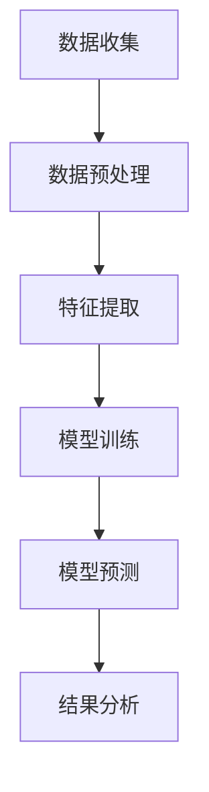
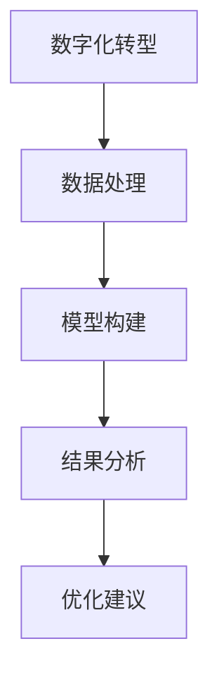

                 


# 新兴市场股市估值与数字化转型的互动

## 关键词：新兴市场，股市估值，数字化转型，算法原理，系统架构设计，项目实战

## 摘要：本文探讨新兴市场股市估值与数字化转型的互动关系，分析数字化转型如何影响股市估值，并通过算法和系统架构设计展示其应用。文章结合理论与实践，提供详细的案例分析和最佳实践建议。

---

## 第一章：新兴市场股市估值与数字化转型的概述

### 1.1 新兴市场股市估值的基本概念

#### 1.1.1 股市估值的基本定义

股市估值是指通过分析公司财务数据、市场环境和宏观经济指标，确定股票的合理价格。新兴市场通常指那些经济发展迅速、市场规模较小但潜力巨大的市场，如中国、印度等。

#### 1.1.2 新兴市场的特点与挑战

新兴市场具有高增长潜力，但同时也面临市场波动大、信息不对称等问题。这些特点使得股市估值在新兴市场更具挑战性。

#### 1.1.3 数字化转型的定义与内涵

数字化转型是指利用数字技术（如大数据、人工智能）改变传统业务模式和流程，以提高效率和竞争力。

---

### 1.2 新兴市场股市估值的核心问题

#### 1.2.1 股市估值的主要问题与挑战

新兴市场中，信息不对称、数据不完整等问题影响股市估值的准确性。

#### 1.2.2 数字化转型对股市估值的影响

数字化转型通过提高数据处理能力，改善估值模型的准确性，降低估值成本。

#### 1.2.3 新兴市场与发达市场的差异

新兴市场与发达市场在经济结构、市场参与者等方面存在显著差异，这使得数字化转型在新兴市场的应用更具挑战性。

---

## 第二章：核心概念与联系的详细分析

### 2.1 核心概念的原理与特征

#### 2.1.1 股市估值的核心原理

股市估值的核心在于分析公司的基本面，包括收入、利润、资产等，结合市场环境和宏观经济指标。

#### 2.1.2 数字化转型的核心特征

数字化转型通过数字化技术实现业务流程的优化和创新，提高企业的竞争力和效率。

---

### 2.2 核心概念属性对比

#### 2.2.1 股市估值与数字化转型的属性对比表格

| 属性                | 股市估值                          | 数字化转型                          |
|---------------------|-----------------------------------|--------------------------------------|
| 核心工具            | 财务数据、宏观经济指标            | 大数据、人工智能、云计算            |
| 目标                | 确定股票价格                      | 改进业务流程、提高效率              |
| 主要挑战            | 数据不完整、市场波动              | 技术集成难度、数据隐私              |

#### 2.2.2 ER实体关系图

```mermaid
erd
  entity 股票 {
    股票代码
    股票名称
    市场指数
  }
  entity 公司 {
    公司名称
    收入
    利润
  }
  entity 数字化工具 {
    工具类型
    数据来源
    分析模型
  }
  股票 --> 数字化工具: 使用工具进行估值
  公司 --> 数字化工具: 提供数据支持
```

---

## 第三章：算法原理与数学模型

### 3.1 算法原理

#### 3.1.1 数据驱动的股市估值算法



#### 3.1.2 数字化转型的算法模型



#### 3.1.3 算法流程图

```mermaid
graph TD
    start --> collect[数据收集]
    collect --> preprocess[数据预处理]
    preprocess --> extract[特征提取]
    extract --> train[模型训练]
    train --> predict[模型预测]
    predict --> end
```

---

### 3.2 数学模型与公式

#### 3.2.1 股市估值的数学模型

$$ P = \frac{E}{(r - g)} $$

其中，P为股票价格，E为每股收益，r为贴现率，g为股息增长率。

---

## 第四章：系统分析与架构设计

### 4.1 问题场景介绍

新兴市场中，企业希望通过数字化转型优化其股市估值流程，提高估值的准确性和效率。

### 4.2 系统功能设计

#### 4.2.1 领域模型

```mermaid
classDiagram
    class 股票估值系统 {
        输入数据
        处理逻辑
        输出结果
    }
    class 数据源 {
        市场数据
        公司数据
    }
    class 处理模块 {
        数据清洗
        模型训练
    }
    股票估值系统 <-->> 数据源
    股票估值系统 <-->> 处理模块
```

### 4.3 系统架构设计

```mermaid
graph TD
    UI --> Service: 发起请求
    Service --> Repository: 查询数据
    Repository --> Database
    Repository <---> Cache
    Repository --> ExternalAPI
    ExternalAPI --> ThirdParty
    Service <---> Response
```

---

## 第五章：项目实战

### 5.1 环境安装

安装Python、Jupyter Notebook、Pandas、Scikit-learn等工具。

### 5.2 核心代码实现

```python
import pandas as pd
from sklearn.linear_model import LinearRegression

# 数据加载
data = pd.read_csv('stock_data.csv')

# 特征提取
X = data[['收入', '利润', '市场指数']]
y = data['股价']

# 模型训练
model = LinearRegression()
model.fit(X, y)

# 模型预测
 predictions = model.predict(X)
```

### 5.3 案例分析与解读

通过实际案例分析，验证模型的准确性和适用性，调整参数以提高预测效果。

---

## 第六章：最佳实践

### 6.1 小结

数字化转型能够显著提升股市估值的准确性和效率，但在新兴市场中需要考虑特定的挑战。

### 6.2 注意事项

在实施过程中，需注意数据质量和隐私保护，合理选择算法和工具。

### 6.3 拓展阅读

建议进一步研究机器学习在股市估值中的应用，以及数字化转型在其他领域的实践。

---

以上是《新兴市场股市估值与数字化转型的互动》的详细目录和内容概述，确保每个章节和子章节都涵盖必要的内容，逻辑清晰，结构合理。

