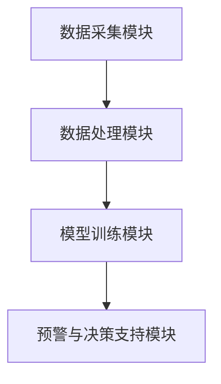
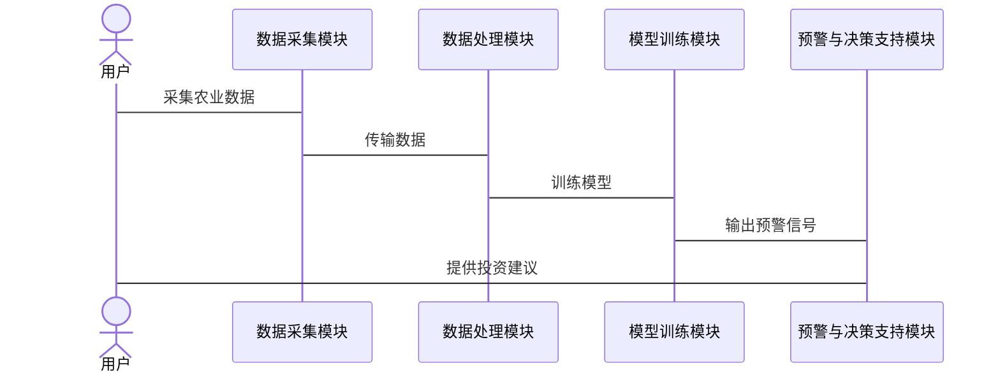

                 


# 新兴市场股市估值与智慧农业病虫害防控系统的互动

> 关键词：新兴市场、股市估值、智慧农业、病虫害防控、数据关联、系统互动

> 摘要：本文探讨了新兴市场股市估值与智慧农业病虫害防控系统之间的互动关系，分析了两者的核心概念、数据关联性及互动机制，提出了基于机器学习的互动模型，并通过实际案例展示了系统的构建与应用。本文旨在为投资者和农业从业者提供新的视角和决策支持工具。

---

## 第一章：背景介绍

### 1.1 问题背景

#### 1.1.1 新兴市场股市估值的重要性
新兴市场作为全球经济发展的重要驱动力，其股市估值具有重要意义。股市估值是衡量市场健康状况的核心指标，但新兴市场的特殊性（如高波动性、政策不确定性）使得估值更具挑战性。

#### 1.1.2 智慧农业病虫害防控的必要性
随着气候变化和病虫害的加剧，智慧农业通过物联网、大数据和人工智能等技术，提供精准的病虫害监测与防控方案，是保障粮食安全的关键。

#### 1.1.3 互动关系
股市估值与农业病虫害防控看似无关，但通过数据关联（如天气、农产品价格、农业政策等），两者存在潜在互动关系。例如，病虫害爆发可能影响农产品供给，进而影响农业板块的股市估值。

#### 1.1.4 研究意义
本文通过构建互动模型，揭示新兴市场中股市估值与农业病虫害防控的潜在关联，为投资者和农业从业者提供新的决策支持工具。

---

## 第二章：核心概念与数据关联

### 2.1 核心概念

#### 2.1.1 股市估值的核心指标
- 市盈率（P/E）
- 市净率（P/B）
- 现金流折现法（DCF）

#### 2.1.2 智慧农业病虫害防控的关键技术
- 物联网传感器（温湿度、光照、土壤湿度）
- 大数据分析与预测模型
- 人工智能图像识别技术

#### 2.1.3 互动机制的核心要素
- 数据流：从农业传感器数据到股市估值模型
- 中间变量：天气、农产品价格、政策变化
- 预测目标：股市估值波动与农业风险评估

---

## 第三章：互动机制的数学模型与算法

### 3.1 互动机制的数学模型

#### 3.1.1 数据关联性分析
通过分析农业传感器数据与股市数据的相关性，建立两者之间的统计关系。例如，使用皮尔逊相关系数分析天气数据与农业板块股票波动的相关性。

$$
r = \frac{\sum (x_i - \bar{x})(y_i - \bar{y})}{\sqrt{\sum (x_i - \bar{x})^2 \sum (y_i - \bar{y})^2}}
$$

其中，$r$为相关系数，$x$为农业数据，$y$为股市数据。

#### 3.1.2 互动模型的构建
基于机器学习的回归模型，将农业数据作为输入，股市估值作为输出，训练模型预测农业风险对股市的影响。

$$
y = \beta_0 + \beta_1x_1 + \beta_2x_2 + \epsilon
$$

其中，$y$为股市估值，$x_1$和$x_2$为农业传感器数据，$\beta$为回归系数。

---

## 第四章：系统架构与功能设计

### 4.1 系统架构设计

#### 4.1.1 系统模块划分
- 数据采集模块：收集农业传感器数据和股市数据
- 数据处理模块：清洗、整合和分析数据
- 模型训练模块：构建互动模型并进行预测
- 预警与决策支持模块：输出预警信号和投资建议

#### 4.1.2 系统架构图


---

## 第五章：项目实战与代码实现

### 5.1 项目实战

#### 5.1.1 环境安装
- Python 3.8+
- NumPy、Pandas、Scikit-learn、Plotly

#### 5.1.2 数据采集与处理
```python
import pandas as pd
import numpy as np

# 采集农业传感器数据
agriculture_data = pd.read_csv('agriculture_sensor.csv')

# 采集股市数据
stock_data = pd.read_csv('stock_market.csv')

# 数据预处理
agriculture_data = agriculture_data.dropna()
stock_data = stock_data.dropna()
```

#### 5.1.3 模型训练
```python
from sklearn.ensemble import RandomForestRegressor
from sklearn.metrics import mean_squared_error

# 数据合并与特征选择
merged_data = pd.merge(agriculture_data, stock_data, on='date')

# 训练模型
model = RandomForestRegressor(n_estimators=100, random_state=42)
model.fit(merged_data[['temperature', 'humidity']], merged_data['stock_return'])

# 模型评估
预测值 = model.predict(merged_data[['temperature', 'humidity']])
mse = mean_squared_error(merged_data['stock_return'], 预测值)
print(f'MSE: {mse}')
```

#### 5.1.4 系统交互设计


---

## 第六章：系统优化与未来展望

### 6.1 系统优化方向
- 引入更多的数据源（如卫星图像）
- 提升模型的实时性与准确性
- 优化用户界面，提供更直观的决策支持

### 6.2 未来展望
随着人工智能和大数据技术的不断进步，股市估值与农业病虫害防控系统的互动关系将更加紧密。未来的研究可以拓展到多模态数据融合、实时预警系统以及全球范围内的跨市场分析。

---

## 第七章：结论与最佳实践

### 7.1 研究结论
本文通过构建互动模型，揭示了新兴市场中股市估值与农业病虫害防控系统的潜在关联，为投资者和农业从业者提供了新的决策支持工具。

### 7.2 最佳实践
- 投资者应关注农业传感器数据对股市的影响
- 农业从业者应利用智慧农业技术降低风险
- 政府应推动农业与金融数据的共享与合作

### 7.3 注意事项
- 数据隐私与安全问题需要高度重视
- 模型的实时性和可解释性需要进一步优化
- 应结合具体市场情况调整模型参数

---

## 第八章：参考文献与拓展阅读

### 8.1 参考文献
1. 《机器学习实战》
2. 《农业物联网技术与应用》
3. 《股市估值与风险管理》

### 8.2 拓展阅读
- 大数据分析在金融领域的应用
- 人工智能在农业病虫害防控中的创新
- 全球气候变化对股市的影响研究

---

通过本文的系统分析与实践，我们不仅揭示了新兴市场中股市估值与智慧农业病虫害防控系统的互动关系，还为读者提供了从理论到实践的完整解决方案。未来，随着技术的不断进步，这种互动关系将为农业与金融领域带来更多的创新与突破。

