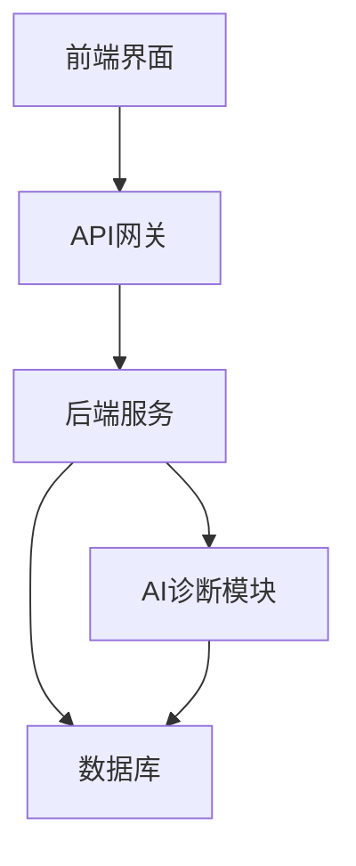

                 


# 新兴市场股市估值与智慧医疗AI辅助诊断的互动

## 关键词：新兴市场、股市估值、智慧医疗、AI辅助诊断、算法原理、系统架构

## 摘要：本文探讨新兴市场股市估值与智慧医疗AI辅助诊断的互动关系，分析AI技术在股市估值中的应用，以及在医疗诊断中的创新应用，重点研究两者如何通过数据共享和技术创新实现互动，提升投资决策和医疗诊断的准确性和效率。文章从背景、技术原理、系统架构、项目实战等多方面展开，结合数学模型和实际案例，深入剖析互动机制，为投资者和医疗从业者提供新的视角和解决方案。

---

## 第一部分：背景与核心概念

### 第1章：新兴市场与智慧医疗的背景介绍

#### 1.1 新兴市场的定义与特点

新兴市场通常指那些经济增长迅速、但尚未达到发达经济体水平的国家。这些市场具有以下特点：
- **经济快速增长**：新兴市场国家的GDP增速通常高于发达市场。
- **股市波动性大**：新兴市场的股市受全球经济波动和政策影响较大。
- **投资者行为多样性**：新兴市场的投资者包括散户、机构投资者和政府基金，行为差异较大。

#### 1.2 智慧医疗的定义与特点

智慧医疗是指利用人工智能、大数据、物联网等技术，提升医疗诊断、治疗和管理效率的新型医疗模式。其特点包括：
- **数据驱动**：依赖医疗数据的收集、存储和分析。
- **技术融合**：结合AI、机器学习和深度学习技术。
- **个性化医疗**：通过数据分析实现精准诊断和治疗。

#### 1.3 股市估值与智慧医疗的互动关系

股市估值与智慧医疗的互动主要体现在数据共享和技术融合方面：
- **数据共享**：医疗数据可以用于股市估值模型的优化。
- **技术融合**：AI技术在股市估值中的应用可以反哺智慧医疗的发展。

### 第2章：核心概念与联系

#### 2.1 股市估值的核心要素

股市估值的关键指标包括：
1. **市盈率（P/E Ratio）**：股价与每股收益的比率，反映市场对公司的盈利能力预期。
2. **市净率（P/B Ratio）**：股价与每股净资产的比率，衡量股价相对于账面价值的高低。
3. **股息率（Dividend Yield）**：每股股息与股价的比率，反映投资回报率。

#### 2.2 智慧医疗AI辅助诊断的核心要素

AI辅助诊断的核心要素包括：
1. **数据来源**：医学影像、实验室结果、电子健康记录（EHR）。
2. **算法模型**：机器学习、深度学习、卷积神经网络（CNN）。
3. **诊断准确性**：AI诊断的准确性和效率是衡量其价值的关键。

#### 2.3 股市估值与智慧医疗的互动机制

1. **数据共享**：医疗数据的共享可以提升股市估值模型的准确性。
2. **技术融合**：AI技术在股市估值中的应用可以提升智慧医疗的诊断效率。
3. **市场反馈**：股市对医疗技术的反馈可以为智慧医疗的发展提供资金支持。

---

## 第二部分：AI辅助诊断的算法与实现

### 第3章：AI辅助诊断的算法原理

#### 3.1 机器学习在医疗诊断中的应用

机器学习在医疗诊断中的应用场景包括：
1. **分类算法**：随机森林、支持向量机（SVM）用于疾病诊断。
2. **回归算法**：线性回归、逻辑回归用于预测疾病风险。

#### 3.2 深度学习在医疗诊断中的应用

深度学习在医疗诊断中的应用包括：
1. **卷积神经网络（CNN）**：用于医学影像分类。
2. **循环神经网络（RNN）**：用于医疗文本分析。
3. **图神经网络（GNN）**：用于医疗知识图谱构建。

#### 3.3 AI诊断系统的数学模型

AI诊断系统的数学模型可以表示为：
$$
y = f(x) + \epsilon
$$
其中，$y$ 是诊断结果，$x$ 是输入数据，$f$ 是模型函数，$\epsilon$ 是噪声。

---

## 第三部分：系统架构与项目实战

### 第4章：系统架构设计

#### 4.1 系统功能设计

系统功能包括：
1. **数据采集**：从医疗数据库中获取数据。
2. **模型训练**：使用深度学习算法训练诊断模型。
3. **诊断推理**：基于训练好的模型进行诊断。

#### 4.2 系统架构图

系统架构图如下：



---

## 第四部分：项目实战与案例分析

### 第5章：项目实战

#### 5.1 环境安装

项目实战需要以下环境：
- **Python**：3.8+
- **深度学习框架**：TensorFlow或Keras
- **数据集**：公开医疗影像数据集

#### 5.2 核心代码实现

以下是AI诊断模块的代码示例：

```python
import tensorflow as tf
from tensorflow import keras

# 加载数据集
(x_train, y_train), (x_test, y_test) = tf.keras.datasets.mnist.load_data()

# 数据预处理
x_train = x_train.reshape(-1, 28, 28, 1).astype('float32') / 255.0
x_test = x_test.reshape(-1, 28, 28, 1).astype('float32') / 255.0
y_train = tf.keras.utils.to_categorical(y_train, 10)
y_test = tf.keras.utils.to_categorical(y_test, 10)

# 构建模型
model = keras.Sequential([
    keras.layers.Conv2D(32, (3,3), activation='relu', input_shape=(28,28,1)),
    keras.layers.MaxPooling2D((2,2)),
    keras.layers.Conv2D(64, (3,3), activation='relu'),
    keras.layers.MaxPooling2D((2,2)),
    keras.layers.Flatten(),
    keras.layers.Dense(10, activation='softmax')
])

# 编译模型
model.compile(optimizer='adam', loss='categorical_crossentropy', metrics=['accuracy'])

# 训练模型
model.fit(x_train, y_train, epochs=10, batch_size=64, validation_data=(x_test, y_test))
```

---

## 第五部分：总结与展望

### 第6章：总结与展望

#### 6.1 总结

本文探讨了新兴市场股市估值与智慧医疗AI辅助诊断的互动关系，分析了AI技术在股市估值和医疗诊断中的应用，提出了数据共享和技术创新的互动机制。

#### 6.2 展望

未来，随着AI技术的不断发展，股市估值与智慧医疗的互动将更加紧密，推动医疗行业和金融市场的进一步融合。

---

通过以上目录结构和内容安排，文章将系统地分析新兴市场股市估值与智慧医疗AI辅助诊断的互动关系，为读者提供理论和实践的双重价值。

